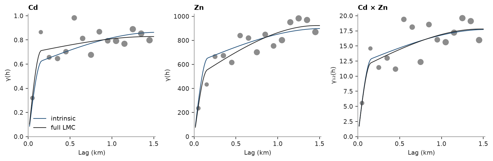

# Intrinsic coregionalization

An intrinsic coregionalization is the simplest multivariate variogram model: every direct and cross variogram is the
same normalized shape, one set of structures, ranges and anisotropy, scaled by one entry of a covariance matrix. The
correlation between two variables is then the same at every lag. `Coregionalization.fit(..., intrinsic=True)` fits
the shape to the pooled direct variograms, each divided by its sill, then the positive semi-definite covariance
matrix; `Coregionalization.intrinsic` builds one from a variogram and a matrix. Either way the result is an ordinary
`Coregionalization`, so cokriging and cosimulation take it unchanged.

<details><summary>Python</summary>

```python
import boitata as bt
import matplotlib.pyplot as plt
import numpy as np
from common import ACCENT, GRAY, INK, save

jura = bt.datasets.jura()
train, test = jura["prediction"], jura["validation"]
xy = train.coords
cd, zn = train["Cd"], train["Zn"]
lag, max_lag = 0.1, 1.5
print(f"{len(cd)} samples, corr(Cd, Zn) {np.corrcoef(cd, zn)[0, 1]:.2f}")
```

</details>

```text
259 samples, corr(Cd, Zn) 0.67
```

## Cd and Zn

The Jura soil samples of [coregionalization](../../05-spatial-continuity/07-coregionalization/README.md) (mg/kg, coordinates in km). `experimental_variograms` computes both variograms
and the cross-variogram as a `VariogramSet`, which the fit takes as it is. The intrinsic model has one shape, a
nugget and two spherical structures, and one 2 x 2 sill matrix.

<details><summary>Python</summary>

```python
experimentals = bt.experimental_variograms(train, ["Cd", "Zn"], lag, max_lag)
icm = bt.Coregionalization.fit(experimentals, ["spherical", "spherical"], intrinsic=True)
lmc = bt.Coregionalization.fit(experimentals, ["spherical", "spherical"])


def sill(model):
    return model.nugget + sum(s for _, _, s in model.structures)


for name, model in [("intrinsic", icm), ("full LMC", lmc)]:
    c = sill(model)
    parts = ", ".join(
        f"{label} {100 * s[0, 0] / c[0, 0]:.0f} / {100 * s[1, 1] / c[1, 1]:.0f} %"
        for label, s in [("nugget", model.nugget), *((f"{m} {a:.2f} km", s) for m, a, s in model.structures)]
    )
    print(
        f"{name}: sills Cd {c[0, 0]:.3f}, Zn {c[1, 1]:.0f}, correlation {c[0, 1] / np.sqrt(c[0, 0] * c[1, 1]):.2f}"
    )
    print(f"  share of the Cd / Zn sill: {parts}")
```

</details>

```text
intrinsic: sills Cd 0.863, Zn 899, correlation 0.64
  share of the Cd / Zn sill: nugget 0 / 0 %, spherical 0.16 km 68 / 68 %, spherical 1.54 km 32 / 32 %
full LMC: sills Cd 0.828, Zn 923, correlation 0.64
  share of the Cd / Zn sill: nugget 0 / 0 %, spherical 0.15 km 83 / 53 %, spherical 1.47 km 17 / 47 %
```

The full linear model of coregionalization of [coregionalization](../../05-spatial-continuity/07-coregionalization/README.md) gives each variable its own mix of the shared structures:
Cd puts 83 % of its sill in the short structure, Zn 53 %. The intrinsic model gives both the same 68 %, a
compromise, and one correlation, 0.64, at every lag. The total sills and the correlation hardly differ between the
two models, so the curves meet at large lags; at short lags the intrinsic model is too smooth for Cd and too rough
for Zn:

<details><summary>Python</summary>

```python
h = np.linspace(0, max_lag, 101)[1:]
origin = np.zeros((h.size, 3))
away = np.c_[h, np.zeros((h.size, 2))]
panels = ((0, 0, "Cd"), (1, 1, "Zn"), (0, 1, "Cd × Zn"))
fig, axes = plt.subplots(1, 3, figsize=(10, 3.2), layout="constrained")
for ax, (i, j, name) in zip(axes, panels):
    bt.plot.variogram(experimentals[i, j], ax=ax, color=GRAY)
    for model, color, label in [(icm, ACCENT, "intrinsic"), (lmc, INK, "full LMC")]:
        gamma = model.cross_covariance(i, j, origin, origin) - model.cross_covariance(i, j, origin, away)
        ax.plot(h, gamma, color=color, lw=1, label=label)
    ax.set(title=name, xlabel="Lag (km)", ylabel="γ(h)" if i == j else "γ₁₂(h)")
axes[0].legend()
save(fig, "variograms")
```

</details>



## Cokriging with either model

Both models go to `Cokriging` the same way. Collocated cokriging of Cd at the 100 validation samples, with Zn known
there, as in [cokriging](../../06-kriging/09-cokriging/README.md). With the correlation this similar, the simpler model predicts as well:

<details><summary>Python</summary>

```python
search = bt.Search(radius=1.5, max_samples=24, min_samples=4)
truth = test["Cd"]
for name, model in [("intrinsic", icm), ("full LMC", lmc)]:
    ck = bt.Cokriging(model, search, means=[cd.mean(), zn.mean()])
    ck.fit(np.vstack([xy, xy]), np.r_[cd, zn], [0] * len(cd) + [1] * len(zn))
    estimate = ck.predict(test, collocated={1: test["Zn"]})
    print(f"{name:>10}: validation RMSE {np.sqrt(np.mean((estimate - truth) ** 2)):.3f} mg/kg")
```

</details>

```text
 intrinsic: validation RMSE 0.681 mg/kg
  full LMC: validation RMSE 0.689 mg/kg
```

## Seven metals

The intrinsic model grows with the number of variables only through its covariance matrix: seven metals need one
shape and 28 matrix entries, fitted in one pass. Its correlations are the ones the model implies at every lag:

<details><summary>Python</summary>

```python
metals = ["Cd", "Co", "Cr", "Cu", "Ni", "Pb", "Zn"]
seven = bt.Coregionalization.fit(
    bt.experimental_variograms(train, metals, lag, max_lag), ["spherical", "spherical"], intrinsic=True
)
c = sill(seven)
corr = c / np.sqrt(np.outer(np.diag(c), np.diag(c)))
print(f"smallest eigenvalue of the sill matrix {np.linalg.eigvalsh(c)[0]:.3g}")
print("      " + "".join(f"{m:>6}" for m in metals))
for m, row in zip(metals, corr):
    print(f"{m:<6}" + "".join(f"{r:6.2f}" for r in row))
```

</details>

```text
smallest eigenvalue of the sill matrix 0.375
          Cd    Co    Cr    Cu    Ni    Pb    Zn
Cd      1.00  0.26  0.62  0.11  0.50  0.25  0.64
Co      0.26  1.00  0.52  0.30  0.74  0.24  0.53
Cr      0.62  0.52  1.00  0.23  0.73  0.31  0.69
Cu      0.11  0.30  0.23  1.00  0.28  0.79  0.60
Ni      0.50  0.74  0.73  0.28  1.00  0.36  0.67
Pb      0.25  0.24  0.31  0.79  0.36  1.00  0.63
Zn      0.64  0.53  0.69  0.60  0.67  0.63  1.00
```

Full script: [`example_05_08.py`](example_05_08.py)
