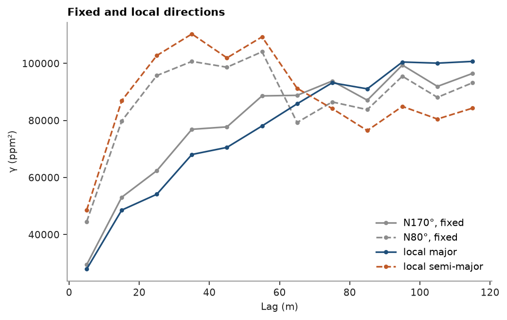
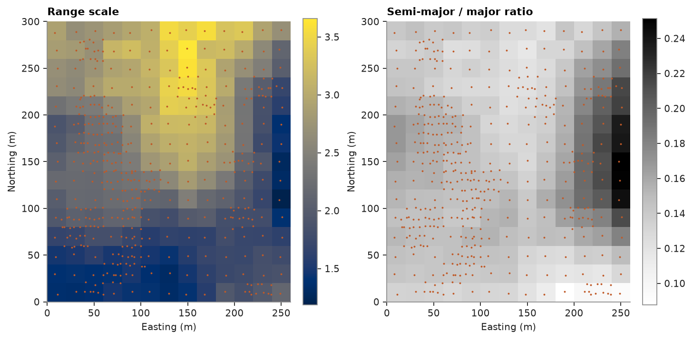
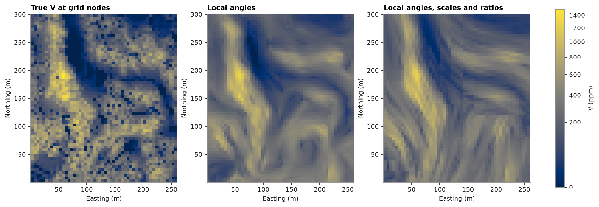

# Local variogram parameters

[Locally varying anisotropy](../../06-kriging/14-local-anisotropy/README.md) bent the variogram along Walker Lake's high-`V` bodies but kept one set of ranges everywhere. Here the local
frames of [locally varying anisotropy](../../06-kriging/14-local-anisotropy/README.md) measure experimental variograms that follow the bodies, moving-window fits of those variograms
give a range scale and a ratio per region, and kriging takes them the same way it takes the local angles.

<details><summary>Python</summary>

```python
import ceres as cs
import matplotlib.pyplot as plt
import numpy as np
from common import ACCENT, GRAY, HIGHLIGHT, map_axes, save
from matplotlib.colors import PowerNorm

samples = cs.datasets.walker_lake()
truth = cs.datasets.walker_lake_exhaustive()["V"].reshape(300, 260)
xy, v = samples.coords, samples["V"]
grid = cs.BlockModel(origin=(0.5, 0.5), size=(5, 5), count=(52, 60))
nodes = grid.centroids.astype(int)
true_at_nodes = truth[nodes[:, 1] - 1, nodes[:, 0] - 1]
```

</details>

The global model and the orientation field, as in [locally varying anisotropy](../../06-kriging/14-local-anisotropy/README.md): two nested structures fitted along N170° and across it,
and local directions from the gradient of an isotropic guide estimate.

<details><summary>Python</summary>

```python
azimuth, lag, max_lag = 170.0, 10.0, 120.0
along = cs.experimental_variogram(xy, v, lag, max_lag, azimuth=azimuth).fit(
    ["spherical", "spherical"], weighting="count/gamma"
)
across = cs.experimental_variogram(xy, v, lag, max_lag, azimuth=azimuth + 90).fit(
    ["spherical", "spherical"],
    weighting="count/gamma",
    nugget=along.nugget,
    sills=[s.sill for s in along.structures],
)
model = along.with_anisotropy(
    (azimuth, 0, 0), (across.structures[-1].range / along.structures[-1].range, 1.0)
)
isotropic = cs.Variogram([("spherical", model.sill - model.nugget, 30.0)], nugget=model.nugget)
guide = cs.OrdinaryKriging(isotropic, cs.Search(radius=60, max_samples=16)).fit(xy, v).predict(grid)
lva = cs.LocalAnisotropy.from_grid(
    grid.with_column("guide", guide), "guide", window=3, ratios=(0.3, 1.0)
).smooth(25.0)
print(f"global ratio {model.ratios[0]:.2f}, ranges {[round(s.range) for s in model.structures]} m")
```

</details>

```text
global ratio 0.33, ranges [20, 81] m
```

## Variograms along the local directions

With `anisotropy=`, `experimental_variogram` reads each pair in the local frame of its tail: azimuth 0 is the local
major axis wherever the pair sits, azimuth 90 the local semi-major. Against the fixed N170° and N80° directions,
the local major direction keeps pairs inside the bodies and rises more slowly; the local cross direction crosses
them everywhere and rises faster.

<details><summary>Python</summary>

```python
fixed = [cs.experimental_variogram(xy, v, lag, max_lag, azimuth=a) for a in (azimuth, azimuth + 90)]
local = [cs.experimental_variogram(xy, v, lag, max_lag, azimuth=a, anisotropy=lva) for a in (0.0, 90.0)]
fig, ax = plt.subplots(figsize=(6.4, 4), layout="constrained")
for exp, color, style, label in (
    (fixed[0], GRAY, "-", "N170°, fixed"),
    (fixed[1], GRAY, "--", "N80°, fixed"),
    (local[0], ACCENT, "-", "local major"),
    (local[1], HIGHLIGHT, "--", "local semi-major"),
):
    ax.plot(exp.lags, exp.gammas, style, marker="o", ms=3, color=color, label=label)
ax.set(xlabel="Lag (m)", ylabel="γ (ppm²)", title="Fixed and local directions")
ax.legend(frameon=False)
save(fig, "variograms")
```

</details>



`local_variogram_parameters` fits the shape of the global model (nugget and structures, rescaled to the variance of
the samples in a window) to such variograms. With one window over the whole deposit it returns one fit: in the
global frame it gives back the global model (scale 1), in the local frames a longer and narrower one.

<details><summary>Python</summary>

```python
center = [[130.0, 150.0]]
for name, field in (("global frame", None), ("local frames", lva)):
    whole = cs.local_variogram_parameters(
        xy, v, center, variogram=model, window=400.0, lag=lag, anisotropy=field
    )
    print(f"{name}: ratio {whole.ratios[0, 0]:.2f}, scale {whole.scales[0]:.2f}")
```

</details>

```text
global frame: ratio 0.32, scale 1.01
local frames: ratio 0.23, scale 1.38
```

## Moving-window fits

The same fit on a window of 100 m around each node of a coarse 20 m grid, in the local frames, then smoothed over
60 m. The angles stay those of the field; each node gets its semi-major ratio and a scale that multiplies every
range of the model. The result is stored on the coarse grid like any other attribute.

<details><summary>Python</summary>

```python
coarse = cs.BlockModel(origin=(0, 0), size=(20, 20), count=(13, 15))
fitted = cs.local_variogram_parameters(
    xy, v, coarse, variogram=model, window=100.0, lag=lag, max_lag=60.0, anisotropy=lva
).smooth(60.0)
coarse = coarse.with_column("scale", fitted.scales).with_column("ratio", fitted.ratios[:, 0])
print("scale percentiles (10, 50, 90):", np.percentile(fitted.scales, [10, 50, 90]).round(2))
print("ratio percentiles (10, 50, 90):", np.percentile(fitted.ratios[:, 0], [10, 50, 90]).round(2))
```

</details>

```text
scale percentiles (10, 50, 90): [1.45 2.19 3.19]
ratio percentiles (10, 50, 90): [0.13 0.14 0.19]
```

<details><summary>Python</summary>

```python
fig, axes = plt.subplots(1, 2, figsize=(9, 4.8), layout="constrained")
for ax, name, title, cmap in (
    (axes[0], "scale", "Range scale", "cividis"),
    (axes[1], "ratio", "Semi-major / major ratio", "Greys"),
):
    im = ax.imshow(coarse[name].reshape(15, 13), origin="lower", extent=(0, 260, 0, 300), cmap=cmap)
    ax.plot(xy[:, 0], xy[:, 1], ".", ms=1.5, color=HIGHLIGHT)
    map_axes(ax, title)
    fig.colorbar(im, ax=ax, shrink=0.8)
save(fig, "parameters")
```

</details>



## Kriging with local ranges

Same model and search throughout: global anisotropy, local angles ([locally varying anisotropy](../../06-kriging/14-local-anisotropy/README.md)), local angles with the fitted scales
only, and with the fitted scales and ratios. Kriging takes the field from the nearest coarse cell. Errors are
against the exhaustive values at the nodes.

<details><summary>Python</summary>

```python
search = cs.Search(radius=100, max_samples=24, min_samples=1)
ok = cs.OrdinaryKriging(model, search).fit(xy, v)
scaled = cs.LocalAnisotropy(lva.coords, lva.angles, lva.ratios, scales=fitted.at(lva.coords).scales)
estimates = {
    f"global N{model.rotation[0]:.0f}°": ok.predict(grid),
    "local angles": ok.predict(grid, anisotropy=lva),
    "+ scales": ok.predict(grid, anisotropy=scaled),
    "+ scales and ratios": ok.predict(grid, anisotropy=fitted),
}
for name, estimate in estimates.items():
    error = estimate - true_at_nodes
    print(
        f"{name:>20}: RMSE {np.sqrt(np.mean(error**2)):.1f} ppm, "
        f"correlation {np.corrcoef(estimate, true_at_nodes)[0, 1]:.3f}"
    )
```

</details>

```text
        global N170°: RMSE 157.3 ppm, correlation 0.780
        local angles: RMSE 148.3 ppm, correlation 0.805
            + scales: RMSE 148.1 ppm, correlation 0.806
 + scales and ratios: RMSE 161.1 ppm, correlation 0.769
```

<details><summary>Python</summary>

```python
norm = PowerNorm(0.5, vmin=0, vmax=1500)
fig, axes = plt.subplots(1, 3, figsize=(12, 4.6), layout="constrained")
for ax, (image, title) in zip(
    axes,
    (
        (true_at_nodes, "True V at grid nodes"),
        (estimates["local angles"], "Local angles"),
        (estimates["+ scales and ratios"], "Local angles, scales and ratios"),
    ),
):
    im = ax.imshow(image.reshape(60, 52), origin="lower", extent=(0.5, 260.5, 0.5, 300.5), norm=norm)
    map_axes(ax, title)
fig.colorbar(im, ax=axes, shrink=0.8, label="V (ppm)")
save(fig, "kriging")
```

</details>



The scales alone barely move the estimate: RMSE 148.1 against 148.3 ppm. Longer ranges with the same nugget and
ratios change the kriging weights little. The fitted ratios do: the windows see bodies about 0.14 as wide as they
are long, against 0.33 in the global model, and kriging with those needle-thin ellipses streaks along the field's
directions. Wherever the guide's directions are off, the estimate follows them across the bodies, and the RMSE
rises to 161.1 ppm, worse than the global model. Narrow local ratios pay off only as far as the orientation field
can be trusted; with a field this rough, keep the global ratios and take the local angles and scales. SGS,
indicator and categorical kriging take the same `anisotropy=` field, scales included.

Full script: [`example_05_09.py`](example_05_09.py)
