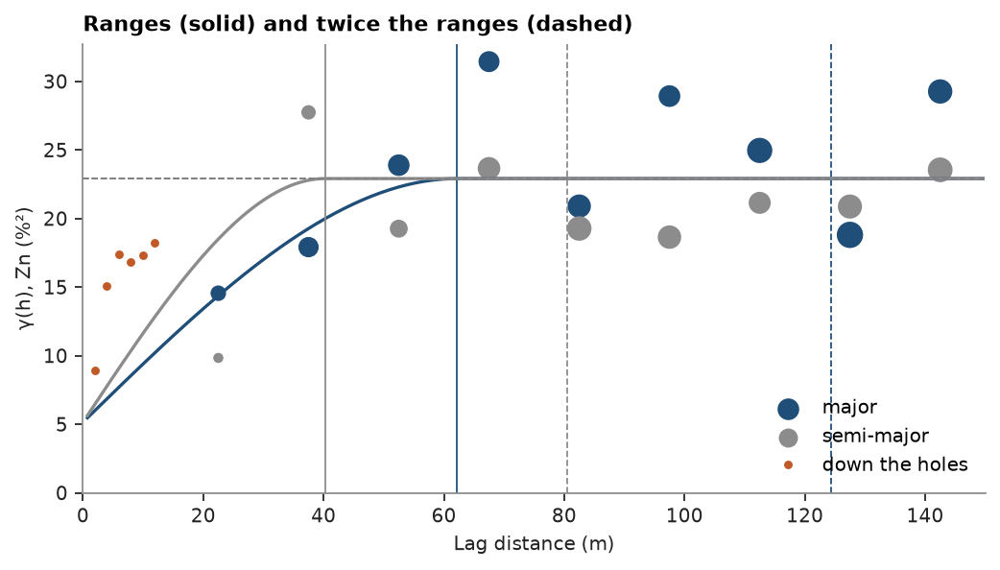
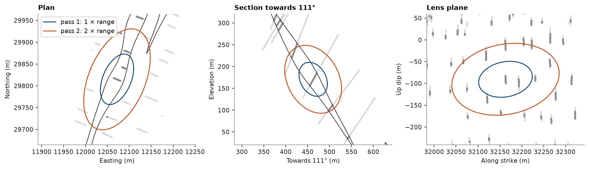
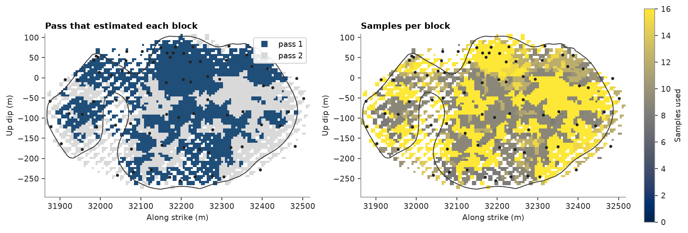

# from variogram to search plan

a variogram tells how far, and in which directions, a sample still informs a block. a 3D model of Zn in three stacked
sulfide lenses becomes a search plan here: an ellipsoid with the model's rotation and ranges, a first pass out to one
range, a second out to two, and a cap per hole so that each neighborhood spans several holes. the kriging diagnostics
then show which pass estimated each block and from how many samples. [search](../../06-kriging/06-search/README.md)
covers each option on its own, and [search calibration](../../06-kriging/07-search-calibration/README.md) scores
`max_samples`.

<details><summary>Python</summary>

```python
import boitata as bt
import matplotlib.pyplot as plt
import numpy as np
from common import ACCENT, GRAY, HIGHLIGHT, INK, LIGHT, save
from matplotlib.colors import ListedColormap
```

</details>

## composites in the lenses

each assay takes the name of the lens around it, and 2 m composites stay inside one lens, as in the
[case study](../../12-case-studies/02-drillholes-to-classified-model/README.md). lens 1 has the most holes. a hole
crosses a lens in one intercept; its length and the angle between the hole and the lens give the true thickness.

<details><summary>Python</summary>

```python
data = bt.datasets.stacked_sulphide_lenses()
lenses = {name: data[name] for name in ("lens_1", "lens_2", "lens_3")}
samples = bt.Drillholes(data["collars"], data["surveys"], data["assays"]).samples()
lens = np.full(len(samples), "host", dtype=object)
for name, mesh in lenses.items():
    lens[mesh.contains(samples.coords)] = name
intervals = samples.with_columns({"LENS": list(lens)}).attributes
drillholes = bt.Drillholes(data["collars"], data["surveys"], intervals)
composites = drillholes.composite(2.0, ["ZN_PCT"], domain="LENS", residual="merge")
composites = composites.filter(np.isfinite(composites["ZN_PCT"]))
ore = composites.filter(np.asarray(composites["LENS"], dtype=object) != "host")
ore_holes = np.asarray(ore["HOLE_ID"], dtype=object)
one = np.asarray(ore["LENS"], dtype=object) == "lens_1"

pole = np.linalg.eigh(np.cov(lenses["lens_1"].vertices.T))[1][:, 0]
pole *= np.sign(pole[2])
dip_direction = np.degrees(np.arctan2(pole[0], pole[1])) % 360
lens_dip = np.degrees(np.arccos(pole[2]))
pierce, thickness = [], []
for hole in sorted(set(ore_holes[one])):
    xyz = ore.coords[one & (ore_holes == hole)]
    pierce.append(xyz.mean(axis=0))
    if len(xyz) > 1:
        direction = (xyz[-1] - xyz[0]) / np.linalg.norm(xyz[-1] - xyz[0])
        thickness.append(2.0 * len(xyz) * abs(direction @ pole))
pierce = np.array(pierce)
print(f"{len(ore)} composites in the lenses, {one.sum()} in lens 1 from {len(pierce)} holes")
print(
    f"lens 1 dips {lens_dip:.0f}° towards {dip_direction:03.0f}°, true thickness {np.median(thickness):.0f} m (median)"
)
```

</details>

```text
1151 composites in the lenses, 609 in lens 1 from 78 holes
lens 1 dips 59° towards 111°, true thickness 12 m (median)
```

## the variogram

the search takes three things from the variogram: the directions of its axes, the range along each, and the nugget.
[variogram volume](../../05-spatial-continuity/04-variogram-volume/README.md) finds the axes from log Zn over all
composites, lens and host rock alike, since the lenses are the continuous bodies and their shape sets the orientation.
within the lenses Zn is fitted along the major and semi-major axes with that rotation held. across a lens the pairs
are too few to fit, so the minor/major ratio keeps the value from the volume. the 2 m lags of the downhole variogram
sit closest to the origin and fix the nugget
([downhole nugget](../../05-spatial-continuity/05-downhole-nugget/README.md)).

<details><summary>Python</summary>

```python
volume = bt.variogram_volume(composites, np.log(composites["ZN_PCT"]), 15.0, 225.0, tolerance=15.0)
downhole = bt.experimental_variogram(ore, "ZN_PCT", 2.0, 12.0, holes="HOLE_ID")
experimentals = [
    bt.experimental_variogram(ore, "ZN_PCT", 15.0, 150.0, azimuth=az, dip=dip, tolerance=20.0)
    for az, dip in volume.axes
]
model = bt.Variogram.fit_directional(
    experimentals[:2],
    volume.axes[:2],
    "spherical",
    nugget=downhole.nugget(),
    rotation=volume.rotation,
    ratios=[None, volume.ratios[1]],
)
ranges = model.structures[0].range * np.array([1.0, *model.ratios])
print(f"pairs across the lenses in the first three lags: {experimentals[2].counts[:3].astype(int)}")
print(f"nugget {model.nugget:.1f} of a sill of {model.sill:.1f} %²")
print("rotation (azimuth, dip, rake):", np.round(model.rotation, 1))
print("ranges (major, semi-major, minor):", np.round(ranges), "m")
for name, (az, dip) in zip(("major", "semi-major", "minor"), volume.axes, strict=True):
    print(f"{name:>10} axis: azimuth {az:05.1f}°, dip {dip:4.1f}°")
```

</details>

```text
pairs across the lenses in the first three lags: [77  9 12]
nugget 5.1 of a sill of 22.9 %²
rotation (azimuth, dip, rake): [200.8  12.7 121.9]
ranges (major, semi-major, minor): [62. 40. 29.] m
     major axis: azimuth 200.8°, dip 12.7°
semi-major axis: azimuth 091.4°, dip 55.9°
     minor axis: azimuth 298.5°, dip 31.0°
```

<details><summary>Python</summary>

```python
fig, ax = plt.subplots(figsize=(6.4, 3.6), layout="constrained")
for exp, direction, color, name, reach in zip(
    experimentals[:2], volume.axes[:2], (ACCENT, GRAY), ("major", "semi-major"), ranges[:2], strict=True
):
    bt.plot.variogram(exp, variogram=model, direction=direction, ax=ax, color=color, label=name)
    for k, ls in ((1, "-"), (2, "--")):
        ax.axvline(k * reach, color=color, lw=0.8, ls=ls)
ax.plot(downhole.lags, downhole.gammas, "o", color=HIGHLIGHT, ms=3, label="down the holes")
ax.set(
    xlabel="Lag distance (m)", ylabel="γ(h), Zn (%²)", title="Ranges (solid) and twice the ranges (dashed)"
)
ax.set_xlim(0, 150)
ax.set_ylim(bottom=0)
ax.legend(loc="lower right")
save(fig, "variogram")
```

</details>



along the major axis, which plunges 13° toward 201°, γ reaches the sill at 62 m; down the dip, at 40 m. a fifth of the
sill is nugget, so even the nearest composite leaves a block uncertain. down the holes γ climbs to four fifths of the
sill within 12 m: the holes cross the lens at a steep angle, and Zn changes fast across it. the minor axis of the
search does not need that range. its 29 m radius spans the 12 m lens, and the domain boundary stops it at the lens
walls.

## from ranges to an ellipsoid

`Search` takes the major range as `radius` and the model's `rotation` and `ratios` unchanged, so the search ellipsoid
is the range ellipsoid. samples inside it are correlated with the block. beyond it a sample has no covariance with the
block, and ordinary kriging weights it only through the other samples and the constraint that the weights sum to one.
the first pass therefore reaches one range and estimates from correlated samples. the second reaches twice the range
and fills the blocks between groups of holes, where the estimate leans toward the local mean.

the three views center the ellipsoids on a hole in lens 1: a plan, a vertical section down the dip, and the lens plane
seen face on, each with the composites within 20 m of the view (lens 1 darker).

<details><summary>Python</summary>

```python
ellipsoid = {"rotation": model.rotation, "ratios": model.ratios}
reach = ranges[0]


def unit(azimuth, dip):
    az, dip = np.radians(azimuth), np.radians(dip)
    return np.array([np.cos(dip) * np.sin(az), np.cos(dip) * np.cos(az), -np.sin(dip)])


def frame(azimuth, dip):
    """Section axes of `bt.plot.slab`: along `azimuth`, and up a plane dipping `dip`."""
    az, dip = np.radians(azimuth), np.radians(dip)
    u = np.array([np.sin(az), np.cos(az), 0.0])
    v = np.cos(dip) * np.array([-np.cos(az), np.sin(az), 0.0]) + np.array([0.0, 0.0, np.sin(dip)])
    return np.array([u, v])


def outline(center, radii, azimuth, dip):
    """Outline of the ellipsoid with these radii along the model axes, seen square to a section."""
    axes = np.array([unit(*a) for a in volume.axes])
    shape = axes.T @ np.diag(np.square(radii)) @ axes
    uv = frame(azimuth, dip)
    t = np.linspace(0, 2 * np.pi, 181)
    return uv @ center + (np.linalg.cholesky(uv @ shape @ uv.T) @ np.array([np.cos(t), np.sin(t)])).T


center = pierce[np.argmin(np.linalg.norm(pierce - np.median(pierce, axis=0), axis=1))]
views = {
    "Plan": (90.0, 0.0, "Easting (m)"),
    f"Section towards {dip_direction:03.0f}°": (dip_direction, 90.0, f"Towards {dip_direction:03.0f}° (m)"),
    "Lens plane": (dip_direction - 90, lens_dip, "Along strike (m)"),
}
fig, axes = plt.subplots(1, 3, figsize=(12, 4.4), layout="constrained")
for ax, (title, (azimuth, dip, xlabel)) in zip(axes, views.items(), strict=True):
    plane = (tuple(center), azimuth, dip)
    meshes = None if title == "Lens plane" else list(lenses.values())
    bt.plot.slab(composites, plane=plane, thickness=40, meshes=meshes, s=2, color=LIGHT, ax=ax)
    bt.plot.slab(ore.filter(one), plane=plane, thickness=40, s=3, color=GRAY, ax=ax)
    for k, color in ((1, ACCENT), (2, HIGHLIGHT)):
        ax.plot(
            *outline(center, k * ranges, azimuth, dip).T, color=color, lw=1.4, label=f"pass {k}: {k} × range"
        )
    c = frame(azimuth, dip) @ center
    ax.set(title=title, xlabel=xlabel, xlim=(c[0] - 180, c[0] + 180), ylim=(c[1] - 150, c[1] + 150))
axes[0].legend(loc="upper left", framealpha=0.9, frameon=True)
save(fig, "ellipsoids")
```

</details>



in plan the ellipsoid lies along the strike of the lenses. in the section it tilts with the dip and pokes out of lens
1 on both sides, where the domain boundary cuts it. face on, the pass-1 ellipse holds about four holes and the pass-2
ellipse about fifteen.

## samples per hole

a hole leaves several composites in a lens, so 16 samples can come from two holes: grades along two lines and nothing
between them. `max_per_hole` caps what one hole gives. with `min_samples=8`, a cap of three per hole needs at least
three holes. the block model has 10 m blocks inside the lenses, and each lens is kriged from its own composites
(`domain_column`). the first pass runs three ways: without a cap, with the cap, and with the cap and octants.

<details><summary>Python</summary>

```python
low = np.min([m.bounds[0] for m in lenses.values()], axis=0)
high = np.max([m.bounds[1] for m in lenses.values()], axis=0)
origin = np.floor(low / 10) * 10
grid = bt.BlockModel(origin, (10, 10, 10), [int(c) for c in np.ceil((high - origin) / 10)])
block_lens = np.full(len(grid), "", dtype=object)
for name, mesh in lenses.items():
    block_lens[mesh.contains(grid.centroids)] = name
inside = block_lens != ""
blocks = grid.mask(inside).with_column("LENS", list(block_lens[inside]))
kriging = bt.OrdinaryKriging(model, bt.Search(reach, **ellipsoid)).fit(
    ore, "ZN_PCT", holes="HOLE_ID", domain_column="LENS"
)
three = bt.hole_distance(
    blocks, ore, "HOLE_ID", 3, search=bt.Search(reach, **ellipsoid), domain_column="LENS"
)
print(f"{len(blocks)} blocks; {np.isfinite(three).mean():.0%} have three holes inside one range")

options = {
    "no cap": bt.Search(reach, min_samples=8, max_samples=16, **ellipsoid),
    "3 per hole": bt.Search(reach, min_samples=8, max_samples=16, max_per_hole=3, **ellipsoid),
    "3 per hole, octants": bt.Search(
        reach, min_samples=8, max_samples=16, max_per_hole=3, octant=True, **ellipsoid
    ),
}
print(f"{'first pass':>20} {'blocks':>7} {'samples':>8} {'holes':>6} {'slope':>6}")
for name, search in options.items():
    d = kriging.with_search(search).predict(blocks, diagnostics=True, domain_column="LENS")
    filled = np.isfinite(d["value"])
    print(
        f"{name:>20} {filled.mean():7.0%} {np.mean(d['n_samples'][filled]):8.1f}"
        f" {np.mean(d['n_holes'][filled]):6.1f} {np.mean(d['slope'][filled]):6.2f}"
    )
```

</details>

```text
6362 blocks; 42% have three holes inside one range
          first pass  blocks  samples  holes  slope
              no cap     81%     14.1    2.3   0.52
          3 per hole     39%     10.3    3.5   0.56
 3 per hole, octants     20%      9.2    3.7   0.60
```

without a cap the first pass fills 81 % of the blocks, from 2.3 holes on average. the cap brings it down to 39 %,
close to the share of blocks with three holes inside one range, and those blocks use 3.5 holes. octants also ask for
holes on several sides of the block; they halve the first pass again for a small gain in slope of regression. the plan
keeps the cap, which spreads the neighborhood over several holes, and leaves the octants out.

## the plan

the second pass doubles the radius and relaxes `min_samples` to 4, two holes under the same cap. blocks that both
passes miss stay unestimated.

<details><summary>Python</summary>

```python
passes = [
    bt.Search(reach, min_samples=8, max_samples=16, max_per_hole=3, **ellipsoid),
    bt.Search(2 * reach, min_samples=4, max_samples=16, max_per_hole=3, **ellipsoid),
]
d = kriging.with_search(passes).predict(blocks, diagnostics=True, domain_column="LENS")
number = np.nan_to_num(d["pass"]).astype(int)
assert (d["n_holes"][number == 1] >= 3).all(), "pass 1 needs three holes"
print(f"{'pass':>4} {'blocks':>7} {'share':>6} {'samples':>8} {'holes':>6} {'distance':>9} {'slope':>6}")
for p in (1, 2):
    s = number == p
    print(
        f"{p:4d} {s.sum():7d} {s.mean():6.0%} {np.mean(d['n_samples'][s]):8.1f} {np.mean(d['n_holes'][s]):6.1f}"
        f" {np.mean(d['mean_distance'][s]):7.0f} m {np.mean(d['slope'][s]):6.2f}"
    )
print(f"unestimated: {np.sum(number == 0)} blocks")
for name in lenses:
    s = np.asarray(blocks["LENS"], dtype=object) == name
    print(f"{name}: {np.mean(number[s] == 1):.0%} of {s.sum()} blocks in pass 1")
```

</details>

```text
pass  blocks  share  samples  holes  distance  slope
   1    2479    39%     10.3    3.5      35 m   0.56
   2    3883    61%     15.4    5.8      59 m   0.46
unestimated: 0 blocks
lens_1: 58% of 2794 blocks in pass 1
lens_2: 20% of 1918 blocks in pass 1
lens_3: 29% of 1650 blocks in pass 1
```

<details><summary>Python</summary>

```python
blocks = blocks.with_columns({"pass": d["pass"], "n_samples": d["n_samples"]})
plane = (tuple(center), dip_direction - 90, lens_dip)
fig, (a, b) = plt.subplots(1, 2, figsize=(11, 4.4), layout="constrained")
bt.plot.section(
    blocks,
    "pass",
    plane=plane,
    ax=a,
    colorbar=False,
    cmap=ListedColormap([ACCENT, LIGHT]),
    vmin=0.5,
    vmax=2.5,
)
a.legend(
    handles=[
        plt.Line2D([], [], marker="s", ls="", color=c, label=f"pass {p}")
        for p, c in ((1, ACCENT), (2, LIGHT))
    ],
    loc="upper right",
    framealpha=0.9,
    frameon=True,
)
bt.plot.section(blocks, "n_samples", plane=plane, ax=b, colorbar=False, vmin=0, vmax=16)
fig.colorbar(b.images[0], ax=b, shrink=0.8, label="Samples used")
for ax, title in ((a, "Pass that estimated each block"), (b, "Samples per block")):
    bt.plot.slab(pierce, plane=plane, thickness=60, meshes=[lenses["lens_1"]], s=6, color=INK, ax=ax)
    ax.set(title=title, aspect="equal")
save(fig, "passes")
```

</details>



lens 1, face on, with its holes as dots. pass 1 covers the blocks inside groups of holes; pass 2 takes the edges and
the gaps, from samples 59 m away on average against 35 m, with a slope of regression of 0.46 against 0.56. lenses 2
and 3 have sparser drilling and get a fifth to a third of their blocks in pass 1. pass-2 blocks use more samples than
pass-1 blocks, because a larger ellipsoid finds 16 samples more easily, so the sample count alone would rank the
blocks the wrong way round. the pass and the distance describe how well a block is informed, and
[classification](../../10-checking-models/05-classification/README.md) can build on them.

Full script: [`example_05_10.py`](example_05_10.py)
