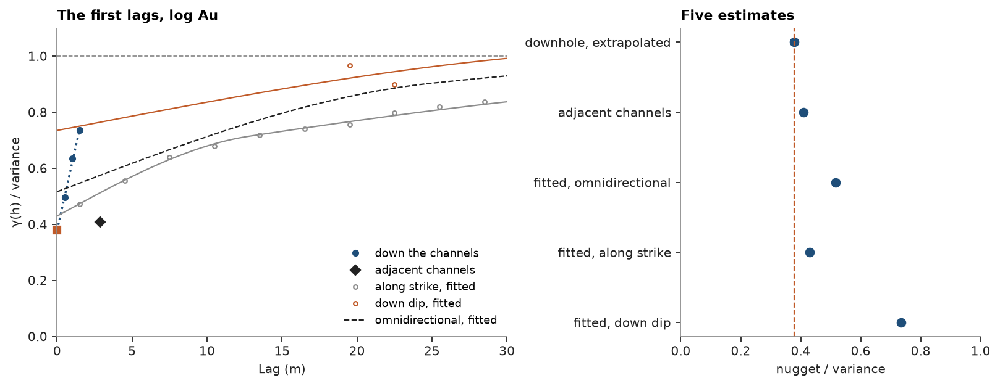

# nugget inference

the nugget is the jump of the variogram at the origin, and no pair of samples sits at zero distance to measure it. each
way of reading it looks from a different distance and direction: extrapolating the first lags down a hole, comparing the
closest samples of neighboring holes, or fitting a model to the variogram between holes. five such estimates for gold in
vein V1 sit side by side, followed by the one to keep.

<details><summary>Python</summary>

```python
import boitata as bt
import matplotlib.pyplot as plt
import numpy as np
from common import ACCENT, GRAY, HIGHLIGHT, INK, save

data = bt.datasets.vein_gold_grade_control()
collars = data["collars"]
intervals = bt.merge_intervals(data["assays"], data["lithology"])
samples = bt.Drillholes(collars, data["surveys"], intervals).samples()
kind = dict(zip(collars["HOLE_ID"], collars["TYPE"], strict=True))
drilling = np.array([kind[h] for h in samples["HOLE_ID"]])
keep = (samples["LITH"] == "QV") & (samples["VEIN"] == "V1") & (drilling == "CH")
channels = samples.filter(keep).drop_null("AU_GPT")
channels = channels.with_column("LOG_AU", np.log(channels["AU_GPT"]))
variance = channels["LOG_AU"].var()
length = channels["TO"] - channels["FROM"]
print(
    f"{len(channels)} channel samples, median length {np.median(length):.2f} m, variance of log Au {variance:.2f}"
)
```

</details>

```text
5464 channel samples, median length 0.50 m, variance of log Au 2.49
```

every estimate uses the same samples: the channel assays of the V1 quartz, about 0.5 m long and uncomposited, so
support does not differ between them. gold grades are skewed, and a few extreme pairs make a raw variogram erratic
([madogram](../../05-spatial-continuity/06-madogram/README.md)). the log of the grades, closer to gaussian, gives
steadier variograms, so the nuggets here are those of log Au, each divided by the variance of the samples.

the channels run across the vein on levels 20 m apart, about one channel every 3 m along each drive. that spacing sets
what each estimate can see. the vein's orientation, from the samples' best-fit plane:

<details><summary>Python</summary>

```python
centered = channels.coords - channels.coords.mean(axis=0)
pole = np.linalg.svd(centered, full_matrices=False)[2][2]
pole = pole if pole[2] > 0 else -pole
dip = np.degrees(np.arccos(pole[2]))
dip_direction = np.degrees(np.arctan2(pole[0], pole[1])) % 360
strike = (dip_direction - 90) % 360
print(f"V1 strikes {strike:03.0f}° and dips {dip:.0f}° towards {dip_direction:03.0f}°")
```

</details>

```text
V1 strikes 350° and dips 76° towards 080°
```

## down the channels

a channel is a short horizontal hole across the vein. with `holes=`, only pairs within one channel count, so the first
lags sit at one, two and three sample lengths. `nugget()` draws a line through the first three and reads it at zero,
as in [downhole nugget](../../05-spatial-continuity/05-downhole-nugget/README.md).

<details><summary>Python</summary>

```python
downhole = bt.experimental_variogram(channels, "LOG_AU", 0.5, 3.0, holes="HOLE_ID")
estimates = {"downhole, extrapolated": downhole.nugget() / variance}
for h, g, n in zip(downhole.lags[:3], downhole.gammas[:3] / variance, downhole.counts[:3], strict=True):
    print(f"{h:4.2f} m  γ/σ² {g:.2f}  {n:.0f} pairs")
```

</details>

```text
0.50 m  γ/σ² 0.50  4171 pairs
1.00 m  γ/σ² 0.64  2977 pairs
1.49 m  γ/σ² 0.74  2026 pairs
```

## neighboring channels

half the mean squared difference of paired samples is the variogram at the pairing distance. field duplicates, two
samples split from one interval, would put that distance at zero and measure the sampling and assay error alone. these
data hold none ([duplicates](../../02-data-and-geometry/04-duplicates/README.md) finds only records entered twice).
the next closest pairs are the samples of adjacent channels: `pairs` takes, for each sample, the nearest one of
another channel within 5 m.

<details><summary>Python</summary>

```python
paired = bt.pairs(channels, channels, 5.0, values="LOG_AU", holes="HOLE_ID")
a, b = paired["value_a"], paired["value_b"]
estimates["adjacent channels"] = 0.5 * np.mean((a - b) ** 2) / variance
print(f"{len(paired)} pairs, mean distance {paired['distance'].mean():.1f} m")
```

</details>

```text
4664 pairs, mean distance 2.9 m
```

## fitted between channels

the usual route fits experimental variograms with 3 m lags, using two nested spherical structures and a free nugget.
the omnidirectional variogram pools all pairs; the directional ones follow the drives along strike and the dip of the
vein, across the levels. each lag carries the label of its bin center, so the first one along strike, at 1.5 m, holds
the adjacent channels 2.5 to 3 m apart.

<details><summary>Python</summary>

```python
lag, max_lag, model = 3.0, 60.0, ["spherical", "spherical"]
directions = {
    "omnidirectional": {},
    "along strike": {"azimuth": strike},
    "down dip": {"azimuth": dip_direction, "dip": dip},
}
experimental, fitted = {}, {}
for name, direction in directions.items():
    experimental[name] = bt.experimental_variogram(channels, "LOG_AU", lag, max_lag, **direction)
    fitted[name] = experimental[name].fit(model)
    estimates[f"fitted, {name}"] = fitted[name].nugget / variance
    first = np.flatnonzero(experimental[name].counts >= 30)[0]
    print(
        f"{name:16} first lag {experimental[name].lags[first]:5.1f} m, {experimental[name].counts[first]:6.0f} pairs"
    )
```

</details>

```text
omnidirectional  first lag   1.5 m,  18664 pairs
along strike     first lag   1.5 m,   6891 pairs
down dip         first lag  19.5 m,  52947 pairs
```

## side by side

<details><summary>Python</summary>

```python
print(f"{'estimate':28}{'nugget / variance':>18}")
for name, value in estimates.items():
    print(f"{name:28}{value:>18.2f}")

fig, (a, b) = plt.subplots(1, 2, figsize=(10, 3.8), layout="constrained", width_ratios=[1.5, 1])
h = np.linspace(0.01, 30, 200)
a.plot(downhole.lags[:3], downhole.gammas[:3] / variance, "o", color=ACCENT, ms=4, label="down the channels")
a.plot(
    [0, downhole.lags[2]],
    [estimates["downhole, extrapolated"], downhole.gammas[2] / variance],
    ":",
    color=ACCENT,
)
a.plot(0, estimates["downhole, extrapolated"], "s", color=HIGHLIGHT, ms=5, clip_on=False)
a.plot(
    paired["distance"].mean(), estimates["adjacent channels"], "D", color=INK, ms=5, label="adjacent channels"
)
for name, color in (("along strike", GRAY), ("down dip", HIGHLIGHT)):
    exp = experimental[name]
    shown = exp.counts >= 30
    a.plot(
        exp.lags[shown],
        exp.gammas[shown] / variance,
        "o",
        color=color,
        ms=3,
        mfc="none",
        label=f"{name}, fitted",
    )
    a.plot(h, fitted[name].gamma(h) / variance, color=color, lw=1)
a.plot(
    h, fitted["omnidirectional"].gamma(h) / variance, "--", color=INK, lw=1, label="omnidirectional, fitted"
)
a.axhline(1, color=GRAY, lw=0.8, ls="--")
a.set(xlim=(0, 30), ylim=(0, 1.1), xlabel="Lag (m)", ylabel="γ(h) / variance")
a.set_title("The first lags, log Au")
a.legend(loc="lower right", fontsize=8)
names = list(estimates)
b.plot(list(estimates.values()), range(len(names)), "o", color=ACCENT)
b.axvline(estimates["downhole, extrapolated"], color=HIGHLIGHT, lw=1, ls="--")
b.set(yticks=range(len(names)), yticklabels=names, xlim=(0, 1), xlabel="nugget / variance")
b.invert_yaxis()
b.set_title("Five estimates")
save(fig, "nuggets")
```

</details>

```text
estimate                     nugget / variance
downhole, extrapolated                    0.38
adjacent channels                         0.41
fitted, omnidirectional                   0.52
fitted, along strike                      0.43
fitted, down dip                          0.73
```



## why they differ

the estimates run from 0.38 to 0.73 of the variance, all from the same samples, because each one reads from a
different distance. down the channels the first lag sits at 0.5 m; adjacent channels lie 2.9 m apart along strike;
down the dip the closest pairs are a level apart, 20 m. any structure the variogram has between zero and the first lag
lands in the nugget, so an estimate that starts farther out comes out higher. the down-dip fit has no pair closer than
18 m and puts most of its sill in the nugget. the omnidirectional variogram pools pairs across the vein, where log Au
changes fast, with pairs along strike, where it changes slowly, and its fit sits above both directions.

two sources share the nugget, and none of these estimates can split them: sampling and assay error, which only
duplicates measure, and geology below the 0.5 m sample, the free gold and quartz textures inside one interval. both
shrink as the support grows. the values here hold for 0.5 m samples; 1 m composites would show a smaller nugget
([downhole nugget](../../05-spatial-continuity/05-downhole-nugget/README.md) follows that effect with composite
length).

## the choice

take the downhole extrapolation, 0.38 of the variance. it reads the shortest lags, with thousands of pairs at each,
and the nugget has no direction, so the direction with the shortest lags sees it best. the adjacent channels give
0.41, an upper bound, since their pairs include 2.9 m of structure along strike. the two agree, so the line did not
undershoot. the along-strike fit gives 0.43. the omnidirectional and down-dip fits start beyond the short-scale
structure and overstate the nugget.

the choice goes into the model as a fixed `nugget=`. along strike, the refit with the nugget held at 0.38 follows the
points almost as well as the free fit, its short structure taking up the difference:

<details><summary>Python</summary>

```python
along = experimental["along strike"]
chosen = along.fit(model, nugget=estimates["downhole, extrapolated"] * variance)
for label, fit in (("free", fitted["along strike"]), ("fixed", chosen)):
    misfit = np.average((along.gammas - fit.gamma(along.lags)) ** 2, weights=along.counts) / variance**2
    parts = ", ".join(f"{s.sill / variance:.2f} ({s.range:.0f} m)" for s in fit.structures)
    print(
        f"{label:5} nugget {fit.nugget / variance:.2f}, structures {parts}, mean squared misfit {misfit:.1e}"
    )
```

</details>

```text
free  nugget 0.43, structures 0.18 (13 m), 0.31 (55 m), mean squared misfit 1.1e-04
fixed nugget 0.38, structures 0.21 (10 m), 0.32 (53 m), mean squared misfit 1.3e-04
```

Full script: [`example_05_11.py`](example_05_11.py)
