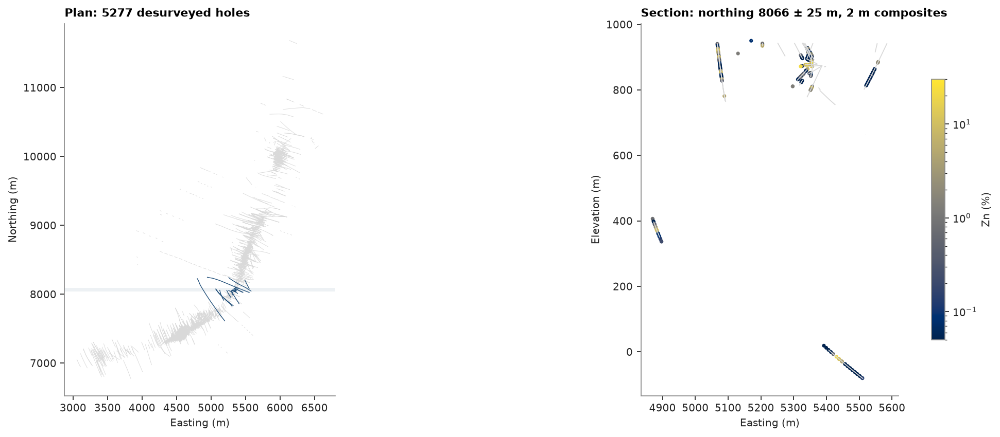
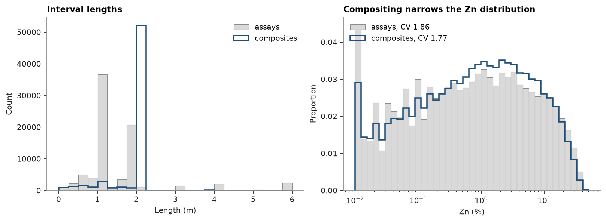
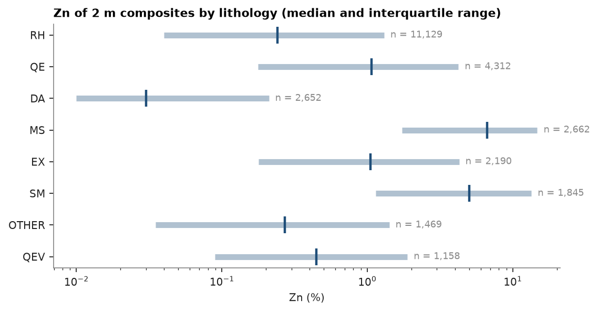

# 6. Drillholes

5 277 holes with collar, survey (dip positive down, azimuth clockwise from north), assay and geology tables.

<details><summary>Python</summary>

```python
import ceres as cs
import matplotlib.pyplot as plt
import numpy as np
from common import ACCENT, GREY, INK, LIGHT, fetch, save
from matplotlib.collections import LineCollection
from matplotlib.colors import LogNorm
```

</details>

Assays and lithology come in separate interval tables. `merge_intervals` splits both at every boundary so each piece
carries its grades and its lithology. `Drillholes` desurveys every hole by minimum curvature; compositing to 2 m by
`LITH` never averages across a contact, does not read unsampled core as zero and drops composites without assays.

<details><summary>Python</summary>

```python
assay = cs.read_csv(fetch("drillholes/assay.csv"))
geology = cs.read_csv(fetch("drillholes/geology.csv"))
intervals = cs.merge_intervals(assay, geology)
dh = cs.Drillholes(
    cs.read_csv(fetch("drillholes/collar.csv")),
    cs.read_csv(fetch("drillholes/survey.csv")),
    intervals,
)

composites = dh.composite(2.0, ["ZN", "PB", "CU", "AG", "AU"], domain="LITH")
paths = dh.paths()
print(dh)
print(
    f"{assay.num_rows} assays + {geology.num_rows} geology intervals -> {intervals.num_rows} merged -> {len(composites)} composites"
)
```

</details>

```text
Drillholes(5277 holes, 137018 intervals)
81656 assays + 64431 geology intervals -> 137018 merged -> 62506 composites
```

Traces in plan and a 50 m thick section with the Zn composites:

<details><summary>Python</summary>

```python
hole = np.array(paths["hole"])
xyz = np.c_[paths["x"], paths["y"], paths["z"]]
breaks = np.flatnonzero(hole[1:] != hole[:-1]) + 1
traces = np.split(xyz, breaks)

y0 = np.median(composites.coords[:, 1])
half = 25.0
in_slab = [t for t in traces if np.any(np.abs(t[:, 1] - y0) < half)]
inside = []
for t in in_slab:
    keep = np.abs(t[:, 1] - y0) < half
    for run in np.split(np.arange(len(t)), np.flatnonzero(np.diff(keep.astype(int))) + 1):
        if keep[run[0]] and len(run) > 1:
            inside.append(t[run][:, [0, 2]])
comps = composites.coords
zn = composites["ZN"]
near = (np.abs(comps[:, 1] - y0) < half) & ~np.isnan(zn) & (zn > 0)

fig, (a, b) = plt.subplots(
    1, 2, figsize=(12, 5.2), layout="constrained", gridspec_kw={"width_ratios": [1, 1.6]}
)
a.add_collection(LineCollection([t[:, :2] for t in traces], colors=LIGHT, linewidths=0.4))
a.add_collection(LineCollection([t[:, :2] for t in in_slab], colors=ACCENT, linewidths=0.6))
a.axhspan(y0 - half, y0 + half, color=ACCENT, alpha=0.08, lw=0)
a.autoscale()
a.set_aspect("equal")
a.set(title=f"Plan: {len(dh)} desurveyed holes", xlabel="Easting (m)", ylabel="Northing (m)")
b.add_collection(LineCollection(inside, colors=LIGHT, linewidths=0.8))
points = b.scatter(comps[near, 0], comps[near, 2], c=zn[near], s=5, norm=LogNorm(0.05, 30), cmap="ceres")
b.autoscale()
b.set_aspect("equal")
b.set(
    title=f"Section: northing {y0:.0f} ± {half:.0f} m, 2 m composites",
    xlabel="Easting (m)",
    ylabel="Elevation (m)",
)
fig.colorbar(points, ax=b, shrink=0.7, label="Zn (%)")
save(fig, "holes")
```

</details>



Compositing regularizes support: most assays are 1 m, some much longer.

<details><summary>Python</summary>

```python
raw_len = assay["TO"] - assay["FROM"]
comp_len = composites["to"] - composites["from"]
fig, (a, b) = plt.subplots(1, 2, figsize=(10, 3.6), layout="constrained")
bins = np.arange(0, 6.25, 0.25)
a.hist(np.clip(raw_len, 0, 6), bins, color=LIGHT, edgecolor=GREY, lw=0.5, label="assays")
a.hist(comp_len, bins, histtype="step", color=ACCENT, lw=1.6, label="composites")
a.set(title="Interval lengths", xlabel="Length (m)", ylabel="Count")
a.legend()
logbins = np.logspace(-2, 1.7, 40)
raw_zn = assay["ZN"]
a_zn = raw_zn[raw_zn > 0]
c_zn = zn[zn > 0]
b.hist(
    a_zn,
    logbins,
    weights=np.full(a_zn.size, 1 / a_zn.size),
    color=LIGHT,
    edgecolor=GREY,
    lw=0.5,
    label=f"assays, CV {a_zn.std() / a_zn.mean():.2f}",
)
b.hist(
    c_zn,
    logbins,
    weights=np.full(c_zn.size, 1 / c_zn.size),
    histtype="step",
    color=ACCENT,
    lw=1.6,
    label=f"composites, CV {c_zn.std() / c_zn.mean():.2f}",
)
b.set_xscale("log")
b.set(title="Compositing narrows the Zn distribution", xlabel="Zn (%)", ylabel="Proportion")
b.legend(loc="upper left")
b.tick_params(axis="y", colors=INK)
save(fig, "compositing")
```

</details>



Zn by lithology:

<details><summary>Python</summary>

```python
lith = np.array(composites.attributes["LITH"])
names, counts = np.unique(lith[lith != ""], return_counts=True)
top = names[np.argsort(counts)[::-1][:8]]
fig, ax = plt.subplots(figsize=(7, 3.6), layout="constrained")
for i, name in enumerate(top):
    values = zn[(lith == name) & ~np.isnan(zn)]
    q1, med, q3 = np.percentile(values, [25, 50, 75])
    ax.plot([q1, q3], [i, i], color=ACCENT, lw=5, alpha=0.35, solid_capstyle="butt")
    ax.plot(med, i, "|", color=ACCENT, ms=14, mew=2)
    ax.text(q3, i, f"  n = {len(values):,}", va="center", color=GREY, fontsize=8)
ax.set_yticks(range(len(top)), top)
ax.invert_yaxis()
ax.set_xscale("log")
ax.set(title="Zn of 2 m composites by lithology (median and interquartile range)", xlabel="Zn (%)")
save(fig, "domains")
```

</details>



Full script: [`example.py`](example.py)
