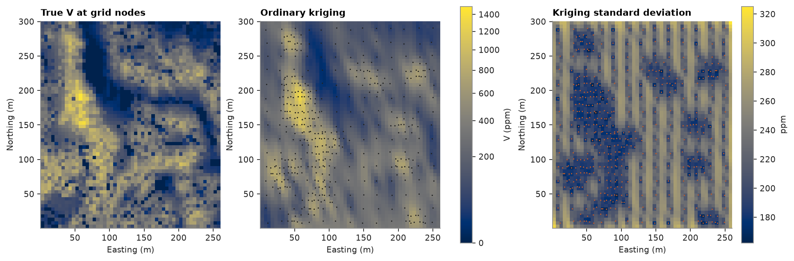
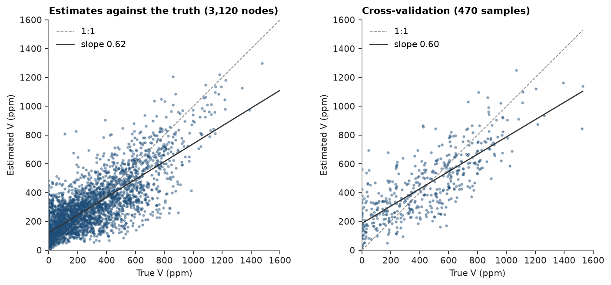

# ordinary kriging

ordinary kriging of walker lake `V` on a 5 m grid, with its kriging variance, checked against the exhaustive values and
by leave-one-out cross-validation.

<details><summary>Python</summary>

```python
import boitata as bt
import matplotlib.pyplot as plt
import numpy as np
from common import ACCENT, HIGHLIGHT, INK, map_axes, save
from matplotlib.colors import PowerNorm

samples = bt.datasets.walker_lake()
truth = bt.datasets.walker_lake_exhaustive()["V"].reshape(300, 260)
```

</details>

two nested spherical structures fitted to experimental variograms in eight directions
([variogram fitting](../../05-spatial-continuity/02-variogram-fitting/README.md) explains the fit):

<details><summary>Python</summary>

```python
azimuths = np.arange(0, 180, 22.5)
directional = [bt.experimental_variogram(samples, "V", 10.0, 120.0, azimuth=a) for a in azimuths]
model = bt.Variogram.fit_directional(
    directional, [(a, 0) for a in azimuths], ["spherical", "spherical"], weighting="count/gamma"
)
print(model)
```

</details>

```text
Variogram(nugget=16458.263904055566, structures=[Structure("spherical", sill=39532.539054973735, range=36.61762520915539), Structure("spherical", sill=39110.929672733, range=115)], rotation=(161.46015029654865, 0.0, 0.0), ratios=(0.33583545063941, 1.0))
```

the search takes up to 24 samples within 100 m. `predict` accepts a `BlockModel`, a `PointSet` or an array of
coordinates; `with_column` stores the results on the model.

<details><summary>Python</summary>

```python
grid = bt.BlockModel(origin=(0.5, 0.5), size=(5, 5), count=(52, 60))
search = bt.Search(radius=100, max_samples=24, min_samples=4)
ok = bt.OrdinaryKriging(model, search).fit(samples, "V")
estimate, variance = ok.predict(grid, return_variance=True)
grid = grid.with_column("estimate", estimate).with_column("variance", variance)
print(grid)
```

</details>

```text
BlockModel(regular, 3120 of 3120 cells, count [52, 60, 1], size [5.0, 5.0, 1.0], rotation [0.0, 0.0, 0.0])
  estimate: Float64
  variance: Float64
```

compare with the true values at the grid nodes, and re-estimate every sample with itself left out:

<details><summary>Python</summary>

```python
nodes = grid.coords.astype(int)
true_at_nodes = truth[nodes[:, 1] - 1, nodes[:, 0] - 1]
cv = ok.cross_validate()
print(f"grid: mean estimate {estimate.mean():.1f}, true {true_at_nodes.mean():.1f}")
print(f"variance of estimates {estimate.var():.0f} vs true {true_at_nodes.var():.0f}")
print(
    f"cross-validation: ME {cv.mean_error:.1f}  RMSE {cv.rmse:.1f}  r {cv.correlation:.2f}  "
    f"slope {cv.slope:.2f}  error²/variance {cv.standardized_squared_error:.2f}"
)
```

</details>

```text
grid: mean estimate 291.7, true 276.2
variance of estimates 38466 vs true 62312
cross-validation: ME 12.1  RMSE 185.6  r 0.79  slope 1.03  error²/variance 0.71
```

the kriging standard deviation depends only on the data layout and the model: low near samples, high in gaps.

<details><summary>Python</summary>

```python
extent = (0.5, 260.5, 0.5, 300.5)
norm = PowerNorm(0.5, vmin=0, vmax=1500)
fig, axes = plt.subplots(1, 3, figsize=(12, 4.6), layout="constrained")
for ax, image, title in (
    (axes[0], true_at_nodes, "True V at grid nodes"),
    (axes[1], estimate, "Ordinary kriging"),
):
    im = ax.imshow(grid.grid(image)[0], origin="lower", extent=extent, norm=norm)
    map_axes(ax, title)
axes[1].scatter(samples.x, samples.y, s=2, color=INK, linewidths=0)
fig.colorbar(im, ax=axes[:2], shrink=0.8, label="V (ppm)")
sd = axes[2].imshow(np.sqrt(grid.grid("variance")[0]), origin="lower", extent=extent, cmap="cividis")
map_axes(axes[2], "Kriging standard deviation")
axes[2].scatter(samples.x, samples.y, s=2, color=HIGHLIGHT, linewidths=0)
fig.colorbar(sd, ax=axes[2], shrink=0.8, label="ppm")
save(fig, "maps")
```

</details>



kriging smooths: the estimates vary less than the truth, a variance of 38 000 against 62 000 at the nodes.
cross-validation shows no conditional bias (the slope of actual on estimate is near 1). a mean error² / variance of
0.71 means the model's variance runs high here.

<details><summary>Python</summary>

```python
fig, (a, b) = plt.subplots(1, 2, figsize=(9, 4), layout="constrained")
for ax, x, y, title in (
    (a, true_at_nodes, estimate, f"Estimates against the truth ({len(estimate):,} nodes)"),
    (b, cv.actual, cv.estimate, f"Cross-validation ({len(cv.actual)} samples)"),
):
    bt.plot.scatter(x, y, ax=ax, s=4, color=ACCENT, alpha=0.4)
    ax.set(xlim=(0, 1600), ylim=(0, 1600), xlabel="True V (ppm)", ylabel="Estimated V (ppm)")
    ax.set_aspect("equal")
    ax.set_title(title)
    ax.legend(loc="upper left")
save(fig, "validation")
```

</details>



the neighborhood search is a k-d tree and nodes are kriged in parallel, so large grids stay fast: every 1 m node of
the area, 78 000 targets, takes about half a second.
[simple estimators](../../06-kriging/02-simple-estimators/README.md) compares cheaper methods, and
[search](../../06-kriging/06-search/README.md) refines the search.

Full script: [`example_06_01.py`](example_06_01.py)
