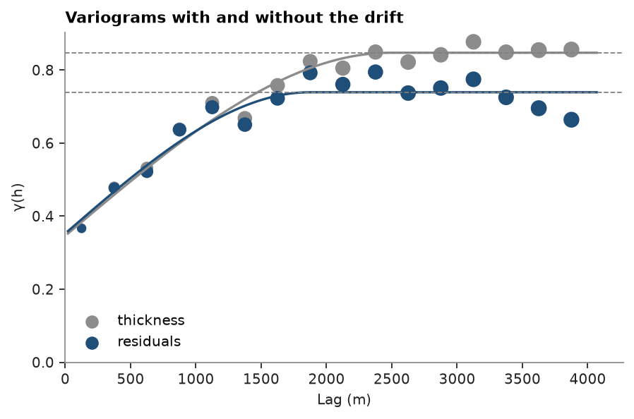
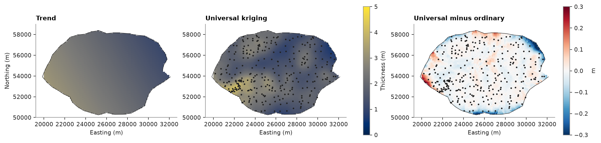
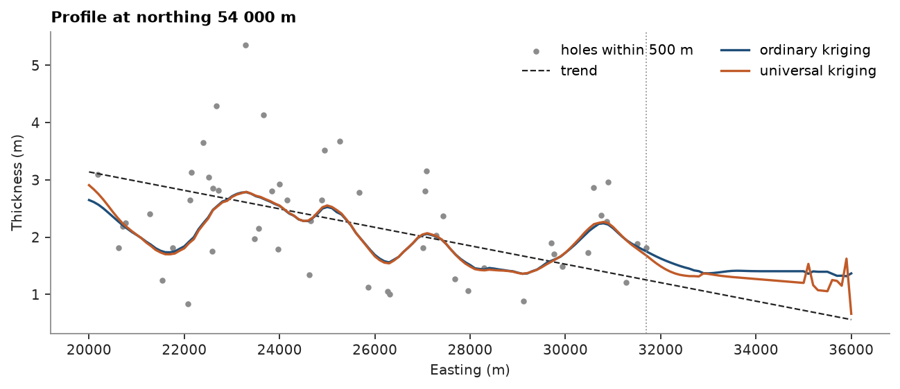

# universal kriging

the coal seam thins to the east. `detrend` fits that drift as a `Trend`. universal kriging estimates the thickness with
the drift re-fitted in every neighborhood, using the variogram of the residuals. inside the drilled lease it agrees with
ordinary kriging; beyond the last holes it keeps following the drift.

<details><summary>Python</summary>

```python
import boitata as bt
import matplotlib.pyplot as plt
import numpy as np
from common import ACCENT, GRAY, HIGHLIGHT, INK, map_axes, save

data = bt.datasets.coal_seam_thickness()
holes, grid, lease = data["boreholes"], data["grid"], data["boundary"]
inside = grid["INSIDE"] == 1
```

</details>

## trend

a plane fitted by least squares: `coefficients` are the constant, then the x, y and z slopes.

<details><summary>Python</summary>

```python
trend, residuals = bt.detrend(holes, "THICKNESS_M", degree=1)
constant, per_x, per_y, _ = trend.coefficients
print(f"thickness = {constant:.2f} {per_x * 1000:+.3f} m/km east {per_y * 1000:+.3f} m/km north")
print(f"variance {holes['THICKNESS_M'].var():.2f} m², of the residuals {residuals.var():.2f} m²")
```

</details>

```text
thickness = 11.54 -0.161 m/km east -0.096 m/km north
variance 0.93 m², of the residuals 0.66 m²
```

the drift inflates the variogram of the thickness at long lags, and the residuals level off lower. universal kriging
takes the residual variogram, since the weights estimate the drift.

<details><summary>Python</summary>

```python
raw = bt.experimental_variogram(holes, "THICKNESS_M", 250.0, 4000.0)
detrended = bt.experimental_variogram(holes.coords, residuals, 250.0, 4000.0)
model = raw.fit("spherical")
residual_model = detrended.fit("spherical")
print(model, residual_model, sep="\n")

fig, ax = plt.subplots(figsize=(5.5, 3.6), layout="constrained")
bt.plot.variogram(raw, variogram=model, ax=ax, color=GRAY, label="thickness")
bt.plot.variogram(detrended, variogram=residual_model, ax=ax, color=ACCENT, label="residuals")
ax.set_title("Variograms with and without the drift")
ax.set_xlabel("Lag (m)")
ax.legend()
save(fig, "variograms")
```

</details>

```text
Variogram(nugget=0.3462976754436873, structures=[Structure("spherical", sill=0.5010714601661295, range=2488.157730375319)], rotation=(0.0, 0.0, 0.0), ratios=(1.0, 1.0))
Variogram(nugget=0.35259576488935374, structures=[Structure("spherical", sill=0.38656878888594104, range=1869.901439094896)], rotation=(0.0, 0.0, 0.0), ratios=(1.0, 1.0))
```



## estimates

universal kriging with a linear drift against ordinary kriging, same search:

<details><summary>Python</summary>

```python
search = bt.Search(radius=6000, max_samples=32, min_samples=12)
ordinary = bt.OrdinaryKriging(model, search).fit(holes, "THICKNESS_M")
universal = bt.UniversalKriging(residual_model, search, degree=1).fit(holes, "THICKNESS_M")
ok, uk = ordinary.predict(grid), universal.predict(grid)
difference = uk - ok
print(f"inside the lease: mean |UK - OK| {np.nanmean(np.abs(difference[inside])):.3f} m")
for name, estimator in (("ordinary", ordinary), ("universal", universal)):
    cv = estimator.cross_validate()
    print(f"{name:>9} cross-validation: ME {cv.mean_error:+.3f}  RMSE {cv.rmse:.3f}  slope {cv.slope:.2f}")
```

</details>

```text
inside the lease: mean |UK - OK| 0.027 m
 ordinary cross-validation: ME +0.004  RMSE 0.596  slope 1.04
universal cross-validation: ME -0.002  RMSE 0.599  slope 1.02
```

<details><summary>Python</summary>

```python
low, high = grid.bounds
extent = (low[0], high[0], low[1], high[1])


def image(ax, values, **kwargs):
    values = grid.grid(np.where(inside, values, np.nan))[0]
    shown = ax.imshow(values, origin="lower", extent=extent, **kwargs)
    ax.plot(*lease.coords[:, :2].T, color=INK, lw=0.6)
    return shown


fig, axes = plt.subplots(1, 3, figsize=(13, 3.6), layout="constrained")
norm = plt.Normalize(0, 5)
image(axes[0], trend.predict(grid), norm=norm)
map_axes(axes[0], "Trend")
shown = image(axes[1], uk, norm=norm)
axes[1].scatter(*holes.coords[:, :2].T, s=2, color=INK)
map_axes(axes[1], "Universal kriging")
fig.colorbar(shown, ax=axes[:2], label="Thickness (m)", shrink=0.8)
limit = 0.3
shown = image(axes[2], difference, cmap="RdBu_r", vmin=-limit, vmax=limit)
axes[2].scatter(*holes.coords[:, :2].T, s=2, color=INK)
map_axes(axes[2], "Universal minus ordinary")
fig.colorbar(shown, ax=axes[2], label="m", shrink=0.8)
for ax in axes[1:]:
    ax.set_ylabel("")
save(fig, "maps")
```

</details>



where holes surround a cell, the local drift and the local mean give nearly the same estimate, and the two
cross-validations are equally good. the differences sit at the edges of the lease, where the neighbors lie on one
side: universal kriging is thicker in the thick west corner and thinner in the thin northeast.

## beyond the data

along an east-west line through the middle of the lease, extended past the last holes:

<details><summary>Python</summary>

```python
x = np.arange(20000.0, 36001.0, 100.0)
line = np.column_stack([x, np.full_like(x, 54000.0)])
near = np.abs(holes.y - 54000.0) < 500
print(f"easternmost hole at {holes.x.max():.0f} m")
profile = {
    "ordinary": ordinary.predict(line),
    "universal": universal.predict(line),
    "trend": trend.predict(line),
}
for at in (32000, 34000, 36000):
    i = np.searchsorted(x, at)
    print(f"x = {at}: " + ", ".join(f"{k} {v[i]:.2f} m" for k, v in profile.items()))

fig, ax = plt.subplots(figsize=(8, 3.4), layout="constrained")
ax.scatter(holes.x[near], holes["THICKNESS_M"][near], s=8, color=GRAY, label="holes within 500 m")
ax.plot(x, profile["trend"], color=INK, ls="--", lw=1, label="trend")
ax.plot(x, profile["ordinary"], color=ACCENT, label="ordinary kriging")
ax.plot(x, profile["universal"], color=HIGHLIGHT, label="universal kriging")
ax.axvline(holes.x.max(), color=GRAY, lw=0.8, ls=":")
ax.set(xlabel="Easting (m)", ylabel="Thickness (m)")
ax.set_title("Profile at northing 54 000 m")
ax.legend(ncols=2)
save(fig, "profile")
```

</details>

```text
easternmost hole at 31703 m
x = 32000: ordinary 1.63 m, universal 1.49 m, trend 1.21 m
x = 34000: ordinary 1.41 m, universal 1.27 m, trend 0.88 m
x = 36000: ordinary 1.37 m, universal 0.66 m, trend 0.56 m
```



past the last hole ordinary kriging levels off at the mean of its neighbors, about 1.4 m, while universal kriging
carries the thinning on, down to 0.66 m at 36 km against 0.56 m for the trend. whether that is right is a geological
call. universal kriging fits the local drift from the neighbors, so it needs a wider search than ordinary kriging:
with a few one-sided samples the drift is poorly determined and its extrapolation erratic.

Full script: [`example_06_03.py`](example_06_03.py)
