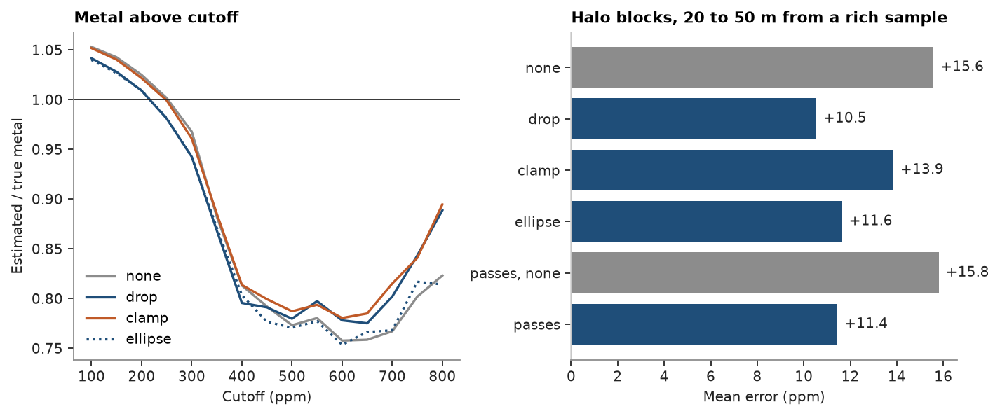

# High-grade restriction

A rich sample informs every node its search reaches, so an isolated high value spreads its grade far beyond the
ground it represents. `cs.HighGrade` restricts samples above a threshold beyond a distance: `mode="drop"` leaves them
out, `mode="clamp"` keeps them at the threshold, and ranges with a rotation give the restriction an ellipse of its
own. Each search pass carries its own restriction. Block kriging of Walker Lake `V` in 5 m blocks, checked against the
exhaustive block averages.

<details><summary>Python</summary>

```python
import ceres as cs
import matplotlib.pyplot as plt
import numpy as np
from common import ACCENT, GRAY, HIGHLIGHT, INK, LIGHT, save

samples = cs.datasets.walker_lake()
xy, v = samples.coords[:, :2], samples["V"]
exhaustive = cs.datasets.walker_lake_exhaustive()["V"].reshape(300, 260)
grid = cs.BlockModel(origin=(0.5, 0.5), size=(5, 5), count=(52, 60))
truth = exhaustive.reshape(60, 5, 52, 5).mean(axis=(1, 3)).ravel()

azimuths = np.arange(0, 180, 22.5)
directional = [cs.experimental_variogram(samples, "V", 10.0, 120.0, azimuth=a) for a in azimuths]
model = cs.Variogram.fit_directional(
    directional, [(a, 0) for a in azimuths], ["spherical", "spherical"], weighting="count/gamma"
)
kriging = cs.BlockKriging(model, cs.Search(radius=80), (5, 5)).fit(samples, "V")


def search(high_grade=None, *, radius=80, min_samples=4):
    ellipse = {"rotation": model.rotation, "ratios": (0.5, 1.0)}
    return cs.Search(
        radius=radius, max_samples=24, min_samples=min_samples, octant=True, high_grade=high_grade, **ellipse
    )
```

</details>

## Four restrictions

The threshold is 600 ppm, reached by almost a third of the samples, and the restricted distance 20 m. The tuple `(600, 20)` is shorthand for `cs.HighGrade(600, 20)`, which drops. Clamp
keeps the far rich samples at 600 ppm, so they still pull the node up, less. The ellipse restricts to 40 m along
the continuity and 10 m across it. The passes restrict to 15 m in a tight first pass and to 30 m in the wide second,
and are compared with the same passes unrestricted.

Blocks 20 to 50 m from the nearest rich sample are its halo: beyond the restricted distance, within the search.
That is where an unrestricted estimate spreads rich values, and where the restriction acts.

<details><summary>Python</summary>

```python
threshold = 600
rich = xy[v > threshold]
nearest = np.sqrt(((grid.centroids[:, None, :2] - rich[None]) ** 2).sum(-1)).min(axis=1)
halo = (nearest > 20) & (nearest < 50)

searches = {
    "none": search(),
    "drop": search((threshold, 20)),
    "clamp": search(cs.HighGrade(threshold, 20, mode="clamp")),
    "ellipse": search(cs.HighGrade(threshold, (40, 10, 10), rotation=model.rotation)),
    "passes, none": [search(radius=30, min_samples=8), search()],
    "passes": [search((threshold, 15), radius=30, min_samples=8), search((threshold, 30))],
}
cutoffs = np.arange(100, 801, 50)
estimates, metal = {}, {}
print(f"{np.mean(v > threshold):.0%} of the samples above {threshold} ppm, {halo.sum()} halo blocks")
print(f"{'search':>13}  halo mean error  block RMSE  metal above 300 ppm  cross-validation mean error")
for name, s in searches.items():
    estimator = kriging.with_search(s)
    estimate = estimates[name] = estimator.predict(grid)
    metal[name] = [estimate[estimate > c].sum() / truth[truth > c].sum() for c in cutoffs]
    print(
        f"{name:>13}  {np.mean(estimate[halo] - truth[halo]):+10.1f} ppm  {np.sqrt(np.mean((estimate - truth) ** 2)):7.1f}"
        f"  {metal[name][4]:14.1%}  {estimator.cross_validate().mean_error:+18.1f} ppm"
    )
```

</details>

```text
31% of the samples above 600 ppm, 1542 halo blocks
       search  halo mean error  block RMSE  metal above 300 ppm  cross-validation mean error
         none       +15.6 ppm    117.9           96.8%               +10.3 ppm
         drop       +10.5 ppm    117.1           94.2%                +9.0 ppm
        clamp       +13.9 ppm    117.5           96.1%               +12.5 ppm
      ellipse       +11.6 ppm    117.3           94.2%                +7.3 ppm
 passes, none       +15.8 ppm    118.4           98.0%               +14.0 ppm
       passes       +11.4 ppm    116.8           94.1%                +9.0 ppm
```

Unrestricted, the halo blocks are overestimated by 16 ppm on average. Dropping the rich samples beyond 20 m takes a
third of that off, and clamp lands between the two, as it must: a far rich sample enters at 600 ppm instead of its
grade or not at all. The ellipse, which lets rich samples reach twice as far along the continuity, does almost as
well as the circle. The restricted passes correct as much as the single restricted search.

## Metal above cutoff

Metal above a cutoff, the sum of the block grades above it, relative to the exhaustive truth.

<details><summary>Python</summary>

```python
fig, (a, b) = plt.subplots(1, 2, figsize=(8.8, 3.6), layout="constrained")
styles = {"none": (GRAY, "-"), "drop": (ACCENT, "-"), "clamp": (HIGHLIGHT, "-"), "ellipse": (ACCENT, ":")}
for name, (color, ls) in styles.items():
    a.plot(cutoffs, metal[name], color=color, ls=ls, lw=1.5, label=name)
a.axhline(1, color=INK, lw=0.8)
a.set(xlabel="Cutoff (ppm)", ylabel="Estimated / true metal", title="Metal above cutoff")
a.legend(loc="lower left")

names = list(searches)
errors = [np.mean(estimates[n][halo] - truth[halo]) for n in names]
colors = [GRAY if n.endswith("none") else ACCENT for n in names]
b.barh(names, errors, color=colors)
for y, e in enumerate(errors):
    b.text(e + 0.3, y, f"{e:+.1f}", va="center", color=INK)
b.axvline(0, color=INK, lw=0.8)
b.invert_yaxis()
b.set(xlabel="Mean error (ppm)", title="Halo blocks, 20 to 50 m from a rich sample")
b.spines["left"].set_color(LIGHT)
save(fig, "modes")
```

</details>



At low cutoffs the unrestricted estimate puts slightly too much metal, and dropping brings it closest to the
truth. From 400 ppm up every estimate falls about a fifth short: that is the smoothing of kriging, which no
restriction cures. Above 650 ppm the restriction even adds metal. Inside dense clusters of rich samples, ordinary
kriging gives the screened far ones small negative weights ([search](../../06-kriging/06-search/README.md)); dropping a negative weight on a high value
raises the estimate, and clamping, which swaps it for a negative weight on the lower threshold, raises it too.

The cross-validation mean error follows none of this closely: the samples sit in the clusters, where the
restriction acts through those negative weights, not in the halos. The truth, or a simulated one, is the better
judge of a restriction.

Full script: [`example_06_08.py`](example_06_08.py)
