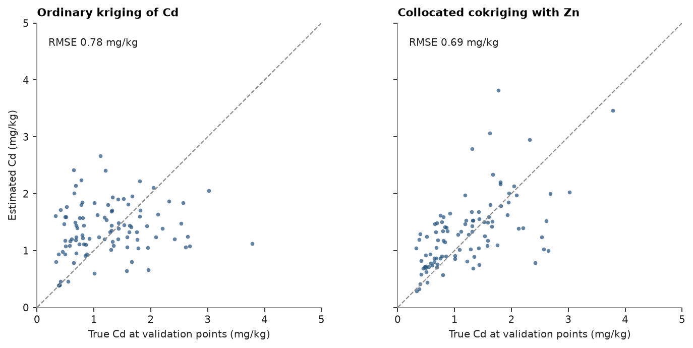

# Cokriging

Jura: 259 soil samples of heavy metals (mg/kg, coordinates in km) and 100 validation samples withheld from estimation.
Cd correlates with Zn, and Zn is also known at the validation points, which suits collocated cokriging.

<details><summary>Python</summary>

```python
import boitata as bt
import matplotlib.pyplot as plt
import numpy as np
from common import ACCENT, GRAY, INK, save

train = bt.datasets.jura()["prediction"]
test = bt.datasets.jura()["validation"]
xy = train.coords
cd, zn = train["Cd"], train["Zn"]
lag, max_lag = 0.1, 1.5
```

</details>

A linear model of coregionalization with two spherical structures, fitted to the Cd and Zn variograms and their
cross-variogram ([coregionalization](../../05-spatial-continuity/07-coregionalization/README.md) shows the fit), and an ordinary kriging of Cd alone for comparison:

<details><summary>Python</summary>

```python
experimentals = [
    [
        bt.experimental_variogram(xy, cd, lag, max_lag),
        bt.experimental_variogram(xy, cd, lag, max_lag, other=zn),
    ],
    [None, bt.experimental_variogram(xy, zn, lag, max_lag)],
]
lmc = bt.Coregionalization.fit(experimentals, ["spherical", "spherical"])
search = bt.Search(radius=1.5, max_samples=24, min_samples=4)
ok = bt.OrdinaryKriging(experimentals[0][0].fit("spherical"), search).fit(train, "Cd")
```

</details>

Cokriging takes the samples of both variables with a variable index each. Collocated cokriging also uses the
secondary value at the target itself, here Zn at each validation point:

<details><summary>Python</summary>

```python
ck = bt.Cokriging(lmc, search, means=[cd.mean(), zn.mean()])
ck.fit(np.vstack([xy, xy]), np.r_[cd, zn], [0] * len(cd) + [1] * len(zn))
truth = test["Cd"]
by_ok = ok.predict(test)
by_ck = ck.predict(test, collocated={1: test["Zn"]})


def rmse(e):
    return float(np.sqrt(np.mean((e - truth) ** 2)))


print(f"validation RMSE: ordinary kriging {rmse(by_ok):.3f}, collocated cokriging {rmse(by_ck):.3f} mg/kg")
print(
    f"variance of estimates: ordinary kriging {by_ok.var():.3f}, cokriging {by_ck.var():.3f}, true {truth.var():.3f}"
)
```

</details>

```text
validation RMSE: ordinary kriging 0.777, collocated cokriging 0.689 mg/kg
variance of estimates: ordinary kriging 0.211, cokriging 0.531, true 0.477
```

Using Zn at the target lowers the error and removes the smoothing that flattens ordinary kriging:

<details><summary>Python</summary>

```python
fig, axes = plt.subplots(1, 2, figsize=(9, 4.2), layout="constrained", sharey=True)
for ax, estimate, title in (
    (axes[0], by_ok, "Ordinary kriging of Cd"),
    (axes[1], by_ck, "Collocated cokriging with Zn"),
):
    ax.scatter(truth, estimate, s=12, color=ACCENT, alpha=0.7, linewidths=0)
    ax.plot([0, 5], [0, 5], color=GRAY, ls="--", lw=1)
    ax.set(xlim=(0, 5), ylim=(0, 5), xlabel="True Cd at validation points (mg/kg)", title=title)
    ax.set_aspect("equal")
    ax.text(0.2, 4.6, f"RMSE {rmse(estimate):.2f} mg/kg", color=INK)
axes[0].set_ylabel("Estimated Cd (mg/kg)")
save(fig, "validation")
```

</details>



Full script: [`example_06_09.py`](example_06_09.py)
