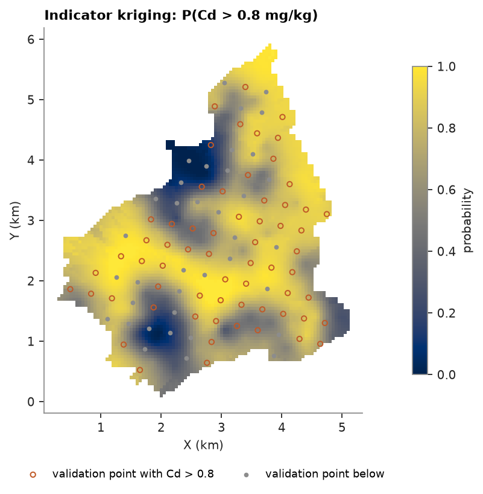

# indicator kriging

jura: 259 soil samples of heavy metals (mg/kg, coordinates in km) and 100 validation samples withheld from estimation.
indicator kriging maps the probability that Cd exceeds 0.8 mg/kg, the swiss guide value.

<details><summary>Python</summary>

```python
import boitata as bt
import matplotlib.pyplot as plt
import numpy as np
from common import GRAY, HIGHLIGHT, save

train = bt.datasets.jura()["prediction"]
test = bt.datasets.jura()["validation"]
grid = bt.datasets.jura()["grid"]
xy, cd = train.coords, train["Cd"]
limit = 0.8
print(f"share of samples above {limit} mg/kg: {np.mean(cd > limit):.0%}")
```

</details>

```text
share of samples above 0.8 mg/kg: 66%
```

the indicator is 1 where Cd is above the threshold and 0 below, and you fit its variogram like any other. IK estimates
P(Cd ≤ threshold), so the exceedance is its complement.

<details><summary>Python</summary>

```python
indicator_model = bt.experimental_variogram(xy, (cd > limit).astype(float), 0.1, 1.5).fit("spherical")
search = bt.Search(radius=1.5, max_samples=24, min_samples=4)
ik = bt.IndicatorKriging(indicator_model, search, threshold=limit).fit(xy, cd)
p_exceed = 1 - ik.predict(grid)
p_test = 1 - ik.predict(test)
exceeds = test["Cd"] > limit
print(
    f"validation: mean P(Cd > {limit}) {p_test[exceeds].mean():.2f} where true exceedance,"
    f" {p_test[~exceeds].mean():.2f} elsewhere"
)
```

</details>

```text
validation: mean P(Cd > 0.8) 0.75 where true exceedance, 0.62 elsewhere
```

most of the area exceeds 0.8 mg/kg, and the map picks out the clean zones:

<details><summary>Python</summary>

```python
fig, ax = plt.subplots(figsize=(6.2, 5), layout="constrained")
image = ax.scatter(*grid.coords[:, :2].T, c=p_exceed, s=7, marker="s", vmin=0, vmax=1, linewidths=0)
ax.scatter(
    *test.coords[exceeds, :2].T,
    s=14,
    facecolors="none",
    edgecolors=HIGHLIGHT,
    linewidths=0.9,
    label=f"validation point with Cd > {limit}",
)
ax.scatter(*test.coords[~exceeds, :2].T, s=6, color=GRAY, label="validation point below")
ax.set_aspect("equal")
ax.set(title=f"Indicator kriging: P(Cd > {limit} mg/kg)", xlabel="X (km)", ylabel="Y (km)")
ax.legend(loc="upper center", bbox_to_anchor=(0.5, -0.12), ncol=2, fontsize=8)
fig.colorbar(image, ax=ax, shrink=0.8, label="probability")
save(fig, "probability")
```

</details>



Full script: [`example_06_10.py`](example_06_10.py)
