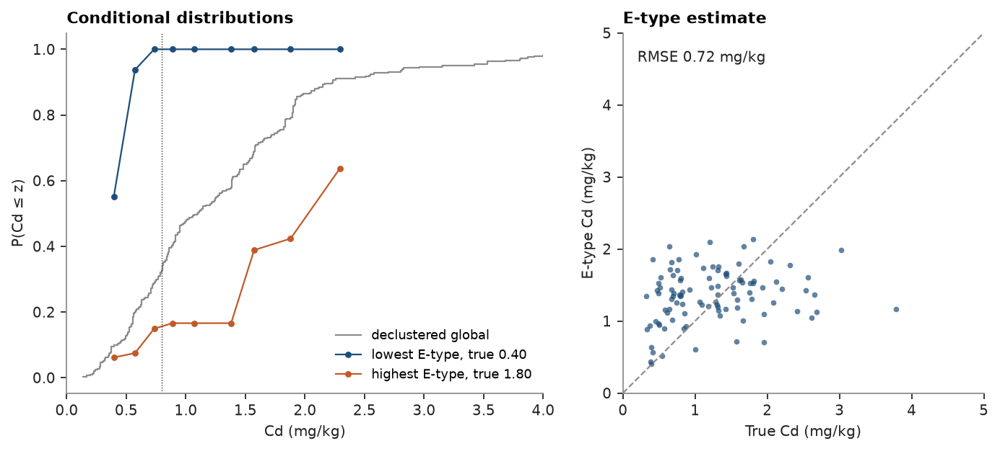
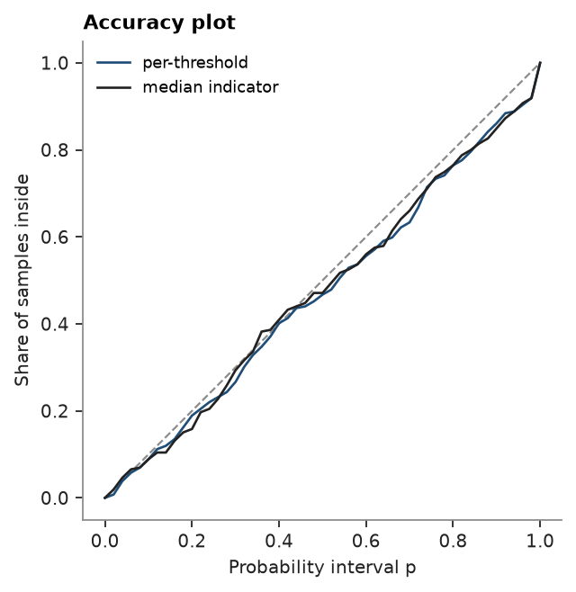

# Multiple indicator kriging

Jura: 259 soil samples of heavy metals (mg/kg, coordinates in km) and 100 validation samples withheld from estimation.
Multiple indicator kriging (MIK) estimates the whole conditional distribution of Cd at each target.

<details><summary>Python</summary>

```python
import ceres as cs
import matplotlib.pyplot as plt
import numpy as np
from common import ACCENT, GRAY, HIGHLIGHT, INK, save

train = cs.datasets.jura()["prediction"]
test = cs.datasets.jura()["validation"]
xy, cd = train.coords, train["Cd"]
truth = test["Cd"]
limit = 0.8
lag, max_lag = 0.1, 1.5
search = cs.Search(radius=1.5, max_samples=24, min_samples=4)
```

</details>

MIK kriges the indicators at the deciles of Cd and assembles the conditional distribution at each target: kriged
probabilities are corrected to rise from 0 to 1, and between thresholds the distribution follows the declustered
data. One indicator variogram per threshold lets low and high values have their own continuity; a single variogram
at the median solves one system per target instead. Ordinary kriging of Cd is the reference.

<details><summary>Python</summary>

```python
weights = cs.cell_declustering(xy, cd).weights
deciles = np.quantile(cd, np.linspace(0.1, 0.9, 9))
indicator_models = [
    cs.experimental_variogram(xy, (cd <= t).astype(float), lag, max_lag).fit("spherical") for t in deciles
]
summaries = {"cutoffs": [limit], "quantiles": [0.1, 0.5, 0.9]}
mik = cs.MultipleIndicatorKriging(indicator_models, search, deciles, tails=(0.0, cd.max()))
by_mik = mik.fit(xy, cd, weights=weights).predict(test, **summaries)
median = cs.MultipleIndicatorKriging(indicator_models[4], search, deciles, tails=(0.0, cd.max()))
by_median = median.fit(xy, cd, weights=weights).predict(test, **summaries)
ok = cs.OrdinaryKriging(cs.experimental_variogram(xy, cd, lag, max_lag).fit("spherical"), search).fit(
    train, "Cd"
)


def rmse(e):
    return float(np.sqrt(np.mean((e - truth) ** 2)))


exceeds = truth > limit
print(f"ordinary kriging: RMSE {rmse(ok.predict(test)):.3f} mg/kg")
for name, s in (("per-threshold variograms", by_mik), ("median indicator", by_median)):
    p = s.probability_above[:, 0]
    print(
        f"{name}: E-type RMSE {rmse(s.mean):.3f} mg/kg, mean P(Cd > {limit}) {p[exceeds].mean():.2f} where true"
        f" exceedance, {p[~exceeds].mean():.2f} elsewhere, mean correction {s.correction.mean():.3f}"
    )
inside = np.mean((truth >= by_mik.quantile_values[:, 0]) & (truth <= by_mik.quantile_values[:, 2]))
print(f"validation points inside their 10-90% interval: {inside:.0%}")
```

</details>

```text
ordinary kriging: RMSE 0.777 mg/kg
per-threshold variograms: E-type RMSE 0.717 mg/kg, mean P(Cd > 0.8) 0.76 where true exceedance, 0.61 elsewhere, mean correction 0.060
median indicator: E-type RMSE 0.755 mg/kg, mean P(Cd > 0.8) 0.76 where true exceedance, 0.62 elsewhere, mean correction 0.005
validation points inside their 10-90% interval: 77%
```

The E-type estimate, the mean of each distribution, has a lower error than ordinary kriging, and the median-indicator
shortcut gives most of that gain back. The distributions also carry the uncertainty: those at the lowest and highest
validation estimates sit on either side of the declustered global one:

<details><summary>Python</summary>

```python
order = np.argsort(by_mik.mean)
fig, axes = plt.subplots(1, 2, figsize=(9, 3.8), layout="constrained")
sorted_cd = np.sort(cd)
cumulative = np.cumsum(weights[np.argsort(cd)]) / weights.sum()
axes[0].step(sorted_cd, cumulative, where="post", color=GRAY, lw=1, label="declustered global")
for i, color, label in ((order[0], ACCENT, "lowest E-type"), (order[-1], HIGHLIGHT, "highest E-type")):
    axes[0].plot(deciles, by_mik.cdf[i], "o-", color=color, ms=3, lw=1, label=f"{label}, true {truth[i]:.2f}")
axes[0].axvline(limit, color=INK, lw=0.6, ls=":")
axes[0].set(xlabel="Cd (mg/kg)", ylabel="P(Cd ≤ z)", title="Conditional distributions", xlim=(0, 4))
axes[0].legend(fontsize=8, loc="lower right")
axes[1].scatter(truth, by_mik.mean, s=12, color=ACCENT, alpha=0.7, linewidths=0)
axes[1].plot([0, 5], [0, 5], color=GRAY, ls="--", lw=1)
axes[1].set(
    xlim=(0, 5), ylim=(0, 5), xlabel="True Cd (mg/kg)", ylabel="E-type Cd (mg/kg)", title="E-type estimate"
)
axes[1].set_aspect("equal")
axes[1].text(0.2, 4.6, f"RMSE {rmse(by_mik.mean):.2f} mg/kg", color=INK)
save(fig, "distributions")
```

</details>



Cross-validation re-estimates each sample's distribution from the others. Besides the error of the E-type mean, it
scores the distributions: the Brier score of each threshold's probability, and the accuracy plot, the share of
samples inside their own symmetric p-probability interval. Points on or above the diagonal are accurate, and the
goodness statistic falls from 1 as the curve strays from it, twice as fast below. The diagnostics of `predict` count
the thresholds whose kriged probabilities broke the order relations at each target:

<details><summary>Python</summary>

```python
p = np.linspace(0, 1, 51)
fig, ax = plt.subplots(figsize=(4.4, 4), layout="constrained")
ax.plot([0, 1], [0, 1], color=GRAY, ls="--", lw=1)
for name, estimator, color in (("per-threshold", mik, ACCENT), ("median indicator", median, INK)):
    cv = estimator.cross_validate()
    print(
        f"{name}: E-type RMSE {cv.rmse:.3f} mg/kg, slope {cv.slope:.2f}, goodness {cv.goodness:.3f},"
        f" Brier {cv.brier.mean():.3f}"
    )
    ax.plot(p, cv.accuracy(p), color=color, lw=1.2, label=name)
diagnostics = mik.predict(test, diagnostics=True).diagnostics
violated = diagnostics["n_order_violations"] > 0
print(f"validation targets with order-relation violations: {violated.mean():.0%}")
ax.set(xlabel="Probability interval p", ylabel="Share of samples inside", title="Accuracy plot")
ax.set_aspect("equal")
ax.legend(fontsize=8, loc="upper left")
save(fig, "accuracy")
```

</details>

```text
per-threshold: E-type RMSE 0.756 mg/kg, slope 1.06, goodness 0.939, Brier 0.131
median indicator: E-type RMSE 0.783 mg/kg, slope 0.97, goodness 0.944, Brier 0.133
validation targets with order-relation violations: 91%
```



At a panel centroid the distribution describes Cd at that one point. Kriging the indicators over the panel instead,
`discretization=(4, 4, 1)`, gives the distribution of the point values within it, and `localize` takes the same
argument. Each panel probability averages those of the points inside, so panels differ a little less and the order
relations need less correction. Within 1 km the indicator variograms rise mostly at the nugget, which kriging at a
centroid already filters, so here the two stay close:

<details><summary>Python</summary>

```python
panels = cs.BlockModel(origin=(0.25, 0.0), size=(1.0, 1.0), count=(5, 6))
by_centroid = mik.predict(panels, cutoffs=[limit])
by_panel = mik.predict(panels, cutoffs=[limit], discretization=(4, 4, 1))
for name, s in (("centroids", by_centroid), ("1 km panels", by_panel)):
    print(
        f"{name}: std of P(Cd > {limit}) across panels {np.nanstd(s.probability_above[:, 0]):.3f},"
        f" mean correction {np.nanmean(s.correction):.4f}"
    )
shift = np.nanmean(np.abs(by_panel.probability_above[:, 0] - by_centroid.probability_above[:, 0]))
print(f"mean |panel - centroid| probability {shift:.3f}")
```

</details>

```text
centroids: std of P(Cd > 0.8) across panels 0.188, mean correction 0.0218
1 km panels: std of P(Cd > 0.8) across panels 0.184, mean correction 0.0147
mean |panel - centroid| probability 0.016
```

Full script: [`example_06_11.py`](example_06_11.py)
