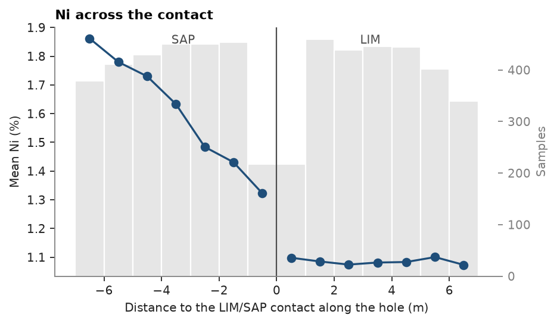
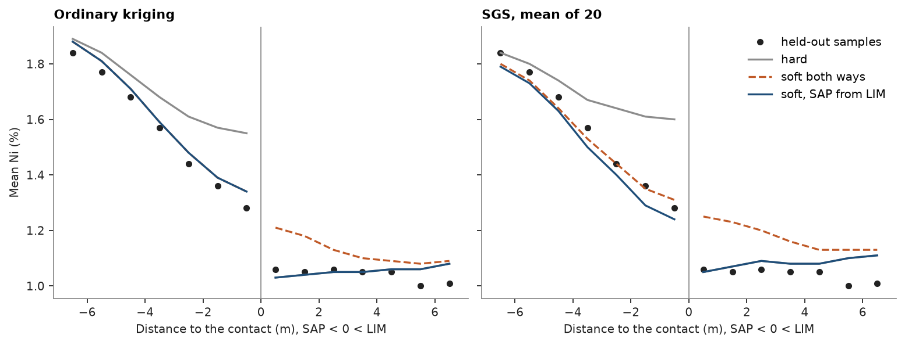

# Soft boundaries

A laterite grades from limonite (`LIM`) down into saprolite (`SAP`), and nickel does not step cleanly at the logged
contact. Fitted with `domains=` or `domain_column=`, an estimator informs each target from samples of its own domain
only: a hard boundary. `Search(..., soft=...)` opens it: samples of another domain within the soft distance inform a
target too, both ways or, with a dict, one way only. Kriging and SGS take the same search.

<details><summary>Python</summary>

```python
import boitata as bt
import matplotlib.pyplot as plt
import numpy as np
from common import ACCENT, GRAY, HIGHLIGHT, INK, save

data = bt.datasets.nickel_laterite_profile()
intervals = bt.merge_intervals(data["assays"], data["horizons"])
samples = bt.Drillholes(data["collars"], data["surveys"], intervals).samples()
samples = samples.filter(np.isin(np.asarray(samples["HORIZON"]), ["LIM", "SAP"]))
horizon = np.asarray(samples["HORIZON"])
for name in ("LIM", "SAP"):
    print(
        f"{name}: {np.sum(horizon == name)} samples of 1 m, mean {samples['NI_PCT'][horizon == name].mean():.2f} % Ni"
    )


def profile(points, values):
    return bt.contact(
        points,
        values,
        domain_column="HORIZON",
        holes="HOLE_ID",
        inside="SAP",
        outside="LIM",
        max_distance=7.0,
        bin=1,
    )
```

</details>

```text
LIM: 3334 samples of 1 m, mean 1.08 % Ni
SAP: 4901 samples of 1 m, mean 1.81 % Ni
```

Down each hole, the mean grade against the distance to the `LIM`/`SAP` contact:

<details><summary>Python</summary>

```python
observed = profile(samples, "NI_PCT")
print("distance:", observed["distance"])
print("mean Ni: ", observed["mean"].round(2))

fig, ax = bt.plot.contact(observed, labels=("SAP", "LIM"))
fig.set_size_inches(6, 3.4)
ax.set(
    xlabel="Distance to the LIM/SAP contact along the hole (m)",
    ylabel="Mean Ni (%)",
    title="Ni across the contact",
)
save(fig, "contact")
```

</details>

```text
distance: [-6.5 -5.5 -4.5 -3.5 -2.5 -1.5 -0.5  0.5  1.5  2.5  3.5  4.5  5.5  6.5]
mean Ni:  [1.86 1.78 1.73 1.63 1.48 1.43 1.32 1.1  1.09 1.07 1.08 1.08 1.1  1.07]
```



`LIM` is flat up to the contact. `SAP` loses grade steadily toward it, from 1.86 % Ni 6 to 7 m below to 1.32 % in the
last meter, and the step at the contact itself is small: the boundary is gradational on the saprolite side.

One normal-score variogram serves both horizons: each is scored on its own, then the scores are pooled. The nugget
and vertical range come from pairs down the holes, the horizontal range from pairs across them. Kriging weights do
not depend on the sill, so the same model serves kriging and SGS.

<details><summary>Python</summary>

```python
scores = np.empty(len(samples))
for name in ("LIM", "SAP"):
    scores[horizon == name] = bt.NormalScore().fit_transform(samples["NI_PCT"][horizon == name])
down = bt.experimental_variogram(samples, scores, 1, 12, holes="HOLE_ID").fit("spherical")
across = bt.experimental_variogram(samples, scores, 25, 250, azimuth=0, tolerance=22.5).fit(
    "spherical", nugget=down.nugget
)
model = across.with_anisotropy((0, 0, 0), (1.0, down.structures[0].range / across.structures[0].range))
print(model)
```

</details>

```text
Variogram(nugget=0.32861112557336725, structures=[Structure("spherical", sill=0.6938819610021464, range=54.74522060744121)], rotation=(0.0, 0.0, 0.0), ratios=(1.0, 0.13561192309647335))
```

The holes on the 50 m mesh do the estimating; the 25 m infill holes are held out to check it. Three rules share one
search, flattened ten to one, near the seven to one of the variogram. The soft distance is measured in that
ellipsoid, so 50 reaches 50 m across and 5 m up or down, most of the transition. The one-way rule lets `SAP` draw on
`LIM` but not the other way round.

<details><summary>Python</summary>

```python
collars = data["collars"]
offset = [np.abs((collars[axis] + 25) % 50 - 25) for axis in ("X", "Y")]
infill = np.asarray(collars["HOLE_ID"])[(offset[0] > 12) | (offset[1] > 12)]
held_out = np.isin(np.asarray(samples["HOLE_ID"]), infill)
mesh, check = samples.filter(~held_out), samples.filter(held_out)
print(f"{len(collars) - len(infill)} mesh holes, {len(infill)} infill holes held out")

rules = {"hard": None, "soft both ways": 50.0, "soft, SAP from LIM": {("SAP", "LIM"): 50.0}}
searches = {
    name: bt.Search(200, max_samples=24, min_samples=4, max_per_hole=6, ratios=(1.0, 0.1), soft=soft)
    for name, soft in rules.items()
}
truth = check["NI_PCT"]
check_horizon = np.asarray(check["HORIZON"])
kriged = {}
for name, search in searches.items():
    ok = bt.OrdinaryKriging(model, search).fit(mesh, "NI_PCT", holes="HOLE_ID", domain_column="HORIZON")
    result = ok.predict(check, diagnostics=True, domain_column="HORIZON")
    kriged[name] = result["value"]
    error = result["value"] - truth
    rmse = {h: np.sqrt(np.mean(error[check_horizon == h] ** 2)) for h in ("LIM", "SAP")}
    other = {h: np.mean(result["n_other_domain"][check_horizon == h] > 0) for h in ("LIM", "SAP")}
    print(
        f"{name:>18}: RMSE LIM {rmse['LIM']:.3f}, SAP {rmse['SAP']:.3f}; "
        f"other horizon used by {other['LIM']:.0%} of LIM, {other['SAP']:.0%} of SAP targets"
    )
```

</details>

```text
301 mesh holes, 147 infill holes held out
              hard: RMSE LIM 0.410, SAP 0.774; other horizon used by 0% of LIM, 0% of SAP targets
    soft both ways: RMSE LIM 0.424, SAP 0.770; other horizon used by 70% of LIM, 42% of SAP targets
soft, SAP from LIM: RMSE LIM 0.410, SAP 0.770; other horizon used by 0% of LIM, 42% of SAP targets
```

Most targets lie far from the contact, so the errors hardly move. The mean estimate by distance to the contact
shows where the rules differ:

<details><summary>Python</summary>

```python
def means(values):
    return profile(check, values)["mean"].round(2)


distance = profile(check, "NI_PCT")["distance"]
print(f"{'distance':>18}:", distance)
print(f"{'held out':>18}:", means("NI_PCT"))
for name, values in kriged.items():
    print(f"{name:>18}:", means(values))
```

</details>

```text
          distance: [-6.5 -5.5 -4.5 -3.5 -2.5 -1.5 -0.5  0.5  1.5  2.5  3.5  4.5  5.5  6.5]
          held out: [1.84 1.77 1.68 1.57 1.44 1.36 1.28 1.06 1.05 1.06 1.05 1.05 1.   1.01]
              hard: [1.89 1.84 1.76 1.68 1.61 1.57 1.55 1.03 1.04 1.05 1.05 1.06 1.06 1.08]
    soft both ways: [1.88 1.81 1.71 1.59 1.48 1.39 1.34 1.21 1.18 1.13 1.1  1.09 1.08 1.09]
soft, SAP from LIM: [1.88 1.81 1.71 1.59 1.48 1.39 1.34 1.03 1.04 1.05 1.05 1.06 1.06 1.08]
```

SGS takes the same searches and the same domains. Each horizon keeps its own normal-score table; a `LIM` sample
informing a `SAP` node enters by its grade, scored through the `SAP` table. The mean of 20 realizations at the
held-out samples:

<details><summary>Python</summary>

```python
simulated = {}
for name, search in searches.items():
    sgs = bt.SGS(model, search).fit(mesh, "NI_PCT", holes="HOLE_ID", domain_column="HORIZON")
    simulated[name] = sgs.simulate(check, n=20, seed=7, domain_column="HORIZON").mean
    print(f"{name:>18}:", means(simulated[name]))
```

</details>

```text
              hard: [1.84 1.8  1.74 1.67 1.64 1.61 1.6  1.05 1.07 1.09 1.08 1.08 1.1  1.11]
    soft both ways: [1.8  1.74 1.64 1.53 1.44 1.35 1.31 1.25 1.23 1.2  1.16 1.13 1.13 1.13]
soft, SAP from LIM: [1.79 1.73 1.63 1.5  1.4  1.29 1.24 1.05 1.07 1.09 1.08 1.08 1.1  1.11]
```

<details><summary>Python</summary>

```python
styles = {"hard": (GRAY, "-"), "soft both ways": (HIGHLIGHT, "--"), "soft, SAP from LIM": (ACCENT, "-")}
fig, axes = plt.subplots(1, 2, figsize=(9.6, 3.6), sharey=True, layout="constrained")
for ax, estimates, title in ((axes[0], kriged, "Ordinary kriging"), (axes[1], simulated, "SGS, mean of 20")):
    for i, side in enumerate((distance < 0, distance > 0)):
        ax.plot(
            distance[side],
            means("NI_PCT")[side],
            "o",
            color=INK,
            ms=4,
            label=None if i else "held-out samples",
        )
        for name, values in estimates.items():
            color, style = styles[name]
            ax.plot(distance[side], means(values)[side], ls=style, color=color, label=None if i else name)
    ax.axvline(0, color=GRAY, lw=0.8)
    ax.set(title=title, xlabel="Distance to the contact (m), SAP < 0 < LIM")
axes[0].set_ylabel("Mean Ni (%)")
axes[1].legend(loc="upper right")
save(fig, "profiles")
```

</details>



In the last meter of `SAP` the hard boundary kriges 1.55 % Ni against 1.28 % held out: it sees only saprolite,
richer deeper down. Letting `SAP` draw on `LIM` brings it to 1.34 % and follows the gradient. Opened both ways, the
boundary also lifts the first meter of `LIM` from 1.03 % to 1.21 %, where the held-out samples stay at 1.06 %. SGS
agrees: 1.60 % hard and 1.24 % one way in the last meter of `SAP`, and 1.25 % in the first meter of `LIM` when soft
both ways. The contact profile says which way to open a boundary; here only the saprolite side is gradational.

Full script: [`example_06_13.py`](example_06_13.py)
