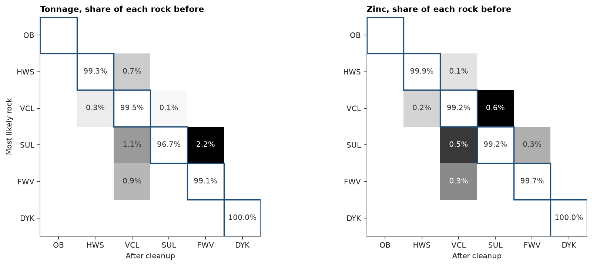

# domain change tables

two categorical models of the same blocks differ block by block: an old and a new domain model, the most likely
category and a realization, or a model before and after cleanup. `domain_change` cross-tabulates them: the tonnage
moving from each class of the first model to each class of the second and, given a grade, the metal and mean grade of
every cell. rows sum to the first model's classes, columns to the second's, the diagonal holds what stays, and the
metal adds up to the model's. `bt.plot.domain_change` draws the table as a matrix.

<details><summary>Python</summary>

```python
import boitata as bt
import matplotlib.pyplot as plt
import numpy as np
from common import save
```

</details>

## two rock models

the section of [domain cleanup](../../02-data-and-geometry/14-domain-cleanup/README.md) across the stacked sulphide lenses: the most likely rock from categorical indicator kriging
of the logged rock types on 10 m cells, and the same model after `remove_small_units` gives units under 5000 m³ to
the rock around them. ordinary kriging estimates zinc and density on the same cells from the 5 m composites,
ignoring the rock types.

<details><summary>Python</summary>

```python
data = bt.datasets.stacked_sulphide_lenses()
intervals = bt.merge_intervals(data["assays"], data["lithology"])
drillholes = bt.Drillholes(data["collars"], data["surveys"], intervals)
composites = drillholes.composite(5.0, ["ZN_PCT", "DENSITY"], categories=["LITH"])
scheme = bt.Categories(
    ["OB", "HWS", "VCL", "SUL", "FWV"],
    mapping={"MS": "SUL", "SMS": "SUL", "STR": "SUL"},
    other="DYK",
    colors=["#d9d9d9", "#a9bfd3", "#8c8c8c", "#c05a28", "#1f4e79", "#e0c080"],
)
weights = bt.cell_declustering(composites, scheme.encode(composites["LITH"]), cell_size=50.0).weights
layers = (23.0, 55.0, 0.0)
variograms = [
    bt.Variogram([("spherical", 0.9, 400.0)], nugget=0.1, rotation=(0.0, 0.0, 0.0), ratios=(1.0, 0.05)),
    bt.Variogram([("spherical", 0.9, 500.0)], nugget=0.1, rotation=layers, ratios=(0.8, 0.2)),
    bt.Variogram([("spherical", 0.85, 400.0)], nugget=0.15, rotation=layers, ratios=(0.8, 0.2)),
    bt.Variogram([("spherical", 0.8, 150.0)], nugget=0.2, rotation=layers, ratios=(0.8, 0.25)),
    bt.Variogram([("spherical", 0.9, 500.0)], nugget=0.1, rotation=layers, ratios=(0.8, 0.2)),
    bt.Variogram([("spherical", 0.7, 40.0)], nugget=0.3),
]
passes = [
    bt.Search(150.0, max_samples=24, max_per_hole=6, rotation=layers, ratios=(1.0, 0.4)),
    bt.Search(300.0, max_samples=24, rotation=layers, ratios=(1.0, 0.4)),
]
cik = bt.CategoricalIndicatorKriging(variograms, passes, scheme=scheme)
cik.fit(composites, "LITH", weights=weights, holes="HOLE_ID")

center = np.array([12350.0, 29900.0, 0.0])
across = np.array([np.sin(np.radians(113.0)), np.cos(np.radians(113.0)), 0.0])
along = np.array([np.sin(np.radians(23.0)), np.cos(np.radians(23.0)), 0.0])
origin = center - 600.0 * across - 5.0 * along + [0.0, 0.0, -400.0]
section = bt.BlockModel(origin, (10.0, 10.0, 10.0), (120, 1, 80), rotation=(23.0, 0.0, 0.0))
topography = data["topography"]
rows = topography.row_at(section.coords[:, :2])
section = section.filter((rows >= 0) & (section.coords[:, 2] < topography["Z"][rows]))
most_likely = cik.predict(section).most_likely
section = section.filter(~np.isnan(most_likely))
section = section.with_columns({"rock": most_likely[~np.isnan(most_likely)]})

grade = bt.Variogram([("spherical", 0.8, 200.0)], nugget=0.2, rotation=layers, ratios=(0.8, 0.2))
search = bt.Search(300.0, max_samples=24, max_per_hole=6, rotation=layers, ratios=(1.0, 0.4))
for column in ["ZN_PCT", "DENSITY"]:
    known = composites.filter(~np.isnan(composites[column]))
    kriged = bt.OrdinaryKriging(grade, search).fit(known, column, holes="HOLE_ID").predict(section)
    section = section.with_columns({column: kriged})
section = section.filter(~np.isnan(section["ZN_PCT"]) & ~np.isnan(section["DENSITY"]))
section = section.with_columns({"clean": bt.remove_small_units(section, "rock", min_volume=5000.0)})
print(f"{len(section)} cells; {np.sum(section['rock'] != section['clean'])} change rock")
```

</details>

```text
5205 cells; 37 change rock
```

## the table

with the block volumes as weights and the kriged density, `tonnage` is in tonnes; with the zinc grades each cell
also holds its `metal` (tonnes × %) and `mean_grade`. the table has one row per pair of rocks, in the order of the
scheme. the rows of a rock sum to its tonnage before the cleanup, its column to its tonnage after, and the metal to
the metal of the model: the cleanup moves tonnes and metal between rocks and creates or loses none.

<details><summary>Python</summary>

```python
table = bt.domain_change("rock", "clean", density="DENSITY", grades="ZN_PCT", scheme=scheme, data=section)
k = len(scheme)
tonnes = np.asarray(table["tonnage"]).reshape(k, k)
block = section.volumes * section["DENSITY"]
before = [block[section["rock"] == c].sum() for c in range(k)]
after = [block[section["clean"] == c].sum() for c in range(k)]
print(f"rows are the rocks before: {np.allclose(tonnes.sum(axis=1), before)}")
print(f"columns are the rocks after: {np.allclose(tonnes.sum(axis=0), after)}")
print(f"unchanged: {np.trace(tonnes) / tonnes.sum():.1%} of {tonnes.sum() / 1e6:.1f} Mt")
zinc = np.sum(block * section["ZN_PCT"]) / 100
print(f"zinc in the table {np.sum(table['metal']) / 100 / 1e3:.2f} kt, in the model {zinc / 1e3:.2f} kt")

start, end = np.asarray(table["from"]), np.asarray(table["to"])
moved = table.filter((start != end) & (np.asarray(table["tonnage"]) > 0))
for a, b, t, g in zip(moved["from"], moved["to"], moved["tonnage"], moved["mean_grade"]):
    print(f"{a:>4} to {b:4} {t / 1e3:5.1f} kt at {g:.2f} % Zn")
```

</details>

```text
rows are the rocks before: True
columns are the rocks after: True
unchanged: 99.3% of 16.7 Mt
zinc in the table 68.04 kt, in the model 68.04 kt
 HWS to VCL   20.3 kt at 0.06 % Zn
 VCL to HWS   26.4 kt at 0.19 % Zn
 VCL to SUL   10.3 kt at 1.79 % Zn
 SUL to VCL    6.2 kt at 1.25 % Zn
 SUL to FWV   12.8 kt at 0.31 % Zn
 FWV to VCL   43.2 kt at 0.09 % Zn
```

under 1 % of the tonnage changes rock, at grades far from random: the volcanic cells taken into the sulphides run
near 1.8 % Zn, while the sulphide specks given to the footwall hold 0.3 %. the matrices show each row as shares of
the rock it starts from, tonnage on the left and zinc on the right. the plot outlines the diagonal and leaves it
blank, so the grays show only what moves.

<details><summary>Python</summary>

```python
fig, axes = plt.subplots(1, 2, figsize=(11, 4.4), layout="constrained")
for ax, value, title in zip(axes, ["tonnage", "metal"], ["Tonnage", "Zinc"]):
    bt.plot.domain_change(table, value=value, relative=True, fmt="{:.1%}", ax=ax)
    ax.set(title=f"{title}, share of each rock before", xlabel="After cleanup", ylabel="Most likely rock")
axes[1].set_ylabel("")
save(fig, "change")
```

</details>



Full script: [`example_07_02.py`](example_07_02.py)
