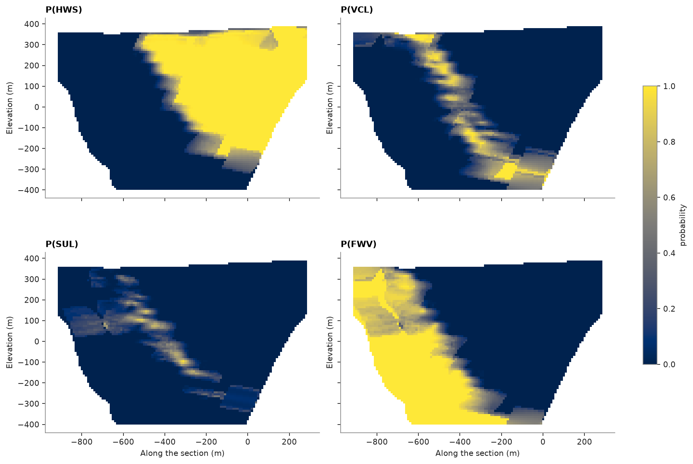
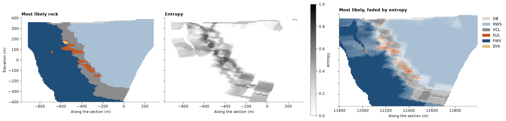

# categorical indicator kriging

logged rock types are categories. categorical indicator kriging estimates the probability of each category at each
target: it krigs each category's indicator (1 inside it, 0 outside) with its own variogram, then clips the
probabilities to [0, 1] and rescales them to sum 1. the most likely category is a rock-type model, and the entropy of
the probabilities marks where that model is uncertain.

<details><summary>Python</summary>

```python
import boitata as bt
import matplotlib.pyplot as plt
import numpy as np
from common import save
```

</details>

## rock types

the holes into the stacked sulphide lenses point west-northwest, across a stratigraphy that strikes 023° and dips
about 55° to the east-southeast: footwall volcanics (`FWV`), volcaniclastics (`VCL`) and hanging-wall sediments
(`HWS`) under overburden (`OB`). the scheme lumps the three sulphide codes into `SUL` and keeps dykes apart. a
`Categories` scheme holds the names, the lumping and the colors; it encodes the logged codes for the estimator and
colors each plot. the logged intervals become 5 m composites, each taking the rock covering most of it.

<details><summary>Python</summary>

```python
data = bt.datasets.stacked_sulphide_lenses()
drillholes = bt.Drillholes(data["collars"], data["surveys"], data["lithology"])
composites = drillholes.composite(5.0, [], categories=["LITH"])
scheme = bt.Categories(
    ["OB", "HWS", "VCL", "SUL", "FWV"],
    mapping={"MS": "SUL", "SMS": "SUL", "STR": "SUL"},
    other="DYK",
    colors=["#d9d9d9", "#a9bfd3", "#8c8c8c", "#c05a28", "#1f4e79", "#e0c080"],
)
codes = scheme.encode(composites["LITH"])
weights = bt.cell_declustering(composites, codes, cell_size=50.0).weights
naive, declustered = scheme.shares(codes), scheme.shares(codes, weights=weights)
print(f"{len(codes)} composites")
print(f"{'':<5}{'naive':>7}{'declustered':>13}")
for name, a, b in zip(scheme.names, naive, declustered):
    print(f"{name:<5}{a:7.3f}{b:13.3f}")
```

</details>

```text
23647 composites
       naive  declustered
OB     0.023        0.040
HWS    0.564        0.545
VCL    0.252        0.226
SUL    0.028        0.026
FWV    0.127        0.156
DYK    0.006        0.006
```

## variograms and the estimate

each category gets an indicator variogram chosen from the geology ([variogram fitting](../../05-spatial-continuity/02-variogram-fitting/README.md) fits them instead):
the layers are continuous along strike and down dip and short across, the sulphides form smaller lenses, the
overburden is a flat blanket and the dykes are short in all directions. each indicator is kriged on its own, so
only the shape of each variogram matters. the search follows the layering in two passes. ordinary kriging takes
each indicator's mean from the samples found, so away from the holes the probabilities follow the nearest layers;
`simple=True` would pull them towards the declustered proportions, which the weights set.

<details><summary>Python</summary>

```python
layers = (23.0, 55.0, 0.0)
variograms = [
    bt.Variogram([("spherical", 0.9, 400.0)], nugget=0.1, rotation=(0.0, 0.0, 0.0), ratios=(1.0, 0.05)),
    bt.Variogram([("spherical", 0.9, 500.0)], nugget=0.1, rotation=layers, ratios=(0.8, 0.2)),
    bt.Variogram([("spherical", 0.85, 400.0)], nugget=0.15, rotation=layers, ratios=(0.8, 0.2)),
    bt.Variogram([("spherical", 0.8, 150.0)], nugget=0.2, rotation=layers, ratios=(0.8, 0.25)),
    bt.Variogram([("spherical", 0.9, 500.0)], nugget=0.1, rotation=layers, ratios=(0.8, 0.2)),
    bt.Variogram([("spherical", 0.7, 40.0)], nugget=0.3),
]
passes = [
    bt.Search(150.0, max_samples=24, max_per_hole=6, rotation=layers, ratios=(1.0, 0.4)),
    bt.Search(300.0, max_samples=24, rotation=layers, ratios=(1.0, 0.4)),
]
cik = bt.CategoricalIndicatorKriging(variograms, passes, scheme=scheme)
cik.fit(composites, "LITH", weights=weights, holes="HOLE_ID")
```

</details>

the targets are the cells of a vertical section across strike, one cell thick, through the middle of the drilling,
without the cells above the topography. `predict` returns a summary: `probabilities` has one row per target and one
column per category, `most_likely` holds category codes (NaN where the search found too few samples), and
`diagnostics` is a `Table` of the search and of the correction.

<details><summary>Python</summary>

```python
center = np.array([12350.0, 29900.0, 0.0])
across = np.array([np.sin(np.radians(113.0)), np.cos(np.radians(113.0)), 0.0])
along = np.array([np.sin(np.radians(23.0)), np.cos(np.radians(23.0)), 0.0])
origin = center - 600.0 * across - 5.0 * along + [0.0, 0.0, -400.0]
section = bt.BlockModel(origin, (10.0, 10.0, 10.0), (120, 1, 80), rotation=(23.0, 0.0, 0.0))
topography = data["topography"]
rows = topography.row_at(section.centroids[:, :2])
section = section.mask((rows >= 0) & (section.centroids[:, 2] < topography["Z"][rows]))

summary = cik.predict(section, diagnostics=True)
p = summary.probabilities
done = ~np.isnan(summary.most_likely)
d = summary.diagnostics
print(f"{done.sum()} of {len(p)} cells estimated, {np.sum(d['pass'] == 2)} in the second pass")
print(f"rows sum to 1: {np.allclose(p[done].sum(axis=1), 1.0)}")
print(
    f"correction: {np.mean(d['n_order_violations'][done] > 0):.0%} of the cells had a category kriged outside "
    f"[0, 1]; mean size {np.mean(summary.correction[done]):.3f}"
)
columns = {f"p_{name}": p[:, c] for c, name in enumerate(scheme.names)}
section = section.with_columns({**columns, "most_likely": summary.most_likely, "entropy": summary.entropy})
```

</details>

```text
7645 of 9224 cells estimated, 2304 in the second pass
rows sum to 1: True
correction: 24% of the cells had a category kriged outside [0, 1]; mean size 0.041
```

## probability maps

each category's probability is high near its samples and fades across its contacts. the sulphides, rare and
short-ranged, stand out only near the holes that cut them.

<details><summary>Python</summary>

```python
fig, axes = plt.subplots(2, 2, figsize=(11, 7.6), layout="constrained", sharex=True, sharey=True)
for ax, name in zip(axes.flat, ["HWS", "VCL", "SUL", "FWV"]):
    bt.plot.section(section, f"p_{name}", axis="y", index=0, vmin=0.0, vmax=1.0, colorbar=False, ax=ax)
    ax.set_title(f"P({name})")
    ax.set_xlabel("Along the section (m)" if ax in axes[1] else "")
    ax.set_ylabel("Elevation (m)")
fig.colorbar(ax.collections[0], ax=axes, shrink=0.6, label="probability")
save(fig, "probabilities")
```

</details>



## most likely rock and its uncertainty

the most likely category takes the scheme's colors. entropy, scaled to [0, 1], is 0 where one category is certain
and 1 where all are equally likely; it peaks along the contacts and far from the holes. the last panel draws both:
the most likely rock fades towards white as its entropy rises.

<details><summary>Python</summary>

```python
fig, axes = plt.subplots(1, 3, figsize=(17, 4.8), layout="constrained", sharey=True)
bt.plot.section(section, "most_likely", axis="y", index=0, scheme=scheme, colorbar=False, ax=axes[0])
axes[0].set_title("Most likely rock")
bt.plot.section(section, "entropy", axis="y", index=0, vmin=0.0, vmax=1.0, cmap="Greys", ax=axes[1])
axes[1].set_title("Entropy")
bt.plot.uncertain("most_likely", "entropy", model=section, axis="y", index=0, scheme=scheme, ax=axes[2])
axes[2].set_title("Most likely, faded by entropy")
for ax, y in zip(axes, ["Elevation (m)", "", ""]):
    ax.set_xlabel("Along the section (m)")
    ax.set_ylabel(y)
save(fig, "most-likely")
```

</details>



## checks

split the holes into 5 folds and re-estimate each fold's composites from the others, then score the probabilities
with the brier score: the mean squared difference between a category's probability and its indicator. 0 is perfect,
and forecasting the declustered proportion `p` everywhere scores `p (1 − p)`. the layers beat that baseline by far,
the thin sulphides barely beat it, and the dykes, which cut across all the layers, fail to.

<details><summary>Python</summary>

```python
cv = cik.cross_validate(folds=5)
print(
    f"the most likely rock is the logged one at {np.mean(cv.most_likely == cv.actual):.0%} of the composites"
)
print(f"{'':<5}{'Brier':>7}{'p(1-p)':>8}")
for c, name in enumerate(scheme.names):
    print(f"{name:<5}{cv.brier[c]:7.3f}{declustered[c] * (1 - declustered[c]):8.3f}")
```

</details>

```text
the most likely rock is the logged one at 87% of the composites
       Brier  p(1-p)
OB     0.008   0.038
HWS    0.041   0.248
VCL    0.076   0.175
SUL    0.024   0.026
FWV    0.036   0.132
DYK    0.007   0.006
```

Full script: [`example_07_05.py`](example_07_05.py)
