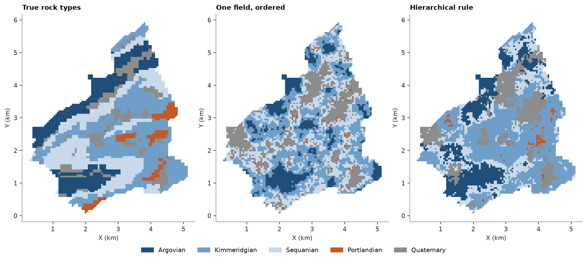
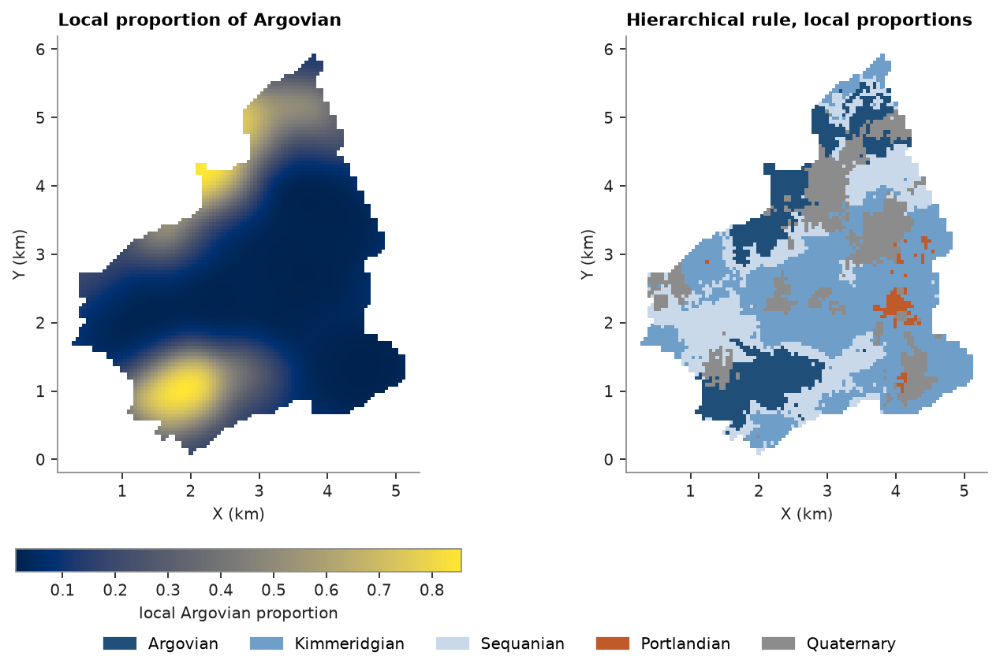
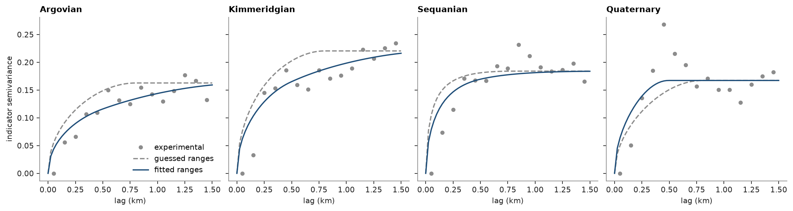

# plurigaussian simulation

plurigaussian simulation (PGS) draws categories by truncating gaussian fields: thresholds set by the proportions cut
each field into categories, and a rule says which categories may touch. SIS ([sequential indicator simulation](../../07-categories-and-domains/06-sis/README.md)) gives each category
its own indicator variogram; PGS controls the contacts between categories.

<details><summary>Python</summary>

```python
import boitata as bt
import matplotlib.pyplot as plt
import numpy as np
from common import ACCENT, GRAY, save
```

</details>

## rules

jura's rock types are known at each node of the prediction grid, so you can compare simulated maps with the real
geology. a `Categories` scheme names the rock types and gives each a color: `encode` turns labels into the codes 0
to 4 that the simulations take, and `shares` gives their proportions.

with one gaussian field, the thresholds order the types, so each type touches only its neighbors in the order. a
hierarchical `rule` truncates several fields in turn: here the first sets quaternary cover apart from the jurassic,
and the second orders the jurassic stages from argovian to portlandian. the cover may then touch any stage, and each
stage touches only the next. both use a guessed latent variogram of 0.8 km.

<details><summary>Python</summary>

```python
jura = bt.datasets.jura()
train, grid = jura["prediction"], jura["grid"]
names = ["Argovian", "Kimmeridgian", "Sequanian", "Portlandian", "Quaternary"]
rock_types = bt.Categories(names, colors=["#1f4e79", "#6f9fc9", "#c9d9ea", "#c05a28", "#8c8c8c"])
rock = rock_types.encode(train["Rock"]).astype(int)
true_rock = rock_types.encode(grid["Rock"]).astype(int)
proportions = rock_types.shares(rock)

latent = bt.Variogram([("spherical", 1.0, 0.8)])
ordered = bt.Plurigaussian(latent, proportions=proportions).fit(train, rock)
by_order = ordered.simulate(grid, n=1, seed=3, keep=True).realizations[0]
stages = (1, [names.index(n) for n in ("Argovian", "Sequanian", "Kimmeridgian", "Portlandian")])
rule = (0, [stages, names.index("Quaternary")])
hierarchy = bt.Plurigaussian([latent, latent], proportions=proportions, rule=rule).fit(train, rock)
by_rule = hierarchy.simulate(grid, n=1, seed=3, keep=True).realizations[0]

simulated = (("ordered", by_order), ("rule", by_rule))
print(f"{'':>10}" + "".join(f"{n[:5]:>8}" for n in names))
for label, cats in (("samples", rock), ("true grid", true_rock), *simulated):
    print(f"{label:>10}" + "".join(f"{s:8.2f}" for s in rock_types.shares(cats)))
for label, cats in simulated:
    print(f"{label}: {np.mean(cats == true_rock):.0%} of nodes match the true rock type")
```

</details>

```text
             Argov   Kimme   Sequa   Portl   Quate
   samples    0.20    0.33    0.24    0.01    0.21
 true grid    0.20    0.34    0.27    0.05    0.13
   ordered    0.14    0.37    0.29    0.01    0.19
      rule    0.18    0.41    0.21    0.01    0.19
ordered: 37% of nodes match the true rock type
rule: 51% of nodes match the true rock type
```

<details><summary>Python</summary>

```python
cmap, norm = bt.plot.category_colors(rock_types)
xy = grid.coords[:, :2].T
fig, axes = plt.subplots(1, 3, figsize=(12, 5.4), layout="constrained")
panels = [(true_rock, "True rock types"), (by_order, "One field, ordered"), (by_rule, "Hierarchical rule")]
for ax, (cats, title) in zip(axes, panels):
    ax.scatter(*xy, c=cats, cmap=cmap, norm=norm, s=7, marker="s", linewidths=0)
    ax.set_aspect("equal")
    ax.set(title=title, xlabel="X (km)", ylabel="Y (km)")
bt.plot.category_legend(rock_types, fig, loc="outside lower center", ncol=5)
save(fig, "categories")
```

</details>



the single field keeps close to the sample proportions but allows contacts only between neighbors in the order, so
portlandian appears as specks along each sequanian-quaternary contact. the hierarchical rule puts portlandian next
to kimmeridgian and under the cover, as in the true map, and matches 51 % of the nodes against 37 %. neither
recovers portlandian's 5 % of the area from 3 of 259 samples.

## local proportions

given local proportions at the samples at `fit` and at the nodes at `simulate`, the rule's thresholds follow them,
so each rock type is likelier where its samples cluster. here the local proportions average the rock types of the
samples with gaussian weights of 300 m and shrink towards the global proportions where samples are sparse. the
probabilities from [categorical indicator kriging](../../07-categories-and-domains/05-categorical-indicator-kriging/README.md) could serve as well.

<details><summary>Python</summary>

```python
onehot = np.eye(5)[rock]


def local_proportions(xy, bandwidth=0.3):
    d2 = ((xy[:, None, :2] - train.coords[None, :, :2]) ** 2).sum(-1)
    w = np.exp(-0.5 * d2 / bandwidth**2)
    return (w @ onehot + proportions) / (w.sum(axis=1, keepdims=True) + 1)


at_nodes = local_proportions(grid.coords)
hierarchy.fit(train.coords, rock, proportions=local_proportions(train.coords))
by_local = hierarchy.simulate(grid, n=1, seed=3, keep=True, proportions=at_nodes).realizations[0]
print(f"rule, local proportions: {np.mean(by_local == true_rock):.0%} of nodes match the true rock type")
```

</details>

```text
rule, local proportions: 57% of nodes match the true rock type
```

<details><summary>Python</summary>

```python
fig, axes = plt.subplots(1, 2, figsize=(9, 5.2), layout="constrained")
im = axes[0].scatter(*xy, c=at_nodes[:, names.index("Argovian")], s=7, marker="s", linewidths=0)
fig.colorbar(im, ax=axes[0], shrink=0.8, orientation="horizontal", label="local Argovian proportion")
axes[1].scatter(*xy, c=by_local, cmap=cmap, norm=norm, s=7, marker="s", linewidths=0)
for ax, title in zip(axes, ("Local proportion of Argovian", "Hierarchical rule, local proportions")):
    ax.set_aspect("equal")
    ax.set(title=title, xlabel="X (km)", ylabel="Y (km)")
bt.plot.category_legend(rock_types, fig, loc="outside lower center", ncol=5)
save(fig, "local-proportions")
```

</details>



with local proportions, argovian keeps to the north-west and the south, near its samples, and the realization
matches the true rock type at 57 % of the nodes, against 51 % with global proportions.

## latent variograms

the latent variograms so far were guesses. the rule and the latent variograms imply each rock type's indicator
variogram, so `fit_variograms` rescales the latent ranges until the implied variograms match the experimental ones.
the fit leaves out portlandian, with 3 samples.

<details><summary>Python</summary>

```python
experimental = [
    bt.experimental_variogram(train.coords, (rock == k).astype(float), 0.1, 1.5)
    if names[k] != "Portlandian"
    else None
    for k in range(5)
]
guessed = bt.Plurigaussian([latent, latent], proportions=proportions, rule=rule)
fitted = bt.Plurigaussian([latent, latent], proportions=proportions, rule=rule).fit_variograms(experimental)
cover, stage = (v.structures[0].range for v in fitted.variograms)
print(f"fitted latent ranges: {cover:.2f} km for the cover field, {stage:.2f} km for the stages field")
fitted.fit(train.coords, rock, proportions=local_proportions(train.coords))
by_fitted = fitted.simulate(grid, n=1, seed=3, keep=True, proportions=at_nodes).realizations[0]
print(
    f"rule, local proportions, fitted: {np.mean(by_fitted == true_rock):.0%} of nodes match the true rock type"
)
```

</details>

```text
fitted latent ranges: 0.49 km for the cover field, 1.87 km for the stages field
rule, local proportions, fitted: 59% of nodes match the true rock type
```

<details><summary>Python</summary>

```python
h = np.linspace(0, 1.5, 61)
fig, axes = plt.subplots(1, 4, figsize=(13, 3.4), layout="constrained", sharey=True)
for ax, k in zip(axes, [k for k in range(5) if experimental[k] is not None]):
    ax.plot(experimental[k].lags, experimental[k].gammas, "o", color=GRAY, ms=4, label="experimental")
    ax.plot(h, guessed.indicator_variograms(h)[k], "--", color=GRAY, label="guessed ranges")
    ax.plot(h, fitted.indicator_variograms(h)[k], color=ACCENT, label="fitted ranges")
    ax.set(title=names[k], xlabel="lag (km)")
axes[0].set_ylabel("indicator semivariance")
axes[0].legend(loc="lower right")
save(fig, "latent-variograms")
```

</details>



the fitted cover field is short (0.49 km) and the stages field long (1.87 km), so the stages form broad bands that
the cover patches over; with 0.8 km on both, the stages varied too fast. the fitted variograms follow the
experimental points of each rock type and bring the match to 59 %.

Full script: [`example_07_07.py`](example_07_07.py)
