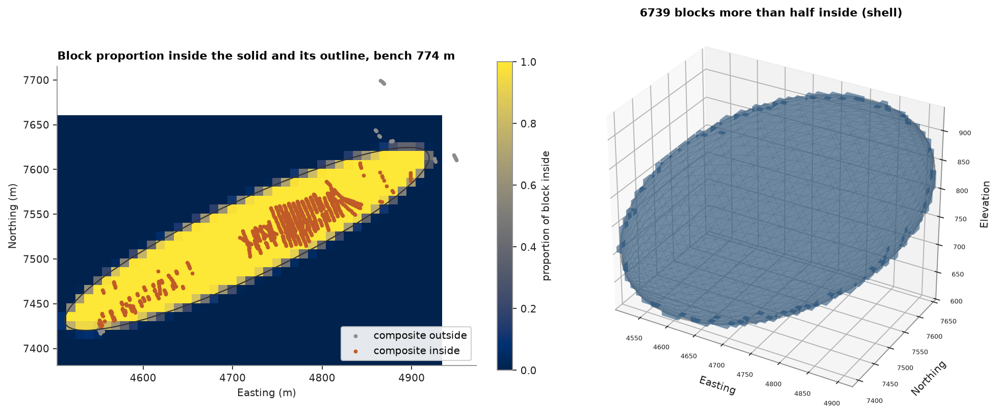
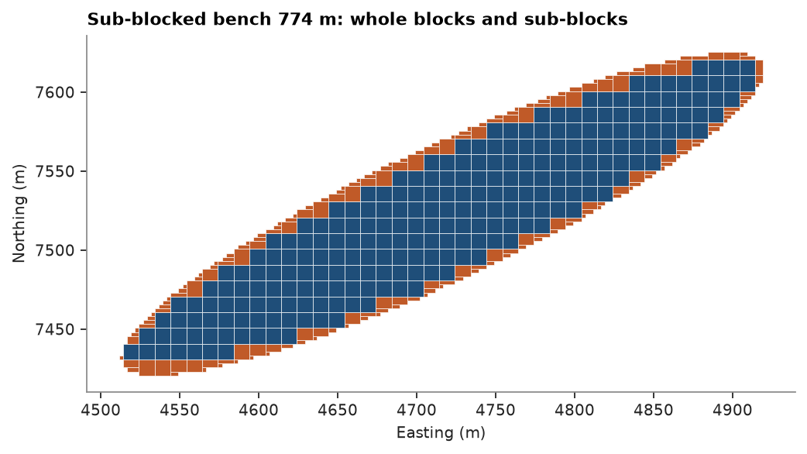

# 7. Solids and block models

A wireframe bounds a domain. Here an ellipsoid is fitted to the Zn > 5 % composites of the cluster seen in
[chapter 6](../06-drillholes/README.md).

<details><summary>Python</summary>

```python
import tempfile

import ceres as cs
import matplotlib.pyplot as plt
import numpy as np
from common import ACCENT, GREY, HIGHLIGHT, LIGHT, save
from mpl_toolkits.mplot3d.art3d import Poly3DCollection
```

</details>

A small helper builds a closed triangle mesh of an ellipsoid:

<details><summary>Python</summary>

```python
def ellipsoid(center, axes, rotation, rings=24, segments=48):
    """Closed triangle mesh of an ellipsoid with semi-axes `axes` along the columns of `rotation`."""
    theta = np.linspace(0, np.pi, rings + 1)[1:-1]
    phi = np.linspace(0, 2 * np.pi, segments, endpoint=False)
    t, p = np.meshgrid(theta, phi, indexing="ij")
    unit = np.c_[(np.sin(t) * np.cos(p)).ravel(), (np.sin(t) * np.sin(p)).ravel(), np.cos(t).ravel()]
    unit = np.vstack([[0, 0, 1], unit, [0, 0, -1]])
    vertices = center + (unit * axes) @ rotation.T
    ring = lambda i: 1 + i * segments + np.arange(segments)
    tris = [[0, *e] for e in zip(ring(0), np.roll(ring(0), -1))]
    for i in range(rings - 2):
        a, b = ring(i), ring(i + 1)
        tris += [[a[j], b[j], a[(j + 1) % segments]] for j in range(segments)]
        tris += [[a[(j + 1) % segments], b[j], b[(j + 1) % segments]] for j in range(segments)]
    last = len(vertices) - 1
    tris += [[last, *e[::-1]] for e in zip(ring(rings - 2), np.roll(ring(rings - 2), -1))]
    return vertices, np.array(tris)
```

</details>

The ellipsoid's axes come from the covariance of the high-grade composites (two standard deviations):

<details><summary>Python</summary>

```python
dh = cs.datasets.drillholes()
composites = dh.composite(2.0, ["ZN"])
xyz, zn = composites.coords, composites["ZN"]
window = (xyz[:, 0] > 4550) & (xyz[:, 0] < 4950) & (xyz[:, 1] > 7400) & (xyz[:, 1] < 7700)
high = xyz[window & (zn > 5)]
center = high.mean(axis=0)
eigen, vectors = np.linalg.eigh(np.cov((high - center).T))
vertices, triangles = ellipsoid(center, 2 * np.sqrt(eigen), vectors)
solid = cs.Mesh(vertices, triangles)
lo, hi = solid.bounds
print(solid, "semi-axes", np.round(2 * np.sqrt(eigen), 1))
```

</details>

```text
Mesh(1106 vertices, 2208 triangles, closed) semi-axes [ 39.9 160.  255.5]
```

`Mesh.proportion` samples 4 × 4 × 4 points in each block; `Mesh.contains` tests points by generalized winding
number. Block proportions should add up to the ellipsoid's volume.

<details><summary>Python</summary>

```python
size = 10.0
count = np.ceil((np.array(hi) - lo) / size).astype(int)
blocks = cs.BlockModel(origin=lo, size=(size, size, size), count=count)
proportion = solid.proportion(blocks, discretization=4)
blocks = blocks.with_column("inside", proportion)
ore = blocks.mask(proportion > 0.5)
local = window & ~np.isnan(zn)
inside = solid.contains(xyz[local])
print(f"{len(blocks)} blocks, {len(ore)} more than half inside; volume {proportion.sum() * size**3:,.0f} m3")
print(
    f"mesh volume {solid.volume:,.0f} m3, exact ellipsoid {4 / 3 * np.pi * np.prod(2 * np.sqrt(eigen)):,.0f} m3"
)
print(
    f"composites inside: {inside.sum()}, mean Zn {np.nanmean(zn[local][inside]):.2f}% vs outside {np.nanmean(zn[local][~inside]):.2f}%"
)
```

</details>

```text
40936 blocks, 6739 more than half inside; volume 6,780,906 m3
mesh volume 6,779,720 m3, exact ellipsoid 6,828,328 m3
composites inside: 9045, mean Zn 3.83% vs outside 2.91%
```

One bench of block proportions, and the blocks more than half inside as a masked `BlockModel` drawn from its
visible faces with `block_shell`:

<details><summary>Python</summary>

```python
k = count[2] // 2
level = lo[2] + (k + 0.5) * size
layer = blocks.centroids[:, 2] == level
fig = plt.figure(figsize=(12, 5), layout="constrained")
a = fig.add_subplot(1, 2, 1)
image = a.imshow(
    proportion[layer].reshape(count[1], count[0]),
    origin="lower",
    extent=(lo[0], lo[0] + count[0] * size, lo[1], lo[1] + count[1] * size),
    cmap="Greys",
    vmin=0,
    vmax=1,
)
slab = local.copy()
slab[local] = np.abs(xyz[local, 2] - level) < size / 2
near_inside = solid.contains(xyz[slab])
a.scatter(*xyz[slab][~near_inside, :2].T, s=6, color=GREY, label="composite outside")
a.scatter(*xyz[slab][near_inside, :2].T, s=6, color=HIGHLIGHT, label="composite inside")
a.set_aspect("equal")
a.set(
    title=f"Block proportion inside the solid, bench {level:.0f} m",
    xlabel="Easting (m)",
    ylabel="Northing (m)",
)
a.legend(loc="lower right")
fig.colorbar(image, ax=a, shrink=0.8, label="proportion of block inside")

b = fig.add_subplot(1, 2, 2, projection="3d")
shell = cs.block_shell(ore)
b.add_collection3d(
    Poly3DCollection(shell.vertices[shell.triangles], facecolor=ACCENT, edgecolor="none", alpha=0.35)
)
b.plot_trisurf(*vertices.T, triangles=triangles, color=LIGHT, edgecolor=GREY, linewidth=0.1, alpha=0.15)
b.set(xlim=(lo[0], hi[0]), ylim=(lo[1], hi[1]), zlim=(lo[2], hi[2]))
b.set_box_aspect(np.array(hi) - lo)
b.set_title(f"{len(ore)} blocks more than half inside (shell)")
b.set_xlabel("Easting")
b.set_ylabel("Northing")
b.set_zlabel("Elevation")
b.tick_params(labelsize=6)
save(fig, "solid")
```

</details>



Whole blocks misstate the volume near the wireframe. `subblock` takes `(mesh, rule, label)` domains in priority
order and splits the blocks a mesh cuts on a regular sub-grid: each sub-cell takes the label of the first domain
holding its centre, and the sub-cells of a block merge along x, then y. Blocks the mesh does not cut stay whole.
Each sub-block stores its parent cell and its extent as fractions of that cell. Counting centres gets the total
volume nearly right at any sub-grid, as errors on either side cancel; what a finer sub-grid shrinks is the volume
in the wrong place, sub-blocks outside the mesh plus mesh outside the sub-blocks, measured with `Mesh.proportion`:

<details><summary>Python</summary>

```python
def misplaced(model):
    p = solid.proportion(model, discretization=4)
    return ((1 - p) * model.volumes).sum() + solid.volume - (p * model.volumes).sum()


print(f"blocks more than half inside: {len(ore) * size**3:,.0f} m3, {misplaced(ore):,.0f} m3 misplaced")
for n in (1, 2, 4, 8):
    sub = blocks.subblock([(solid, "inside", "ore")], n)
    print(
        f"sub-grid {n}: {len(sub):>6} sub-blocks, {sub.volumes.sum():,.0f} m3, {misplaced(sub):,.0f} m3 misplaced"
    )
subblocked = blocks.subblock([(solid, "inside", "ore")], 4)
print(subblocked)
```

</details>

```text
blocks more than half inside: 6,739,000 m3, 651,970 m3 misplaced
sub-grid 1:   6781 sub-blocks, 6,781,000 m3, 652,907 m3 misplaced
sub-grid 2:  10508 sub-blocks, 6,780,250 m3, 315,626 m3 misplaced
sub-grid 4:  25526 sub-blocks, 6,780,906 m3, 145,319 m3 misplaced
sub-grid 8:  80769 sub-blocks, 6,780,105 m3, 63,095 m3 misplaced
BlockModel(sub-blocked, 25526 sub-blocks in 40936 cells, count [43, 28, 34], size [10.0, 10.0, 10.0], rotation [0.0, 0.0, 0.0])
  inside: Float64
  domain: Utf8
```

<details><summary>Python</summary>

```python
z = subblocked.centroids[:, 2]
thick = size * (subblocked.extents[:, 5] - subblocked.extents[:, 2])
cut = (z - thick / 2 < level + 0.1) & (z + thick / 2 > level + 0.1)
whole = (subblocked.extents == [0, 0, 0, 1, 1, 1]).all(axis=1)
fig, ax = plt.subplots(figsize=(6.4, 5), layout="constrained")
for c, e, w in zip(subblocked.centroids[cut], subblocked.extents[cut], whole[cut]):
    dx, dy = (e[3] - e[0]) * size, (e[4] - e[1]) * size
    ax.add_patch(
        plt.Rectangle(
            (c[0] - dx / 2, c[1] - dy / 2),
            dx,
            dy,
            facecolor=ACCENT if w else HIGHLIGHT,
            edgecolor="white",
            lw=0.3,
        )
    )
ax.autoscale()
ax.set_aspect("equal")
ax.set(
    title=f"Sub-blocked bench {level:.0f} m: whole blocks and sub-blocks",
    xlabel="Easting (m)",
    ylabel="Northing (m)",
)
save(fig, "subblocks")
```

</details>



`regularize` moves columns between any two models of the same rotation by the volume each pair of blocks shares:
floats as volume-weighted means, labels by the value filling the most volume. Here the sub-blocks take an
inverse-distance Zn grade from the composites inside, then go to 20 m blocks. `fraction` is how much of each
20 m block the sub-blocks fill, so volume × fraction × grade keeps the metal; `min_fraction` drops thin edges.

<details><summary>Python</summary>

```python
search = cs.Search(radius=200, min_samples=1, max_samples=12)
grade = cs.InverseDistance(search, power=2).fit(xyz[local][inside], zn[local][inside]).predict(subblocked)
subblocked = subblocked.with_column("zn", grade)
coarse = cs.BlockModel(origin=lo, size=(20, 20, 20), count=np.ceil(count / 2).astype(int))
for minimum in (0.0, 0.5):
    out = subblocked.regularize(coarse, min_fraction=minimum)
    kept = ~np.isnan(out["zn"])
    tonnes = out.volumes[kept] * out["fraction"][kept]
    print(
        f"min_fraction {minimum}: {kept.sum()} blocks, {tonnes.sum():,.0f} m3 at {np.average(out['zn'][kept], weights=tonnes):.2f}% Zn"
    )
print(
    f"      sub-blocks: {subblocked.volumes.sum():,.0f} m3 at {np.average(grade, weights=subblocked.volumes):.2f}% Zn"
)
```

</details>

```text
min_fraction 0.0: 1341 blocks, 6,780,906 m3 at 3.60% Zn
min_fraction 0.5: 840 blocks, 6,085,438 m3 at 3.61% Zn
      sub-blocks: 6,780,906 m3 at 3.60% Zn
```

Meshes read and write OBJ, STL and DXF, chosen by extension. STL stores single precision, so vertices move by
less than a millimetre at these coordinates:

<details><summary>Python</summary>

```python
with tempfile.TemporaryDirectory() as folder:
    cs.write_mesh(Path(folder) / "ellipsoid.stl", solid)
    back = cs.read_mesh(Path(folder) / "ellipsoid.stl")
shift = np.abs(back.vertices[back.triangles] - solid.vertices[solid.triangles]).max()
print(
    back,
    f"volume {back.volume:,.0f} m3 (written {solid.volume:,.0f} m3), largest shift {shift * 1000:.2f} mm",
)
```

</details>

```text
Mesh(1106 vertices, 2208 triangles, closed) volume 6,779,719 m3 (written 6,779,720 m3), largest shift 0.24 mm
```

Full script: [`example_07.py`](example_07.py)
