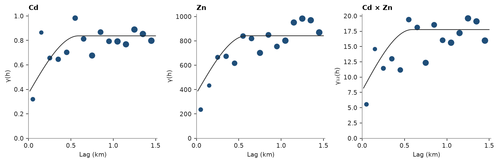
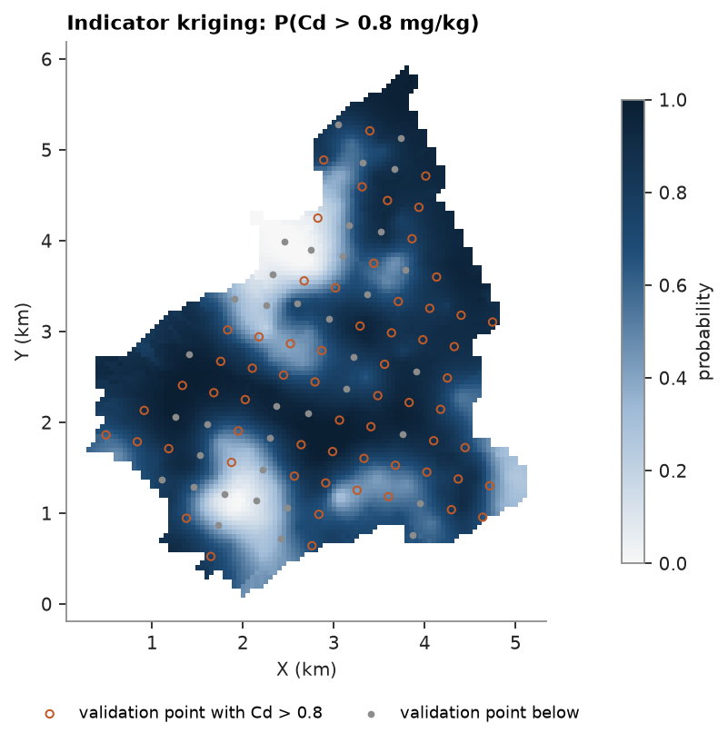
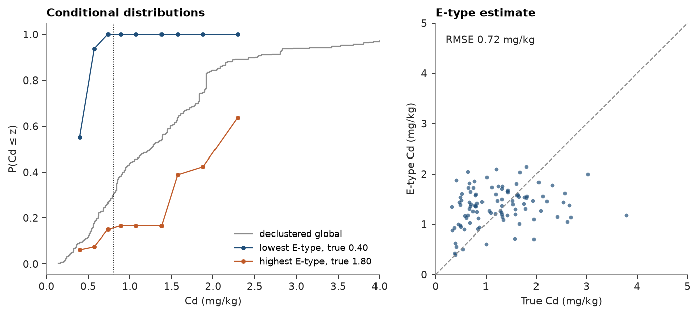
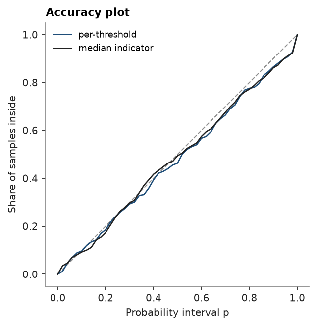

# 8. Cokriging and indicator kriging

Jura: 259 soil samples of heavy metals (mg/kg, coordinates in km) and 100 validation samples withheld from estimation.
Cd correlates with Zn, and Zn is also known at the validation points, which suits collocated cokriging.

<details><summary>Python</summary>

```python
import ceres as cs
import matplotlib.pyplot as plt
import numpy as np
from common import ACCENT, GRAY, HIGHLIGHT, INK, save

train = cs.datasets.jura()["prediction"]
test = cs.datasets.jura()["validation"]
grid = cs.datasets.jura()["grid"]
xy = train.coords
cd, zn = train["Cd"], train["Zn"]
rho = np.corrcoef(cd, zn)[0, 1]
lag, max_lag = 0.1, 1.5
```

</details>

The linear model of coregionalization is fitted to the Cd and Zn variograms and their cross-variogram, the half mean
product of the Cd and Zn increments between co-located samples, all together. The variables share the structures, a
nugget and two spherical ranges, and each structure's sill matrix stays positive semi-definite: its smallest
eigenvalue is never negative. The short structure takes the place of the nugget, which fits to zero.

<details><summary>Python</summary>

```python
experimentals = [
    [
        cs.experimental_variogram(xy, cd, lag, max_lag),
        cs.experimental_variogram(xy, cd, lag, max_lag, other=zn),
    ],
    [None, cs.experimental_variogram(xy, zn, lag, max_lag)],
]
lmc = cs.Coregionalization.fit(experimentals, ["spherical", "spherical"])
print(f"corr(Cd, Zn) {rho:.2f}")
for name, matrix in [("nugget", lmc.nugget)] + [(f"{m} {a:.2f} km", s) for m, a, s in lmc.structures]:
    print(f"{name}: {np.round(matrix, 3).tolist()}, smallest eigenvalue {np.linalg.eigvalsh(matrix)[0]:.3g}")

cd_model = experimentals[0][0].fit("spherical")
search = cs.Search(radius=1.5, max_samples=24, min_samples=4)
ok = cs.OrdinaryKriging(cd_model, search).fit(xy, cd)
ck = cs.Cokriging(lmc, search, means=[cd.mean(), zn.mean()])
ck.fit(np.vstack([xy, xy]), np.r_[cd, zn], [0] * len(cd) + [1] * len(zn))
```

</details>

```text
corr(Cd, Zn) 0.67
nugget: [[0.0, 0.0], [0.0, 0.0]], smallest eigenvalue 0
spherical 0.15 km: [[0.69, 11.146], [11.146, 485.455]], smallest eigenvalue 0.434
spherical 1.47 km: [[0.138, 6.658], [6.658, 437.931]], smallest eigenvalue 0.0368
```

Each curve is the fitted LMC's C(0) − C(h), and the three experimental variograms follow the shared short and long
structures in their own proportions:

<details><summary>Python</summary>

```python
h = np.linspace(0, max_lag, 101)[1:]
origin = np.zeros((h.size, 3))
away = np.c_[h, np.zeros((h.size, 2))]
panels = (
    (0, 0, "Cd", experimentals[0][0]),
    (1, 1, "Zn", experimentals[1][1]),
    (0, 1, "Cd × Zn", experimentals[0][1]),
)
fig, axes = plt.subplots(1, 3, figsize=(10, 3.2), layout="constrained")
for ax, (i, j, name, experimental) in zip(axes, panels):
    cs.plot.variogram(experimental, ax=ax, color=ACCENT)
    model = lmc.cross_covariance(i, j, origin, origin) - lmc.cross_covariance(i, j, origin, away)
    ax.plot(h, model, color=INK, lw=1)
    ax.set(title=name, xlabel="Lag (km)", ylabel="γ(h)" if i == j else "γ₁₂(h)")
save(fig, "variograms")
```

</details>



Given directional variograms, the fit also finds the anisotropy the structures share: the angles and range ratios
are searched together with the sill matrices. Cd and Zn are most continuous along a north-west to south-east axis; the
cokriging below keeps the isotropic model.

<details><summary>Python</summary>

```python
azimuths = [0.0, 45.0, 90.0, 135.0]


def directional(u, v=None):
    return [cs.experimental_variogram(xy, u, lag, max_lag, azimuth=a, other=v) for a in azimuths]


anisotropic = cs.Coregionalization.fit(
    [[directional(cd), directional(cd, zn)], [None, directional(zn)]],
    ["spherical", "spherical"],
    directions=[(a, 0.0) for a in azimuths],
)
print(
    f"major axis azimuth {anisotropic.rotation[0]:.0f}°, semi-major/major ratio {anisotropic.ratios[0]:.2f}, "
    f"major ranges {', '.join(f'{r:.2f}' for _, r, _ in anisotropic.structures)} km"
)
```

</details>

```text
major axis azimuth 132°, semi-major/major ratio 0.31, major ranges 0.67, 1.45 km
```

Both estimators at the validation points:

<details><summary>Python</summary>

```python
truth = test["Cd"]
by_ok = ok.predict(test)
by_ck = ck.predict(test, collocated={1: test["Zn"]})


def rmse(e):
    return float(np.sqrt(np.mean((e - truth) ** 2)))


print(f"validation RMSE: ordinary kriging {rmse(by_ok):.3f}, collocated cokriging {rmse(by_ck):.3f} mg/kg")
```

</details>

```text
validation RMSE: ordinary kriging 0.777, collocated cokriging 0.689 mg/kg
```

Indicator kriging estimates the probability that Cd exceeds 0.8 mg/kg, the Swiss guide value, from the indicator
variogram. IK estimates P(Cd ≤ threshold), so the exceedance is its complement.

<details><summary>Python</summary>

```python
limit = 0.8
indicator_model = cs.experimental_variogram(xy, (cd > limit).astype(float), lag, max_lag).fit("spherical")
ik = cs.IndicatorKriging(indicator_model, search, threshold=limit).fit(xy, cd)
p_exceed = 1 - ik.predict(grid)
p_test = 1 - ik.predict(test)
exceeds = truth > limit
print(
    f"validation: mean P(Cd > {limit}) {p_test[exceeds].mean():.2f} where true exceedance, {p_test[~exceeds].mean():.2f} elsewhere"
)
```

</details>

```text
validation: mean P(Cd > 0.8) 0.75 where true exceedance, 0.62 elsewhere
```

Using Zn at the target lowers the error and removes the smoothing that flattens ordinary kriging:

<details><summary>Python</summary>

```python
fig, axes = plt.subplots(1, 2, figsize=(9, 4.2), layout="constrained", sharey=True)
for ax, estimate, title in (
    (axes[0], by_ok, "Ordinary kriging of Cd"),
    (axes[1], by_ck, "Collocated cokriging with Zn"),
):
    ax.scatter(truth, estimate, s=12, color=ACCENT, alpha=0.7, linewidths=0)
    ax.plot([0, 5], [0, 5], color=GRAY, ls="--", lw=1)
    ax.set(xlim=(0, 5), ylim=(0, 5), xlabel="True Cd at validation points (mg/kg)", title=title)
    ax.set_aspect("equal")
    ax.text(0.2, 4.6, f"RMSE {rmse(estimate):.2f} mg/kg", color=INK)
axes[0].set_ylabel("Estimated Cd (mg/kg)")
save(fig, "validation")
```

</details>


Most of the area exceeds 0.8 mg/kg, so the map separates clean zones rather than hot spots:

<details><summary>Python</summary>

```python
fig, ax = plt.subplots(figsize=(6.2, 5), layout="constrained")
image = ax.scatter(*grid.coords[:, :2].T, c=p_exceed, s=7, marker="s", vmin=0, vmax=1, linewidths=0)
ax.scatter(
    *test.coords[exceeds, :2].T,
    s=14,
    facecolors="none",
    edgecolors=HIGHLIGHT,
    linewidths=0.9,
    label=f"validation point with Cd > {limit}",
)
ax.scatter(*test.coords[~exceeds, :2].T, s=6, color=GRAY, label="validation point below")
ax.set_aspect("equal")
ax.set(title=f"Indicator kriging: P(Cd > {limit} mg/kg)", xlabel="X (km)", ylabel="Y (km)")
ax.legend(loc="upper center", bbox_to_anchor=(0.5, -0.12), ncol=2, fontsize=8)
fig.colorbar(image, ax=ax, shrink=0.8, label="probability")
save(fig, "probability")
```

</details>



Multiple indicator kriging repeats this at the deciles of Cd and assembles the conditional distribution at each
target: kriged probabilities are corrected to rise from 0 to 1, and between thresholds the distribution follows the
declustered data. One indicator variogram per threshold lets low and high values have their own continuity; a single
variogram at the median solves one system per target instead.

<details><summary>Python</summary>

```python
weights = cs.cell_declustering(xy, cd).weights
deciles = np.quantile(cd, np.linspace(0.1, 0.9, 9))
indicator_models = [
    cs.experimental_variogram(xy, (cd <= t).astype(float), lag, max_lag).fit("spherical") for t in deciles
]
median_model = indicator_models[4]
summaries = {"cutoffs": [limit], "quantiles": [0.1, 0.5, 0.9]}
mik = cs.MultipleIndicatorKriging(indicator_models, search, deciles, tails=(0.0, cd.max()))
by_mik = mik.fit(xy, cd, weights=weights).predict(test, **summaries)
median = cs.MultipleIndicatorKriging(median_model, search, deciles, tails=(0.0, cd.max()))
by_median = median.fit(xy, cd, weights=weights).predict(test, **summaries)
for name, s in (("per-threshold variograms", by_mik), ("median indicator", by_median)):
    p = s.probability_above[0]
    print(
        f"{name}: E-type RMSE {rmse(s.mean):.3f} mg/kg, mean P(Cd > {limit}) {p[exceeds].mean():.2f} where true"
        f" exceedance, {p[~exceeds].mean():.2f} elsewhere, mean correction {s.correction.mean():.3f}"
    )
inside = np.mean((truth >= by_mik.quantile_values[0]) & (truth <= by_mik.quantile_values[2]))
print(f"validation points inside their 10-90% interval: {inside:.0%}")
```

</details>

```text
per-threshold variograms: E-type RMSE 0.717 mg/kg, mean P(Cd > 0.8) 0.76 where true exceedance, 0.62 elsewhere, mean correction 0.060
median indicator: E-type RMSE 0.757 mg/kg, mean P(Cd > 0.8) 0.77 where true exceedance, 0.62 elsewhere, mean correction 0.005
validation points inside their 10-90% interval: 75%
```

The E-type estimate, the mean of each distribution, has a lower error than ordinary kriging, and the median-indicator
shortcut gives most of that gain back. The distributions also carry the uncertainty: those at the lowest and highest
validation estimates sit on either side of the declustered global one:

<details><summary>Python</summary>

```python
order = np.argsort(by_mik.mean)
fig, axes = plt.subplots(1, 2, figsize=(9, 3.8), layout="constrained")
sorted_cd = np.sort(cd)
cumulative = np.cumsum(weights[np.argsort(cd)]) / weights.sum()
axes[0].step(sorted_cd, cumulative, where="post", color=GRAY, lw=1, label="declustered global")
for i, color, label in ((order[0], ACCENT, "lowest E-type"), (order[-1], HIGHLIGHT, "highest E-type")):
    axes[0].plot(
        deciles, by_mik.cdf[:, i], "o-", color=color, ms=3, lw=1, label=f"{label}, true {truth[i]:.2f}"
    )
axes[0].axvline(limit, color=INK, lw=0.6, ls=":")
axes[0].set(xlabel="Cd (mg/kg)", ylabel="P(Cd ≤ z)", title="Conditional distributions", xlim=(0, 4))
axes[0].legend(fontsize=8, loc="lower right")
axes[1].scatter(truth, by_mik.mean, s=12, color=ACCENT, alpha=0.7, linewidths=0)
axes[1].plot([0, 5], [0, 5], color=GRAY, ls="--", lw=1)
axes[1].set(
    xlim=(0, 5), ylim=(0, 5), xlabel="True Cd (mg/kg)", ylabel="E-type Cd (mg/kg)", title="E-type estimate"
)
axes[1].set_aspect("equal")
axes[1].text(0.2, 4.6, f"RMSE {rmse(by_mik.mean):.2f} mg/kg", color=INK)
save(fig, "distributions")
```

</details>



Cross-validation re-estimates each sample's distribution from the others. Besides the error of the E-type mean, it
scores the distributions: the Brier score of each threshold's probability, and the accuracy plot, the share of
samples inside their own symmetric p-probability interval. Points on or above the diagonal are accurate, and the
goodness statistic falls from 1 as the curve strays from it, twice as fast below. The diagnostics of `predict` count
the thresholds whose kriged probabilities broke the order relations at each target:

<details><summary>Python</summary>

```python
p = np.linspace(0, 1, 51)
fig, ax = plt.subplots(figsize=(4.4, 4), layout="constrained")
ax.plot([0, 1], [0, 1], color=GRAY, ls="--", lw=1)
for name, estimator, color in (("per-threshold", mik, ACCENT), ("median indicator", median, INK)):
    cv = estimator.cross_validate()
    print(
        f"{name}: E-type RMSE {cv.rmse:.3f} mg/kg, slope {cv.slope:.2f}, goodness {cv.goodness:.3f},"
        f" Brier {cv.brier.mean():.3f}"
    )
    ax.plot(p, cv.accuracy(p), color=color, lw=1.2, label=name)
diagnostics = mik.predict(test, diagnostics=True).diagnostics
violated = diagnostics["n_order_violations"] > 0
print(f"validation targets with order-relation violations: {violated.mean():.0%}")
ax.set(xlabel="Probability interval p", ylabel="Share of samples inside", title="Accuracy plot")
ax.set_aspect("equal")
ax.legend(fontsize=8, loc="upper left")
save(fig, "accuracy")
```

</details>

```text
per-threshold: E-type RMSE 0.756 mg/kg, slope 1.05, goodness 0.956, Brier 0.131
median indicator: E-type RMSE 0.784 mg/kg, slope 0.96, goodness 0.959, Brier 0.133
validation targets with order-relation violations: 91%
```



At a panel centroid the distribution describes Cd at that one point. Kriging the indicators over the panel instead,
`discretization=(4, 4, 1)`, gives the distribution of the point values within it, and `localize` takes the same
argument. Each panel probability averages those of the points inside, so panels differ a little less and the order
relations need less correction. Within 1 km the indicator variograms rise mostly at the nugget, which kriging at a
centroid already filters, so here the two stay close:

<details><summary>Python</summary>

```python
panels = cs.BlockModel(origin=(0.25, 0.0), size=(1.0, 1.0), count=(5, 6))
by_centroid = mik.predict(panels, cutoffs=[limit])
by_panel = mik.predict(panels, cutoffs=[limit], discretization=(4, 4, 1))
for name, s in (("centroids", by_centroid), ("1 km panels", by_panel)):
    print(
        f"{name}: std of P(Cd > {limit}) across panels {np.nanstd(s.probability_above[0]):.3f},"
        f" mean correction {np.nanmean(s.correction):.4f}"
    )
shift = np.nanmean(np.abs(by_panel.probability_above[0] - by_centroid.probability_above[0]))
print(f"mean |panel - centroid| probability {shift:.3f}")
```

</details>

```text
centroids: std of P(Cd > 0.8) across panels 0.188, mean correction 0.0218
1 km panels: std of P(Cd > 0.8) across panels 0.184, mean correction 0.0147
mean |panel - centroid| probability 0.016
```

Full script: [`example_08.py`](example_08.py)
