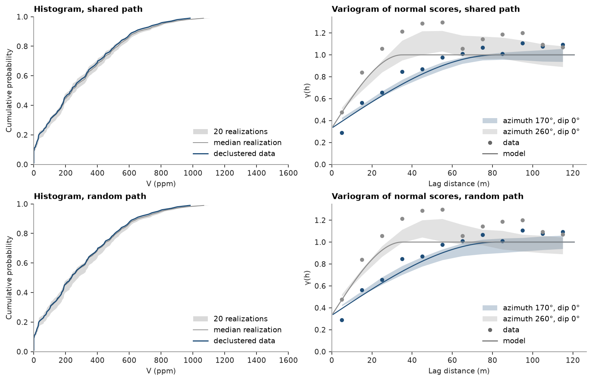

# SGS along a shared path

On a block model, SGS runs every realization along one multigrid path: coarse cells first, then finer ones. A node's
neighbors and kriging weights then depend on the path alone, so they are found once for a batch of realizations and
reused by all of them; only the noise differs. `path="random"` draws a new path per realization instead, as points
and sub-blocked models need. Both reproduce the histogram and the variogram; the shared path is faster the more
realizations and nodes there are. Realizations do not depend on `batch`, the number simulated together, which by
default fills 70 % of the free memory.

<details><summary>Python</summary>

```python
import ceres as cs
import matplotlib.pyplot as plt
import numpy as np
from common import save
```

</details>

Walker Lake V, simulated as in [realization checks](../../10-checking-models/04-realization-checks/README.md) on a 1 m grid of 260 × 300 cells: declustered normal scores and their
variogram along N170° and across it.

<details><summary>Python</summary>

```python
samples = cs.datasets.walker_lake()
xy, v = samples.coords, samples["V"]
weights = cs.cell_declustering(xy, v, sizes=np.arange(2.5, 102.5, 2.5)).weights
y = cs.NormalScore(tails=(0.0, v.max())).fit_transform(v, weights=weights)

azimuth, lag, max_lag = 170.0, 10.0, 120.0
major = cs.experimental_variogram(xy, y, lag, max_lag, azimuth=azimuth).fit("spherical")
minor = cs.experimental_variogram(xy, y, lag, max_lag, azimuth=azimuth + 90).fit("spherical")
total, a_major = major.sill, major.structures[0].range
gaussian = cs.Variogram(
    [("spherical", major.structures[0].sill / total, a_major)],
    nugget=major.nugget / total,
    rotation=(azimuth, 0, 0),
    ratios=(min(minor.structures[0].range / a_major, 1.0), 1.0),
)
grid = cs.BlockModel(origin=(0.5, 0.5), size=(1, 1), count=(260, 300))
sgs = cs.SGS(gaussian, cs.Search(radius=100, max_samples=24)).fit(samples, "V", weights=weights)
```

</details>

Twenty realizations along each kind of path, timed:

<details><summary>Python</summary>

```python
runs = {}
for path in ["shared", "random"]:
    start = time.perf_counter()
    runs[path] = sgs.simulate(grid, n=20, seed=42, keep=True, path=path)
    print(
        f"{path:6} path: {time.perf_counter() - start:5.2f} s for 20 realizations of {len(grid.centroids):,} nodes"
    )
```

</details>

```text
shared path:  0.11 s for 20 realizations of 78,000 nodes
random path:  1.00 s for 20 realizations of 78,000 nodes
```

`batch` changes memory and speed, not the realizations: one at a time gives the same grades as all together.

<details><summary>Python</summary>

```python
one = sgs.simulate(grid, n=4, seed=42, keep=True, path="shared", batch=1)
together = sgs.simulate(grid, n=4, seed=42, keep=True, path="shared", batch=4)
print("batch=1 equals batch=4:", np.array_equal(one.realizations, together.realizations))
```

</details>

```text
batch=1 equals batch=4: True
```

Both paths reproduce the declustered histogram and the variogram model along N170°; the bands overlap.

<details><summary>Python</summary>

```python
fig, axes = plt.subplots(2, 2, figsize=(10, 6.4), layout="constrained")
for row, (path, summary) in zip(axes, runs.items()):
    check = cs.check_realizations(
        grid, summary, samples, "V", weights=weights, variogram=gaussian, lag=lag, max_lag=max_lag
    )
    cs.plot.histogram_reproduction(check, ax=row[0])
    cs.plot.variogram_reproduction(check, ax=row[1])
    row[0].set(xlim=(0, 1600), xlabel="V (ppm)", title=f"Histogram, {path} path")
    row[1].set(xlabel="Lag distance (m)", title=f"Variogram of normal scores, {path} path")
save(fig, "reproduction")
```

</details>



Full script: [`example_08_02.py`](example_08_02.py)
