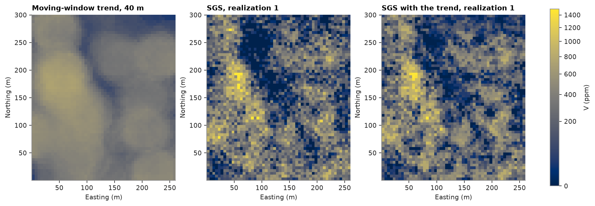

# simulation with a trend

far from the data, SGS draws from the global histogram at any location. a trend known at all nodes can steer it
instead.

<details><summary>Python</summary>

```python
import boitata as bt
import matplotlib.pyplot as plt
import numpy as np
from common import map_axes, save
from matplotlib.colors import PowerNorm

samples = bt.datasets.walker_lake()
xy, v = samples.coords, samples["V"]
weights = bt.cell_declustering(xy, v, sizes=np.arange(2.5, 102.5, 2.5)).weights
grid = bt.BlockModel(origin=(0.5, 0.5), size=(5, 5), count=(52, 60))
```

</details>

here the trend is a moving-window average of V within 40 m, built with an existing estimator; any model or estimate
would do. `trend=` gives it at the data to `fit` and at the nodes to `simulate`, as an array or the name of a
`BlockModel` column.

<details><summary>Python</summary>

```python
window = bt.MovingAverage(bt.Search(radius=40, max_samples=200)).fit(xy, v)
trend = window.predict(xy)
trended = grid.with_column("trend", window.predict(grid))
```

</details>

SGS normal-scores the data within 8 equal-probability classes of the trend: the stepwise conditional transform of
[multivariate transforms](../../04-transforms/05-multivariate-transforms/README.md) on (trend, V), which leaves scores independent of the trend. it simulates those scores with their own
variogram and back-transforms each node with the histogram of its trend class. plain SGS, for comparison, uses the
variogram of global normal scores; both variograms have a unit sill.

<details><summary>Python</summary>

```python
pair = np.column_stack([trend, v])
scores = bt.StepwiseConditional(classes=8).fit(pair, weights=weights).transform(pair)[:, 1]
y = bt.NormalScore(tails=(0.0, v.max())).fit_transform(v, weights=weights)


def unit_sill(values):
    fitted = bt.experimental_variogram(xy, values, 10.0, 150.0).fit("spherical")
    (structure,) = fitted.structures
    return bt.Variogram(
        [("spherical", structure.sill / fitted.sill, structure.range)], nugget=fitted.nugget / fitted.sill
    )


score_variogram, plain_variogram = unit_sill(scores), unit_sill(y)
print(score_variogram, plain_variogram, sep="\n")

search = bt.Search(radius=100, max_samples=24)
with_trend = bt.SGS(score_variogram, search, classes=8).fit(xy, v, weights=weights, trend=trend)
by_trend = with_trend.simulate(trended, n=20, seed=5, keep=True, trend="trend").realizations
plain = bt.SGS(plain_variogram, search).fit(xy, v, weights=weights)
by_sgs = plain.simulate(grid, n=20, seed=5, keep=True).realizations
```

</details>

```text
Variogram(nugget=0.19038648061160174, structures=[Structure("spherical", sill=0.8096135193883982, range=22.62299198336531)], rotation=(0.0, 0.0, 0.0), ratios=(1.0, 1.0))
Variogram(nugget=0.3405226282644493, structures=[Structure("spherical", sill=0.6594773717355508, range=51.76429044224697)], rotation=(0.0, 0.0, 0.0), ratios=(1.0, 1.0))
```

<details><summary>Python</summary>

```python
node_trend = trended["trend"]
cov = np.cov(v, trend, aweights=weights)
print(f"correlation with the trend: data {cov[0, 1] / np.sqrt(cov[0, 0] * cov[1, 1]):.2f}", end="")
for name, reals in (("SGS", by_sgs), ("SGS with trend", by_trend)):
    print(f", {name} {np.mean([np.corrcoef(r, node_trend)[0, 1] for r in reals]):.2f}", end="")
edges = np.quantile(node_trend, [0.25, 0.5, 0.75])
at_data, at_nodes = np.digitize(trend, edges), np.digitize(node_trend, edges)
print(f"\n{'mean V (ppm) by trend quartile':<32}{'data':>6}{'SGS':>6}{'SGS with trend':>16}")
for k in range(4):
    data_mean = np.average(v[at_data == k], weights=weights[at_data == k])
    plain_mean, trend_mean = (reals[:, at_nodes == k].mean() for reals in (by_sgs, by_trend))
    print(f"{f'quartile {k + 1}':<32}{data_mean:6.0f}{plain_mean:6.0f}{trend_mean:16.0f}")
```

</details>

```text
correlation with the trend: data 0.52, SGS 0.45, SGS with trend 0.49
mean V (ppm) by trend quartile    data   SGS  SGS with trend
quartile 1                         106   145             114
quartile 2                         267   261             262
quartile 3                         320   328             321
quartile 4                         450   449             451
```

<details><summary>Python</summary>

```python
shape = (60, 52)
extent = (0.5, 260.5, 0.5, 300.5)
norm = PowerNorm(0.5, vmin=0, vmax=1500)
fig, axes = plt.subplots(1, 3, figsize=(11.5, 4.4), layout="constrained")
panels = [
    (node_trend, "Moving-window trend, 40 m"),
    (by_sgs[0], "SGS, realization 1"),
    (by_trend[0], "SGS with the trend, realization 1"),
]
for ax, (image, title) in zip(axes, panels):
    im = ax.imshow(image.reshape(shape), origin="lower", extent=extent, norm=norm)
    map_axes(ax, title)
fig.colorbar(im, ax=axes, shrink=0.8, label="V (ppm)")
save(fig, "trend")
```

</details>



plain SGS follows the trend where data are dense, but pulls the low-trend quarter up towards the global mean. with
the trend, each quarter keeps the declustered mean of its data, and the realizations correlate with the trend about
as much as the data do.

Full script: [`example_08_05.py`](example_08_05.py)
