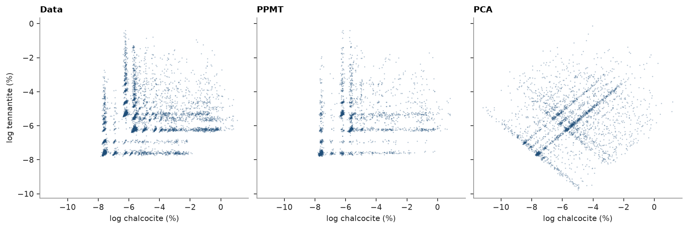

# multivariate simulation

`MultivariateSimulation` cosimulates correlated grades through independent factors. it fits a multivariate
transform ([multivariate transforms](../../04-transforms/05-multivariate-transforms/README.md)), simulates each factor with its own variogram and seed, and back-transforms each
realization at the nodes, before any averaging to blocks. the grades here are log chalcocite and log tennantite of
porphyry 1, through PPMT and, for contrast, PCA.

<details><summary>Python</summary>

```python
import boitata as bt
import matplotlib.pyplot as plt
import numpy as np
from common import ACCENT, save

data = bt.datasets.porphyry_geometallurgy(deposit=1)["synthetic_drillholes"]
coords = data.coords
pair = np.log(np.column_stack([data["calcosina"], data["tenantita"]]))
names = ["log chalcocite (%)", "log tennantite (%)"]
logs = bt.PointSet(coords, {"chalcocite": pair[:, 0], "tennantite": pair[:, 1]})
weights = bt.cell_declustering(coords, pair[:, 0], cell_size=50.0).weights
print(f"{len(pair)} composites, correlation {np.corrcoef(pair.T)[0, 1]:.2f}")
```

</details>

```text
6817 composites, correlation 0.19
```

each factor gets the omnidirectional variogram of its scores; turning bands simulate 20 realizations on 25 m nodes.
50 m cells decluster the statistics of the data. `fit` takes the variables as an array or, as here, as column names
of a `PointSet`.

<details><summary>Python</summary>

```python
lo, hi = map(np.array, data.bounds)
count = np.ceil((hi - lo) / (100, 100, 50)).astype(int)
blocks = bt.BlockModel(origin=tuple(lo), size=(100, 100, 50), count=tuple(count))
nodes = bt.BlockModel(origin=tuple(lo), size=(25, 25, 25), count=tuple(count * (4, 4, 2)))
search = bt.Search(radius=250, max_samples=16)

runs = {}
for name, transform in {"PPMT": bt.PPMT(seed=7), "PCA": bt.PCA(standardize=True)}.items():
    f = transform.fit_transform(pair, weights=weights)
    variograms = [bt.experimental_variogram(coords, f[:, j], 25.0, 300.0).fit("spherical") for j in range(2)]
    simulation = bt.MultivariateSimulation(transform, [bt.TurningBands(v, search=search) for v in variograms])
    runs[name] = simulation.fit(logs, ["chalcocite", "tennantite"], weights=weights)
reals = {
    name: [s.realizations for s in sim.simulate(nodes, n=20, seed=1, keep=True)] for name, sim in runs.items()
}
print(f"{len(nodes.coords)} nodes, 20 realizations")
```

</details>

```text
36608 nodes, 20 realizations
```

both keep the correlation, the only dependence a linear rotation carries. PPMT also keeps the declustered
histograms and honors the composites. PCA factors depart from gaussian, so simulating them as gaussian shortens
the upper tail of chalcocite and puts high chalcocite with high tennantite twice as often.

<details><summary>Python</summary>

```python
def weighted_quantiles(values, weights, qs):
    order = np.argsort(values)
    cum = np.cumsum(weights[order]) / weights.sum()
    return values[order][np.searchsorted(cum, qs)]


qs = [0.1, 0.5, 0.9]
high = np.quantile(pair, 0.8, axis=0)
cov = np.cov(pair.T, aweights=weights)
rows = [
    (
        "data",
        cov[0, 1] / np.sqrt(cov[0, 0] * cov[1, 1]),
        *weighted_quantiles(pair[:, 0], weights, qs),
        *weighted_quantiles(pair[:, 1], weights, qs),
        np.average((pair > high).all(axis=1), weights=weights),
    )
]
for name, (a, b) in reals.items():
    r = np.mean([np.corrcoef(x, y)[0, 1] for x, y in zip(a, b)])
    rows.append((name, r, *np.quantile(a, qs), *np.quantile(b, qs), np.mean((a > high[0]) & (b > high[1]))))
print(f"{'':6}{'r':>6}{'chalcocite q10, q50, q90':>27}{'tennantite q10, q50, q90':>27}{'both > q80':>12}")
for name, r, *q, both in rows:
    cc, tn = (", ".join(f"{v:.2f}" for v in part) for part in (q[:3], q[3:]))
    print(f"{name:6}{r:6.2f}{cc:>27}{tn:>27}{both:12.3f}")

at_data = runs["PPMT"].simulate(coords[:500], n=5, seed=2)
error = max(np.abs(s.mean - pair[:500, j]).max() + s.std.max() for j, s in enumerate(at_data))
print(f"PPMT at 500 composites: largest departure from the data {error:.1e}")
```

</details>

```text
           r   chalcocite q10, q50, q90   tennantite q10, q50, q90  both > q80
data    0.25        -7.61, -5.69, -2.38        -7.62, -6.10, -3.81       0.038
PPMT    0.27        -7.62, -5.70, -2.28        -7.62, -6.15, -3.87       0.034
PCA     0.28        -7.78, -5.49, -2.90        -7.67, -5.90, -3.88       0.074
PPMT at 500 composites: largest departure from the data 2.1e-12
```

one realization of each: PPMT rebuilds the L-shaped cloud of the data; PCA spreads a rotated square over it,
reaching below the lowest assays and into the corner the data leave empty.

<details><summary>Python</summary>

```python
pick = np.random.default_rng(0).choice(len(nodes.coords), 3000, replace=False)
fig, axes = plt.subplots(1, 3, figsize=(11, 3.6), layout="constrained", sharex=True, sharey=True)
panels = [(pair[:, 0], pair[:, 1], "Data")] + [
    (a[0][pick], b[0][pick], name) for name, (a, b) in reals.items()
]
for ax, (x, y, title) in zip(axes, panels):
    ax.scatter(x, y, s=2, color=ACCENT, alpha=0.3, linewidths=0)
    ax.set(xlabel=names[0], title=title)
axes[0].set_ylabel(names[1])
save(fig, "simulated")
```

</details>



at block support, `blocks=` averages each realization after the back-transform. the transform is nonlinear, so
averaging the factors would give other values. the blocks here are 100 × 100 × 50 m.

<details><summary>Python</summary>

```python
by_block = runs["PPMT"].simulate(nodes, n=20, seed=1, keep=True, blocks=blocks)
for j, s in enumerate(by_block):
    print(
        f"{names[j]}: variance {reals['PPMT'][j].var(axis=1).mean():.2f} at nodes, "
        f"{s.realizations.var(axis=1).mean():.2f} in {s.realizations.shape[1]} blocks"
    )
```

</details>

```text
log chalcocite (%): variance 3.88 at nodes, 1.46 in 1144 blocks
log tennantite (%): variance 2.06 at nodes, 0.86 in 1144 blocks
```

## missing variables

if a variable is missing in some composites, `fit(..., impute=True)` fills them with a fresh draw of
`GaussianImputer` ([imputation](../../04-transforms/06-imputation/README.md)) in each realization, so the uncertainty of the missing values reaches the
realizations. here every other hole hides its tennantite; the transform and the factor variograms come from the
complete composites.

<details><summary>Python</summary>

```python
hidden = data["DHID"] % 2 == 0
holed = pair.copy()
holed[hidden, 1] = np.nan
f = bt.PPMT(seed=7).fit_transform(pair[~hidden], weights=weights[~hidden])
variograms = [
    bt.experimental_variogram(coords[~hidden], f[:, j], 25.0, 300.0).fit("spherical") for j in range(2)
]
simulation = bt.MultivariateSimulation(
    bt.PPMT(seed=7), [bt.TurningBands(v, search=search) for v in variograms]
)
simulation.fit(coords, holed, weights=weights, impute=True)
a, b = (s.realizations for s in simulation.simulate(nodes, n=20, seed=1, keep=True))
r = np.mean([np.corrcoef(x, y)[0, 1] for x, y in zip(a, b)])
print(f"{hidden.sum()} of {len(pair)} composites miss tennantite")
print(f"r {r:.2f}, tennantite q10, q50, q90: " + ", ".join(f"{v:.2f}" for v in np.quantile(b, qs)))
```

</details>

```text
3334 of 6817 composites miss tennantite
r 0.27, tennantite q10, q50, q90: -7.62, -6.17, -3.81
```

Full script: [`example_08_06.py`](example_08_06.py)
