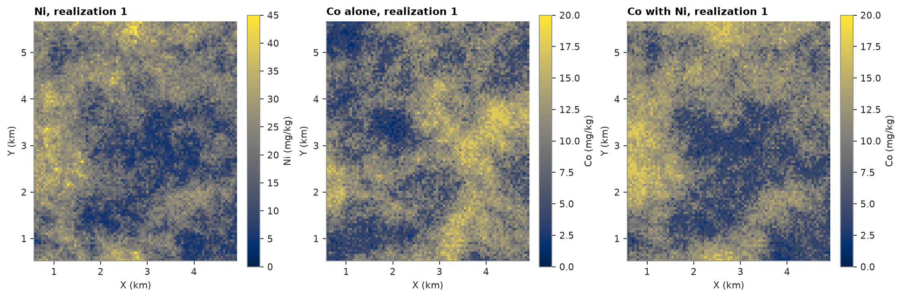
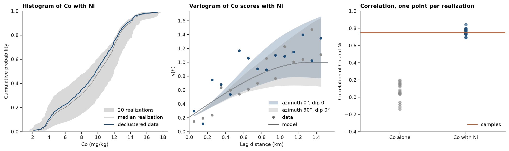

# collocated cosimulation

SGS can condition a grade on a second variable known at each node: an exhaustive covariate, or a realization of
another grade simulated first. it draws each node from the collocated simple cokriging of its normal score from its
neighbors and the secondary score at the node itself. the cross-covariance is the correlation of the scores times
the primary covariance, so you need no cross-variogram. `SGS.fit` takes the secondary at the data and fits that
correlation; `simulate` takes the secondary at the nodes, one row per realization for simulated secondaries. here
jura Co, cosimulated realization by realization with simulated Ni, against Co simulated alone.

<details><summary>Python</summary>

```python
import boitata as bt
import matplotlib.pyplot as plt
import numpy as np
from common import ACCENT, GRAY, HIGHLIGHT, save

samples = bt.datasets.jura()["prediction"]
xy = samples.coords
lag, max_lag = 0.1, 1.5


def unit_sill(values):
    """Spherical model of the normal scores of `values`, scaled to a unit sill."""
    scores = bt.NormalScore().fit_transform(values)
    fitted = bt.experimental_variogram(xy, scores, lag, max_lag).fit("spherical")
    s = fitted.structures[0]
    return bt.Variogram([("spherical", s.sill / fitted.sill, s.range)], nugget=fitted.nugget / fitted.sill)


print(f"{len(xy)} samples, correlation of Co and Ni {np.corrcoef(samples['Co'], samples['Ni'])[0, 1]:.2f}")
```

</details>

```text
259 samples, correlation of Co and Ni 0.75
```

SGS simulates Ni first, 20 realizations on 50 m nodes, then Co twice with the same seeds: alone, and with row ``k``
of the Ni realizations as the secondary of realization ``k``. `fit` normal-scores Ni at the samples and fits the
correlation of the Co and Ni scores:

<details><summary>Python</summary>

```python
nodes = bt.BlockModel(origin=(0.6, 0.55), size=(0.05, 0.05), count=(87, 103))
search = bt.Search(radius=1.5, max_samples=24)
ni_model = unit_sill(samples["Ni"])
ni = bt.SGS(ni_model, search).fit(samples, "Ni").simulate(nodes, n=20, seed=1, keep=True)
model = unit_sill(samples["Co"])
alone = bt.SGS(model, search).fit(samples, "Co").simulate(nodes, n=20, seed=100, keep=True)
cosgs = bt.SGS(model, search).fit(samples, "Co", secondary="Ni")
with_ni = cosgs.simulate(nodes, n=20, seed=100, secondary=ni.realizations, keep=True)
print(f"correlation of Co and Ni scores at the samples: {cosgs.correlation:.2f}")
```

</details>

```text
correlation of Co and Ni scores at the samples: 0.71
```

simulated alone, Co keeps its histogram and variogram but forgets Ni: away from the samples the two vary
independently, and their correlation over the nodes falls to near zero. cosimulated, each realization of Co
follows its own Ni realization and the correlation comes back:

<details><summary>Python</summary>

```python
checks = {
    name: bt.check_realizations(
        nodes, [ni, co], samples, ["Ni", "Co"], variogram=[ni_model, model], lag=lag, max_lag=max_lag
    )
    for name, co in [("alone", alone), ("with Ni", with_ni)]
}
for name, check in checks.items():
    r = check.correlations[:, 0, 1]
    print(
        f"Co {name:8} correlation with Ni {r.min():.2f} to {r.max():.2f} (samples {check.data_correlation[0, 1]:.2f})"
    )
```

</details>

```text
Co alone    correlation with Ni -0.14 to 0.20 (samples 0.75)
Co with Ni  correlation with Ni 0.69 to 0.84 (samples 0.75)
```

<details><summary>Python</summary>

```python
shape, extent = (103, 87), (0.575, 4.925, 0.525, 5.675)
fig, axes = plt.subplots(1, 3, figsize=(12, 4.6), layout="constrained")
for ax, image, title, label in (
    (axes[0], ni.realizations[0], "Ni, realization 1", "Ni (mg/kg)"),
    (axes[1], alone.realizations[0], "Co alone, realization 1", "Co (mg/kg)"),
    (axes[2], with_ni.realizations[0], "Co with Ni, realization 1", "Co (mg/kg)"),
):
    top = 45 if label.startswith("Ni") else 20
    im = ax.imshow(image.reshape(shape), origin="lower", extent=extent, vmin=0, vmax=top)
    ax.set(title=title, xlabel="X (km)", ylabel="Y (km)", aspect="equal")
    fig.colorbar(im, ax=ax, shrink=0.75, label=label)
save(fig, "maps")
```

</details>



the cosimulated Co still reproduces its own histogram and variogram (the [realization checks](../../10-checking-models/04-realization-checks/README.md)), and its correlation
with Ni, 0.69 to 0.84 across realizations, brackets the samples' 0.75. simulated alone, Co keeps little of it.

<details><summary>Python</summary>

```python
fig, axes = plt.subplots(1, 3, figsize=(13, 3.8), layout="constrained")
check = checks["with Ni"]
bt.plot.histogram_reproduction(check, variable="Co", ax=axes[0])
axes[0].set(xlabel="Co (mg/kg)", title="Histogram of Co with Ni")
bt.plot.variogram_reproduction(check, variable="Co", ax=axes[1])
axes[1].set(xlabel="Lag distance (km)", title="Variogram of Co scores with Ni")
for x, (name, c) in enumerate(checks.items()):
    r = c.correlations[:, 0, 1]
    axes[2].plot(np.full(r.size, x), r, "o", ms=5, alpha=0.6, color=GRAY if x == 0 else ACCENT)
axes[2].axhline(check.data_correlation[0, 1], color=HIGHLIGHT, lw=1.2, label="samples")
axes[2].set(xlim=(-0.6, 1.6), xticks=[0, 1], xticklabels=["Co alone", "Co with Ni"], ylim=(-0.4, 1))
axes[2].set(ylabel="Correlation of Co and Ni", title="Correlation, one point per realization")
axes[2].legend(loc="lower right")
save(fig, "checks")
```

</details>



[DSS](../08-direct-sequential-simulation/README.md) takes the same `secondary` and `correlation` arguments. it
kriges the grades of Co with their own variogram, standardizes Co and Ni by their declustered means and standard
deviations instead of normal-scoring them, and cokriges each node in those units. the node is then drawn from the
histogram of Co with the cokriged mean and variance. `DSS.fit` fits the correlation of the grades:

<details><summary>Python</summary>

```python
import warnings

fitted = bt.experimental_variogram(xy, samples["Co"], lag, max_lag).fit("spherical")
grades = bt.Variogram(
    [("spherical", fitted.structures[0].sill, fitted.structures[0].range)], nugget=fitted.nugget
)
codss = bt.DSS(grades, search).fit(samples, "Co", secondary="Ni")
with warnings.catch_warnings():
    warnings.simplefilter("ignore")
    dss_with_ni = codss.simulate(nodes, n=20, seed=100, secondary=ni.realizations, keep=True)
r = [np.corrcoef(co, n)[0, 1] for co, n in zip(dss_with_ni.realizations, ni.realizations)]
print(f"correlation of Co and Ni grades at the samples: {codss.correlation:.2f}")
print(f"co-DSS: correlation of Co and Ni over the nodes {min(r):.2f} to {max(r):.2f}")
```

</details>

```text
correlation of Co and Ni grades at the samples: 0.75
co-DSS: correlation of Co and Ni over the nodes 0.70 to 0.85
```

the co-DSS realizations follow their Ni realizations as closely as the cosimulated SGS ones: their correlation with
Ni brackets the samples' 0.75. the block above silences the warning on nodes DSS draws from the nearest reachable
mean and variance.

Full script: [`example_08_07.py`](example_08_07.py)
