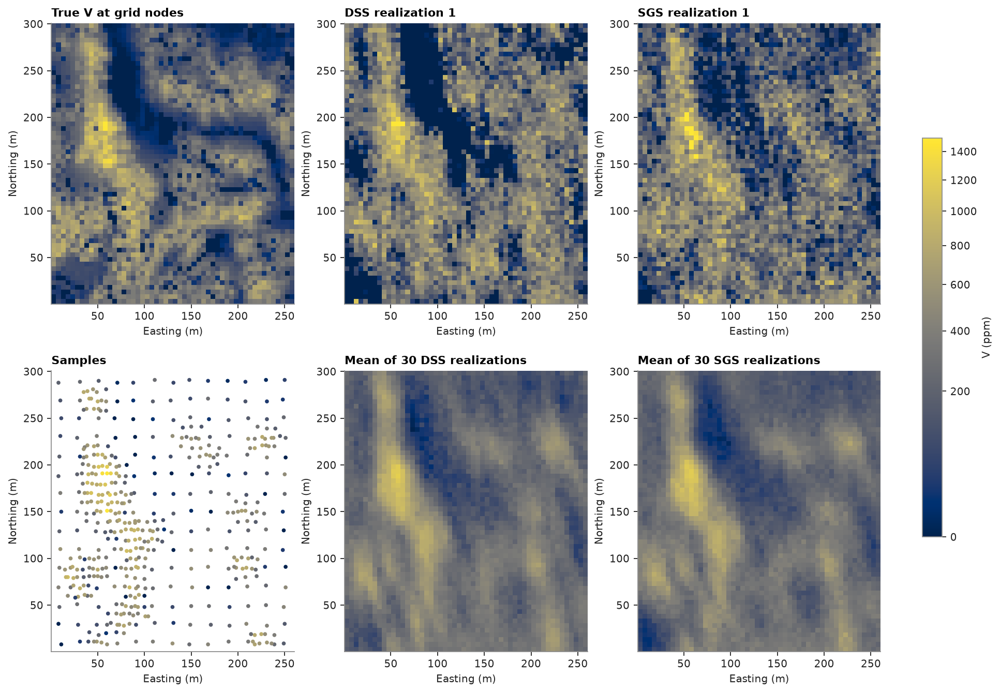
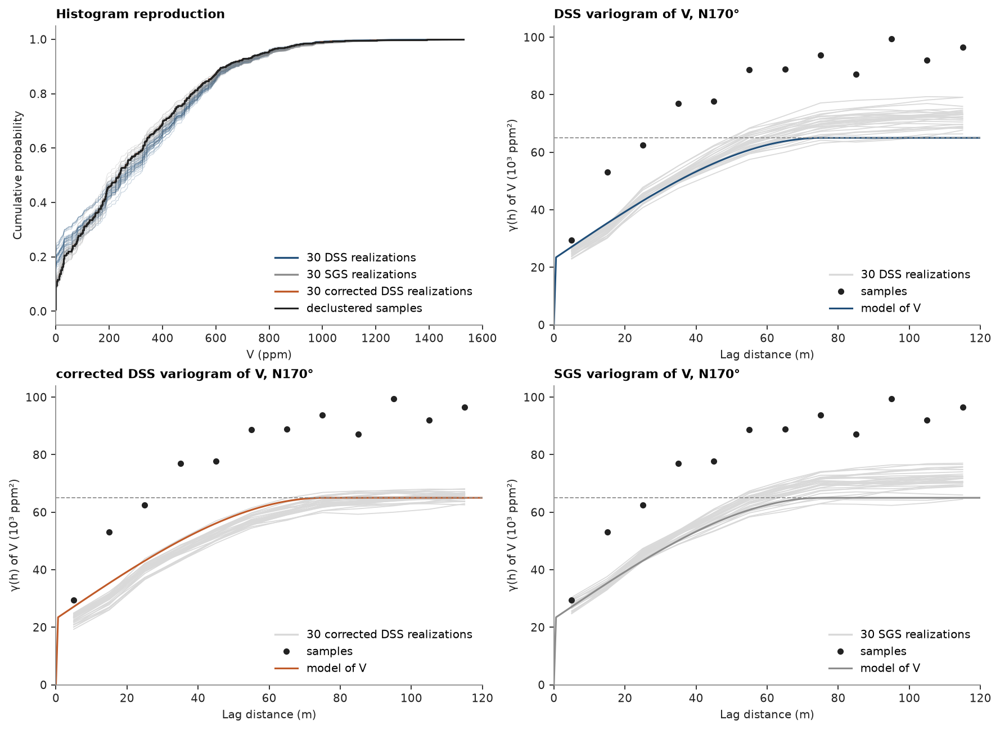

# direct sequential simulation

SGS simulates normal scores and back-transforms them, so it reproduces the variogram of the scores. DSS kriges the
grades themselves with their own variogram and draws each node from the declustered histogram, so it needs no
gaussian model of the field. this page runs both on walker lake and compares what each reproduces.

<details><summary>Python</summary>

```python
import warnings

import boitata as bt
import matplotlib.pyplot as plt
import numpy as np
from common import ACCENT, GRAY, HIGHLIGHT, INK, LIGHT, map_axes, save
from matplotlib.colors import PowerNorm

samples = bt.datasets.walker_lake()
truth = bt.datasets.walker_lake_exhaustive()["V"].reshape(300, 260)
xy, v = samples.coords, samples["V"]
weights = bt.cell_declustering(xy, v, sizes=np.arange(2.5, 102.5, 2.5)).weights
mean = np.average(v, weights=weights)
variance = np.average((v - mean) ** 2, weights=weights)
print(f"declustered mean {mean:.0f} ppm, variance {variance:.0f} ppm²")
```

</details>

```text
declustered mean 291 ppm, variance 65006 ppm²
```

each method takes the variogram of the variable it kriges: SGS the variogram of the normal scores, DSS the variogram
of V. both are fitted along N170°, the direction of greatest continuity, and across it, and scaled to a unit sill.
DSS rescales its nugget and sill to the declustered variance of each domain, so a unit sill is enough.

<details><summary>Python</summary>

```python
azimuth, lag, max_lag = 170.0, 10.0, 120.0
y = bt.NormalScore(tails=(0.0, v.max())).fit_transform(v, weights=weights)


def unit_sill(values):
    major = bt.experimental_variogram(xy, values, lag, max_lag, azimuth=azimuth).fit("spherical")
    minor = bt.experimental_variogram(xy, values, lag, max_lag, azimuth=azimuth + 90).fit("spherical")
    a_major = major.structures[0].range
    return bt.Variogram(
        [("spherical", major.structures[0].sill / major.sill, a_major)],
        nugget=major.nugget / major.sill,
        rotation=(azimuth, 0, 0),
        ratios=(min(minor.structures[0].range / a_major, 1.0), 1.0),
    )


gaussian, raw = unit_sill(y), unit_sill(v)
print(f"normal scores: {gaussian}\ngrades:        {raw}")
```

</details>

```text
normal scores: Variogram(nugget=0.3315861183518779, structures=[Structure("spherical", sill=0.6684138816481222, range=82.43111673409601)], rotation=(170.0, 0.0, 0.0), ratios=(0.42564072265384956, 1.0))
grades:        Variogram(nugget=0.35312835994483693, structures=[Structure("spherical", sill=0.6468716400551632, range=75.41661873855779)], rotation=(170.0, 0.0, 0.0), ratios=(0.3216494539612399, 1.0))
```

DSS simple kriges each node with the declustered mean and draws it from the declustered histogram, as the
back-transform of a gaussian whose transformed mean and variance equal the kriged ones. near the tails, or where
kriging extrapolates beyond the data, no such draw exists; DSS takes the nearest reachable pair and warns with the
share of nodes it moved. both simulators run 30 realizations from the same seed.

each DSS draw matches its kriged mean and variance, but the histogram of a realization need not match the data. V is
skewed, with 9% of the declustered samples at 0 ppm, and its variogram has a 35% nugget, so the kriging variance
stays large where the kriged mean is low. the only draws with a low mean and a large variance put most of their
weight at 0 ppm and the rest at high grades. `correct_distribution` maps each realization, rank by rank, onto the
declustered histogram.

<details><summary>Python</summary>

```python
grid = bt.BlockModel(origin=(0.5, 0.5), size=(5, 5), count=(52, 60))
search = bt.Search(radius=100, max_samples=24)
options = {"n": 30, "seed": 42, "keep": True}
with warnings.catch_warnings(record=True) as caught:
    warnings.simplefilter("always")
    dss = bt.DSS(raw, search).fit(samples, "V", weights=weights).simulate(grid, **options)
for warning in caught:
    print(warning.message)
sgs = bt.SGS(gaussian, search).fit(samples, "V", weights=weights).simulate(grid, **options)
corrected = bt.correct_distribution(dss, v, weights=weights)

nodes = grid.centroids.astype(int)
true_at_nodes = truth[nodes[:, 1] - 1, nodes[:, 0] - 1]
for name, reals in (("DSS", dss.realizations), ("corrected DSS", corrected), ("SGS", sgs.realizations)):
    print(
        f"{name}: mean {reals.mean():.0f}, variance {reals.var(axis=1).mean():.0f}, "
        f"at 0 ppm {np.mean(reals <= 0):.1%}, above 500 ppm {np.mean(reals > 500):.1%}"
    )
print(
    f"true: mean {true_at_nodes.mean():.0f}, variance {true_at_nodes.var():.0f}, "
    f"at 0 ppm {np.mean(true_at_nodes <= 0):.1%}, above 500 ppm {np.mean(true_at_nodes > 500):.1%}"
)
```

</details>

```text
11.71% of simulated nodes had a kriged mean and variance no draw reaches; drew them from the nearest reachable pair
DSS: mean 302, variance 72524, at 0 ppm 18.8%, above 500 ppm 24.2%
corrected DSS: mean 291, variance 65002, at 0 ppm 9.1%, above 500 ppm 21.1%
SGS: mean 299, variance 71069, at 0 ppm 9.5%, above 500 ppm 22.1%
true: mean 276, variance 62312, at 0 ppm 7.6%, above 500 ppm 18.9%
```

DSS puts 19% of the nodes at 0 ppm, twice the declustered share, in wide patches across the low-grade areas. after
the correction, realization 1 keeps the same pattern of high and low grades with 9% at 0 ppm. the DSS and SGS
realizations average about 300 ppm with a variance near 72,000 ppm², above the declustered 291 ppm and 65,006 ppm²:
the grid nodes near the clustered high-grade samples copy them. the corrected realizations take the declustered mean
and variance exactly.

<details><summary>Python</summary>

```python
shape = (60, 52)
extent = (0.5, 260.5, 0.5, 300.5)
norm = PowerNorm(0.5, vmin=0, vmax=1500)
fig, axes = plt.subplots(2, 3, figsize=(12, 8.4), layout="constrained")
axes[1, 0].scatter(*xy[:, :2].T, c=v, s=6, norm=norm)
map_axes(axes[1, 0], "Samples")
axes[1, 0].set(xlim=extent[:2], ylim=extent[2:])
for ax, image, title in (
    (axes[0, 0], true_at_nodes, "True V at grid nodes"),
    (axes[0, 1], dss.realizations[0], "DSS realization 1"),
    (axes[0, 2], sgs.realizations[0], "SGS realization 1"),
    (axes[1, 1], corrected[0], "DSS realization 1, corrected"),
    (axes[1, 2], dss.mean, "Mean of 30 DSS realizations"),
):
    im = ax.imshow(image.reshape(shape), origin="lower", extent=extent, norm=norm)
    map_axes(ax, title)
fig.colorbar(im, ax=axes, shrink=0.6, label="V (ppm)")
save(fig, "maps")
```

</details>



the corrected DSS and the SGS realizations follow the declustered histogram. the variograms of the corrected DSS
realizations level off at the declustered variance (dashed) and run slightly below the model of V at short lags.
before the correction they level off about 10% above that sill, as their variance does, and the SGS realizations do
the same. the samples sit above every curve since they cluster in the high grades.

<details><summary>Python</summary>

```python
fig, axes = plt.subplots(2, 2, figsize=(11, 8), layout="constrained")
order = np.argsort(v)
h = np.linspace(0, max_lag, 200)
data_exp = bt.experimental_variogram(xy, v, lag, max_lag, azimuth=azimuth)
sets = (
    (axes[0, 1], "DSS", dss.realizations, ACCENT),
    (axes[1, 1], "SGS", sgs.realizations, GRAY),
    (axes[1, 0], "corrected DSS", corrected, HIGHLIGHT),
)
for ax, name, reals, color in sets:
    for r in reals:
        axes[0, 0].plot(np.sort(r), np.linspace(0, 1, r.size), color=color, lw=0.5, alpha=0.25)
        exp = bt.experimental_variogram(grid.centroids, r, lag, max_lag, azimuth=azimuth)
        ax.plot(exp.lags, exp.gammas / 1e3, color=LIGHT, lw=0.8)
    axes[0, 0].plot([], [], color=color, label=f"30 {name} realizations")
    ax.plot([], [], color=LIGHT, label=f"30 {name} realizations")
    ax.plot(data_exp.lags, data_exp.gammas / 1e3, "o", color=INK, ms=4, label="samples")
    ax.plot(h, variance * raw.gamma(h) / 1e3, color=color, lw=1.4, label="model of V")
    ax.axhline(variance / 1e3, color=GRAY, lw=0.8, ls="--")
    ax.set(xlim=(0, max_lag), ylim=(0, 1.6 * variance / 1e3), xlabel="Lag distance (m)")
    ax.set(ylabel="γ(h) of V (10³ ppm²)", title=f"{name} variogram of V, N{azimuth:.0f}°")
    ax.legend(loc="lower right")
axes[0, 0].step(
    v[order],
    np.cumsum(weights[order]) / weights.sum(),
    color=INK,
    lw=1.4,
    where="post",
    label="declustered samples",
)
axes[0, 0].set(
    xlim=(0, 1600), xlabel="V (ppm)", ylabel="Cumulative probability", title="Histogram reproduction"
)
axes[0, 0].legend(loc="lower right")
save(fig, "reproduction")
```

</details>



[sequential gaussian simulation](../../08-stochastic-simulation/01-sgs/README.md) covers the summary that `simulate`
returns, and [simulation at block support](../../08-stochastic-simulation/03-simulation-at-block-support/README.md)
averages realizations to blocks.

Full script: [`example_08_08.py`](example_08_08.py)
