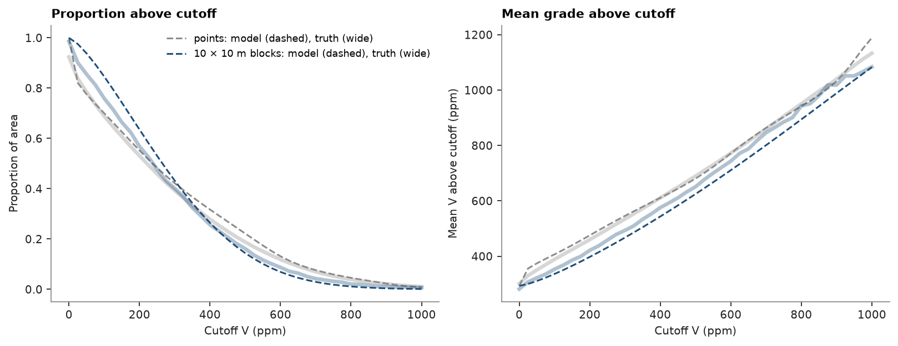
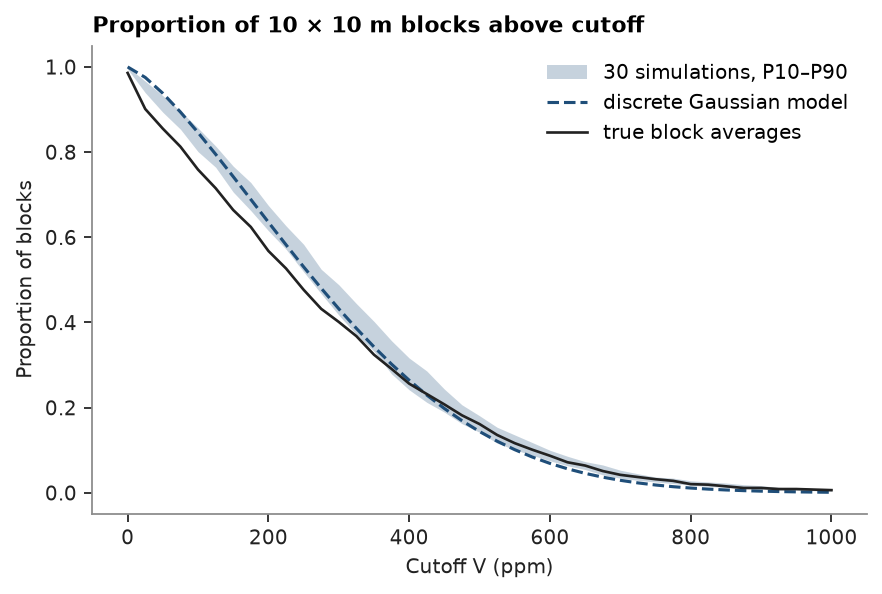
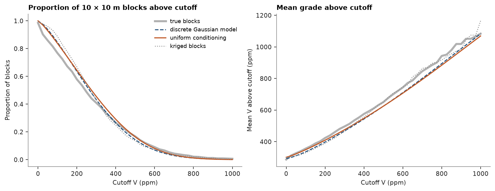
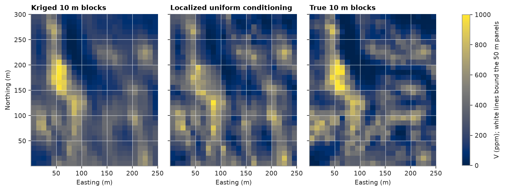
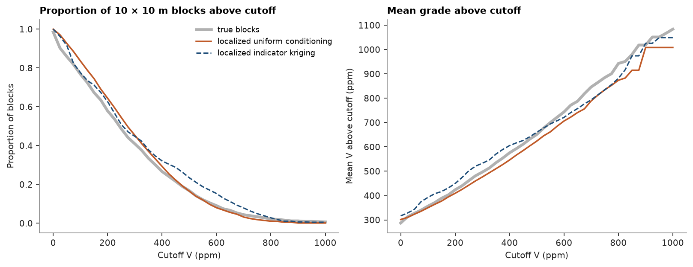
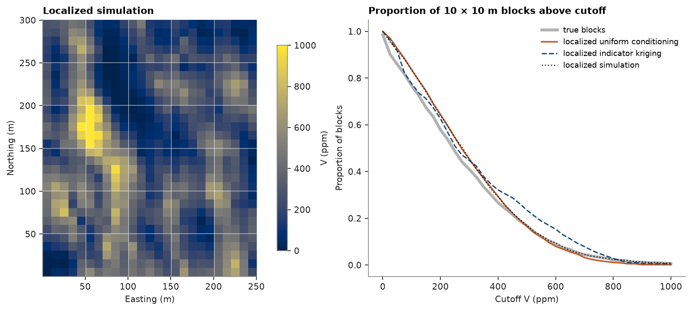
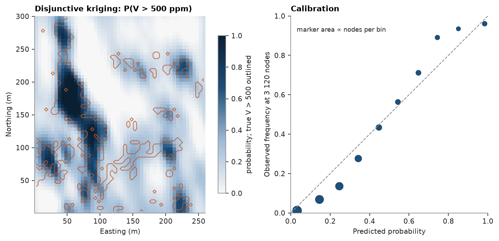

# 9. Change of support and disjunctive kriging

Mining selects blocks, not points. Block grades vary less than point grades, so a point histogram misstates the
tonnage above cutoffs. The exhaustive Walker Lake grid gives true point and block curves to check against.

<details><summary>Python</summary>

```python
import ceres as cs
import matplotlib.pyplot as plt
import numpy as np
from common import ACCENT, GREY, HIGHLIGHT, INK, save

samples = cs.datasets.walker_lake()
truth = cs.datasets.walker_lake_exhaustive()["V"].reshape(300, 260)
xy, v = samples.coords, samples["V"]
azimuth = cs.Variogram.from_json((HERE.parent / "03-variography" / "model.json").read_text()).rotation[0]
weights = cs.cell_declustering(xy, v, sizes=np.arange(2.5, 102.5, 2.5)).weights
```

</details>

A Hermite anamorphosis models the declustered point distribution; the variogram of its Gaussian scores is fitted
along and across N170° and scaled to a unit sill.

<details><summary>Python</summary>

```python
anam = cs.HermiteAnamorphosis(degree=40).fit(v, weights=weights)
y = anam.transform(v)
major = cs.experimental_variogram(xy, y, 10, 120, azimuth=azimuth).fit("spherical")
minor = cs.experimental_variogram(xy, y, 10, 120, azimuth=azimuth + 90).fit("spherical")
total = major.sill
gaussian = cs.Variogram(
    [("spherical", major.structures[0].sill / total, major.structures[0].range)],
    nugget=major.nugget / total,
    rotation=(azimuth, 0, 0),
    ratios=(min(minor.structures[0].range / major.structures[0].range, 1.0), 1.0),
)
```

</details>

The discrete Gaussian model shrinks the point anamorphosis to 10 × 10 m blocks with a change-of-support coefficient r:

<details><summary>Python</summary>

```python
size = 10
r, block = cs.change_of_support(anam, gaussian, size=(size, size), discretization=(5, 5, 1))
blocks_true = truth.reshape(30, size, 26, size).mean(axis=(1, 3)).ravel()
print(
    f"r = {r:.3f}; point variance {anam.variance_:.0f}, block {block.variance_:.0f}, true block {blocks_true.var():.0f}"
)
```

</details>

```text
r = 0.738; point variance 67110, block 34919, true block 46694
```

Grade-tonnage curves, model against truth:

<details><summary>Python</summary>

```python
cutoffs = np.linspace(0, 1000, 41)
model_point = anam.grade_tonnage(cutoffs)
model_block = block.grade_tonnage(cutoffs)


def empirical(values):
    tonnage = np.array([(values > c).mean() for c in cutoffs])
    grade = np.array([values[values > c].mean() if (values > c).any() else np.nan for c in cutoffs])
    return tonnage, grade


true_point = empirical(truth.ravel())
true_block = empirical(blocks_true)

fig, (a, b) = plt.subplots(1, 2, figsize=(10, 3.8), layout="constrained")
for curves, model, color, label in (
    (true_point, model_point, GREY, "points"),
    (true_block, model_block, ACCENT, f"{size} × {size} m blocks"),
):
    a.plot(cutoffs, curves[0], color=color, lw=3, alpha=0.35)
    a.plot(
        cutoffs,
        model["tonnage"],
        color=color,
        lw=1.4,
        ls="--",
        label=f"{label}: model (dashed), truth (wide)",
    )
    b.plot(cutoffs, curves[1], color=color, lw=3, alpha=0.35)
    b.plot(cutoffs, model["mean_grade"], color=color, lw=1.4, ls="--")
a.set(title="Proportion above cutoff", xlabel="Cutoff V (ppm)", ylabel="Proportion of area")
a.legend(fontsize=8)
b.set(title="Mean grade above cutoff", xlabel="Cutoff V (ppm)", ylabel="Mean V above cutoff (ppm)")
save(fig, "grade-tonnage")
```

</details>



Simulation reaches block support by averaging instead. Thirty sequential Gaussian simulations on 2.5 m nodes, with
`blocks=` averaging each realization over the 16 nodes of every 10 × 10 m block before summarizing, give one
block tonnage curve per realization, so the model's curve comes with its uncertainty:

<details><summary>Python</summary>

```python
nodes = cs.BlockModel(origin=(0.5, 0.5), size=(2.5, 2.5), count=(104, 120))
blocks = cs.BlockModel(origin=(0.5, 0.5), size=(size, size), count=(26, 30))
sgs = cs.SGS(gaussian, cs.Search(radius=100, max_samples=24)).fit(xy, v, weights=weights)
summary = sgs.simulate(nodes, n=30, seed=7, cutoffs=list(cutoffs), blocks=blocks)
low, high = np.quantile(summary.realization_above, [0.1, 0.9], axis=1)
for c in (300, 500, 800):
    k = np.searchsorted(cutoffs, c)
    print(
        f"above {c} ppm: simulated P10 {low[k]:.1%}, P90 {high[k]:.1%}; "
        f"discrete Gaussian {model_block['tonnage'][k]:.1%}; true {true_block[0][k]:.1%}"
    )

fig, ax = plt.subplots(figsize=(5.4, 3.6), layout="constrained")
ax.fill_between(cutoffs, low, high, color=ACCENT, alpha=0.25, lw=0, label="30 simulations, P10–P90")
ax.plot(cutoffs, model_block["tonnage"], color=ACCENT, lw=1.4, ls="--", label="discrete Gaussian model")
ax.plot(cutoffs, true_block[0], color=INK, lw=1.2, label="true block averages")
ax.set(
    title=f"Proportion of {size} × {size} m blocks above cutoff",
    xlabel="Cutoff V (ppm)",
    ylabel="Proportion of blocks",
)
ax.legend()
save(fig, "simulated-blocks")
```

</details>

```text
above 300 ppm: simulated P10 41.7%, P90 48.9%; discrete Gaussian 43.2%; true 40.1%
above 500 ppm: simulated P10 14.2%, P90 18.1%; discrete Gaussian 14.4%; true 16.2%
above 800 ppm: simulated P10 1.8%, P90 2.8%; discrete Gaussian 1.1%; true 2.1%
```



Above about 400 ppm the band holds the true curve; below it, both models put a few per cent more blocks above
cutoff than the truth has.

Uniform conditioning reaches the same selectivity from kriged panels, without simulating. Ordinary block kriging
of 50 × 50 m panels, over the western 250 m, uses the variogram of chapter 3 rescaled to the anamorphosis variance,
and its diagnostics give each panel the variance of its estimate. That variance sets each panel's change-of-support
coefficient, so a panel estimated from few or distant samples, which kriging smooths more, spreads its selective
blocks wider:

<details><summary>Python</summary>

```python
model = cs.Variogram.from_json((HERE.parent / "03-variography" / "model.json").read_text())
scale = anam.variance_ / model.sill
raw = cs.Variogram(
    [(s.model, s.sill * scale, s.range) for s in model.structures],
    nugget=model.nugget * scale,
    rotation=model.rotation,
    ratios=model.ratios,
)
search = cs.Search(radius=100, max_samples=24, min_samples=4)
panels = cs.BlockModel(origin=(0.5, 0.5), size=(50, 50), count=(5, 6))
kriged = cs.BlockKriging(raw, search, size=(50, 50), discretization=(5, 5, 1)).fit(xy, v)
d = kriged.predict(panels, diagnostics=True)
panels = panels.with_column("V", d["value"]).with_column("estimate_variance", d["estimate_variance"])
uc = cs.UniformConditioning(anam, r_smu=r)
curves = uc.grade_tonnage(panels, "V", cutoffs, estimate_variance="estimate_variance")
uc_tonnage = np.nanmean(curves["tonnage"], axis=0)
uc_grade = np.nanmean(curves["metal"], axis=0) / uc_tonnage

true_smu = truth[:, :250].reshape(30, size, 25, size).mean(axis=(1, 3))
smus = panels.discretize(5)
direct = cs.BlockKriging(raw, search, size=(size, size), discretization=(5, 5, 1)).fit(xy, v).predict(smus)
true_curve, direct_curve = empirical(true_smu.ravel()), empirical(direct)
for c in (300, 500, 800):
    k = np.searchsorted(cutoffs, c)
    print(
        f"above {c} ppm: uniform conditioning {uc_tonnage[k]:.1%}, discrete Gaussian {model_block['tonnage'][k]:.1%}, "
        f"kriged {direct_curve[0][k]:.1%}, true {true_curve[0][k]:.1%}"
    )

fig, (a, b) = plt.subplots(1, 2, figsize=(10, 3.8), layout="constrained")
for (tonnage, grade), color, style, label in (
    (true_curve, INK, {"lw": 3, "alpha": 0.35}, "true blocks"),
    (
        (model_block["tonnage"], model_block["mean_grade"]),
        ACCENT,
        {"lw": 1.4, "ls": "--"},
        "discrete Gaussian model",
    ),
    ((uc_tonnage, uc_grade), HIGHLIGHT, {"lw": 1.6}, "uniform conditioning"),
    (direct_curve, GREY, {"lw": 1.2, "ls": ":"}, "kriged blocks"),
):
    a.plot(cutoffs, tonnage, color=color, label=label, **style)
    b.plot(cutoffs, grade, color=color, **style)
a.set(
    title=f"Proportion of {size} × {size} m blocks above cutoff",
    xlabel="Cutoff V (ppm)",
    ylabel="Proportion of blocks",
)
a.legend(fontsize=8)
b.set(title="Mean grade above cutoff", xlabel="Cutoff V (ppm)", ylabel="Mean V above cutoff (ppm)")
save(fig, "uniform-conditioning")
```

</details>

```text
above 300 ppm: uniform conditioning 45.5%, discrete Gaussian 43.2%, kriged 43.3%, true 40.9%
above 500 ppm: uniform conditioning 16.5%, discrete Gaussian 14.4%, kriged 13.6%, true 16.8%
above 800 ppm: uniform conditioning 1.2%, discrete Gaussian 1.1%, kriged 2.3%, true 2.1%
```



Around 500 ppm uniform conditioning lands on the true tonnage, where the smoothed kriged blocks and the discrete
Gaussian model fall short. Below 300 ppm it overstates the tonnage by a few per cent, as the other models do, and
above 700 ppm, where few blocks remain, both Gaussian models understate it.

Uniform conditioning says how much of each panel is ore, not where. Localisation places it: inside each panel the
25 blocks of `panels.discretize(5)` are ranked by their direct kriging, and the block ranked i receives the mean
of the i-th of 25 equal-probability bands of the panel's block distribution. Every panel keeps its grade, and its
blocks reproduce its grade-tonnage curve:

<details><summary>Python</summary>

```python
smus = smus.with_column("kriged", direct)
local = uc.localize(panels, "V", smus, "kriged", estimate_variance="estimate_variance", name="localized")
localized = local["localized"]
for label, values in (("kriged", direct), ("localized", localized)):
    print(
        f"{label}: variance {values.var():.0f}, correlation with truth {np.corrcoef(values, true_smu.ravel())[0, 1]:.2f}"
    )
print(f"true blocks: variance {true_smu.var():.0f}")

fig, axes = plt.subplots(1, 3, figsize=(10, 4.4), layout="constrained", sharey=True)
extent = (0.5, 250.5, 0.5, 300.5)
for ax, values, title in (
    (axes[0], direct, "Kriged 10 m blocks"),
    (axes[1], localized, "Localized uniform conditioning"),
    (axes[2], true_smu, "True 10 m blocks"),
):
    image = ax.imshow(np.reshape(values, (30, 25)), origin="lower", extent=extent, vmin=0, vmax=1000)
    ax.vlines(np.arange(50.5, 250, 50), 0.5, 300.5, color="white", lw=0.6, alpha=0.7)
    ax.hlines(np.arange(50.5, 300, 50), 0.5, 250.5, color="white", lw=0.6, alpha=0.7)
    ax.set_aspect("equal")
    ax.set(title=title, xlabel="Easting (m)")
axes[0].set_ylabel("Northing (m)")
fig.colorbar(image, ax=axes, shrink=0.7, label="V (ppm); white lines bound the 50 m panels")
save(fig, "localized")
```

</details>

```text
kriged: variance 34921, correlation with truth 0.88
localized: variance 37382, correlation with truth 0.79
true blocks: variance 47350
```



The localised blocks spread as the model says blocks should, and it says too little here: the anamorphosis puts
the variance of 10 m blocks near 35 000 (the first printout), well below the true 47 000. Block by block they
match the truth less well than kriging does, since the ranking inside a panel is only as good as the kriging that
sets it; what localisation keeps is each panel's grade and its tonnage above every cutoff.

Multiple indicator kriging reaches the panels without a Gaussian model. Kriged at each panel centroid from indicator
variograms at the deciles, its conditional distribution describes point grades. An affine correction shrinks it
about its mean to block support by a variance factor f, the variance of 10 m blocks within a panel over that of
points within it, here from the grade variogram; the same ranked blocks then share its bands:

<details><summary>Python</summary>

```python
deciles = np.quantile(v, np.linspace(0.1, 0.9, 9))
indicators = [
    cs.experimental_variogram(xy, (v <= t).astype(float), 10, 120).fit("spherical") for t in deciles
]
mik = cs.MultipleIndicatorKriging(indicators, search, deciles, tails=(0.0, v.max()))
mik.fit(xy, v, weights=weights)
local = mik.localize(panels, smus, "kriged", variance_factor=raw, name="mik")
by_mik = local["mik"]
for label, values in (("uniform conditioning", localized), ("indicator kriging", by_mik)):
    print(
        f"{label}: variance {values.var():.0f}, correlation with truth {np.corrcoef(values, true_smu.ravel())[0, 1]:.2f}"
    )
mik_curve, uc_curve = empirical(by_mik), empirical(localized)

fig, (a, b) = plt.subplots(1, 2, figsize=(10, 3.8), layout="constrained")
for (tonnage, grade), color, style, label in (
    (true_curve, INK, {"lw": 3, "alpha": 0.35}, "true blocks"),
    (uc_curve, HIGHLIGHT, {"lw": 1.6}, "localized uniform conditioning"),
    (mik_curve, ACCENT, {"lw": 1.4, "ls": "--"}, "localized indicator kriging"),
):
    a.plot(cutoffs, tonnage, color=color, label=label, **style)
    b.plot(cutoffs, grade, color=color, **style)
a.set(
    title=f"Proportion of {size} × {size} m blocks above cutoff",
    xlabel="Cutoff V (ppm)",
    ylabel="Proportion of blocks",
)
a.legend(fontsize=8)
b.set(title="Mean grade above cutoff", xlabel="Cutoff V (ppm)", ylabel="Mean V above cutoff (ppm)")
save(fig, "localized-mik")
```

</details>

```text
uniform conditioning: variance 37382, correlation with truth 0.79
indicator kriging: variance 53812, correlation with truth 0.82
```



Ranked alike, the indicator blocks follow the truth a little more closely than the uniform-conditioning ones, and
they spread wider than the true blocks: from 400 to 700 ppm they put a few per cent too many blocks above cutoff.
The affine correction keeps the shape of each point distribution, so its long upper tail survives the shrinking,
where the discrete Gaussian model pulls it in.

Simulation localises without a change-of-support model. Thirty realisations averaged to the same 10 m blocks are
pooled panel by panel: 25 blocks × 30 realisations give 750 values, sorted and cut into 25 chunks of 30, and the
block ranked i by the same kriging receives the mean of chunk i. Each panel keeps the mean of its realisations,
and its blocks the spread the simulation gives them:

<details><summary>Python</summary>

```python
west = cs.BlockModel(origin=(0.5, 0.5), size=(2.5, 2.5), count=(100, 120))
ensemble = sgs.simulate(west, n=30, seed=11, blocks=smus, realizations=True)
simulated = cs.localize(smus, "kriged", ensemble.realizations, panels)["localized"]
print(
    f"localized simulation: variance {simulated.var():.0f}, "
    f"correlation with truth {np.corrcoef(simulated, true_smu.ravel())[0, 1]:.2f}"
)
sim_curve = empirical(simulated)
for c in (300, 500, 800):
    k = np.searchsorted(cutoffs, c)
    print(
        f"above {c} ppm: uniform conditioning {uc_curve[0][k]:.1%}, indicator kriging {mik_curve[0][k]:.1%}, "
        f"simulation {sim_curve[0][k]:.1%}, true {true_curve[0][k]:.1%}"
    )

fig, (a, b) = plt.subplots(1, 2, figsize=(10, 4.4), layout="constrained", width_ratios=(1, 1.3))
image = a.imshow(np.reshape(simulated, (30, 25)), origin="lower", extent=extent, vmin=0, vmax=1000)
a.vlines(np.arange(50.5, 250, 50), 0.5, 300.5, color="white", lw=0.6, alpha=0.7)
a.hlines(np.arange(50.5, 300, 50), 0.5, 250.5, color="white", lw=0.6, alpha=0.7)
a.set_aspect("equal")
a.set(title="Localized simulation", xlabel="Easting (m)", ylabel="Northing (m)")
fig.colorbar(image, ax=a, shrink=0.8, label="V (ppm)")
for (tonnage, _), color, style, label in (
    (true_curve, INK, {"lw": 3, "alpha": 0.35}, "true blocks"),
    (uc_curve, HIGHLIGHT, {"lw": 1.6}, "localized uniform conditioning"),
    (mik_curve, ACCENT, {"lw": 1.4, "ls": "--"}, "localized indicator kriging"),
    (sim_curve, INK, {"lw": 1.2, "ls": ":"}, "localized simulation"),
):
    b.plot(cutoffs, tonnage, color=color, label=label, **style)
b.set(
    title=f"Proportion of {size} × {size} m blocks above cutoff",
    xlabel="Cutoff V (ppm)",
    ylabel="Proportion of blocks",
)
b.legend(fontsize=8)
save(fig, "localized-simulation")
```

</details>

```text
localized simulation: variance 43472, correlation with truth 0.85
above 300 ppm: uniform conditioning 45.3%, indicator kriging 44.8%, simulation 45.5%, true 40.9%
above 500 ppm: uniform conditioning 16.5%, indicator kriging 23.5%, simulation 16.9%, true 16.8%
above 800 ppm: uniform conditioning 1.1%, indicator kriging 2.8%, simulation 2.4%, true 2.1%
```



Ranked alike, the simulated and uniform-conditioning blocks share their tonnages up to 500 ppm. Above it the
simulated blocks keep the rich tail that uniform conditioning thins out, and their variance, 43 000, lies between
the anamorphosis's 35 000 and the true 47 000; the indicator blocks overshoot from 400 to 700 ppm. Uniform
conditioning and indicator kriging need a panel estimate and a change-of-support model; the simulation needs
neither, only its realisations, and what it pools is only as good as they are.

Disjunctive kriging estimates, at each node, the probability of exceeding a cutoff from the kriged Hermite factors.
Binned against the truth, a calibrated estimate would sit on the diagonal:

<details><summary>Python</summary>

```python
grid = cs.BlockModel(origin=(0.5, 0.5), size=(5, 5), count=(52, 60))
dk = cs.DisjunctiveKriging(anam, gaussian, cs.Search(radius=100, max_samples=24), order=20).fit(xy, v)
cutoff = 500.0
p = dk.predict_tonnage(grid, cutoff)
nodes = grid.centroids.astype(int)
above = truth[nodes[:, 1] - 1, nodes[:, 0] - 1] > cutoff
edges = np.linspace(0, 1, 11)
bins = np.clip(np.digitize(p, edges) - 1, 0, 9)
predicted = np.array([p[bins == k].mean() for k in range(10)])
observed = np.array([above[bins == k].mean() for k in range(10)])
counts = np.bincount(bins, minlength=10)
print(f"DK: mean predicted P(V > {cutoff:.0f}) {p.mean():.3f}, true proportion {above.mean():.3f}")

fig, (a, b) = plt.subplots(1, 2, figsize=(10, 4.2), layout="constrained")
image = a.imshow(
    np.clip(p, 0, 1).reshape(60, 52), origin="lower", extent=(0.5, 260.5, 0.5, 300.5), vmin=0, vmax=1
)
a.contour(
    above.reshape(60, 52).astype(float),
    levels=[0.5],
    origin="lower",
    extent=(0.5, 260.5, 0.5, 300.5),
    colors=HIGHLIGHT,
    linewidths=0.8,
)
a.set_aspect("equal")
a.set(title=f"Disjunctive kriging: P(V > {cutoff:.0f} ppm)", xlabel="Easting (m)", ylabel="Northing (m)")
fig.colorbar(image, ax=a, shrink=0.8, label="probability; true V > 500 outlined")
keep = counts > 20
b.plot([0, 1], [0, 1], color=GREY, ls="--", lw=1)
b.scatter(predicted[keep], observed[keep], s=np.sqrt(counts[keep]) * 4, color=ACCENT)
b.set(
    xlim=(0, 1),
    ylim=(0, 1),
    xlabel="Predicted probability",
    ylabel="Observed frequency at 3 120 nodes",
    title="Calibration",
)
b.set_aspect("equal")
b.text(0.03, 0.92, "marker area ∝ nodes per bin", color=INK, fontsize=8)
save(fig, "disjunctive")
```

</details>

```text
DK: mean predicted P(V > 500) 0.233, true proportion 0.189
```



Full script: [`example_09.py`](example_09.py)
