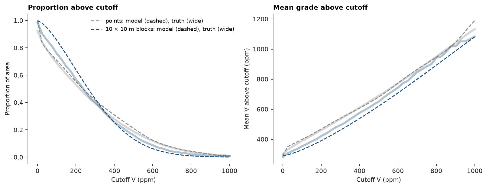

# discrete gaussian model

mining selects blocks. block grades vary less than point grades, so a point histogram misstates the tonnage above
cutoffs. the discrete gaussian model shrinks a hermite anamorphosis of the points to block support, and the exhaustive
walker lake grid gives the true point and block curves to check it against.

<details><summary>Python</summary>

```python
import boitata as bt
import matplotlib.pyplot as plt
import numpy as np
from common import ACCENT, GRAY, save

samples = bt.datasets.walker_lake()
truth = bt.datasets.walker_lake_exhaustive()["V"].reshape(300, 260)
xy, v = samples.coords, samples["V"]
weights = bt.cell_declustering(samples, "V", sizes=np.arange(2.5, 102.5, 2.5)).weights
```

</details>

a hermite anamorphosis models the declustered point distribution. the variogram of its gaussian scores is fitted
jointly along and across N170°, the major axis found in
[variogram fitting](../../05-spatial-continuity/02-variogram-fitting/README.md):

<details><summary>Python</summary>

```python
anam = bt.HermiteAnamorphosis(degree=40).fit(v, weights=weights)
y = anam.transform(v)
azimuths = (170, 260)
experimental = [bt.experimental_variogram(xy, y, 10, 120, azimuth=a) for a in azimuths]
gaussian = bt.Variogram.fit_directional(experimental, [(a, 0) for a in azimuths], rotation=[170, 0, 0])
print(gaussian)
```

</details>

```text
Variogram(nugget=0.3880895785084983, structures=[Structure("spherical", sill=0.6541303654567798, range=95.35466468171232)], rotation=(170.0, 0.0, 0.0), ratios=(0.3490856295281619, 1.0))
```

`change_of_support` averages the gaussian correlogram over a 10 × 10 m block and returns the change-of-support
coefficient r with the block anamorphosis. only the correlogram matters, so the sill of the variogram has no effect.

<details><summary>Python</summary>

```python
size = 10
r, block = bt.change_of_support(anam, gaussian, size=(size, size), discretization=(5, 5, 1))
blocks_true = truth.reshape(30, size, 26, size).mean(axis=(1, 3)).ravel()
print(
    f"r = {r:.3f}; point variance {anam.variance_:.0f}, block {block.variance_:.0f}, true block {blocks_true.var():.0f}"
)
```

</details>

```text
r = 0.725; point variance 64974, block 32652, true block 46694
```

grade-tonnage curves, model against truth:

<details><summary>Python</summary>

```python
cutoffs = np.linspace(0, 1000, 41)
model_point = anam.grade_tonnage(cutoffs)
model_block = block.grade_tonnage(cutoffs)


def empirical(values):
    tonnage = np.array([(values > c).mean() for c in cutoffs])
    grade = np.array([values[values > c].mean() if (values > c).any() else np.nan for c in cutoffs])
    return tonnage, grade


true_point = empirical(truth.ravel())
true_block = empirical(blocks_true)
for c in (300, 500, 800):
    k = np.searchsorted(cutoffs, c)
    print(
        f"above {c} ppm: points {model_point['tonnage'][k]:.1%} (true {true_point[0][k]:.1%}), "
        f"blocks {model_block['tonnage'][k]:.1%} (true {true_block[0][k]:.1%})"
    )

fig, (a, b) = plt.subplots(1, 2, figsize=(10, 3.8), layout="constrained")
for curves, model, color, label in (
    (true_point, model_point, GRAY, "points"),
    (true_block, model_block, ACCENT, f"{size} × {size} m blocks"),
):
    a.plot(cutoffs, curves[0], color=color, lw=3, alpha=0.35)
    a.plot(
        cutoffs,
        model["tonnage"],
        color=color,
        lw=1.4,
        ls="--",
        label=f"{label}: model (dashed), truth (wide)",
    )
    b.plot(cutoffs, curves[1], color=color, lw=3, alpha=0.35)
    b.plot(cutoffs, model["mean_grade"], color=color, lw=1.4, ls="--")
a.set(title="Proportion above cutoff", xlabel="Cutoff V (ppm)", ylabel="Proportion of area")
a.legend(fontsize=8)
b.set(title="Mean grade above cutoff", xlabel="Cutoff V (ppm)", ylabel="Mean V above cutoff (ppm)")
save(fig, "grade-tonnage")
```

</details>

```text
above 300 ppm: points 41.7% (true 39.3%), blocks 42.7% (true 40.1%)
above 500 ppm: points 21.1% (true 18.8%), blocks 13.3% (true 16.2%)
above 800 ppm: points 4.3% (true 3.9%), blocks 1.0% (true 2.1%)
```



the model shrinks the point variance of 64 974 to 32 652 for 10 m blocks, below the true 46 694, so it pulls the rich
tail in too far: above 500 ppm it keeps 13.3% of the blocks against a true 16.2%, above 800 ppm 1.0% against 2.1%. the
point curves run a few percent high, since the declustered samples still overstate the rich grades.
[uniform conditioning](../../09-recoverable-resources/02-uniform-conditioning/README.md) and
[MIK localization](../../09-recoverable-resources/03-mik-localization/README.md) carry block support down to panels;
[simulation at block support](../../08-stochastic-simulation/03-simulation-at-block-support/README.md) reaches it by
simulation.

Full script: [`example_09_01.py`](example_09_01.py)
