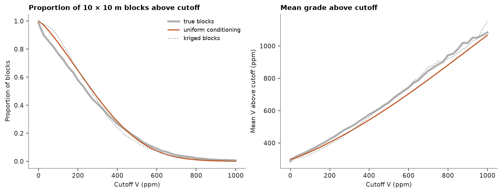
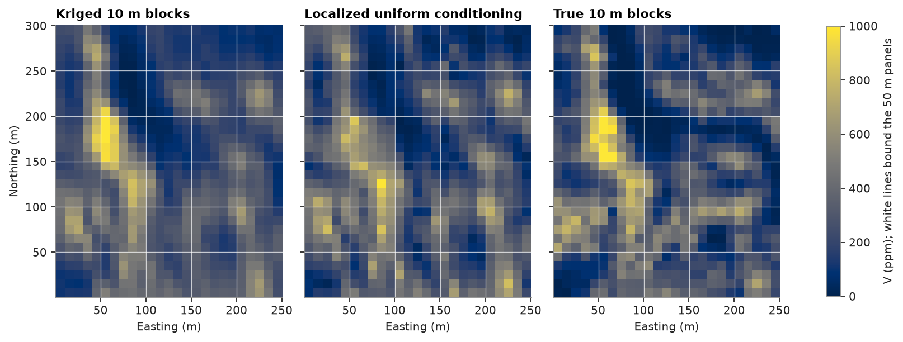

# uniform conditioning

kriged panels are too large to mine selectively, and kriged selective blocks are too smooth. uniform conditioning
takes the kriged grade of each panel and returns the grade-tonnage curve of the selective blocks inside it;
localization then places those blocks. the exhaustive walker lake grid gives the true 10 m blocks to check against.

<details><summary>Python</summary>

```python
import boitata as bt
import matplotlib.pyplot as plt
import numpy as np
from common import GRAY, HIGHLIGHT, INK, save

samples = bt.datasets.walker_lake()
truth = bt.datasets.walker_lake_exhaustive()["V"].reshape(300, 260)
xy, v = samples.coords, samples["V"]
weights = bt.cell_declustering(samples, "V", sizes=np.arange(2.5, 102.5, 2.5)).weights
size = 10
true_smu = truth[:, :250].reshape(30, size, 25, size).mean(axis=(1, 3))
```

</details>

two models, both fitted along and across N170°, the major axis found in
[variogram fitting](../../05-spatial-continuity/02-variogram-fitting/README.md). the variogram of the gaussian scores
of a hermite anamorphosis sets the change-of-support coefficient r of 10 m blocks
([discrete gaussian model](../../09-recoverable-resources/01-discrete-gaussian-model/README.md)). the variogram of the
grades, rescaled to the anamorphosis variance, kriges the panels.

<details><summary>Python</summary>

```python
anam = bt.HermiteAnamorphosis(degree=40).fit(v, weights=weights)
azimuths = (170, 260)
directions = [(a, 0) for a in azimuths]
scores = [bt.experimental_variogram(xy, anam.transform(v), 10, 120, azimuth=a) for a in azimuths]
gaussian = bt.Variogram.fit_directional(scores, directions, rotation=[170, 0, 0])
r, _ = bt.change_of_support(anam, gaussian, size=(size, size), discretization=(5, 5, 1))

grades = [bt.experimental_variogram(xy, v, 10, 120, azimuth=a) for a in azimuths]
fitted = bt.Variogram.fit_directional(grades, directions, ["spherical", "spherical"], rotation=[170, 0, 0])
raw = fitted.standardized(sill=anam.variance_)
print(f"r = {r:.3f}")
print(raw)
```

</details>

```text
r = 0.725
Variogram(nugget=16180.280562737755, structures=[Structure("spherical", sill=14864.277854678605, range=35.64043704679606), Structure("spherical", sill=33929.057964930726, range=79.33065065479494)], rotation=(170.0, 0.0, 0.0), ratios=(0.343967906520505, 1.0))
```

ordinary block kriging of 50 × 50 m panels over the western 250 m. its diagnostics give each panel the variance of its
estimate, which sets the change-of-support coefficient of that panel: kriging smooths a panel estimated from few or
distant samples more, so its selective blocks spread wider.

<details><summary>Python</summary>

```python
search = bt.Search(radius=100, max_samples=24, min_samples=4)
panels = bt.BlockModel(origin=(0.5, 0.5), size=(50, 50), count=(5, 6))
kriged = bt.BlockKriging(raw, search, size=(50, 50), discretization=(5, 5, 1)).fit(xy, v)
d = kriged.predict(panels, diagnostics=True)
panels = panels.with_columns({"V": d["value"], "estimate_variance": d["estimate_variance"]})
uc = bt.UniformConditioning(anam, r_smu=r)
cutoffs = np.linspace(0, 1000, 41)
curves = uc.grade_tonnage(panels, "V", cutoffs, estimate_variance="estimate_variance")
uc_tonnage, uc_grade = curves["tonnage"] / panels.volumes.sum(), curves["mean_grade"]


def empirical(values):
    tonnage = np.array([(values > c).mean() for c in cutoffs])
    grade = np.array([values[values > c].mean() if (values > c).any() else np.nan for c in cutoffs])
    return tonnage, grade


smus = panels.discretize(5)
direct = bt.BlockKriging(raw, search, size=(size, size), discretization=(5, 5, 1)).fit(xy, v).predict(smus)
true_curve, direct_curve = empirical(true_smu.ravel()), empirical(direct)
for c in (300, 500, 800):
    k = np.searchsorted(cutoffs, c)
    print(
        f"above {c} ppm: uniform conditioning {uc_tonnage[k]:.1%}, kriged blocks {direct_curve[0][k]:.1%}, "
        f"true {true_curve[0][k]:.1%}"
    )

fig, (a, b) = plt.subplots(1, 2, figsize=(10, 3.8), layout="constrained")
for (tonnage, grade), color, style, label in (
    (true_curve, INK, {"lw": 3, "alpha": 0.35}, "true blocks"),
    ((uc_tonnage, uc_grade), HIGHLIGHT, {"lw": 1.6}, "uniform conditioning"),
    (direct_curve, GRAY, {"lw": 1.2, "ls": ":"}, "kriged blocks"),
):
    a.plot(cutoffs, tonnage, color=color, label=label, **style)
    b.plot(cutoffs, grade, color=color, **style)
a.set(
    title=f"Proportion of {size} × {size} m blocks above cutoff",
    xlabel="Cutoff V (ppm)",
    ylabel="Proportion of blocks",
)
a.legend(fontsize=8)
b.set(title="Mean grade above cutoff", xlabel="Cutoff V (ppm)", ylabel="Mean V above cutoff (ppm)")
save(fig, "uniform-conditioning")
```

</details>

```text
above 300 ppm: uniform conditioning 45.3%, kriged blocks 42.9%, true 40.9%
above 500 ppm: uniform conditioning 15.6%, kriged blocks 13.6%, true 16.8%
above 800 ppm: uniform conditioning 1.1%, kriged blocks 2.3%, true 2.1%
```



at 500 ppm uniform conditioning keeps 15.6% of the blocks against a true 16.8%; the smoothed kriged blocks keep 13.6%.
at 300 ppm it overstates the tonnage by a few percent, as kriging does. at 800 ppm, where few blocks remain, it thins
the rich tail to 1.1% against a true 2.1%.

uniform conditioning says how much of each panel is ore, but not where. localization places it: inside each panel, the
25 blocks of `panels.discretize(5)` are ranked by their direct kriging, and the block ranked i receives the mean of
the i-th of 25 equal-probability bands of the block distribution of the panel. each panel keeps its grade, and its
blocks reproduce its grade-tonnage curve:

<details><summary>Python</summary>

```python
smus = smus.with_column("kriged", direct)
localized = uc.localize(smus, "kriged", panels, "V", estimate_variance="estimate_variance")["localized"]
for label, values in (("kriged", direct), ("localized", localized)):
    r = bt.compare(values, true_smu.ravel())["correlation"]
    print(f"{label}: variance {values.var():.0f}, correlation with truth {r:.2f}")
print(f"true blocks: variance {true_smu.var():.0f}")

fig, axes = plt.subplots(1, 3, figsize=(10, 4.4), layout="constrained", sharey=True)
extent = (0.5, 250.5, 0.5, 300.5)
for ax, values, title in (
    (axes[0], direct, "Kriged 10 m blocks"),
    (axes[1], localized, "Localized uniform conditioning"),
    (axes[2], true_smu, "True 10 m blocks"),
):
    image = ax.imshow(np.reshape(values, (30, 25)), origin="lower", extent=extent, vmin=0, vmax=1000)
    ax.vlines(np.arange(50.5, 250, 50), 0.5, 300.5, color="white", lw=0.6, alpha=0.7)
    ax.hlines(np.arange(50.5, 300, 50), 0.5, 250.5, color="white", lw=0.6, alpha=0.7)
    ax.set_aspect("equal")
    ax.set(title=title, xlabel="Easting (m)")
axes[0].set_ylabel("Northing (m)")
fig.colorbar(image, ax=axes, shrink=0.7, label="V (ppm); white lines bound the 50 m panels")
save(fig, "localized")
```

</details>

```text
kriged: variance 35064, correlation with truth 0.89
localized: variance 35465, correlation with truth 0.80
true blocks: variance 47350
```



the localized blocks spread as the model says blocks should, and the model says too little here: variance 35 465
against the true 47 350. block by block they match the truth less well than kriging (correlation 0.80 against 0.89),
since the ranking inside a panel is only as good as the kriging that sets it. localization keeps the grade of each
panel and its tonnage above every cutoff.

Full script: [`example_09_02.py`](example_09_02.py)
