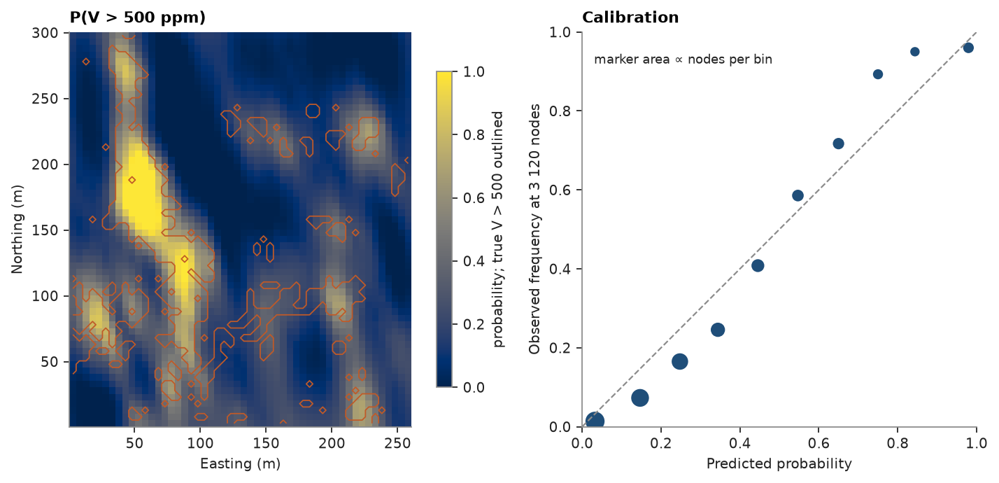

# disjunctive kriging

disjunctive kriging estimates, at each node, any function of the grade from kriged hermite factors of a gaussian
anamorphosis; here, the probability that V exceeds a cutoff. the exhaustive walker lake grid shows where the grade
exceeds it.

<details><summary>Python</summary>

```python
import boitata as bt
import matplotlib.pyplot as plt
import numpy as np
from common import ACCENT, GRAY, HIGHLIGHT, INK, save

samples = bt.datasets.walker_lake()
truth = bt.datasets.walker_lake_exhaustive()["V"].reshape(300, 260)
xy, v = samples.coords, samples["V"]
weights = bt.cell_declustering(samples, "V", sizes=np.arange(2.5, 102.5, 2.5)).weights
```

</details>

a hermite anamorphosis of the declustered samples, and the variogram of its gaussian scores fitted along and across
N170°, the major axis found in [variogram fitting](../../05-spatial-continuity/02-variogram-fitting/README.md):

<details><summary>Python</summary>

```python
anam = bt.HermiteAnamorphosis(degree=40).fit(v, weights=weights)
y = anam.transform(v)
azimuths = (170, 260)
experimental = [bt.experimental_variogram(xy, y, 10, 120, azimuth=a) for a in azimuths]
gaussian = bt.Variogram.fit_directional(experimental, [(a, 0) for a in azimuths], rotation=[170, 0, 0])
print(gaussian)
```

</details>

```text
Variogram(nugget=0.3880895785084983, structures=[Structure("spherical", sill=0.6541303654567798, range=95.35466468171232)], rotation=(170.0, 0.0, 0.0), ratios=(0.3490856295281619, 1.0))
```

`predict_tonnage` gives P(V > cutoff) on a 5 m grid. binned against the truth, a calibrated estimate would sit on the
diagonal:

<details><summary>Python</summary>

```python
grid = bt.BlockModel(origin=(0.5, 0.5), size=(5, 5), count=(52, 60))
dk = bt.DisjunctiveKriging(anam, gaussian, bt.Search(radius=100, max_samples=24), order=20).fit(xy, v)
cutoff = 500.0
p = dk.predict_tonnage(grid, cutoff)
nodes = grid.centroids.astype(int)
above = truth[nodes[:, 1] - 1, nodes[:, 0] - 1] > cutoff
edges = np.linspace(0, 1, 11)
bins = np.clip(np.digitize(p, edges) - 1, 0, 9)
counts = np.bincount(bins, minlength=10)
keep = counts > 20
predicted = np.array([p[bins == k].mean() if counts[k] else np.nan for k in range(10)])
observed = np.array([above[bins == k].mean() if counts[k] else np.nan for k in range(10)])
print(f"mean predicted P(V > {cutoff:.0f}) {p.mean():.3f}, true proportion {above.mean():.3f}")
for k in np.flatnonzero(keep):
    print(
        f"bin {edges[k]:.1f}–{edges[k + 1]:.1f}: {counts[k]} nodes, predicted {predicted[k]:.2f}, observed {observed[k]:.2f}"
    )

fig, (a, b) = plt.subplots(1, 2, figsize=(10, 4.2), layout="constrained")
extent = (0.5, 260.5, 0.5, 300.5)
image = a.imshow(np.clip(p, 0, 1).reshape(60, 52), origin="lower", extent=extent, vmin=0, vmax=1)
a.contour(
    above.reshape(60, 52).astype(float),
    levels=[0.5],
    origin="lower",
    extent=extent,
    colors=HIGHLIGHT,
    linewidths=0.8,
)
a.set_aspect("equal")
a.set(title=f"P(V > {cutoff:.0f} ppm)", xlabel="Easting (m)", ylabel="Northing (m)")
fig.colorbar(image, ax=a, shrink=0.8, label=f"probability; true V > {cutoff:.0f} outlined")
b.plot([0, 1], [0, 1], color=GRAY, ls="--", lw=1)
b.scatter(predicted[keep], observed[keep], s=np.sqrt(counts[keep]) * 4, color=ACCENT)
b.set(
    xlim=(0, 1),
    ylim=(0, 1),
    xlabel="Predicted probability",
    ylabel=f"Observed frequency at {p.size:,} nodes".replace(",", " "),
    title="Calibration",
)
b.set_aspect("equal")
b.text(0.03, 0.92, "marker area ∝ nodes per bin", color=INK, fontsize=8)
save(fig, "disjunctive")
```

</details>

```text
mean predicted P(V > 500) 0.231, true proportion 0.189
bin 0.0–0.1: 1021 nodes, predicted 0.03, observed 0.01
bin 0.1–0.2: 740 nodes, predicted 0.15, observed 0.07
bin 0.2–0.3: 527 nodes, predicted 0.25, observed 0.17
bin 0.3–0.4: 277 nodes, predicted 0.34, observed 0.25
bin 0.4–0.5: 174 nodes, predicted 0.45, observed 0.41
bin 0.5–0.6: 111 nodes, predicted 0.55, observed 0.59
bin 0.6–0.7: 99 nodes, predicted 0.65, observed 0.72
bin 0.7–0.8: 56 nodes, predicted 0.75, observed 0.89
bin 0.8–0.9: 40 nodes, predicted 0.84, observed 0.95
bin 0.9–1.0: 75 nodes, predicted 0.98, observed 0.96
```



on average the estimate says 23.1% of the nodes exceed 500 ppm; 18.9% do. the error sits in the low bins, which hold
most nodes: where it predicts 0.1 to 0.4, you observe half to two thirds of that. from 0.5 to 0.9 the error reverses,
and more nodes exceed the cutoff than it predicts.

Full script: [`example_09_04.py`](example_09_04.py)
