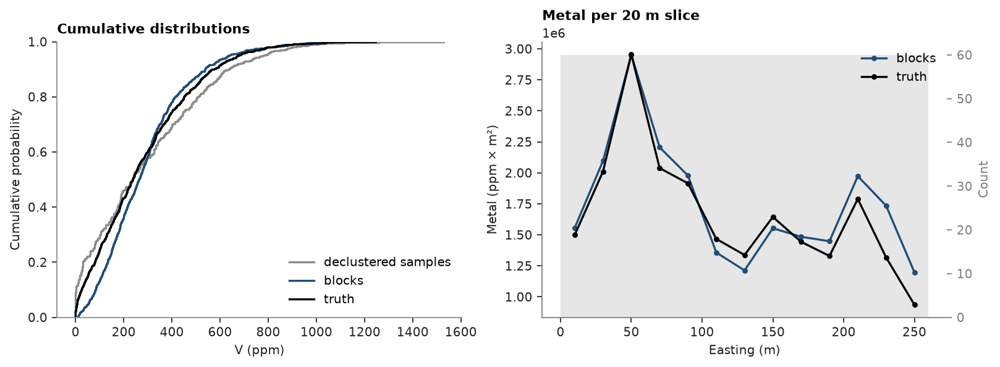
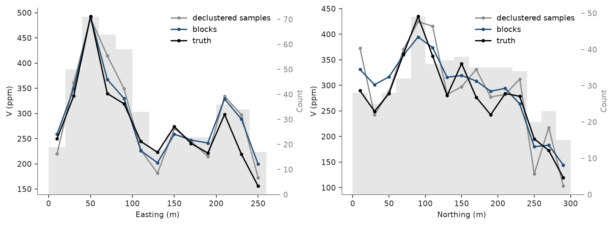

# Model checks

Block kriging of Walker Lake `V` on 10 × 10 m blocks, checked against the declustered samples: the global bias,
distributions side by side with `validate_model`, and swaths of grade and metal along easting and northing. The
exhaustive grid gives the true blocks as a reference.

<details><summary>Python</summary>

```python
import boitata as bt
import matplotlib.pyplot as plt
import numpy as np
from common import ACCENT, GRAY, save

samples = bt.datasets.walker_lake()
truth = bt.datasets.walker_lake_exhaustive()["V"].reshape(300, 260)
xy, v = samples.coords, samples["V"]
azimuths = np.arange(0, 180, 22.5)
directional = [bt.experimental_variogram(xy, v, 10.0, 120.0, azimuth=a) for a in azimuths]
model = bt.Variogram.fit_directional(
    directional, [(a, 0) for a in azimuths], ["spherical", "spherical"], weighting="count/gamma"
)
weights = bt.cell_declustering(xy, v, sizes=np.arange(2.5, 102.5, 2.5)).weights

blocks = bt.BlockModel(origin=(0.5, 0.5), size=(10, 10), count=(26, 30))
search = bt.Search(radius=80, max_samples=24, min_samples=4, rotation=model.rotation, ratios=(0.5, 1.0))
kriging = bt.BlockKriging(model, search, size=(10, 10), discretization=(5, 5, 1)).fit(xy, v)
true_blocks = truth.reshape(30, 10, 26, 10).mean(axis=(1, 3)).ravel()
kriged = blocks.with_columns({"value": kriging.predict(blocks), "truth": true_blocks})
```

</details>

## Global bias

The mean of the blocks against the declustered mean of the samples. Blocks of equal size weigh the same; with
volumes or tonnages, pass them as `weights`.

<details><summary>Python</summary>

```python
bias = bt.global_bias(kriged["value"], v, data_weights=weights)
print(
    f"blocks {bias['estimate_mean']:.1f} ppm, declustered samples {bias['data_mean']:.1f} ppm, "
    f"bias {bias['relative']:+.1%}; true blocks {true_blocks.mean():.1f} ppm"
)
```

</details>

```text
blocks 291.7 ppm, declustered samples 290.7 ppm, bias +0.3%; true blocks 278.0 ppm
```

## Distributions

`validate_model` sets the blocks against the samples, naive and declustered, with the true blocks as a reference.
Differences are relative to the declustered samples.

<details><summary>Python</summary>

```python
table = bt.validate_model(kriged, "value", samples, "V", weights=weights, reference="truth")
print(f"{'':12}{'n':>6}{'mean':>7}{'CV':>6}{'P10':>6}{'P50':>6}{'P90':>7}{'mean diff':>11}{'var. ratio':>11}")
for row in zip(
    *(table[c] for c in ["source", "n", "mean", "cv", "P10", "P50", "P90", "mean_diff", "variance_ratio"])
):
    source, n, mean, cv, p10, p50, p90, diff, ratio = row
    print(
        f"{source:<12}{n:>6.0f}{mean:>7.0f}{cv:>6.2f}{p10:>6.0f}{p50:>6.0f}{p90:>7.0f}{diff:>+11.1%}{ratio:>11.2f}"
    )
```

</details>

```text
                 n   mean    CV   P10   P50    P90  mean diff var. ratio
naive          470    435  0.69    31   424    819     +49.8%       1.38
declustered    470    291  0.88     2   235    636      +0.0%       1.00
model          780    292  0.64    85   265    539      +0.3%       0.54
reference      780    278  0.78    26   239    576      -4.4%       0.72
```

The blocks reproduce the declustered mean within 0.3 %; both sit about 5 % above the truth, which no check against
the samples can see. Being 10 × 10 m averages smoothed by kriging, the blocks have a much smaller variance; the true
blocks sit in between, since averaging over a block alone already removes part of the sample
variance. Their cumulative distributions show the same smoothing: the blocks have fewer low and high grades than
the true blocks, the declustered samples more. `bt.plot.grade_tonnage` draws the same comparison as tonnage and
grade above cutoff ([result plots](../../10-checking-models/06-result-plots/README.md)). Swaths of metal, grade × area per 20 m slice of easting, show where the estimate
puts the metal; they add up to the metal of the whole model.

<details><summary>Python</summary>

```python
fig, axes = plt.subplots(1, 2, figsize=(10, 3.6), layout="constrained")
bt.plot.cdf([v, kriged["value"], true_blocks], weights=[weights, None, None], ax=axes[0])
metal = [bt.swath(kriged, g, 20.0, axis="x") for g in ("value", "truth")]
bt.plot.swath(metal, labels=["blocks", "truth"], y="metal", ax=axes[1])
for ax, colors in ((axes[0], (GRAY, ACCENT, "black")), (axes[1], (ACCENT, "black"))):
    for line, color in zip(ax.lines, colors, strict=True):
        line.set_color(color)
axes[0].legend(axes[0].lines, ["declustered samples", "blocks", "truth"])
axes[1].legend()
axes[0].set(xlabel="V (ppm)", title="Cumulative distributions")
axes[1].set(xlabel="Easting (m)", ylabel="Metal (ppm × m²)", title="Metal per 20 m slice")
save(fig, "distributions")
```

</details>



## Swaths

Local bias shows in swaths: mean grade in 20 m slices along easting and northing, for the blocks, the declustered
samples and the truth. Blocks track the truth slice by slice and are smoother than the samples, whose slice means
scatter where few samples fall.

<details><summary>Python</summary>

```python
fig, axes = plt.subplots(1, 2, figsize=(10, 3.6), layout="constrained")
for ax, axis, name in ((axes[0], "x", "Easting (m)"), (axes[1], "y", "Northing (m)")):
    series = [
        bt.swath(samples, "V", 20.0, axis=axis, weights=weights),
        bt.swath(kriged, "value", 20.0, axis=axis),
        bt.swath(kriged, "truth", 20.0, axis=axis),
    ]
    bt.plot.swath(series, labels=["declustered samples", "blocks", "truth"], ax=ax)
    for line, color in zip(ax.lines, (GRAY, ACCENT, "black"), strict=True):
        line.set_color(color)
    ax.legend()
    ax.set(xlabel=name, ylabel="V (ppm)")
save(fig, "swaths")
```

</details>



Full script: [`example_10_01.py`](example_10_01.py)
