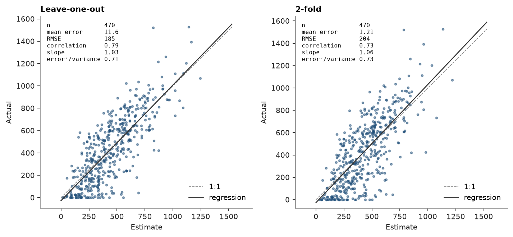

# cross-validation

ordinary kriging of walker lake `V` re-estimates each sample from the others, with the same variogram and search:
leave-one-out, then k-fold with fewer and fewer folds.

<details><summary>Python</summary>

```python
import boitata as bt
import matplotlib.pyplot as plt
import numpy as np
from common import save

samples = bt.datasets.walker_lake()
xy, v = samples.coords, samples["V"]
azimuths = np.arange(0, 180, 22.5)
directional = [bt.experimental_variogram(xy, v, 10.0, 120.0, azimuth=a) for a in azimuths]
model = bt.Variogram.fit_directional(
    directional, [(a, 0) for a in azimuths], ["spherical", "spherical"], weighting="count/gamma"
)
search = bt.Search(radius=80, max_samples=24, min_samples=4, rotation=model.rotation, ratios=(0.5, 1.0))
kriging = bt.OrdinaryKriging(model, search).fit(xy, v)
```

</details>

leave-one-out removes one sample at a time. k-fold removes a whole fold, sample `i` going to fold `i % k`, so each
estimate sees data a fraction `1/k` sparser. the slope comes from the regression of actual on estimated values and
is 1 without conditional bias. the standardized squared error is the mean of error² over kriging variance, 1 when
the kriging variance is calibrated.

<details><summary>Python</summary>

```python
results = {}
for folds in (None, 10, 5, 2):
    name = "leave-one-out" if folds is None else f"{folds}-fold"
    cv = results[name] = kriging.cross_validate(folds=folds)
    print(
        f"{name:>13}: RMSE {cv.rmse:5.1f} ppm, correlation {cv.correlation:.2f}, slope {cv.slope:.2f}, "
        f"standardized squared error {cv.standardized_squared_error:.2f}"
    )
```

</details>

```text
leave-one-out: RMSE 185.4 ppm, correlation 0.79, slope 1.03, standardized squared error 0.71
      10-fold: RMSE 189.4 ppm, correlation 0.78, slope 1.03, standardized squared error 0.73
       5-fold: RMSE 193.2 ppm, correlation 0.77, slope 1.03, standardized squared error 0.74
       2-fold: RMSE 204.1 ppm, correlation 0.73, slope 1.06, standardized squared error 0.73
```

errors grow as folds get fewer. leave-one-out judges the model at the sample spacing, which in the clustered areas
is finer than most blocks see. a slope above 1 and a standardized squared error below 1 hold at each k: high
estimates understate the samples a little, and the kriging variance is too large. `bt.plot.cross_validation`
([result plots](../../10-checking-models/06-result-plots/README.md)) draws a result as actual against estimate, with the regression line and these statistics:

<details><summary>Python</summary>

```python
fig, axes = plt.subplots(1, 2, figsize=(9, 4.2))
for ax, name in zip(axes, ("leave-one-out", "2-fold"), strict=True):
    bt.plot.cross_validation(results[name], ax=ax)
    ax.set_title(name.capitalize())
fig.tight_layout()
save(fig, "cross_validation")
```

</details>



Full script: [`example_10_02.py`](example_10_02.py)
