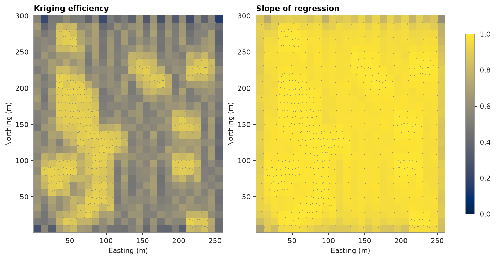
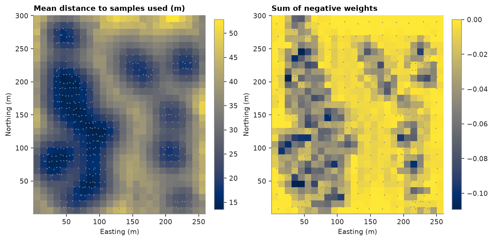

# Kriging diagnostics

Block kriging of Walker Lake `V` on 10 × 10 m blocks with `diagnostics=True`: kriging efficiency and slope of
regression per block, then the neighborhood behind each estimate. The exhaustive grid checks what they predict.

<details><summary>Python</summary>

```python
import boitata as bt
import matplotlib.pyplot as plt
import numpy as np
from common import GRAY, map_axes, save

samples = bt.datasets.walker_lake()
truth = bt.datasets.walker_lake_exhaustive()["V"].reshape(300, 260)
xy, v = samples.coords, samples["V"]
azimuths = np.arange(0, 180, 22.5)
directional = [bt.experimental_variogram(xy, v, 10.0, 120.0, azimuth=a) for a in azimuths]
model = bt.Variogram.fit_directional(
    directional, [(a, 0) for a in azimuths], ["spherical", "spherical"], weighting="count/gamma"
)

blocks = bt.BlockModel(origin=(0.5, 0.5), size=(10, 10), count=(26, 30))
search = bt.Search(radius=80, max_samples=24, min_samples=4, rotation=model.rotation, ratios=(0.5, 1.0))
kriging = bt.BlockKriging(model, search, size=(10, 10), discretization=(5, 5, 1)).fit(xy, v)
d = kriging.predict(blocks, diagnostics=True)
true_blocks = truth.reshape(30, 10, 26, 10).mean(axis=(1, 3)).ravel()
shape, extent = (30, 26), (0.5, 260.5, 0.5, 300.5)
```

</details>

## Efficiency and slope

Kriging efficiency compares the block variance with the kriging variance: 1 for a perfectly known block, 0 or less
for one no better known than the global mean. The slope of regression of true on estimated grades is 1 when
estimates are conditionally unbiased; below 1, high estimates overstate and low ones understate the truth. Both
fall away from the samples:

<details><summary>Python</summary>

```python
fig, axes = plt.subplots(1, 2, figsize=(9, 4.6), layout="constrained")
for ax, key, title in (
    (axes[0], "efficiency", "Kriging efficiency"),
    (axes[1], "slope", "Slope of regression"),
):
    im = ax.imshow(d[key].reshape(shape), origin="lower", extent=extent, vmin=0, vmax=1)
    ax.scatter(xy[:, 0], xy[:, 1], s=2, color=GRAY, linewidths=0)
    map_axes(ax, title)
fig.colorbar(im, ax=axes, shrink=0.8)
save(fig, "diagnostics")
```

</details>



The truth checks both. Globally, the regression of true on estimated block grades has a slope close to the mean
predicted slope. Blocks with efficiency of 0.7 or more are clearly closer to the truth; below that efficiency
separates them poorly, one reason classification also uses sample spacing ([classification](../../10-checking-models/05-classification/README.md)).

<details><summary>Python</summary>

```python
observed = np.polyfit(d["value"], true_blocks, 1)[0]
print(f"slope of regression: predicted mean {d['slope'].mean():.2f}, observed {observed:.2f}")
groups = np.digitize(d["efficiency"], [0.5, 0.7])
for g, label in enumerate(("efficiency < 0.5", "0.5 to 0.7", ">= 0.7")):
    k = groups == g
    error = np.sqrt(np.mean((d["value"][k] - true_blocks[k]) ** 2))
    corr = np.corrcoef(d["value"][k], true_blocks[k])[0, 1]
    print(f"{label:>16}: {k.sum():3d} blocks, RMSE {error:5.1f} ppm, correlation with truth {corr:.2f}")
```

</details>

```text
slope of regression: predicted mean 0.96, observed 1.02
efficiency < 0.5:  98 blocks, RMSE  95.7 ppm, correlation with truth 0.77
      0.5 to 0.7: 423 blocks, RMSE 110.0 ppm, correlation with truth 0.70
          >= 0.7: 259 blocks, RMSE  84.0 ppm, correlation with truth 0.93
```

## Neighborhood

The other diagnostics say why a block is weak. `mean_distance` is the mean distance to the samples used, and
`max_samples_reached` flags searches that stopped at 24 samples before the ellipse ran out: those blocks sit in
denser data and have the higher slope. `negative_weight_sum` adds the weights below zero, which samples screened
by closer ones receive. `lagrange` (the Lagrange multiplier) and `n_holes` (distinct drill holes used; each Walker
Lake sample is its own) complete the set.

<details><summary>Python</summary>

```python
full = d["max_samples_reached"] == 1
for label, k in (("full search", full), ("ellipse ran out", ~full)):
    print(
        f"{label:>15}: {k.mean():4.0%} of blocks, mean distance {d['mean_distance'][k].mean():4.1f} m, "
        f"mean slope {d['slope'][k].mean():.2f}"
    )
groups = np.digitize(d["negative_weight_sum"], [-0.05, -0.03])
for g, label in enumerate(("below -0.05", "-0.05 to -0.03", "above -0.03")):
    k = groups == g
    error = np.sqrt(np.mean((d["value"][k] - true_blocks[k]) ** 2))
    print(
        f"negative weights {label:>14}: {k.sum():3d} blocks, RMSE {error:5.1f} ppm, "
        f"mean {d['value'][k].mean():3.0f} ppm against {true_blocks[k].mean():3.0f} true"
    )
print(f"{np.sum(d['value'] < 0)} negative estimates")
```

</details>

```text
    full search:  89% of blocks, mean distance 28.2 m, mean slope 0.97
ellipse ran out:  11% of blocks, mean distance 40.4 m, mean slope 0.89
negative weights    below -0.05: 105 blocks, RMSE  98.9 ppm, mean 446 ppm against 410 true
negative weights -0.05 to -0.03: 133 blocks, RMSE  93.8 ppm, mean 408 ppm against 392 true
negative weights    above -0.03: 542 blocks, RMSE 102.0 ppm, mean 233 ppm against 224 true
0 negative estimates
```

Negative weights are strongest in and around the dense clusters of the west, where close samples screen the
others. Those blocks lie in high grades, and they overstate the truth by about four times as much as the rest,
although their errors are no larger; no estimate goes below zero.

<details><summary>Python</summary>

```python
fig, axes = plt.subplots(1, 2, figsize=(9, 4.6), layout="constrained")
for ax, key, title in (
    (axes[0], "mean_distance", "Mean distance to samples used (m)"),
    (axes[1], "negative_weight_sum", "Sum of negative weights"),
):
    im = ax.imshow(d[key].reshape(shape), origin="lower", extent=extent)
    ax.scatter(xy[:, 0], xy[:, 1], s=2, color=GRAY, linewidths=0)
    map_axes(ax, title)
    fig.colorbar(im, ax=ax, shrink=0.8)
save(fig, "neighborhood")
```

</details>



Full script: [`example_10_03.py`](example_10_03.py)
