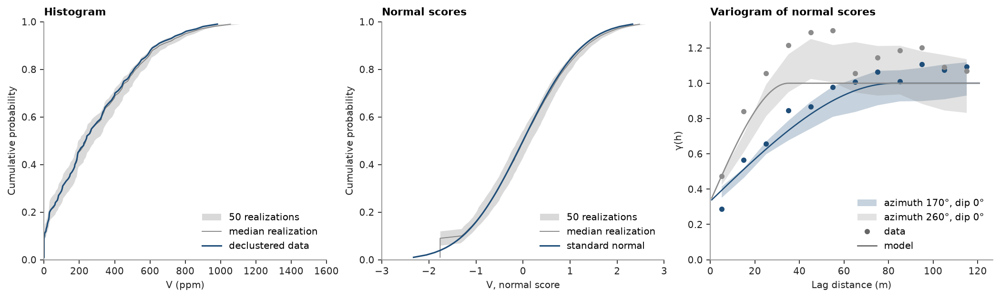
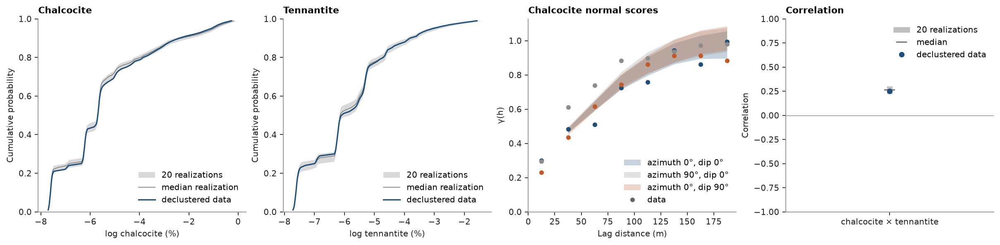

# Realization checks

Realizations are only as good as what they reproduce: the declustered histogram of the data, the variogram model they
were drawn from and, with several variables, the correlations between them. `check_realizations` measures all three
for every realization, and `bt.plot.histogram_reproduction`, `variogram_reproduction` and `correlation_reproduction`
draw each as a band across realizations against its target. Realization variograms on a grid pair cells by index
shifts, in parallel over realizations.

<details><summary>Python</summary>

```python
import boitata as bt
import matplotlib.pyplot as plt
import numpy as np
from common import save
```

</details>

Walker Lake V, simulated as in [sequential Gaussian simulation](../../08-stochastic-simulation/01-sgs/README.md): declustered normal scores, their variogram along N170° and across it,
and 50 SGS realizations on a 5 m grid.

<details><summary>Python</summary>

```python
samples = bt.datasets.walker_lake()
xy, v = samples.coords, samples["V"]
weights = bt.cell_declustering(xy, v, sizes=np.arange(2.5, 102.5, 2.5)).weights
y = bt.NormalScore(tails=(0.0, v.max())).fit_transform(v, weights=weights)

azimuth, lag, max_lag = 170.0, 10.0, 120.0
major = bt.experimental_variogram(xy, y, lag, max_lag, azimuth=azimuth).fit("spherical")
minor = bt.experimental_variogram(xy, y, lag, max_lag, azimuth=azimuth + 90).fit("spherical")
total, a_major = major.sill, major.structures[0].range
gaussian = bt.Variogram(
    [("spherical", major.structures[0].sill / total, a_major)],
    nugget=major.nugget / total,
    rotation=(azimuth, 0, 0),
    ratios=(min(minor.structures[0].range / a_major, 1.0), 1.0),
)
grid = bt.BlockModel(origin=(0.5, 0.5), size=(5, 5), count=(52, 60))
sgs = bt.SGS(gaussian, bt.Search(radius=100, max_samples=24)).fit(samples, "V", weights=weights)
summary = sgs.simulate(grid, n=50, seed=42, keep=True)
```

</details>

One call checks them all. Given the model, the variograms run along its azimuth and across it, in the normal scores
of the declustered data, the units the model is in. `statistics` holds what `describe` gives for the declustered
data (realization 0) and for every realization:

<details><summary>Python</summary>

```python
check = bt.check_realizations(
    grid, summary, samples, "V", weights=weights, variogram=gaussian, lag=lag, max_lag=max_lag
)
stats = check.statistics
for name in ["mean", "std", "P50", "P90"]:
    column = stats[name]
    print(f"{name:5} data {column[0]:6.0f}   realizations {column[1:].min():6.0f} to {column[1:].max():6.0f}")
```

</details>

```text
mean  data    291   realizations    274 to    334
std   data    255   realizations    254 to    278
P50   data    235   realizations    192 to    284
P90   data    636   realizations    616 to    702
```

The realizations' distributions straddle the declustered data's in grades and in normal scores, save the step at
the lowest scores, where every realization value of 0 ppm shares one score. Their variograms
follow the model along and across N170° up to its ranges; beyond them the realizations wander around the sill, as
single 260 × 300 m fields must, and the band shows how far.

<details><summary>Python</summary>

```python
fig, axes = plt.subplots(1, 3, figsize=(13, 3.8), layout="constrained")
bt.plot.histogram_reproduction(check, ax=axes[0])
bt.plot.histogram_reproduction(check, scores=True, ax=axes[1])
bt.plot.variogram_reproduction(check, ax=axes[2])
axes[0].set(xlim=(0, 1600), xlabel="V (ppm)", title="Histogram")
axes[1].set(xlim=(-3, 3), title="Normal scores")
axes[2].set(xlabel="Lag distance (m)", title="Variogram of normal scores")
save(fig, "walker_lake")
```

</details>



## Several variables

Log chalcocite and log tennantite of porphyry 1, cosimulated through PPMT by turning bands as in [multivariate simulation](../../08-stochastic-simulation/06-multivariate-simulation/README.md). With a
list of summaries, one per variable, the check adds each realization's correlation matrix.

<details><summary>Python</summary>

```python
data = bt.datasets.porphyry_geometallurgy(deposit=1)["synthetic_drillholes"]
coords = data.coords
names = ["chalcocite", "tennantite"]
logs = bt.PointSet(coords, {"chalcocite": np.log(data["calcosina"]), "tennantite": np.log(data["tenantita"])})
pair = np.column_stack([logs[n] for n in names])
weights = bt.cell_declustering(coords, pair[:, 0], cell_size=50.0).weights

lo, hi = coords.min(axis=0), coords.max(axis=0)
nodes = bt.BlockModel(origin=tuple(lo), size=(25, 25, 25), count=tuple(np.ceil((hi - lo) / 25).astype(int)))
ppmt = bt.PPMT(seed=7)
factors = ppmt.fit_transform(pair, weights=weights)
simulators = [
    bt.TurningBands(bt.experimental_variogram(coords, f, 25.0, 300.0).fit("spherical")) for f in factors.T
]
simulation = bt.MultivariateSimulation(ppmt, simulators).fit(logs, names, weights=weights)
reals = simulation.simulate(nodes, n=20, seed=1, keep=True)

multi = bt.check_realizations(
    nodes, reals, logs, names, weights=weights, lag=25.0, max_lag=200.0, directions=[(0, 0), (90, 0), (0, 90)]
)
r = multi.correlations[:, 0, 1]
print(
    f"{len(nodes.centroids):,} nodes; correlation data {multi.data_correlation[0, 1]:.2f}, "
    f"realizations {r.min():.2f} to {r.max():.2f}"
)
```

</details>

```text
32,130 nodes; correlation data 0.25, realizations 0.22 to 0.30
```

Both declustered histograms and the correlation are reproduced; the variograms are not. The factors were simulated
with omnidirectional models, so the realizations are nearly isotropic and smoother than the data, which are more
continuous down the holes than across them. The check points at the next step: directional factor variograms.

<details><summary>Python</summary>

```python
fig, axes = plt.subplots(1, 4, figsize=(15, 3.6), layout="constrained")
for ax, name in zip(axes, names):
    bt.plot.histogram_reproduction(multi, variable=name, ax=ax)
    ax.set(xlabel=f"log {name} (%)", title=name.capitalize())
bt.plot.variogram_reproduction(multi, variable="chalcocite", ax=axes[2])
axes[2].set(xlabel="Lag distance (m)", title="Chalcocite normal scores")
bt.plot.correlation_reproduction(multi, ax=axes[3])
axes[3].set_title("Correlation")
save(fig, "porphyry")
```

</details>



Full script: [`example_10_04.py`](example_10_04.py)
