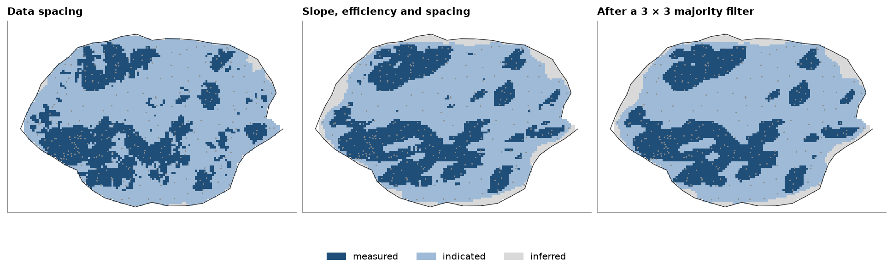

# classification

resource classes for the blocks of a coal lease, first from the spacing of the boreholes alone, then from the kriging
diagnostics of seam thickness together with the spacing. `classify` applies rules in order, and `smooth_classes`
absorbs isolated blocks into their surroundings.

<details><summary>Python</summary>

```python
import boitata as bt
import matplotlib.pyplot as plt
import numpy as np
from common import ACCENT, GRAY, INK, LIGHT, save

data = bt.datasets.coal_seam_thickness()
holes, grid, lease = data["boreholes"], data["grid"], data["boundary"]
blocks = grid.mask(np.asarray(grid["INSIDE"]) == 1)
xy, thickness = holes.coords, holes["THICKNESS_M"]
print(f"{len(holes)} boreholes, {len(blocks.centroids)} blocks of 100 × 100 m inside the lease")
```

</details>

```text
295 boreholes, 7162 blocks of 100 × 100 m inside the lease
```

## by data spacing

`data_spacing` measures from each block to its `n`th nearest borehole. on a square mesh of spacing `s`, the 4th
nearest hole lies at about `s`, so `n=4` reads as the local drilling mesh. rules apply in order and the first that
holds wins; blocks where none holds get the default.

<details><summary>Python</summary>

```python
spacing = bt.data_spacing(holes, n=4, targets=blocks)
rules = [("measured", {"spacing": ("<=", 500)}), ("indicated", {"spacing": ("<=", 1000)})]
by_spacing = bt.classify({"spacing": spacing}, rules, default="inferred")
print(
    f"4th nearest hole: median {np.median(spacing):.0f} m, 90th percentile {np.percentile(spacing, 90):.0f} m"
)
```

</details>

```text
4th nearest hole: median 576 m, 90th percentile 773 m
```

## by kriging diagnostics

block kriging with `diagnostics=True` gives each block its slope of regression and kriging efficiency ([kriging diagnostics](../../10-checking-models/03-kriging-diagnostics/README.md)).
the rules add the spacing, so a block needs a well-conditioned estimate and nearby holes.

<details><summary>Python</summary>

```python
azimuths = np.arange(0, 180, 45.0)
directional = [bt.experimental_variogram(xy, thickness, 250.0, 4000.0, azimuth=a) for a in azimuths]
model = bt.Variogram.fit_directional(
    directional, [(a, 0) for a in azimuths], ["spherical"], weighting="count/gamma"
)
search = bt.Search(radius=3000, max_samples=16, min_samples=4, rotation=model.rotation, ratios=(0.5, 1.0))
kriging = bt.BlockKriging(model, search, size=(100, 100), discretization=(4, 4, 1)).fit(xy, thickness)
d = kriging.predict(blocks, diagnostics=True)

criteria = {"slope": d["slope"], "efficiency": d["efficiency"], "spacing": spacing}
rules = [
    ("measured", {"slope": (">=", 0.95), "efficiency": (">=", 0.75), "spacing": ("<=", 600)}),
    ("indicated", {"slope": (">=", 0.9), "efficiency": (">=", 0.6), "spacing": ("<=", 1000)}),
]
by_kriging = bt.classify(criteria, rules, default="inferred")
```

</details>

## smoothing

a 3 × 3 majority filter absorbs isolated blocks into their surroundings; cells outside the lease do not vote.

<details><summary>Python</summary>

```python
smoothed = bt.smooth_classes(blocks, by_kriging, window=(3, 3, 1))
names = ["measured", "indicated", "inferred"]
print(f"{'':>9} {'spacing':>8} {'kriging':>8} {'smoothed':>9}")
for name in names:
    shares = [np.mean(c == name) for c in (by_spacing, by_kriging, smoothed)]
    print(f"{name:>9}" + "".join(f"{s:>9.1%}" for s in shares))
print(f"{np.mean(smoothed != by_kriging):.1%} of blocks change class in smoothing")
```

</details>

```text
           spacing  kriging  smoothed
 measured    31.8%    32.4%    31.7%
indicated    67.3%    59.9%    60.9%
 inferred     0.9%     7.7%     7.4%
2.8% of blocks change class in smoothing
```

both classifications put about a third of the blocks in measured. spacing alone leaves ragged patches around the
infill and few blocks in inferred. the kriging diagnostics also see the geometry of the data, so blocks along the
lease edge, with holes on one side only, drop to inferred (7.7 % of the lease). the filter changes 2.8 % of the
blocks, most of them single blocks and thin fringes.

<details><summary>Python</summary>

```python
resource_classes = bt.Categories(names, colors=[ACCENT, "#9ebad6", LIGHT])
cmap, norm = bt.plot.category_colors(resource_classes)
nx, ny, _ = grid.count
x0, y0, _ = grid.origin
extent = (x0, x0 + nx * grid.size[0], y0, y0 + ny * grid.size[1])
fig, axes = plt.subplots(1, 3, figsize=(12, 3.8), layout="constrained")
for ax, classes, title in (
    (axes[0], by_spacing, "Data spacing"),
    (axes[1], by_kriging, "Slope, efficiency and spacing"),
    (axes[2], smoothed, "After a 3 × 3 majority filter"),
):
    image = np.full(nx * ny, np.nan)
    image[blocks.index] = resource_classes.encode(classes)
    ax.imshow(image.reshape(ny, nx), origin="lower", extent=extent, cmap=cmap, norm=norm)
    ax.plot(*lease.vertices[:, :2].T, color=INK, lw=0.6)
    ax.scatter(xy[:, 0], xy[:, 1], s=2, color=GRAY, linewidths=0)
    ax.set(title=title, aspect="equal", xticks=[], yticks=[])
bt.plot.category_legend(resource_classes, fig, loc="outside lower center", ncol=3)
save(fig, "classes")
```

</details>



Full script: [`example_10_05.py`](example_10_05.py)
