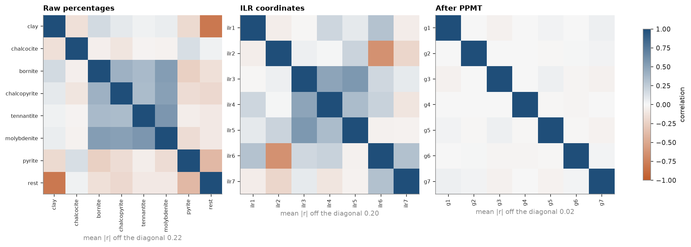

# 10. Compositional data

Porphyry 1 geometallurgical samples: seven minerals in % plus the remainder, a composition summing to 100.
Percentages live on the simplex: raising one part lowers the others, so correlations between raw parts mix geology with the constant-sum constraint, and kriging or simulating them independently can break the total.

The isometric log-ratio (ILR) maps each composition to 7 unconstrained real coordinates; the projection-pursuit multivariate transform (PPMT) then turns those into independent standard Gaussians, ready for independent simulation.




After PPMT the mean absolute correlation drops to 0.02, and the way back (inverse PPMT, inverse ILR) returns every composition to within 1e-12 %.

```python
composition = cs.closure(parts, total=100)
coords = cs.ilr(composition)  # (n, 8) -> (n, 7)
ppmt = cs.PPMT(iterations=40, seed=7).fit(coords)
gauss = ppmt.transform(coords)
back = cs.ilr_inverse(ppmt.inverse_transform(gauss)) * 100
```

[`example.py`](example.py)
