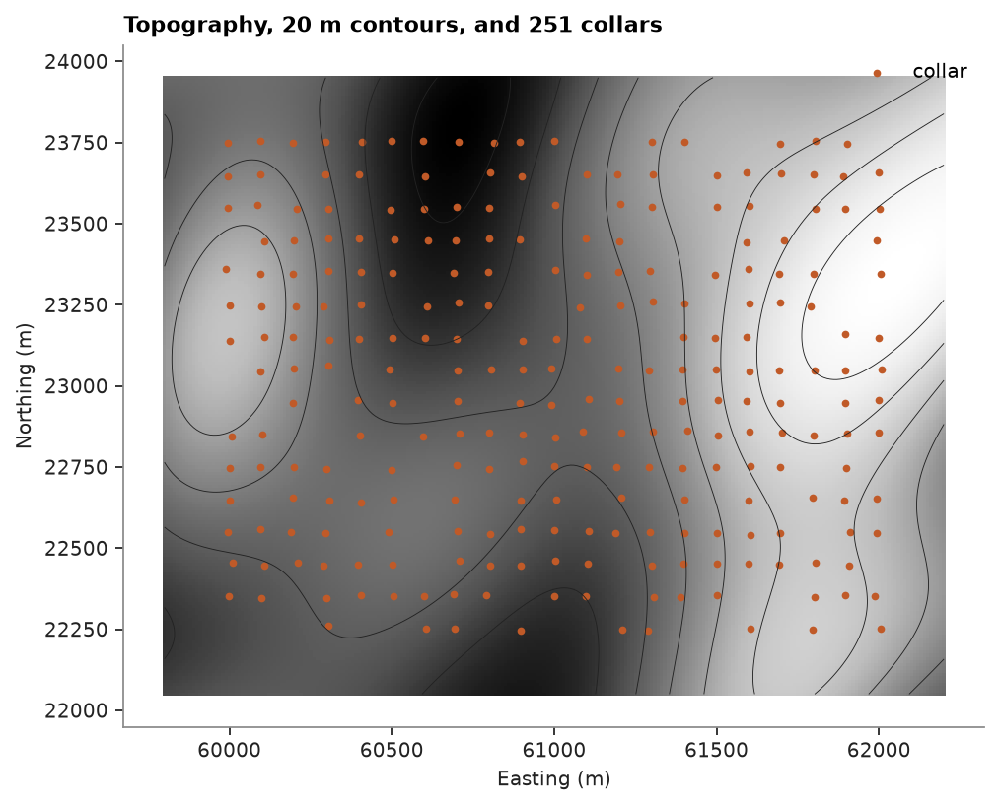
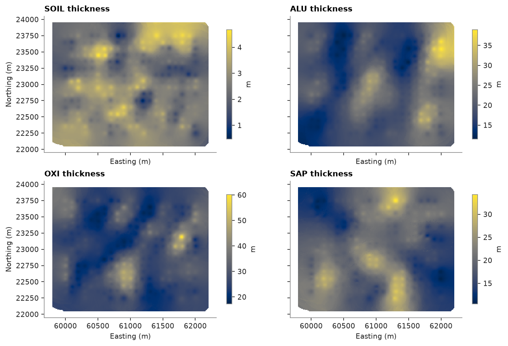
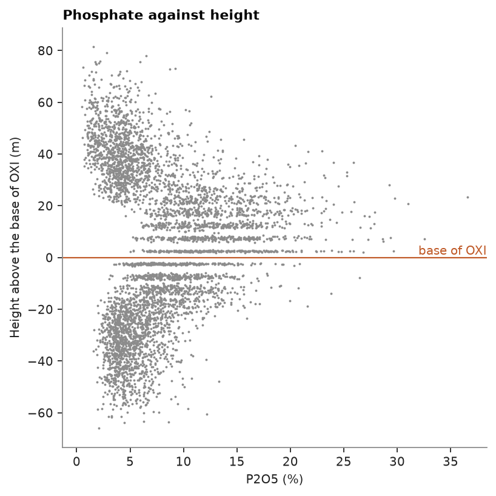
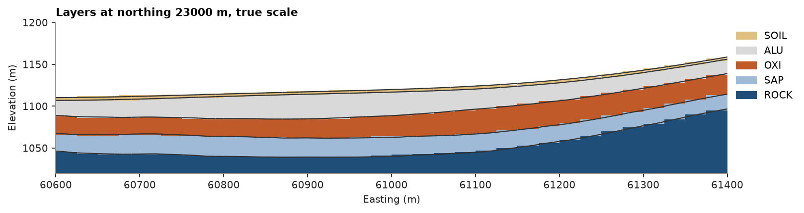

# Layered surfaces

A phosphate deposit weathered in place: 251 vertical holes log five horizons from the top, soil (`SOIL`), aluminous
laterite (`ALU`), oxidized ore (`OXI`), saprolite (`SAP`) and fresh rock (`ROCK`), under topography gridded at 10 m.
Each horizon base becomes a surface, the surfaces stack into a layered block model, and vertical distances to them
place any sample in its layer.

<details><summary>Python</summary>

```python
import boitata as bt
import matplotlib.pyplot as plt
import numpy as np
from common import ACCENT, GRAY, HIGHLIGHT, INK, LIGHT, map_axes, save
```

</details>

## Topography as a surface

Gridded elevations are a 2D `BlockModel` with a `Z` column; `grid_surface` triangulates them through the block
centers. `Mesh.vertical_distance` is a point's elevation minus the surface's at the same easting and northing:
the collars sit on the topography.

<details><summary>Python</summary>

```python
data = bt.datasets.phosphate_weathering_profile()
topography = data["topography"]
ground = bt.grid_surface(topography, "Z")
collars = data["collars"]
xyz = np.column_stack([collars["X"], collars["Y"], collars["Z"]])
print(topography)
print(ground)
offset = ground.vertical_distance(xyz)
print(f"collar minus topography: {offset.min():+.2f} to {offset.max():+.2f} m")

fig, ax = plt.subplots(figsize=(7, 5), layout="constrained")
bt.plot.section(topography, "Z", ax=ax, cmap="Greys_r", colorbar=False)
ax.contour(
    topography.centroids[:, 0].reshape(191, 241),
    topography.centroids[:, 1].reshape(191, 241),
    np.asarray(topography["Z"]).reshape(191, 241),
    levels=np.arange(1080, 1240, 20),
    colors=INK,
    linewidths=0.4,
)
ax.scatter(xyz[:, 0], xyz[:, 1], s=6, color=HIGHLIGHT, label="collar")
map_axes(ax, "Topography, 20 m contours, and 251 collars")
ax.legend(loc="upper right")
save(fig, "topography")
```

</details>

```text
BlockModel(regular, 46031 of 46031 cells, count [241, 191, 1], size [10.0, 10.0, 1.0], rotation [0.0, 0.0, 0.0])
  Z: Float64
Mesh(46031 vertices, 91200 triangles, open, 860 boundary edges)
collar minus topography: -0.06 to +0.06 m
```



## Horizon bases

The base of each horizon is found at its `TO` depth along the hole. Rather than interpolating the contact
elevations, which follow the topography, the depth below ground is interpolated, by inverse distance on the 10 m
grid, and subtracted from the topography. Every hole logs all five horizons, so the four depths get the same
weights in every cell: their order holds and the surfaces never cross.

<details><summary>Python</summary>

```python
LAYERS = ["SOIL", "ALU", "OXI", "SAP"]
holes = bt.Drillholes(collars, data["surveys"])
horizons = data["horizons"]
ids, names, to = np.array(horizons["HOLE_ID"]), np.array(horizons["HORIZON"]), np.asarray(horizons["TO"])
idw = bt.InverseDistance(bt.Search(radius=400, max_samples=12, min_samples=3))
bases, elevations = {}, {}
for name in LAYERS:
    base = holes.at(list(ids[names == name]), to[names == name])
    depth = -ground.vertical_distance(base)
    elevations[name] = topography["Z"] - idw.fit(base[:, :2], depth).predict(topography)
    bases[name] = bt.grid_surface(topography.with_column("base", elevations[name]), "base")
    print(f"base of {name}: depth {np.median(depth):5.1f} m median, {bases[name]}")
```

</details>

```text
base of SOIL: depth   2.7 m median, Mesh(45939 vertices, 91033 triangles, open, 843 boundary edges)
base of ALU: depth  21.8 m median, Mesh(45939 vertices, 91033 triangles, open, 843 boundary edges)
base of OXI: depth  48.5 m median, Mesh(45940 vertices, 91035 triangles, open, 843 boundary edges)
base of SAP: depth  69.2 m median, Mesh(45948 vertices, 91050 triangles, open, 844 boundary edges)
```

Cells beyond 400 m of a hole are left out of the surfaces. The thickness of a horizon is the vertical distance from
its base, at each cell center, up to the surface above it; a cell with no base elevation gets NaN.

<details><summary>Python</summary>

```python
above = {"SOIL": ground, "ALU": bases["SOIL"], "OXI": bases["ALU"], "SAP": bases["OXI"]}
fig, axes = plt.subplots(2, 2, figsize=(9, 6), sharex=True, sharey=True, layout="constrained")
for ax, name in zip(axes.flat, LAYERS, strict=True):
    points = np.column_stack([topography.centroids[:, :2], elevations[name]])
    thickness = -above[name].vertical_distance(points)
    print(f"{name:>4}: thickness {np.nanmin(thickness):5.1f} to {np.nanmax(thickness):5.1f} m")
    bt.plot.section(topography, thickness, ax=ax, colorbar=False)
    fig.colorbar(ax.collections[0], ax=ax, shrink=0.8, label="m")
    map_axes(ax, f"{name} thickness")
for ax in axes.flat[1::2]:
    ax.set_ylabel("")
save(fig, "thickness")
```

</details>

```text
SOIL: thickness   0.5 to   4.7 m
 ALU: thickness  11.5 to  38.9 m
 OXI: thickness  17.3 to  60.1 m
 SAP: thickness  10.5 to  34.2 m
```



## Samples by layer

A sample is in the first layer, from the top, whose base lies below it. At the assay midpoints, the layers from
the surfaces match the logged horizons, and they show where the phosphate is: the oxidized horizon.

<details><summary>Python</summary>

```python
assays = bt.Drillholes(collars, data["surveys"], data["assays"]).samples()
logged = bt.Drillholes(collars, data["surveys"], horizons).samples()


def layer(points):
    label = np.full(len(points), "ROCK", dtype=object)
    for name in reversed(LAYERS):
        label[bases[name].vertical_distance(points) > 0] = name
    return label


print(f"horizon midpoints in their logged layer: {np.mean(layer(logged.coords) == logged['HORIZON']):.1%}")
by_layer = layer(assays.coords)
p2o5 = np.asarray(assays["P2O5_PCT"])
for name in [*LAYERS, "ROCK"]:
    print(f"{name:>4}: {np.sum(by_layer == name):5} assays, P2O5 {np.nanmean(p2o5[by_layer == name]):5.2f} %")

height = bases["OXI"].vertical_distance(assays.coords)
fig, ax = plt.subplots(figsize=(5, 5), layout="constrained")
ax.scatter(p2o5, height, s=3, color=GRAY, linewidths=0)
ax.axhline(0, color=HIGHLIGHT, lw=1)
ax.text(ax.get_xlim()[1], 0, "base of OXI", color=HIGHLIGHT, ha="right", va="bottom")
ax.set(xlabel="P2O5 (%)", ylabel="Height above the base of OXI (m)", title="Phosphate against height")
save(fig, "profile")
```

</details>

```text
horizon midpoints in their logged layer: 100.0%
SOIL:   251 assays, P2O5  1.94 %
 ALU:  1042 assays, P2O5  4.92 %
 OXI:  1432 assays, P2O5 12.92 %
 SAP:   998 assays, P2O5  9.07 %
ROCK:  1316 assays, P2O5  5.09 %
```



## A layered block model

`BlockModel.from_meshes` labels sub-cells with the first `(mesh, rule, label)` domain that holds their center.
Listed from the bottom, each horizon lies `"below"` its base's upper neighbor: fresh rock below the base of `SAP`,
saprolite below the base of `OXI`, and so on up to soil below the ground; air is in no domain and is dropped.
Listed from the top with `"above"`, each horizon lies above its own base, with fresh rock as the `fill`; the air,
above the ground, comes first. Over the drilled area and down to 950 m, on 25 m blocks split into 1 m sub-cells in
elevation, both give the same volumes.

<details><summary>Python</summary>

```python
grid = ((60000, 22250, 950), (25, 25, 10), (80, 60, 30))
stack = [ground, *(bases[n] for n in LAYERS)]
from_bottom_up = [(mesh, "below", label) for mesh, label in zip(stack[::-1], ["ROCK", *LAYERS[::-1]])]
from_top_down = [(ground, "above", "AIR"), *((bases[n], "above", n) for n in LAYERS)]
from_bottom = bt.BlockModel.from_meshes(*grid, from_bottom_up, subgrid=(1, 1, 10))
from_top = bt.BlockModel.from_meshes(*grid, from_top_down, subgrid=(1, 1, 10), fill="ROCK")
print(from_bottom)
for name in [*LAYERS, "ROCK"]:
    bottom = from_bottom.volumes[np.array(from_bottom["domain"]) == name].sum()
    top = from_top.volumes[np.array(from_top["domain"]) == name].sum()
    print(f"{name:>4}: {bottom / 1e6:7.2f} Mm3 from the bottom, {top / 1e6:7.2f} Mm3 from the top")
```

</details>

```text
BlockModel(sub-blocked, 240405 sub-blocks in 144000 cells, count [80, 60, 30], size [25.0, 25.0, 10.0], rotation [0.0, 0.0, 0.0])
  domain: Utf8
SOIL:    8.17 Mm3 from the bottom,    8.17 Mm3 from the top
 ALU:   60.36 Mm3 from the bottom,   60.36 Mm3 from the top
 OXI:   83.20 Mm3 from the bottom,   83.20 Mm3 from the top
 SAP:   59.26 Mm3 from the bottom,   59.26 Mm3 from the top
ROCK:  367.98 Mm3 from the bottom,  367.98 Mm3 from the top
```

A true-scale east–west section shows the sub-cells following the surfaces:

<details><summary>Python</summary>

```python
scheme = bt.Categories([*LAYERS, "ROCK"], colors=["#e0c080", LIGHT, HIGHLIGHT, "#9ebad6", ACCENT])
codes = scheme.encode(from_bottom["domain"])
north = 23000.0
plane = ((0, north, 0), 90, 90)
fig, ax = plt.subplots(figsize=(10, 3.4), layout="constrained")
bt.plot.section(from_bottom, codes, plane=plane, resolution=1.0, scheme=scheme, ax=ax, colorbar=False)
bt.plot.slab(np.empty((0, 3)), plane=plane, thickness=10, meshes=[ground, *bases.values()], color=INK, ax=ax)
ax.set(xlim=(60600, 61400), ylim=(1020, 1200), title=f"Layers at northing {north:.0f} m, true scale")
ax.set_aspect("equal")
bt.plot.category_legend(scheme, ax, loc="upper left", bbox_to_anchor=(1, 1))
save(fig, "section")
```

</details>



Full script: [`example_11_04.py`](example_11_04.py)
