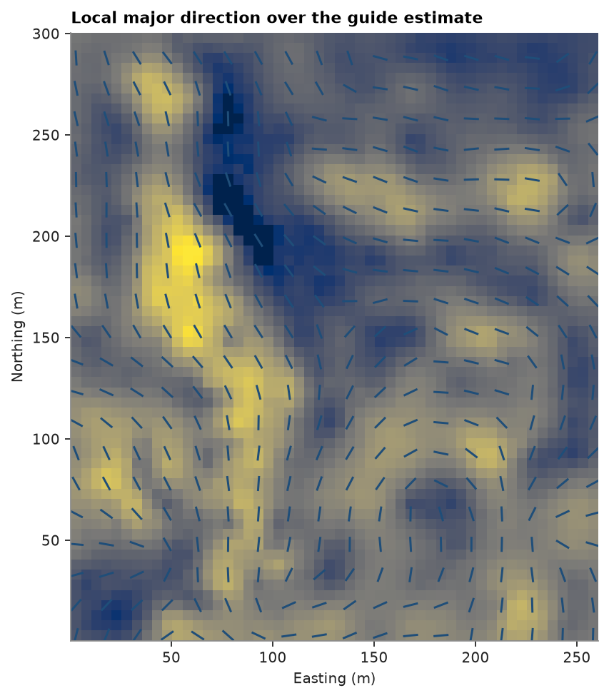
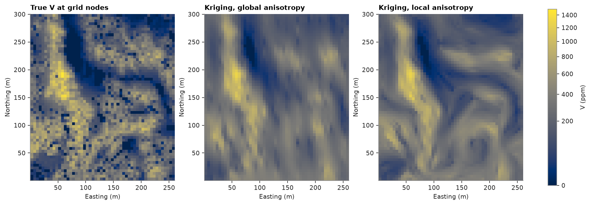
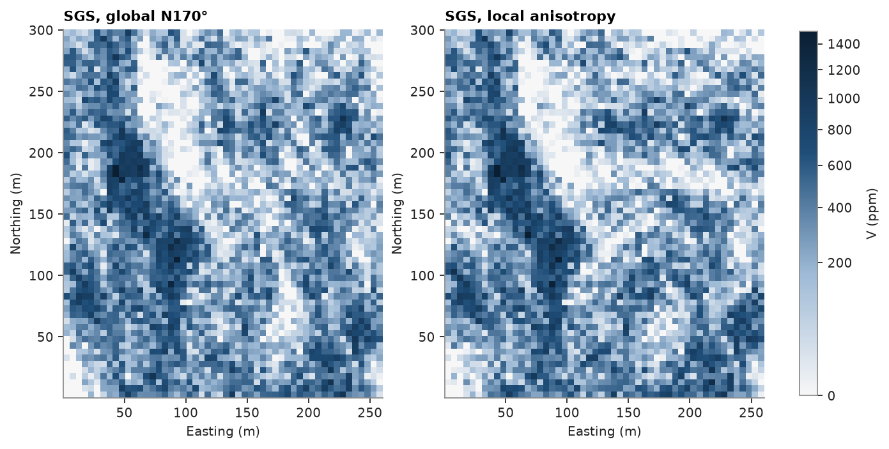

# 11. Locally varying anisotropy

Walker Lake's high-`V` bodies bend: one global direction (N170° in [chapter 3](../03-variography/README.md)) fits
some of them and crosses others. Locally varying anisotropy (LVA) gives every location its own orientation, used for
both the variogram and the search. The orientation field can come from a gridded attribute (`from_grid`, used here),
a point cloud (`from_points`) or a wireframe (`from_mesh`).

<details><summary>Python</summary>

```python
import ceres as cs
import matplotlib.pyplot as plt
import numpy as np
from common import ACCENT, fetch, map_axes, save
from matplotlib.colors import PowerNorm

samples = cs.PointSet.from_table(cs.read_csv(fetch("walker-lake/sample.csv")))
truth = cs.read_csv(fetch("walker-lake/exhaustive.csv"))["V"].reshape(300, 260)
xy, v = samples.coords, samples["V"]
model = cs.Variogram.from_json((HERE.parent / "03-variography" / "model.json").read_text())
grid = cs.BlockModel(origin=(0.5, 0.5), size=(5, 5), count=(52, 60))
nodes = grid.centroids.astype(int)
true_at_nodes = truth[nodes[:, 1] - 1, nodes[:, 0] - 1]
```

</details>

A quick isotropic estimate outlines the bodies; the gradient of that map gives the orientation of least change.
The structure tensor sums gradients over 3 cells each side, and smoothing averages orientations within 25 m.

<details><summary>Python</summary>

```python
isotropic = cs.Variogram([("spherical", model.sill - model.nugget, 30.0)], nugget=model.nugget)
guide = cs.OrdinaryKriging(isotropic, cs.Search(radius=60, max_samples=16)).fit(xy, v).predict(grid)
lva = cs.LocalAnisotropy.from_grid(
    grid.with_column("guide", guide), "guide", window=3, ratios=(0.3, 1.0)
).smooth(25.0)
print(lva)
print("azimuth percentiles (10, 50, 90):", np.percentile(lva.angles[:, 0] % 180, [10, 50, 90]).round())
```

</details>

```text
LocalAnisotropy(3120 locations)
azimuth percentiles (10, 50, 90): [ 13. 109. 171.]
```

<details><summary>Python</summary>

```python
shape = (60, 52)
extent = (0.5, 260.5, 0.5, 300.5)
fig, ax = plt.subplots(figsize=(6.4, 6), layout="constrained")
ax.imshow(
    guide.reshape(shape), origin="lower", extent=extent, cmap="Greys", norm=PowerNorm(0.5, vmin=0, vmax=1200)
)
every = (nodes[:, 0] % 15 == 3) & (nodes[:, 1] % 15 == 3)
azimuth = np.radians(lva.angles[every, 0])
ax.quiver(
    *grid.centroids[every, :2].T,
    np.sin(azimuth),
    np.cos(azimuth),
    pivot="middle",
    headwidth=0,
    headlength=0,
    headaxislength=0,
    scale=35,
    width=0.004,
    color=ACCENT,
)
map_axes(ax, "Local major direction over the guide estimate")
save(fig, "field")
```

</details>



Same model, same search; only the orientation changes. Errors are against the exhaustive values at the nodes.

<details><summary>Python</summary>

```python
search = cs.Search(radius=100, max_samples=24, min_samples=4)
ok = cs.OrdinaryKriging(model, search).fit(xy, v)
global_estimate = ok.predict(grid)
local_estimate = ok.predict(grid, anisotropy=lva)
for name, estimate in (("global N170°", global_estimate), ("local", local_estimate)):
    error = estimate - true_at_nodes
    print(
        f"{name:>13}: RMSE {np.sqrt(np.mean(error**2)):.1f} ppm, correlation {np.corrcoef(estimate, true_at_nodes)[0, 1]:.3f}"
    )
```

</details>

```text
 global N170°: RMSE 160.1 ppm, correlation 0.771
        local: RMSE 148.8 ppm, correlation 0.804
```

<details><summary>Python</summary>

```python
norm = PowerNorm(0.5, vmin=0, vmax=1500)
fig, axes = plt.subplots(1, 3, figsize=(12, 4.6), layout="constrained")
for ax, image, title in (
    (axes[0], true_at_nodes, "True V at grid nodes"),
    (axes[1], global_estimate, "Kriging, global anisotropy"),
    (axes[2], local_estimate, "Kriging, local anisotropy"),
):
    im = ax.imshow(image.reshape(shape), origin="lower", extent=extent, norm=norm)
    map_axes(ax, title)
fig.colorbar(im, ax=axes, shrink=0.8, label="V (ppm)")
save(fig, "kriging")
```

</details>



Local orientations lower the error and keep the north-eastern bodies elongated east-west, where the global
direction crosses them.

Simulation takes the same field: each node's variogram and search follow the local direction, so continuity bends
with the bodies instead of crossing them.

<details><summary>Python</summary>

```python
weights = cs.cell_declustering(xy, v, sizes=np.arange(2.5, 102.5, 2.5)).weights
gaussian = cs.Variogram([("spherical", 0.68, 82.0)], nugget=0.32)
sgs = cs.SGS(gaussian, cs.Search(radius=100, max_samples=24)).fit(xy, v, weights=weights)
uniform = cs.LocalAnisotropy(np.zeros((1, 3)), [[170.0, 0, 0]], [[0.43, 1.0]])
global_real = sgs.simulate(grid, n=1, seed=11, realizations=True, anisotropy=uniform).realizations[0]
local_real = sgs.simulate(grid, n=1, seed=11, realizations=True, anisotropy=lva).realizations[0]

fig, axes = plt.subplots(1, 2, figsize=(8.6, 4.6), layout="constrained")
for ax, image, title in (
    (axes[0], global_real, "SGS, global N170°"),
    (axes[1], local_real, "SGS, local anisotropy"),
):
    im = ax.imshow(image.reshape(shape), origin="lower", extent=extent, norm=norm)
    map_axes(ax, title)
fig.colorbar(im, ax=axes, shrink=0.8, label="V (ppm)")
save(fig, "simulation")
```

</details>



Full script: [`example.py`](example.py)
