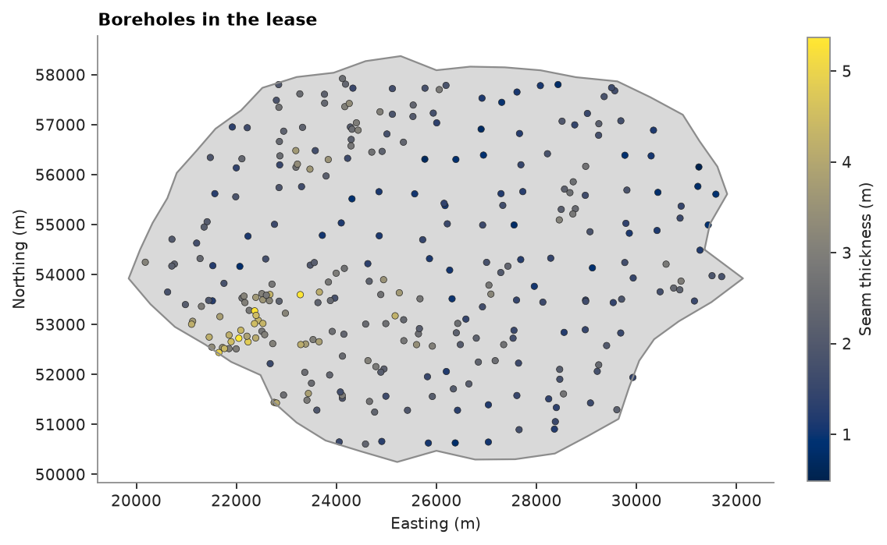
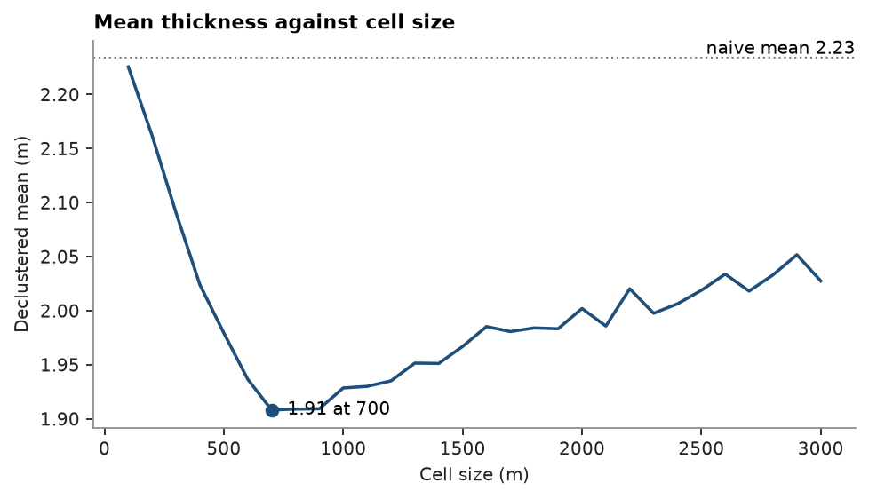
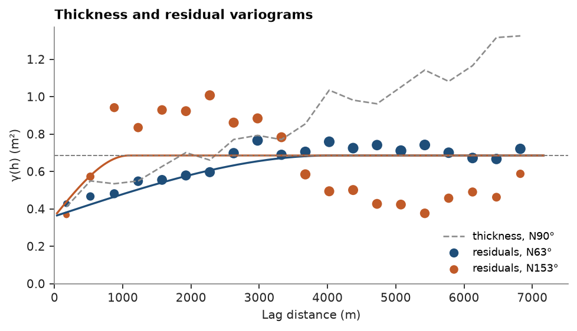
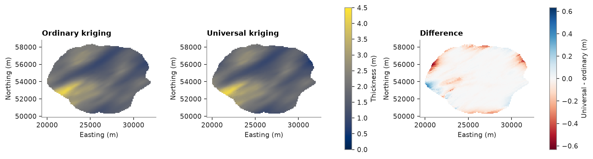
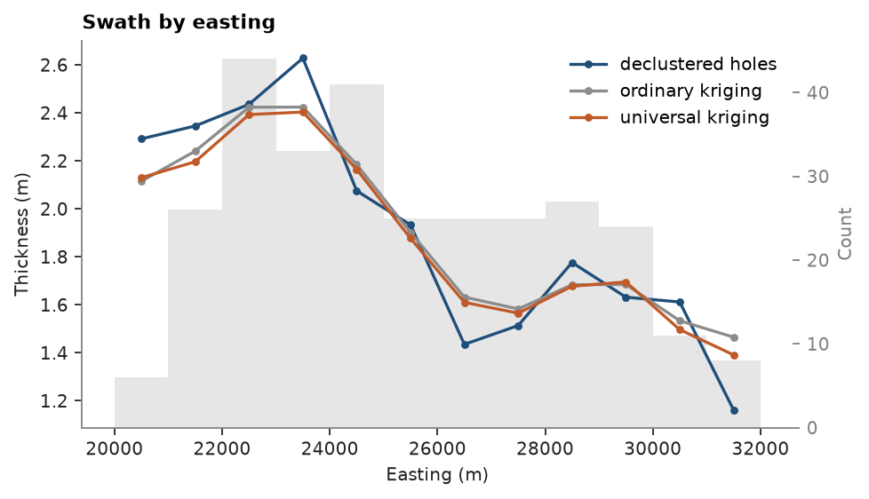
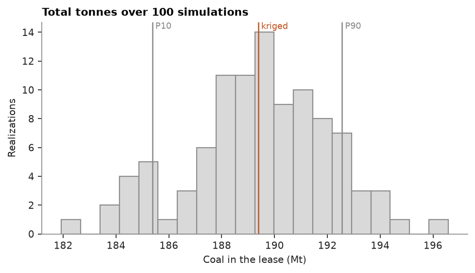
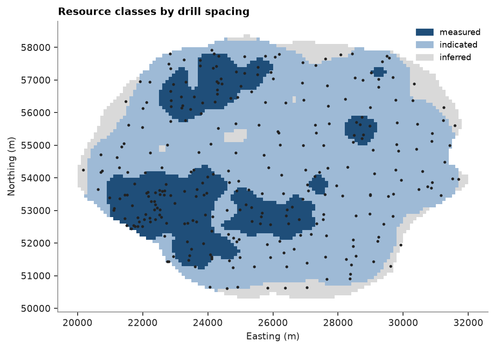

# A coal seam in a lease

How many tonnes of coal lie in a lease, and how sure is that number? 295 boreholes measure the seam thickness: a
regional grid of about 700 m, plus infill drilled where the seam is thick. You go from the lease polygon to tonnes
by resource class on a 100 m grid.

<details><summary>Python</summary>

```python
import boitata as bt
import matplotlib.pyplot as plt
import numpy as np
from common import ACCENT, GRAY, HIGHLIGHT, INK, LIGHT, map_axes, save
```

</details>

## The lease and its grid

The dataset brings the boreholes, the lease boundary and a 100 m grid flagged `INSIDE` the lease. The flag agrees
with testing each cell center against the polygon, so the lease is the masked grid.

<details><summary>Python</summary>

```python
data = bt.datasets.coal_seam_thickness()
holes, grid = data["boreholes"], data["grid"]
lease = data["boundary"].parts[0][:, :2]
xy, thickness = holes.coords[:, :2], holes["THICKNESS_M"]
inside = bt.point_in_polygon(grid.centroids[:, :2], lease)
print(f"{np.mean(inside == (grid['INSIDE'] == 1)):.1%} of cells agree with INSIDE")
cells = grid.mask(inside)
area = len(cells) * 100 * 100
print(
    f"{len(cells)} cells inside, {area / 1e6:.1f} km²; {bt.point_in_polygon(xy, lease).sum()} of {len(xy)} holes"
)

fig, ax = plt.subplots(figsize=(7, 4.6), layout="constrained")
ax.fill(*lease.T, color=LIGHT, lw=0)
ax.plot(*np.vstack([lease, lease[:1]]).T, color=GRAY, lw=1)
points = ax.scatter(*xy.T, c=thickness, s=14, edgecolors=INK, linewidths=0.3)
fig.colorbar(points, ax=ax, shrink=0.8, label="Seam thickness (m)")
map_axes(ax, "Boreholes in the lease")
save(fig, "lease")
```

</details>

```text
100.0% of cells agree with INSIDE
7162 cells inside, 71.6 km²; 295 of 295 holes
```



## Declustering

The infill sits where the seam is thick, so the plain mean overstates it. Cell declustering weights each hole by
the inverse of the number of holes in its cell, and keeps the cell size that gives the lowest mean, averaged over
25 grid origins.

<details><summary>Python</summary>

```python
declustering = bt.cell_declustering(xy, thickness, sizes=np.arange(100, 3100, 100))
weights = declustering.weights
size = declustering.cell_size
print(f"naive mean {thickness.mean():.2f} m, declustered {declustering.mean:.2f} m with {size:.0f} m cells")
print(f"curve at {size:.0f} m: {declustering.means[declustering.sizes == size][0]:.2f} m")

fig, ax = plt.subplots(figsize=(6, 3.4), layout="constrained")
bt.plot.declustering(declustering, naive=thickness.mean(), ax=ax, color=ACCENT, lw=1.6)
ax.set(xlabel="Cell size (m)", ylabel="Declustered mean (m)", title="Mean thickness against cell size")
save(fig, "declustering")
```

</details>

```text
naive mean 2.23 m, declustered 1.91 m with 700 m cells
curve at 700 m: 1.91 m
```



The minimum falls at 700 m, the spacing of the regional grid: one regional hole per cell, the infill sharing its
cell's weight. The weights are averaged over the same 25 origins, so their mean is the curve's minimum, 1.91 m:
the infill inflates the plain mean by about 0.3 m.

## An anisotropic variogram

Thickness falls to the east. The variogram along the fall keeps climbing past the sill, and the trend causes part
of that climb. The residuals from a plane fitted to the thickness level off; you fit one anisotropic model to them
in eight directions at once.

<details><summary>Python</summary>

```python
trend, residuals = bt.detrend(xy, thickness, degree=1)
print(
    f"trend: {trend.coefficients[1] * 1000:+.2f} m per km east, {trend.coefficients[2] * 1000:+.2f} m per km north"
)
azimuths = np.arange(0, 180, 22.5)
lag, max_lag = 350.0, 7000.0
directional = [bt.experimental_variogram(xy, residuals, lag, max_lag, azimuth=a) for a in azimuths]
model = bt.Variogram.fit_directional(directional, [(a, 0) for a in azimuths], "spherical")
azimuth, ratio = model.rotation[0], model.ratios[0]
print(model)

fig, ax = plt.subplots(figsize=(6, 3.4), layout="constrained")
raw = bt.experimental_variogram(xy, thickness, lag, max_lag, azimuth=90)
ax.plot(raw.lags, raw.gammas, "--", color=GRAY, lw=1.2, label="thickness, N90°")
for a, color in ((azimuth, ACCENT), (azimuth + 90, HIGHLIGHT)):
    experimental = bt.experimental_variogram(xy, residuals, lag, max_lag, azimuth=a)
    bt.plot.variogram(
        experimental,
        variogram=model,
        direction=(a, 0),
        ax=ax,
        color=color,
        label=f"residuals, N{a % 180:.0f}°",
    )
ax.set(xlabel="Lag distance (m)", ylabel="γ(h) (m²)", title="Thickness and residual variograms")
ax.set_ylim(bottom=0)
ax.legend(loc="lower right", fontsize=8)
save(fig, "variogram")
```

</details>

```text
trend: -0.16 m per km east, -0.10 m per km north
Variogram(nugget=0.36028891520809164, structures=[Structure("spherical", sill=0.3250410112495912, range=4038.395920926705)], rotation=(63.29552111528892, 0.0, 0.0), ratios=(0.2695603732169465, 1.0))
```



Half the residual variance is nugget. The rest is continuous over 4 km towards N63° and a quarter of that across,
where the residuals rise above the sill and fall back below it: bands of thick and thin coal elongated N63°.

## Ordinary or universal kriging

Ordinary kriging assumes a constant local mean; universal kriging fits the eastward plane within each
neighborhood. Both use the residual variogram and a search elongated like it.

<details><summary>Python</summary>

```python
search = bt.Search(radius=5000, rotation=(azimuth, 0, 0), ratios=(ratio, 1), max_samples=24, min_samples=4)
estimators = {
    "ordinary": bt.OrdinaryKriging(model, search),
    "universal": bt.UniversalKriging(model, search, degree=1),
}
estimates = {}
for name, estimator in estimators.items():
    estimator.fit(xy, thickness)
    estimates[name] = estimator.predict(cells)
    check = estimator.cross_validate()
    print(
        f"{name:>9}: mean {estimates[name].mean():.2f} m; leave-one-out RMSE {check.rmse:.3f} m, "
        f"slope {check.slope:.2f}"
    )
difference = estimates["universal"] - estimates["ordinary"]
print(f"universal - ordinary: {difference.min():+.2f} to {difference.max():+.2f} m")

cells = cells.with_columns({**estimates, "difference": difference})
fig, axes = plt.subplots(1, 3, figsize=(11, 3.4), layout="constrained")
for ax, name in zip(axes[:2], estimates, strict=True):
    bt.plot.section(cells, name, ax=ax, colorbar=False, vmin=0, vmax=4.5)
    map_axes(ax, f"{name.capitalize()} kriging")
fig.colorbar(axes[0].collections[0], ax=axes[:2], shrink=0.8, label="Thickness (m)")
limit = np.abs(difference).max()
bt.plot.section(cells, "difference", ax=axes[2], colorbar=False, cmap="RdBu", vmin=-limit, vmax=limit)
fig.colorbar(axes[2].collections[0], ax=axes[2], shrink=0.8, label="Universal - ordinary (m)")
map_axes(axes[2], "Difference")
save(fig, "kriging")
```

</details>

```text
 ordinary: mean 1.91 m; leave-one-out RMSE 0.603 m, slope 1.02
universal: mean 1.89 m; leave-one-out RMSE 0.609 m, slope 1.00
universal - ordinary: -0.63 to +0.44 m
```



Inside the drilling the two agree, and cross-validate alike: every neighborhood surrounds its cell. They part at
the edges of the lease, where the neighborhood lies on one side of the cell; there ordinary kriging pulls towards
the local mean, universal kriging carries the plane on. A swath by easting follows both against the declustered
holes.

<details><summary>Python</summary>

```python
samples = bt.PointSet(xy, {"thickness": thickness, "weight": weights})
swaths = [
    bt.swath(samples, "thickness", 1000.0, axis="x", weights="weight"),
    bt.swath(cells, "ordinary", 1000.0, axis="x"),
    bt.swath(cells, "universal", 1000.0, axis="x"),
]
labels = ["declustered holes", "ordinary kriging", "universal kriging"]
print(
    "easternmost km: " + ", ".join(f"{n} {s['mean'][-1]:.2f} m" for n, s in zip(labels, swaths, strict=True))
)
fig, ax = plt.subplots(figsize=(6, 3.4), layout="constrained")
bt.plot.swath(swaths, labels=labels, ax=ax)
ax.set(xlabel="Easting (m)", ylabel="Thickness (m)", title="Swath by easting")
save(fig, "swath")
```

</details>

```text
easternmost km: declustered holes 1.16 m, ordinary kriging 1.47 m, universal kriging 1.39 m
```



Both smooth the holes, as kriging does. In the easternmost kilometer, where the holes average 1.16 m, universal
kriging gives 1.39 m and ordinary kriging 1.47 m: the plane carries the thinning into the edge cells. Keep
universal kriging for the tonnes.

## Volume and tonnes

Each cell holds its kriged thickness over 100 × 100 m. The dataset has no density, so assume 1.4 t/m³ in situ,
typical of bituminous coal.

<details><summary>Python</summary>

```python
density = 1.4
for name, estimate in estimates.items():
    volume = estimate.sum() * 100 * 100
    print(f"{name:>9}: {volume / 1e6:.1f} Mm³, {volume * density / 1e6:.1f} Mt")
cell_tonnes = estimates["universal"] * 100 * 100 * density
kriged = cell_tonnes.sum()
```

</details>

```text
 ordinary: 136.7 Mm³, 191.4 Mt
universal: 135.3 Mm³, 189.4 Mt
```

## How sure is the total?

One kriged map gives one number. Sequential Gaussian simulation gives a hundred equally likely maps; the total of
each is a possible tonnage. The eastward plane steers it as it steered universal kriging: thickness is
normal-scored, with the declustering weights, within ten classes of the plane, and every node is back-transformed
within the class of the plane at that node. The variogram of those scores is fitted as before and rescaled to a
unit sill.

<details><summary>Python</summary>

```python
plane = trend.predict(xy)
pair = np.column_stack([plane, thickness])
scores = bt.StepwiseConditional().fit(pair, weights=weights).transform(pair)[:, 1]
directional = [bt.experimental_variogram(xy, scores, lag, max_lag, azimuth=a) for a in azimuths]
fitted = bt.Variogram.fit_directional(directional, [(a, 0) for a in azimuths], "spherical")
sill = fitted.sill
gaussian = bt.Variogram(
    [("spherical", fitted.structures[0].sill / sill, fitted.structures[0].range)],
    nugget=fitted.nugget / sill,
    rotation=fitted.rotation,
    ratios=fitted.ratios,
)
print(gaussian)
sgs = bt.SGS(gaussian, search).fit(xy, thickness, weights=weights, trend=plane)
summary = sgs.simulate(cells, n=100, seed=7, trend=trend.predict(cells.centroids))
tonnes = summary.realization_mean * area * density
p10, p50, p90 = np.quantile(tonnes, [0.1, 0.5, 0.9])
print(
    f"total: P10 {p10 / 1e6:.1f} Mt, P50 {p50 / 1e6:.1f} Mt, P90 {p90 / 1e6:.1f} Mt; kriged {kriged / 1e6:.1f} Mt"
)
print(f"P10-P90 spread ±{(p90 - p10) / 2 / p50:.1%} of P50")

fig, ax = plt.subplots(figsize=(6, 3.4), layout="constrained")
ax.hist(tonnes / 1e6, bins=20, color=LIGHT, edgecolor=GRAY)
for value, label, color in ((p10, "P10", GRAY), (p90, "P90", GRAY), (kriged, "kriged", HIGHLIGHT)):
    ax.axvline(value / 1e6, color=color, lw=1.2)
    ax.text(value / 1e6, ax.get_ylim()[1], f" {label}", color=color, va="top", fontsize=8)
ax.set(xlabel="Coal in the lease (Mt)", ylabel="Realizations", title="Total tonnes over 100 simulations")
save(fig, "tonnes")
```

</details>

```text
Variogram(nugget=0.3254728460107622, structures=[Structure("spherical", sill=0.6745271539892377, range=3908.4989240025343)], rotation=(60.7549914680867, 0.0, 0.0), ratios=(0.30591074358169207, 1.0))
total: P10 185.4 Mt, P50 189.4 Mt, P90 192.6 Mt; kriged 189.4 Mt
P10-P90 spread ±1.9% of P50
```



From P10 to P90 the simulated totals span 185.4 to 192.6 Mt, ±1.9 % around 189.4 Mt, and the kriged 189.4 Mt
lies within. With a hole every 700 m or closer, errors in single cells cancel over the 7162 cells of the lease.
The assumed density weighs more: 0.1 t/m³ either way moves the total more than the whole P10–P90 range.

## Classification by data spacing

The equivalent spacing of a cell is the spacing of a square grid of holes that would put as much drilling around
it; on a square grid of spacing s it reads about s. Cells at 450 m or less, the infill, are measured; at 700 m or
less, the regional grid, indicated; the rest inferred. A 3 × 3 majority filter removes isolated cells.

<details><summary>Python</summary>

```python
spacing = bt.data_spacing(cells, xy, None)
rules = [("measured", {"spacing": ("<=", 450)}), ("indicated", {"spacing": ("<=", 700)})]
classes = bt.classify({"spacing": spacing}, rules, default="inferred")
classes = bt.smooth_classes(cells, classes, window=(3, 3, 1))
names = ["measured", "indicated", "inferred"]
for name in names:
    kept = classes == name
    print(
        f"{name:>9}: {kept.mean():5.1%} of the lease, {cell_tonnes[kept].sum() / 1e6:5.1f} Mt, "
        f"mean {estimates['universal'][kept].mean():.2f} m"
    )

scheme = bt.Categories(names, colors=[ACCENT, "#9ebad6", LIGHT])
cells = cells.with_column("class", scheme.encode(classes))
fig, ax = plt.subplots(figsize=(7, 4.6), layout="constrained")
bt.plot.section(cells, "class", ax=ax, colorbar=False, scheme=scheme)
ax.scatter(*xy.T, s=3, color=INK)
bt.plot.category_legend(scheme, ax, loc="upper right", fontsize=8)
map_axes(ax, "Resource classes by drill spacing")
save(fig, "classes")
```

</details>

```text
 measured: 21.9% of the lease,  57.4 Mt, mean 2.62 m
indicated: 68.9% of the lease, 118.9 Mt, mean 1.72 m
 inferred:  9.2% of the lease,  13.0 Mt, mean 1.41 m
```



Measured cells, a fifth of the lease, sit on the infill where the seam is thickest, 2.62 m on average, and hold
57.4 Mt. Indicated cells cover the regional grid, 118.9 Mt; inferred ones, 13.0 Mt, lie at the edges of the lease
beyond the last holes, and where the regional grid has gaps. Spacing ignores the variogram; [classification](../../10-checking-models/05-classification/README.md) classifies
from the kriging itself.

Full script: [`example_12_01.py`](example_12_01.py)
