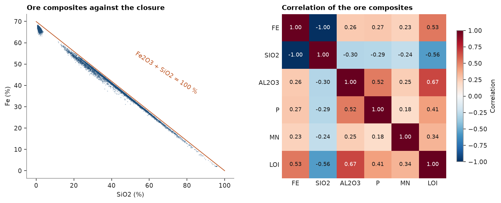
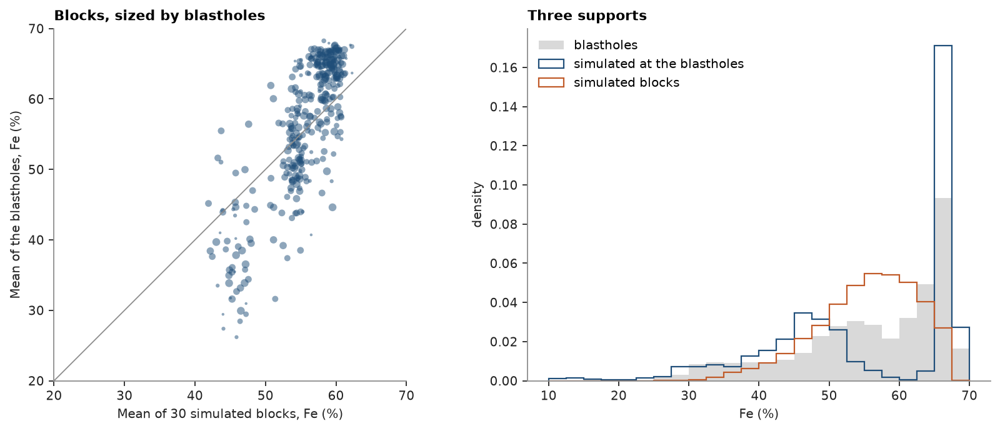
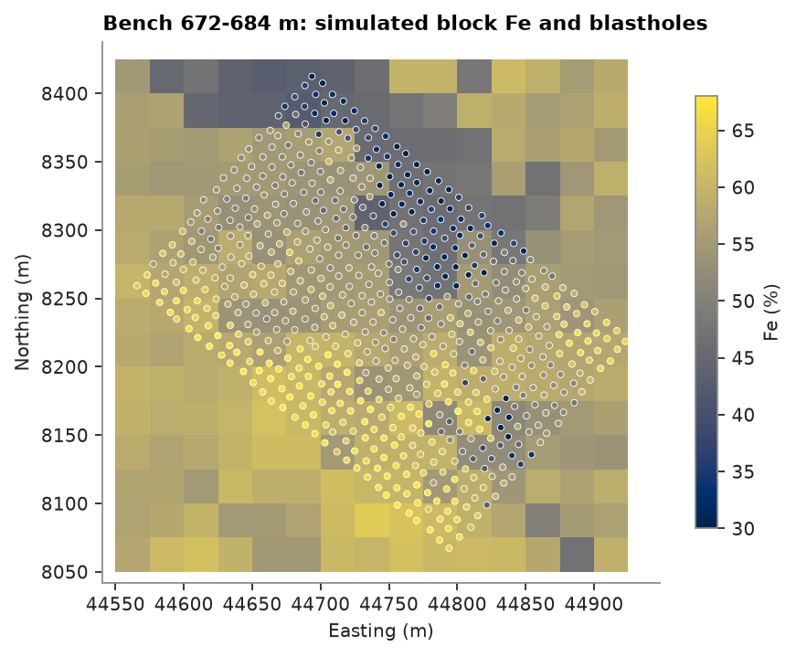

# Iron ore: several grades, one closure, reconciled

An iron formation plateau: 187 diamond holes assayed for Fe, SiO2, Al2O3, P, Mn and loss on ignition, a block model
of 25 × 25 × 12 m coded by lithology, and grade-control blastholes over three 12 m benches. The grades cannot vary
on their own: as oxides they fill almost the whole sample, so more iron means less silica. You simulate the six
grades together through log-ratios, so every simulated block still adds up, and check the result against the
blastholes.

<details><summary>Python</summary>

```python
import boitata as bt
import matplotlib.pyplot as plt
import numpy as np
from common import ACCENT, GRAY, HIGHLIGHT, LIGHT, save
```

</details>

## Composites by lithology

Assays and logged lithology are merged and composited to 6 m within each lithology: half a bench, and the
lithology of a composite is never a mixture.

<details><summary>Python</summary>

```python
data = bt.datasets.iron_formation_plateau()
grades = ["FE_PCT", "SIO2_PCT", "AL2O3_PCT", "P_PCT", "MN_PCT", "LOI_PCT"]
intervals = bt.merge_intervals(data["assays"], data["lithology"])
holes = bt.Drillholes(data["collars"], data["surveys"], intervals)
composites = holes.composite(6.0, grades, domain="LITH", residual="merge")
lith = composites["LITH"]
values = np.column_stack([composites[g] for g in grades])
print(f"{len(composites)} composites; mean grade (%) by lithology")
print(f"{'':5}{'n':>6}" + "".join(f"{g.removesuffix('_PCT'):>8}" for g in grades))
for code in ["CG", "HF", "HC", "IF", "IC", "LAT", "MAF"]:
    inside = lith == code
    print(f"{code:5}{inside.sum():6}" + "".join(f"{v:8.3f}" for v in values[inside].mean(axis=0)))
```

</details>

```text
11764 composites; mean grade (%) by lithology
          n      FE    SIO2   AL2O3       P      MN     LOI
CG      199  58.554   3.030   5.357   0.152   0.321   6.115
HF     1696  66.542   1.471   1.037   0.052   0.302   1.542
HC     2709  66.631   1.506   0.794   0.038   0.099   1.005
IF     1083  49.230  26.203   1.214   0.040   0.201   1.542
IC     4996  37.537  44.831   0.498   0.029   0.099   0.502
LAT      44  32.810  19.592  17.286   0.081   0.170  10.721
MAF    1037  12.253  45.448  14.117   0.045   0.158   2.909
```

Friable (`HF`) and compact (`HC`) hematite hold 66 % Fe; friable (`IF`) and compact (`IC`) itabirite are banded
hematite and quartz; canga (`CG`), laterite (`LAT`) and the mafic dykes (`MAF`) are waste or cover.

## One closure

Iron is assayed as the element but sits in the rock as hematite, Fe2O3; P and Mn likewise as P2O5 and MnO. Written
as oxides, the six assays nearly fill the sample. The small remainder, other oxides and analytical error, is kept
as a seventh part, so each composite is a composition summing to exactly 100 %.

<details><summary>Python</summary>

```python
oxide = np.array([1.4297, 1.0, 1.0, 2.2914, 1.2912, 1.0])
parts = values * oxide
total = parts.sum(axis=1)
parts = np.column_stack([parts, 100 - total])
names = ["Fe2O3", "SiO2", "Al2O3", "P2O5", "MnO", "LOI", "rest"]
for code in ["HF", "HC", "IF", "IC", "MAF"]:
    p1, p50, p99 = np.percentile(total[lith == code], [1, 50, 99])
    print(f"{code:4} oxides total P1 {p1:5.1f}, P50 {p50:5.1f}, P99 {p99:5.1f} %")
assert (parts > 0).all(), "log-ratios need positive parts"
ore = np.isin(lith, ["HF", "HC", "IF", "IC"])
r = bt.correlation(values[ore])
print(
    f"ore composites: r(Fe, SiO2) = {r[0, 1]:.2f}, r(Fe, LOI) = {r[0, 5]:.2f}, r(Al2O3, LOI) = {r[2, 5]:.2f}"
)

fig, (a, b) = plt.subplots(1, 2, figsize=(10, 4), layout="constrained")
a.scatter(values[ore, 1], values[ore, 0], s=2, color=ACCENT, alpha=0.3, linewidths=0)
si = np.linspace(0, 100, 2)
a.plot(si, (100 - si) / 1.4297, color=HIGHLIGHT, lw=1)
a.text(52, 36, "Fe2O3 + SiO2 = 100 %", color=HIGHLIGHT, rotation=-33)
a.set(xlabel="SiO2 (%)", ylabel="Fe (%)", title="Ore composites against the closure")
bt.plot.correlation(values[ore], labels=[g.removesuffix("_PCT") for g in grades], ax=b)
b.set_title("Correlation of the ore composites")
save(fig, "closure")
```

</details>

```text
HF   oxides total P1  99.6, P50  99.7, P99  99.8 %
HC   oxides total P1  98.2, P50  98.8, P99  99.2 %
IF   oxides total P1  99.5, P50  99.7, P99  99.8 %
IC   oxides total P1  99.5, P50  99.7, P99  99.8 %
MAF  oxides total P1  72.8, P50  80.5, P99  86.8 %
ore composites: r(Fe, SiO2) = -1.00, r(Fe, LOI) = 0.53, r(Al2O3, LOI) = 0.67
```



In ore the oxides total 98.8 to 99.7 % at the median; only the mafic dykes, with unassayed oxides, fall well short.
Iron and silica sit on the closure line, one the mirror of the other (r −1.00); LOI goes with Al2O3, the clays of
weathering. Kriging or simulating each grade on its own would honor neither that line nor the total: nothing stops
a block from summing past 100 %.

## Ore domains of the model

The blastholes cover three benches, 660 to 696 m, in the south-west of the plateau. The blocks of those benches
over the blasthole area are simulated, in three ore domains of the block model: hematite (`HF`, `HC` and the few
`CG` blocks), friable itabirite `IF` and compact itabirite `IC`. Simulating all 129 278 blocks would take far longer
than a gallery page should; nothing below depends on the window.

<details><summary>Python</summary>

```python
model = data["block_model"]
blastholes = data["blastholes"]
lo, hi = np.array(blastholes.bounds)
c = model.coords
window = np.all((c > lo - (12.5, 12.5, 6)) & (c < hi + (12.5, 12.5, 6)), axis=1)
blocks = model.filter(window)
domains = {"hematite": ["HF", "HC", "CG"], "friable itabirite": ["IF"], "compact itabirite": ["IC"]}
block_lith = blocks["LITH"]
block_domain = np.full(len(blocks), "", dtype=object)
for name, codes in domains.items():
    block_domain[np.isin(block_lith, codes)] = name
print(f"{len(blocks)} blocks: " + ", ".join(f"{n} {np.sum(block_domain == n)}" for n in domains))
```

</details>

```text
675 blocks: hematite 372, friable itabirite 190, compact itabirite 113
```

The block model carries the lithology at each block center, and at 25 m it often disagrees with the logging: a
6 m composite of logged hematite may sit in an itabirite block. Each composite therefore takes the domain of the
block it falls in, so each domain carries the mixture its blocks will be mined as. Only those within 100 m of
the blasthole area and 30 m of the benches inform the simulation: the plateau is weathered from the top, and deeper
ore of the same code is leaner.

<details><summary>Python</summary>

```python
model_lith = model.sample(composites.coords, "LITH")
buffer = (100, 100, 30)
near = np.all((composites.coords > lo - buffer) & (composites.coords < hi + buffer), axis=1)
for name, codes in domains.items():
    inside = np.isin(model_lith, codes)
    logged = np.isin(lith[inside], codes).mean()
    print(f"{name}: {inside.sum()} composites in its blocks, {logged:.0%} logged as such")
```

</details>

```text
hematite: 3898 composites in its blocks, 59% logged as such
friable itabirite: 768 composites in its blocks, 50% logged as such
compact itabirite: 5584 composites in its blocks, 68% logged as such
```

## Log-ratios, PPMT and simulation

The isometric log-ratio (ilr) maps each 7-part composition to 6 unconstrained coordinates, and any 6 coordinates
back to a composition summing to 100 %. PPMT turns the coordinates into independent Gaussian factors ([compositional data](../../04-transforms/04-compositional/README.md) and
[multivariate transforms](../../04-transforms/05-multivariate-transforms/README.md)), each simulated on its own by turning bands with the omnidirectional variogram of its scores. Per domain,
`MultivariateSimulation` simulates 30 realizations on 12.5 × 12.5 × 6 m nodes, eight per block, and at every
blasthole. The factors come back as ilr coordinates, turned into oxides at the nodes; blocks average their nodes
only after that, since the log-ratio is not linear.

<details><summary>Python</summary>

```python
n = 30
nodes = blocks.discretize(2)
node_block = blocks.row_at(nodes.coords)
bh_block = blocks.row_at(blastholes.coords)
at_blocks = np.full((n, len(blocks), 7), np.nan)
at_blastholes = np.full((n, len(blastholes), 7), np.nan)
for name, codes in domains.items():
    use = near & np.isin(model_lith, codes)
    xyz, coords = composites.coords[use], bt.ilr(bt.closure(parts[use]))
    ppmt = bt.PPMT(seed=7)
    scores = ppmt.fit_transform(coords)
    variograms = [bt.experimental_variogram(xyz, s, 25.0, 300.0).fit("spherical") for s in scores.T]
    search = bt.Search(radius=300, max_samples=16)
    simulation = bt.MultivariateSimulation(ppmt, [bt.TurningBands(v, search=search) for v in variograms]).fit(
        xyz, coords
    )
    in_domain = block_domain[node_block] == name
    bh_in = block_domain[bh_block] == name
    targets = np.vstack([nodes.coords[in_domain], blastholes.coords[bh_in]])
    factors = simulation.simulate(targets, n=n, seed=1, keep=True)
    ilr = np.stack([f.realizations for f in factors], axis=-1)
    oxides = 100 * bt.ilr_inverse(ilr.reshape(-1, 6)).reshape(n, len(targets), 7)
    split = in_domain.sum()
    at_blastholes[:, bh_in] = oxides[:, split:]
    for k in range(7):
        sums = np.stack([np.bincount(node_block[in_domain], o, len(blocks)) for o in oxides[:, :split, k]])
        at_blocks[:, block_domain == name, k] = sums[:, block_domain == name] / 8
    print(f"{name}: {use.sum()} composites, {split} nodes, {bh_in.sum()} blastholes")
```

</details>

```text
hematite: 251 composites, 2976 nodes, 1037 blastholes
friable itabirite: 156 composites, 1520 nodes, 584 blastholes
compact itabirite: 121 composites, 904 nodes, 332 blastholes
```

## Do the blocks still close?

Every node is a composition, and an average of compositions is one too: each simulated block sums to 100 %
within rounding, with no part negative. For contrast, Fe and SiO2 of the hematite domain are simulated each on its
own, with the same search and their own seeds.

<details><summary>Python</summary>

```python
print(f"largest departure of a block total from 100 %: {np.abs(at_blocks.sum(axis=2) - 100).max():.1e}")
print(f"smallest simulated part: {at_blocks.min():.3f} %")
use = near & np.isin(model_lith, domains["hematite"])
alone = []
for seed, (g, factor) in enumerate((("FE_PCT", 1.4297), ("SIO2_PCT", 1.0)), start=2):
    ns = bt.NormalScore().fit_transform(composites[g][use])
    variogram = bt.experimental_variogram(composites.coords[use], ns, 25.0, 300.0).fit("spherical")
    bands = bt.TurningBands(variogram, search=search).fit(composites.coords[use], composites[g][use])
    alone.append(
        factor
        * bands.simulate(
            nodes.coords[block_domain[node_block] == "hematite"], n=n, seed=seed, keep=True
        ).realizations
    )
hematite = at_blocks[:, block_domain == "hematite"]
print(f"hematite nodes simulated apart: Fe2O3 + SiO2 above 100 % at {np.mean(alone[0] + alone[1] > 100):.0%}")
print(
    f"r(Fe, SiO2): composites {np.corrcoef(composites['FE_PCT'][use], composites['SIO2_PCT'][use])[0, 1]:.2f}, "
    f"hematite blocks {np.corrcoef(hematite[..., 0].ravel(), hematite[..., 1].ravel())[0, 1]:.2f}, "
    f"nodes simulated apart {np.corrcoef(alone[0].ravel(), alone[1].ravel())[0, 1]:.2f}"
)
```

</details>

```text
largest departure of a block total from 100 %: 5.7e-14
smallest simulated part: 0.023 %
hematite nodes simulated apart: Fe2O3 + SiO2 above 100 % at 28%
r(Fe, SiO2): composites -1.00, hematite blocks -0.99, nodes simulated apart 0.00
```

Simulated apart, over a quarter of the hematite nodes hold more Fe2O3 and SiO2 than a sample can, and the two grades
lose their correlation altogether. Through the log-ratios the blocks keep it, and every part stays positive.

## Reconciliation with the blastholes

The blastholes are drilled on a 10 m pattern, and each assays the cuttings of the whole bench: a column a few
decimeters across and 12 m high, with a larger analytical error than core. That support is between the 6 m
composites and a 25 × 25 × 12 m block, so blasthole grades vary less than composites and more than blocks. Means
can be compared directly; spreads only support for support. The simulation gives both: values at each blasthole,
at the support of the composites it was conditioned on, and block averages.

<details><summary>Python</summary>

```python
fe = at_blocks[..., 0] / 1.4297
silica = at_blocks[..., 1]
bh_fe, bh_si = blastholes["FE_PCT"], blastholes["SIO2_PCT"]
count = np.bincount(bh_block, minlength=len(blocks))
drilled = count > 0
bh_mean_fe = np.bincount(bh_block, bh_fe, len(blocks))[drilled] / count[drilled]
bh_mean_si = np.bincount(bh_block, bh_si, len(blocks))[drilled] / count[drilled]
print(f"{drilled.sum()} blocks hold blastholes, {np.median(count[drilled]):.0f} per block (median)")
in_window = blocks.contains(composites.coords)
window_domain = blocks.sample(composites.coords, block_domain)
print(
    f"{'':18}{'Fe blast':>9}{'Fe sim':>8}{'Fe drill':>9}{'SiO2 blast':>11}{'SiO2 sim':>9}{'SiO2 drill':>11}"
)
for name in domains:
    k = block_domain[bh_block] == name
    b = block_domain[drilled] == name
    j = window_domain == name
    print(
        f"{name:18}{bh_fe[k].mean():9.2f}{fe[:, drilled][:, b].mean():8.2f}{composites['FE_PCT'][j].mean():9.2f}"
        f"{bh_si[k].mean():11.2f}{silica[:, drilled][:, b].mean():9.2f}{composites['SIO2_PCT'][j].mean():11.2f}"
    )
print(f"{in_window.sum()} composites from {len(set(composites['HOLE_ID'][in_window]))} holes in the window")
point = at_blastholes[..., 0] / 1.4297
print(
    f"Fe variance: blastholes {bh_fe.var():.0f}, simulated at the blastholes {point.var(axis=1).mean():.0f}, "
    f"blasthole means per block {bh_mean_fe.var():.0f}, simulated blocks {fe[:, drilled].var(axis=1).mean():.0f}"
)
e_type = fe[:, drilled].mean(axis=0)
agreement = bt.compare(e_type, bh_mean_fe)
print(
    f"blasthole means per block against the mean of the simulations: r {agreement['correlation']:.2f}, "
    f"slope {agreement['slope']:.2f}"
)

fig, (a, b) = plt.subplots(1, 2, figsize=(10, 4.2), layout="constrained")
a.scatter(e_type, bh_mean_fe, s=4 * count[drilled], color=ACCENT, alpha=0.5, linewidths=0)
a.plot([20, 70], [20, 70], color=GRAY, lw=0.8)
a.set(
    xlabel="Mean of 30 simulated blocks, Fe (%)",
    ylabel="Mean of the blastholes, Fe (%)",
    title="Blocks, sized by blastholes",
    xlim=(20, 70),
    ylim=(20, 70),
    aspect="equal",
)
bins = np.arange(10, 71, 2.5)
b.hist(bh_fe, bins=bins, density=True, color=LIGHT, label="blastholes")
b.hist(
    point.ravel(), bins=bins, density=True, histtype="step", color=ACCENT, label="simulated at the blastholes"
)
b.hist(
    fe[:, drilled].ravel(),
    bins=bins,
    density=True,
    histtype="step",
    color=HIGHLIGHT,
    label="simulated blocks",
)
b.set(xlabel="Fe (%)", ylabel="density", title="Three supports")
b.legend(loc="upper left")
save(fig, "reconciliation")
```

</details>

```text
360 blocks hold blastholes, 6 per block (median)
                   Fe blast  Fe sim Fe drill SiO2 blast SiO2 sim SiO2 drill
hematite              62.59   58.82    60.56       6.76    12.57       9.66
friable itabirite     52.89   54.40    52.60      20.95    18.59      21.17
compact itabirite     41.33   46.49    48.32      38.90    31.22      29.10
115 composites from 12 holes in the window
Fe variance: blastholes 114, simulated at the blastholes 171, blasthole means per block 99, simulated blocks 51
blasthole means per block against the mean of the simulations: r 0.81, slope 1.70
```



Per domain the simulation sits near the drilling in the window, not the blastholes: 115 composites from 12 holes,
against 1953 blastholes. Hematite blocks come out 3.8 % Fe poorer than the blastholes say, compact itabirite blocks
5.2 % richer; friable itabirite is close. The spreads order as the supports do: 171 at 6 m points, 114 for the
12 m blastholes, 99 for the mean of about six blastholes per block, 51 for simulated blocks. The mean of six
blastholes still carries their analytical error and short-scale variation, so it varies more than the block
itself would.

Blocks rank well (r 0.81), but the blasthole means spread 1.70 times as far as the simulated means: with holes
100 m apart, the model cannot place the 25 m contrasts between hematite and itabirite that grade control sees. Grade
control drills blastholes to close that gap.

## A bench in plan

The middle bench, 672 to 684 m: the mean of the simulated block Fe, with the blastholes on the same color scale.
The low-grade itabirite band the blastholes trace to the north-east is in the model, wider and less sharp.

<details><summary>Python</summary>

```python
bench = int((678 - model.origin[2]) // model.size[2])
blocks = blocks.with_column("fe", fe.mean(axis=0))
on_bench = np.isclose(blastholes.z, 678)
norm = plt.Normalize(30, 68)
fig, ax = bt.plot.section(blocks, "fe", axis="z", index=bench, norm=norm, colorbar=False)
points = ax.scatter(
    *blastholes.coords[on_bench, :2].T,
    c=bh_fe[on_bench],
    norm=norm,
    s=10,
    edgecolors="white",
    linewidths=0.4,
    cmap="cividis",
)
fig.colorbar(points, ax=ax, shrink=0.8, label="Fe (%)")
ax.set(
    xlim=(lo[0] - 25, hi[0] + 25),
    ylim=(lo[1] - 25, hi[1] + 25),
    aspect="equal",
    xlabel="Easting (m)",
    ylabel="Northing (m)",
    title="Bench 672-684 m: simulated block Fe and blastholes",
)
save(fig, "bench")
```

</details>



Full script: [`example_12_03.py`](example_12_03.py)
