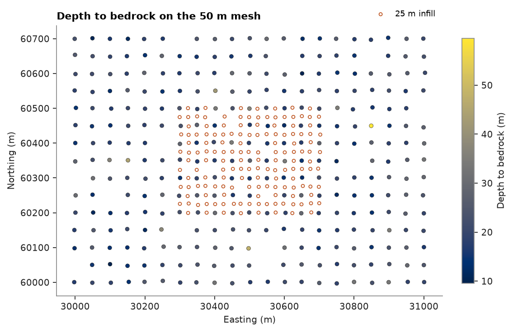
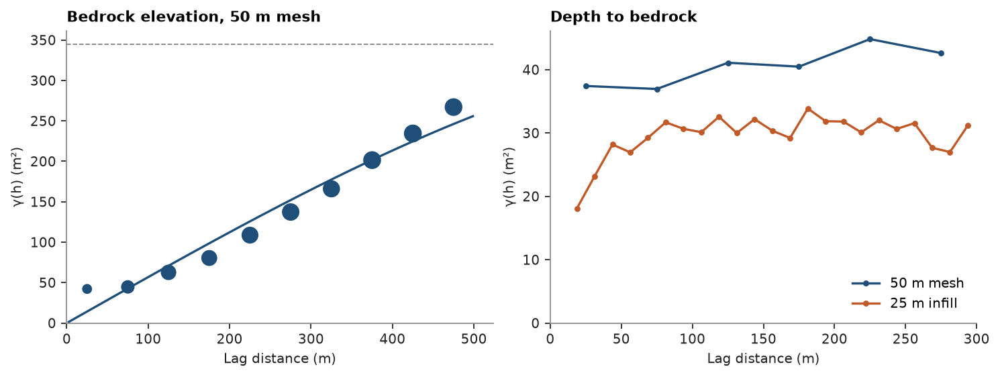
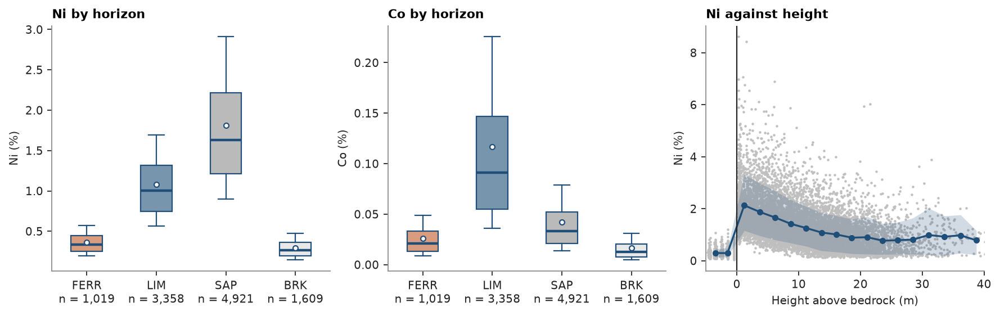
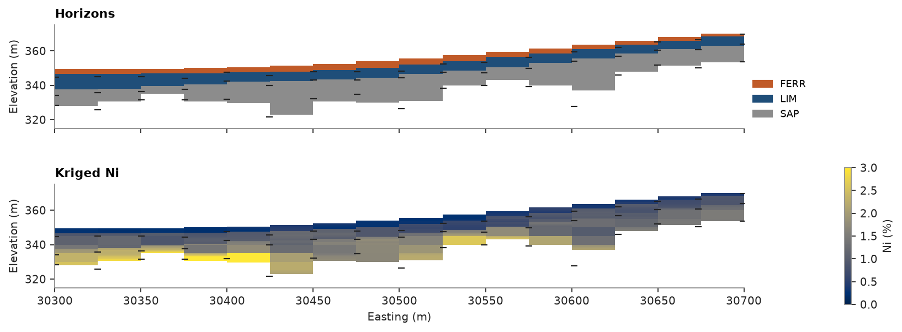

# A laterite profile: horizons, then grades

Weathering has turned an ultramafic bedrock into a blanket a few tens of meters thick: ferricrete at surface,
limonite, saprolite, then fresh rock. 448 vertical holes, on a 50 m mesh with a 25 m infill in the middle, log
the horizons and assay Ni and Co every meter. You model the geometry first, then the grades and the tonnes.

<details><summary>Python</summary>

```python
from itertools import pairwise

import boitata as bt
import matplotlib.pyplot as plt
import numpy as np
from common import ACCENT, GRAY, HIGHLIGHT, INK, LIGHT, map_axes, save
```

</details>

## Horizon contacts

Each hole logs its horizons top down, and the top of each horizon is a contact; with vertical holes its elevation
is the collar's less the depth. Where a hole has no ferricrete, the limonite starts at surface.

<details><summary>Python</summary>

```python
data = bt.datasets.nickel_laterite_profile()
collars, horizons = data["collars"], data["horizons"]
holes = np.array(collars["HOLE_ID"], dtype=object)
xy, surface = np.column_stack([collars["X"], collars["Y"]]), collars["Z"]
names = ["FERR", "LIM", "SAP", "BRK"]
logged, logged_hole = (np.array(horizons[c], dtype=object) for c in ("HORIZON", "HOLE_ID"))
row = {h: i for i, h in enumerate(holes)}
tops = {name: surface.copy() for name in names}
for name in names[1:]:
    keep = logged == name
    rows = [row[h] for h in logged_hole[keep]]
    tops[name][rows] = surface[rows] - horizons["FROM"][keep]
for name, below in pairwise(names):
    thickness = tops[name] - tops[below]
    print(f"{name:4}: {thickness.mean():4.1f} m on average, {thickness.min():.1f} to {thickness.max():.1f} m")
depth = surface - tops["BRK"]
print(f"bedrock: {depth.mean():.1f} m deep on average, {depth.min():.1f} to {depth.max():.1f} m")

i, j = np.round((xy[:, 0] - 30000) / 25), np.round((xy[:, 1] - 60000) / 25)
infill = (i % 2 == 1) | (j % 2 == 1)
print(f"{(~infill).sum()} holes on the 50 m mesh, {infill.sum()} infill")

fig, ax = plt.subplots(figsize=(7, 4.6), layout="constrained")
points = ax.scatter(*xy[~infill].T, c=depth[~infill], s=16, edgecolors=INK, linewidths=0.3)
ax.scatter(*xy[infill].T, s=10, facecolors="none", edgecolors=HIGHLIGHT, linewidths=0.8, label="25 m infill")
fig.colorbar(points, ax=ax, shrink=0.8, label="Depth to bedrock (m)")
ax.legend(loc="lower right", bbox_to_anchor=(1, 1), fontsize=8)
map_axes(ax, "Depth to bedrock on the 50 m mesh")
save(fig, "contacts")
```

</details>

```text
FERR:  2.2 m on average, 0.0 to 5.3 m
LIM :  7.4 m on average, 3.5 to 16.2 m
SAP : 10.9 m on average, 2.6 to 49.6 m
bedrock: 20.5 m deep on average, 9.4 to 59.6 m
301 holes on the 50 m mesh, 147 infill
```



The saprolite varies most: 2.6 to 49.6 m. Bedrock lies 20.5 m deep on average, but 59.6 m in the deepest hole.

## Is the 50 m mesh enough?

Krige the bedrock elevation from the mesh holes alone, then compare it with the contacts logged by the infill.

<details><summary>Python</summary>

```python
mesh_xy, mesh_z = xy[~infill], tops["BRK"][~infill]
experimental = bt.experimental_variogram(mesh_xy, mesh_z, 50.0, 500.0)
bedrock = bt.Variogram.fit(experimental, "spherical")
print(bedrock)
search = bt.Search(radius=250, max_samples=16, min_samples=4)
kriging = bt.OrdinaryKriging(bedrock, search).fit(mesh_xy, mesh_z)
error = kriging.predict(xy[infill]) - tops["BRK"][infill]
naive = surface[infill] - depth[~infill].mean() - tops["BRK"][infill]
print(f"kriged at the infill: mean error {error.mean():+.2f} m, RMSE {np.sqrt(np.mean(error**2)):.2f} m")
print(f"topography less the mean depth: RMSE {np.sqrt(np.mean(naive**2)):.2f} m")

fig, (a, b) = plt.subplots(1, 2, figsize=(9.2, 3.4), layout="constrained")
bt.plot.variogram(experimental, variogram=bedrock, ax=a, color=ACCENT)
a.set(xlabel="Lag distance (m)", ylabel="γ(h) (m²)", title="Bedrock elevation, 50 m mesh")
for keep, lag, color, label in (
    (~infill, 50.0, ACCENT, "50 m mesh"),
    (infill, 12.5, HIGHLIGHT, "25 m infill"),
):
    exp = bt.experimental_variogram(xy[keep], depth[keep], lag, 300.0)
    b.plot(exp.lags, exp.gammas, "o-", color=color, ms=3, label=label)
b.set(xlim=(0, 300), ylim=(0, None), xlabel="Lag distance (m)", ylabel="γ(h) (m²)", title="Depth to bedrock")
b.legend(loc="lower right")
save(fig, "bedrock")
```

</details>

```text
Variogram(nugget=0, structures=[Structure("spherical", sill=344.4516832057495, range=905.6018592151071)], rotation=(0.0, 0.0, 0.0), ratios=(1.0, 1.0))
kriged at the infill: mean error -0.77 m, RMSE 5.25 m
topography less the mean depth: RMSE 5.55 m
```



The elevation variogram keeps climbing over the whole area: the bedrock follows the topography. Kriged from the
mesh, it misses the infill contacts by 5.25 m RMSE, little better than the topography less the mean depth,
5.55 m. The depth to bedrock shows why: on the 50 m mesh its variogram is flat from the first lag, pure nugget,
while the infill resolves a structure shorter than 50 m. The pockets and ridges of fresh rock are narrower than
the mesh; only the infill sees them.

## A layered block model

With all holes, topography and bedrock elevations are kriged on a 25 m grid, and so are the ferricrete and
limonite thicknesses; hung below the topography, they give the other two contacts. Each surface becomes a mesh
with `grid_surface`, and `from_meshes` labels each sub-cell by the first surface it lies below, in the order
bedrock, saprolite, limonite, topography; above the topography nothing matches and no block is made. Blocks of
25 × 25 × 5 m split into 0.5 m sub-cells along z follow the contacts; the bedrock blocks are then dropped.

<details><summary>Python</summary>

```python
grid = bt.BlockModel((29987.5, 59987.5, 0), (25, 25, 1), (41, 29, 1))
surfaces = {
    "topography": surface,
    "FERR": tops["FERR"] - tops["LIM"],
    "LIM": tops["LIM"] - tops["SAP"],
    "BRK": tops["BRK"],
}
kriged = {}
for name, values in surfaces.items():
    variogram = bt.Variogram.fit(bt.experimental_variogram(xy, values, 25.0, 400.0), "spherical")
    kriged[name] = bt.OrdinaryKriging(variogram, search).fit(xy, values).predict(grid.centroids[:, :2])
lim = kriged["topography"] - kriged["FERR"].clip(0)
sap = lim - kriged["LIM"].clip(0)
print(f"saprolite at least {(sap - kriged['BRK']).min():.1f} m thick")
grid = grid.with_columns({"topography": kriged["topography"], "LIM": lim, "SAP": sap, "BRK": kriged["BRK"]})
contacts = {name: bt.grid_surface(grid, name) for name in ["BRK", "SAP", "LIM", "topography"]}
bottom = np.floor(kriged["BRK"].min() / 5) * 5
count = (40, 28, int(np.ceil((kriged["topography"].max() - bottom) / 5)))
rules = [(mesh, "below", name) for mesh, name in zip(contacts.values(), ["BRK", "SAP", "LIM", "FERR"])]
blocks = bt.BlockModel.from_meshes(
    (30000, 60000, bottom), (25, 25, 5), count, rules, (1, 1, 10), column="HORIZON"
)
blocks = blocks.mask(np.array(blocks["HORIZON"], dtype=object) != "BRK")
horizon = np.array(blocks["HORIZON"], dtype=object)
for name in names[:3]:
    print(f"{name}: {blocks.volumes[horizon == name].sum() / 1e6:.2f} Mm³")
print(f"{len(blocks)} blocks and sub-blocks")
```

</details>

```text
saprolite at least 1.9 m thick
FERR: 1.49 Mm³
LIM: 5.47 Mm³
SAP: 7.64 Mm³
27213 blocks and sub-blocks
```

The kriged saprolite never thins below 1.9 m, so the bedrock, kriged on its own, never cuts into the limonite. The
volumes match the logged thicknesses over the 0.7 km² of the model: 1.49 Mm³ of ferricrete, 5.47 of limonite and
7.64 of saprolite.

## Ni and Co by horizon

The assays are composited to 1 m within each horizon. Each composite's height above bedrock is its elevation less
the bedrock contact of its own hole.

<details><summary>Python</summary>

```python
intervals = bt.merge_intervals(data["assays"], horizons)
drillholes = bt.Drillholes(collars, data["surveys"], intervals)
composites = drillholes.composite(1.0, ["NI_PCT", "CO_PCT"], domain="HORIZON", residual="merge")
unit, hole = (np.array(composites[c], dtype=object) for c in ("HORIZON", "HOLE_ID"))
height = composites.coords[:, 2] - tops["BRK"][[row[h] for h in hole]]
ni, co = composites["NI_PCT"], composites["CO_PCT"]
print(f"{'':5}{'n':>6}{'Ni %':>7}{'CV':>6}{'Co %':>7}{'CV':>6}")
for name in names:
    keep = unit == name
    print(
        f"{name:5}{keep.sum():6d}{ni[keep].mean():7.2f}{ni[keep].std() / ni[keep].mean():6.2f}"
        f"{co[keep].mean():7.3f}{co[keep].std() / co[keep].mean():6.2f}"
    )

scheme = bt.Categories(names, colors=[HIGHLIGHT, ACCENT, GRAY, LIGHT])
fig, axes = plt.subplots(1, 3, figsize=(11, 3.4), layout="constrained")
bt.plot.boxplot(ni, scheme.encode(list(unit)), scheme=scheme, ax=axes[0])
axes[0].set(title="Ni by horizon", ylabel="Ni (%)")
bt.plot.boxplot(co, scheme.encode(list(unit)), scheme=scheme, ax=axes[1])
axes[1].set(title="Co by horizon", ylabel="Co (%)")
bins = np.arange(-5, 41, 2.5)
bt.plot.conditional(height, ni, bins=bins, ax=axes[2])
axes[2].axvline(0, color=INK, lw=1)
axes[2].set(xlim=(-5, 40), xlabel="Height above bedrock (m)", ylabel="Ni (%)", title="Ni against height")
save(fig, "grades")
```

</details>

```text
          n   Ni %    CV   Co %    CV
FERR   1019   0.36  0.44  0.026  0.69
LIM    3358   1.08  0.44  0.117  0.82
SAP    4921   1.81  0.48  0.042  0.79
BRK    1609   0.29  0.48  0.016  0.82
```



Each horizon has its own grades. Ni rises down the profile, from 0.36 % in the ferricrete to 1.08 % in the
limonite and 1.81 % in the saprolite, then falls to 0.29 % in fresh rock. Co peaks in the limonite, at 0.117 %,
three times the saprolite's. Against the height above bedrock, Ni is richest in the first meters above fresh rock
and fades upwards: the grades follow position in the profile more than elevation.

## Grades into the blocks

Krige each horizon in flattened coordinates: easting, northing and height above the bedrock surface, for
composites and blocks alike (`vertical_distance` gives the blocks' heights). Every horizon and element gets its
own variogram, fitted along the east–west drill rows and down the holes at once; composites of one horizon inform
only its blocks.

<details><summary>Python</summary>

```python
flat = np.column_stack([composites.coords[:, :2], height])
targets = np.column_stack([blocks.centroids[:, :2], contacts["BRK"].vertical_distance(blocks)])
grades = {"NI_PCT": np.full(len(blocks), np.nan), "CO_PCT": np.full(len(blocks), np.nan)}
for name in names[:3]:
    keep, into = unit == name, horizon == name
    for element, values in grades.items():
        v = composites[element][keep]
        across = bt.experimental_variogram(flat[keep], v, 25.0, 300.0, azimuth=90, tolerance=20, bandwidth=5)
        down = bt.experimental_variogram(flat[keep], v, 1.0, 10.0, holes=hole[keep])
        model = bt.Variogram.fit_directional(
            [across, down],
            [(90, 0), (0, 90)],
            rotation=[90, 0, 0],
            ratios=[(1, 1), (0.01, 0.5)],
            ranges=[(25, 300)],
        )
        s = model.structures[0]
        print(
            f"{name:4} {element[:2]}: nugget {model.nugget / model.sill:.0%}, "
            f"{s.range:.0f} m across, {s.range * model.ratios[1]:.1f} m down"
        )
        search = bt.Search(
            radius=300, ratios=model.ratios, rotation=model.rotation, max_samples=24, max_per_hole=6
        )
        values[into] = (
            bt.OrdinaryKriging(model, search).fit(flat[keep], v, holes=hole[keep]).predict(targets[into])
        )
blocks = blocks.with_columns(grades)
print(f"{sum(np.isnan(g).sum() for g in grades.values())} values left unestimated")
```

</details>

```text
FERR NI: nugget 28%, 70 m across, 4.9 m down
FERR CO: nugget 43%, 167 m across, 83.3 m down
LIM  NI: nugget 28%, 25 m across, 5.7 m down
LIM  CO: nugget 55%, 213 m across, 10.4 m down
SAP  NI: nugget 25%, 25 m across, 7.7 m down
SAP  CO: nugget 46%, 25 m across, 7.5 m down
0 values left unestimated
```

A quarter to a half of each variance is nugget. Down the profile Ni stays continuous for 5 to 8 m; across it,
the Ni of the limonite and saprolite loses its continuity within 25 m, the shortest range allowed and the infill
spacing. Between holes the blocks lean on the mean of their horizon at their height. The ferricrete, 2 m thick,
has too few pairs down the holes to fit its Co anisotropy, which ends on its bound. A section across the infill,
at true scale, shows the horizons and the kriged Ni, with the contacts logged by the holes within 12.5 m.

<details><summary>Python</summary>

```python
plane = ((30500, 60351, 340), 90, 90)
near = np.abs(xy[:, 1] - 60351) < 12.5
profile = bt.Categories(names[:3], colors=[HIGHLIGHT, ACCENT, GRAY])
fig, axes = plt.subplots(2, 1, figsize=(10, 3.8), layout="constrained", sharex=True)
bt.plot.section(
    blocks, profile.encode(list(horizon)), plane=plane, scheme=profile, colorbar=False, ax=axes[0]
)
bt.plot.section(blocks, "NI_PCT", plane=plane, colorbar=False, vmin=0, vmax=3, ax=axes[1])
fig.colorbar(axes[1].collections[0], ax=axes[1], shrink=0.9, label="Ni (%)")
bt.plot.category_legend(profile, axes[0], loc="lower left", bbox_to_anchor=(1, 0), fontsize=8)
for ax, title in zip(axes, ("Horizons", "Kriged Ni"), strict=True):
    for name in names[1:]:
        ax.scatter(xy[near, 0], tops[name][near], s=30, marker="_", color=INK, lw=1)
    ax.set(title=title, xlim=(30300, 30700), ylim=(315, 375))
axes[0].set_xlabel("")
save(fig, "section")
```

</details>



## Tonnes and grade by horizon

The dataset measures no density, so assume typical dry densities of laterite: 2.2 t/m³ for the ferricrete,
1.5 for the limonite and 1.6 for the saprolite. Tonnes are block volume × density; each horizon is reported whole
and above 1.5 % Ni.

<details><summary>Python</summary>

```python
density = {"FERR": 2.2, "LIM": 1.5, "SAP": 1.6}
tonnes = blocks.volumes * np.array([density[h] for h in horizon])
ni, co = blocks["NI_PCT"], blocks["CO_PCT"]
print(f"{'':16}{'Mt':>6}{'Ni %':>7}{'Co %':>7}{'kt Ni':>8}{'kt Co':>7}")
for name in names[:3]:
    for label, keep in (("all", horizon == name), ("≥ 1.5 % Ni", (horizon == name) & (ni >= 1.5))):
        t = tonnes[keep].sum()
        if t == 0:
            continue
        ni_t, co_t = (tonnes[keep] * ni[keep]).sum() / 100, (tonnes[keep] * co[keep]).sum() / 100
        print(
            f"{name:4} {label:11}{t / 1e6:6.2f}{100 * ni_t / t:7.2f}{100 * co_t / t:7.3f}"
            f"{ni_t / 1e3:8.1f}{co_t / 1e3:7.2f}"
        )
```

</details>

```text
                    Mt   Ni %   Co %   kt Ni  kt Co
FERR all          3.28   0.37  0.027    12.0   0.88
LIM  all          8.21   1.09  0.120    89.4   9.84
LIM  ≥ 1.5 % Ni   0.43   1.63  0.157     7.0   0.67
SAP  all         12.22   1.81  0.041   220.8   5.06
SAP  ≥ 1.5 % Ni   9.42   1.94  0.044   182.9   4.11
```

The block grades of each horizon reproduce its composites: 0.37 against 0.36 % Ni in the ferricrete, 1.09 against
1.08 in the limonite, 1.81 in the saprolite. The saprolite holds 12.2 Mt at 1.81 % Ni, 221 kt of nickel, and 9.42
Mt of it lie above 1.5 % Ni. The limonite, 8.21 Mt at 1.09 % Ni, is poorer in nickel, but at 0.120 % Co it holds
9.84 of the 15.8 kt of cobalt. The ferricrete, 3.28 Mt at 0.37 % Ni, is overburden. Every tonne scales with the
assumed densities: a saprolite at 1.4 instead of 1.6 t/m³ would lose an eighth of its tonnes and metal.

Full script: [`example_12_04.py`](example_12_04.py)
