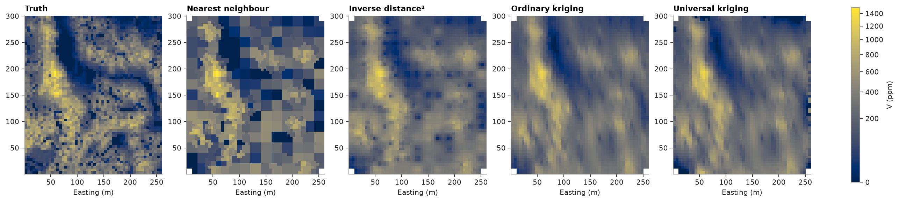
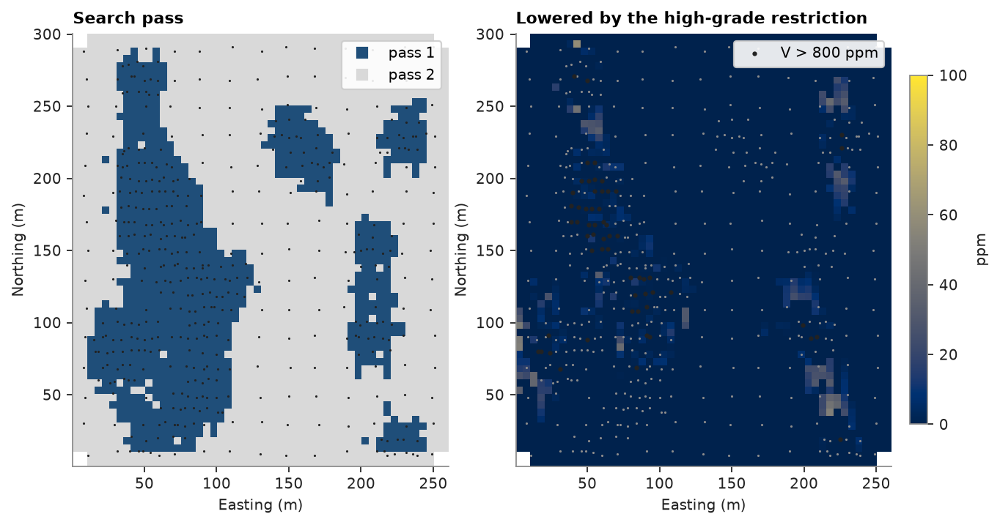
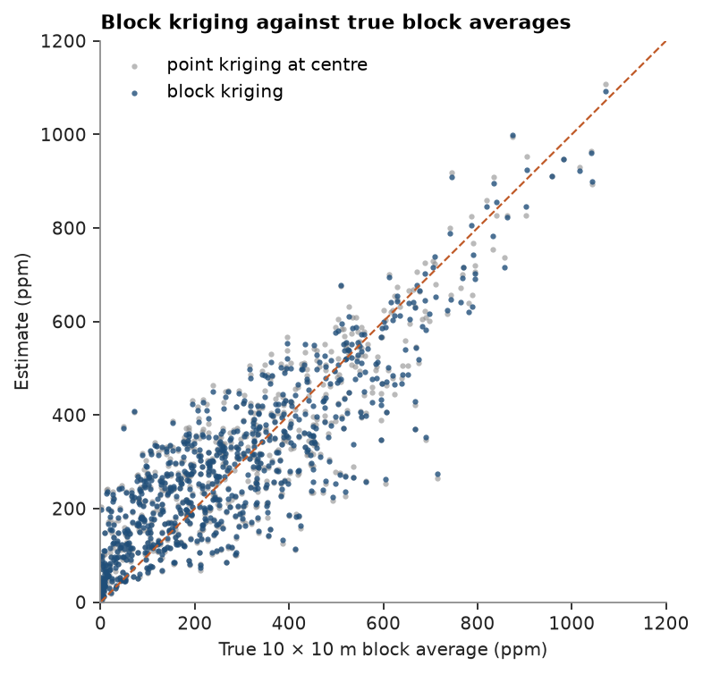

# 12. Estimation methods and search

Five estimators of Walker Lake `V` from the same 470 samples and the same neighbourhood, checked against the
exhaustive values: nearest neighbour, inverse distance, ordinary and universal kriging at points, and block kriging
of 10 × 10 m block averages. Search passes and a high-grade restriction refine the neighbourhood.

<details><summary>Python</summary>

```python
import ceres as cs
import matplotlib.pyplot as plt
import numpy as np
from common import ACCENT, GREY, HIGHLIGHT, INK, LIGHT, map_axes, save
from matplotlib.colors import ListedColormap, PowerNorm

samples = cs.datasets.walker_lake()
truth = cs.datasets.walker_lake_exhaustive()["V"].reshape(300, 260)
xy, v = samples.coords, samples["V"]
model = cs.Variogram.from_json((HERE.parent / "03-variography" / "model.json").read_text())
grid = cs.BlockModel(origin=(0.5, 0.5), size=(5, 5), count=(52, 60))
nodes = grid.centroids.astype(int)
true_at_nodes = truth[nodes[:, 1] - 1, nodes[:, 0] - 1]
```

</details>

The search ellipsoid can differ from the variogram's: here it follows the N170° anisotropy but with a milder
ratio, and octants keep samples from piling up on one side.

<details><summary>Python</summary>

```python
ellipse = {"max_samples": 24, "octant": True, "rotation": model.rotation, "ratios": (0.5, 1.0)}
search = cs.Search(radius=80, min_samples=4, **ellipse)
methods = {
    "nearest neighbour": cs.NearestNeighbor(search),
    "inverse distance²": cs.InverseDistance(search, power=2),
    "ordinary kriging": cs.OrdinaryKriging(model, search),
    "universal kriging": cs.UniversalKriging(model, search, degree=1),
}
estimates = {name: m.fit(xy, v).predict(grid) for name, m in methods.items()}
print(f"{'method':>18}  RMSE   corr   variance ratio")
for name, e in estimates.items():
    ok = ~np.isnan(e)
    rmse = np.sqrt(np.mean((e[ok] - true_at_nodes[ok]) ** 2))
    corr = np.corrcoef(e[ok], true_at_nodes[ok])[0, 1]
    print(f"{name:>18}  {rmse:5.1f}  {corr:.3f}  {e[ok].var() / true_at_nodes[ok].var():.2f}")
```

</details>

```text
            method  RMSE   corr   variance ratio
 nearest neighbour  178.6  0.739  0.95
 inverse distance²  152.0  0.798  0.66
  ordinary kriging  155.3  0.786  0.61
 universal kriging  160.1  0.769  0.64
```

Nearest neighbour keeps the full variability but places it poorly; inverse distance and kriging trade variability
for accuracy. Here inverse distance is slightly more accurate than kriging with the chapter 3 model, whose short
ranges across the major axis smooth hard; kriging adds a variance per estimate and accounts for clustered samples,
which inverse distance does not. Universal kriging's linear drift does not help on this stationary field.

<details><summary>Python</summary>

```python
shape = (60, 52)
extent = (0.5, 260.5, 0.5, 300.5)
norm = PowerNorm(0.5, vmin=0, vmax=1500)
fig, axes = plt.subplots(1, 5, figsize=(16, 4), layout="constrained")
for ax, (title, image) in zip(axes, [("truth", true_at_nodes), *estimates.items()]):
    im = ax.imshow(image.reshape(shape), origin="lower", extent=extent, norm=norm)
    map_axes(ax, title.capitalize())
    ax.set_ylabel("")
fig.colorbar(im, ax=axes, shrink=0.8, label="V (ppm)")
save(fig, "methods")
```

</details>



A list of searches runs as passes: nodes the first leaves unestimated go to the next, and `diagnostics` reports
the pass behind each. A first pass wanting eight samples within 30 m hardly changes the estimates; it labels the
nodes by how well they are informed, which classification uses. Pass-1 nodes have the higher slope of regression
but also the larger errors: Walker Lake was sampled densely where `V` is high and variable.

`high_grade` keeps samples above 800 ppm, the top 12 %, from informing nodes more than 20 m away. It lowers the
nodes around isolated rich samples, where kriging overestimates most.

<details><summary>Python</summary>

```python
passes = [cs.Search(radius=30, min_samples=8, **ellipse), search]
d = cs.OrdinaryKriging(model, passes).fit(xy, v).predict(grid, diagnostics=True)
for p in (1, 2):
    s = d["pass"] == p
    rmse = np.sqrt(np.mean((d["value"][s] - true_at_nodes[s]) ** 2))
    print(f"pass {p}: {s.mean():4.0%} of nodes, mean slope {np.mean(d['slope'][s]):.2f}, RMSE {rmse:.0f} ppm")

capped = cs.Search(radius=80, min_samples=4, high_grade=(800, 20), **ellipse)
restricted = cs.OrdinaryKriging(model, capped).fit(xy, v)
free = estimates["ordinary kriging"]
difference = restricted.predict(grid) - free
changed = np.abs(difference) > 5
error = free[changed] - true_at_nodes[changed]
print(
    f"{changed.sum()} nodes move by over 5 ppm; their mean error goes from {error.mean():+.0f} ppm to "
    f"{(error + difference[changed]).mean():+.0f} ppm"
)
before, after = methods["ordinary kriging"].cross_validate(), restricted.cross_validate()
print(
    f"cross-validation mean error {before.mean_error:+.1f} ppm without the restriction, {after.mean_error:+.1f} with"
)

fig, (a, b) = plt.subplots(1, 2, figsize=(8.4, 4.4), layout="constrained")
a.imshow(
    d["pass"].reshape(shape),
    origin="lower",
    extent=extent,
    cmap=ListedColormap([ACCENT, LIGHT]),
    vmin=0.5,
    vmax=2.5,
)
a.scatter(*xy[:, :2].T, s=2, color=INK, linewidths=0)
map_axes(a, "Search pass")
a.legend(
    handles=[
        plt.Line2D([], [], marker="s", ls="", color=c, label=f"pass {p}")
        for p, c in ((1, ACCENT), (2, LIGHT))
    ],
    loc="upper right",
    framealpha=0.9,
    frameon=True,
)
im = b.imshow(
    -difference.reshape(shape),
    origin="lower",
    extent=extent,
    cmap="cividis",
    vmin=0,
    vmax=100,
)
rich = v > 800
b.scatter(*xy[~rich, :2].T, s=2, color=GREY, linewidths=0)
b.scatter(*xy[rich, :2].T, s=8, color=INK, linewidths=0, label="V > 800 ppm")
map_axes(b, "Lowered by the high-grade restriction")
b.legend(loc="upper right", framealpha=0.9, frameon=True)
fig.colorbar(im, ax=b, shrink=0.8, label="ppm")
save(fig, "search")
```

</details>

```text
pass 1:  32% of nodes, mean slope 0.97, RMSE 174 ppm
pass 2:  68% of nodes, mean slope 0.90, RMSE 146 ppm
179 nodes move by over 5 ppm; their mean error goes from +55 ppm to +38 ppm
cross-validation mean error +7.4 ppm without the restriction, +4.8 with
```



Block kriging estimates the average over each 10 × 10 m block directly, from 5 × 5 points per block. Its targets are
block centres; the truth is the average of the 100 exhaustive values in each block.

<details><summary>Python</summary>

```python
blocks = cs.BlockModel(origin=(0, 0), size=(10, 10), count=(26, 30))
block_estimate = (
    cs.BlockKriging(model, search, size=(10, 10), discretization=(5, 5, 1)).fit(xy, v).predict(blocks)
)
point_at_centres = methods["ordinary kriging"].predict(blocks)
true_blocks = truth.reshape(30, 10, 26, 10).mean(axis=(1, 3)).ravel()
for name, e in (("block kriging", block_estimate), ("point kriging at centres", point_at_centres)):
    print(f"{name:>24}: RMSE against block averages {np.sqrt(np.nanmean((e - true_blocks) ** 2)):.1f} ppm")

fig, ax = plt.subplots(figsize=(4.8, 4.6), layout="constrained")
ax.scatter(
    true_blocks, point_at_centres, s=8, color=GREY, alpha=0.6, linewidths=0, label="point kriging at centre"
)
ax.scatter(true_blocks, block_estimate, s=8, color=ACCENT, alpha=0.8, linewidths=0, label="block kriging")
ax.plot([0, 1200], [0, 1200], color=HIGHLIGHT, lw=1, ls="--")
ax.set(xlim=(0, 1200), ylim=(0, 1200), xlabel="True 10 × 10 m block average (ppm)", ylabel="Estimate (ppm)")
ax.set_title("Block kriging against true block averages")
ax.legend(loc="upper left")
save(fig, "blocks")
```

</details>

```text
           block kriging: RMSE against block averages 102.5 ppm
point kriging at centres: RMSE against block averages 107.7 ppm
```



The neighbourhood search is a k-d tree, so large grids stay fast. Ordinary kriging of every 1 m node of the area,
78 000 targets, in parallel:

<details><summary>Python</summary>

```python
fine = cs.BlockModel(origin=(0.5, 0.5), size=(1, 1), count=(260, 300))
start = time.perf_counter()
full = methods["ordinary kriging"].predict(fine)
seconds = time.perf_counter() - start
print(
    f"{len(fine):,} nodes in {seconds:.2f} s; RMSE against all exhaustive values {np.sqrt(np.nanmean((full - truth.ravel()) ** 2)):.1f} ppm"
)
```

</details>

```text
78,000 nodes in 0.06 s; RMSE against all exhaustive values 153.9 ppm
```

Full script: [`example_12.py`](example_12.py)
