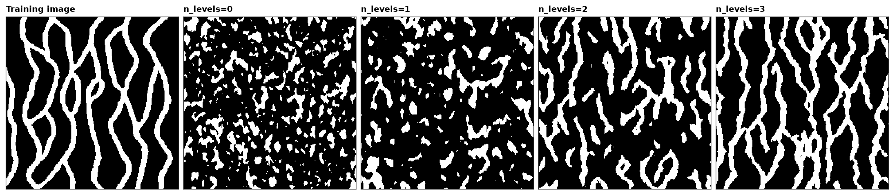

# SNESIM and its multigrid

SNESIM copies patterns rather than a variogram. It counts, once, every arrangement of categories the training image
holds around a cell, and a simulated cell draws its category from the counts of the arrangement around it. The
template it reads is small, a few cells across, so on its own it cannot see a channel 100 cells long. The multigrid
simulates the coarse structure first, on every 2nd, 4th and 8th cell, and fills in the rest afterwards.

<details><summary>Python</summary>

```python
import boitata as bt
import matplotlib.pyplot as plt
import numpy as np
from common import INK, save
from matplotlib.colors import ListedColormap

ti = bt.datasets.strebelle()
nx, ny = ti.count[:2]
image = ti["facies"].reshape(ny, nx)
print(f"{nx} x {ny} cells, sand (code 1) in {image.mean():.1%} of them")
```

</details>

```text
250 x 250 cells, sand (code 1) in 27.7% of them
```

The channels run along Y. The mean length of the runs of sand along Y measures how far a channel carries; across,
along X, it measures its width.

<details><summary>Python</summary>

```python
def runs(img, axis):
    """Mean length of the runs of code 1 along `axis` of a (y, x) image."""
    lines = img if axis == 1 else img.T
    lengths = [len(r) for line in lines for r in "".join(map(str, line.astype(int))).split("0") if r]
    return np.mean(lengths)


print(f"training image: sand runs {runs(image, 0):.1f} cells along Y, {runs(image, 1):.1f} across")
```

</details>

```text
training image: sand runs 20.4 cells along Y, 8.5 across
```

Twenty realizations for each number of coarse levels, from none to three, on a grid the size of the image. Each
level halves the spacing, so `n_levels=3` starts on every eighth cell. Half of a coarse template stays next to the
cell and half spreads over the level's spacing, so the template reaches farther without losing sight of the cells
around it.

<details><summary>Python</summary>

```python
grid = bt.BlockModel((0, 0), (1, 1), (nx, ny))
realizations = {}
for levels in (0, 1, 2, 3):
    summary = bt.SNESIM(ti, "facies", n_levels=levels).simulate(grid, n=20, seed=7, keep=True, progress=False)
    reals = summary.realizations.reshape(-1, ny, nx)
    realizations[levels] = reals[0]
    along = np.mean([runs(r, 0) for r in reals])
    across = np.mean([runs(r, 1) for r in reals])
    print(f"n_levels={levels}: sand {reals.mean():.1%}, runs {along:.1f} along Y, {across:.1f} across")
```

</details>

```text
n_levels=0: sand 22.6%, runs 7.0 along Y, 5.2 across
n_levels=1: sand 22.6%, runs 10.3 along Y, 7.1 across
n_levels=2: sand 28.2%, runs 15.5 along Y, 8.0 across
n_levels=3: sand 29.8%, runs 18.0 along Y, 8.2 across
```

Without levels the channels break into short pieces. Each level lengthens them, and three reach most of the
image's length. The coarse templates also shift the proportions: near its edges the image has no room for a
template 16 cells wide, and the cells far from the edges hold more sand, so the realizations end up with more sand
than the image. The servosystem in the next page pulls it back.

<details><summary>Python</summary>

```python
codes = ListedColormap(["black", "white"])
fig, axes = plt.subplots(1, 5, figsize=(15, 3.6), layout="constrained")
panels = [(image, "Training image")] + [(realizations[k], f"n_levels={k}") for k in realizations]
for ax, (img, title) in zip(axes, panels):
    ax.imshow(img, origin="lower", cmap=codes, vmin=0, vmax=1, interpolation="nearest")
    ax.set_title(title)
    ax.set(xticks=[], yticks=[])
    for side in ax.spines.values():
        side.set(visible=True, color=INK, lw=0.6)
save(fig, "levels")
```

</details>



[Conditioning SNESIM](../../13-multiple-point-statistics/02-snesim-conditioning/README.md) honors hard data and steers the proportions, and
[continuous SNESIM](../../13-multiple-point-statistics/03-snesim-continuous/README.md) simulates values instead of codes.

Full script: [`example_13_01.py`](example_13_01.py)
