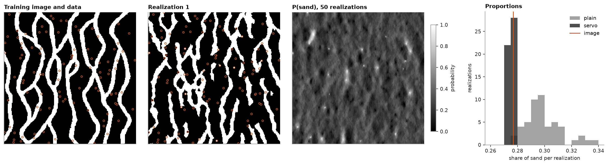

# conditioning SNESIM

hard data fix the category of their cells in all realizations, and the patterns around them decide the rest. a
servosystem pulls each realization towards target proportions.

<details><summary>Python</summary>

```python
import boitata as bt
import matplotlib.pyplot as plt
import numpy as np
from common import GRAY, HIGHLIGHT, INK, save
from matplotlib.colors import ListedColormap

ti = bt.datasets.strebelle()
nx, ny = ti.count[:2]
image = ti["facies"].reshape(ny, nx)
grid = bt.BlockModel((0, 0), (1, 1), (nx, ny))
```

</details>

100 cells of the image drawn at random serve as hard data, as if the image were the truth and these the wells:

<details><summary>Python</summary>

```python
rows = np.random.default_rng(0).choice(nx * ny, size=100, replace=False)
wells = grid.centroids[rows]
facies = ti["facies"][rows].astype(int)
print(f"{facies.sum()} sand and {(facies == 0).sum()} shale data")
```

</details>

```text
25 sand and 75 shale data
```

fifty realizations, once without targets and once with the image's proportions as targets. `servo` sets how hard
the servosystem pulls: a cell draws from its pattern probability plus `servo / (1 - servo)` times the gap between
the target and the share simulated so far. where all matching patterns hold one category, the servosystem leaves
the cell alone.

<details><summary>Python</summary>

```python
sand = image.mean()
plain = bt.SNESIM(ti, "facies").fit(wells, facies)
steered = bt.SNESIM(ti, "facies", target_proportions=[1 - sand, sand], servo=0.8).fit(wells, facies)
summaries = {
    name: s.simulate(grid, n=50, seed=3, keep=[0], progress=False)
    for name, s in [("plain", plain), ("servo", steered)]
}
for name, summary in summaries.items():
    share = summary.proportions[:, 1]
    low, high = np.quantile(share, [0.05, 0.95])
    print(f"{name}: sand {share.mean():.1%} ({low:.1%} to {high:.1%}), image {sand:.1%}")
reproduced = all((s.realizations[:, rows] == facies).all() for s in summaries.values())
print(f"hard data reproduced in every realization: {reproduced}")
```

</details>

```text
plain: sand 29.9% (28.1% to 32.7%), image 27.7%
servo: sand 27.5% (27.2% to 27.9%), image 27.7%
hard data reproduced in every realization: True
```

the data steer the channels around them as well as their own cell: within 3 cells of a sand datum, sand is twice
as likely as on average, and near a shale datum half as likely. the image itself is more decided there, since the
data steer the patterns and the patterns still choose where each channel goes:

<details><summary>Python</summary>

```python
p_sand = summaries["servo"].probabilities[:, 1].reshape(ny, nx)
yy, xx = np.mgrid[:ny, :nx]
for code, label in ((1, "sand"), (0, "shale")):
    near = np.zeros((ny, nx), bool)
    for x, y in wells[facies == code, :2].astype(int):
        near |= (xx - x) ** 2 + (yy - y) ** 2 <= 9
    print(
        f"within 3 cells of {label} data: P(sand) {p_sand[near].mean():.2f}, image {image[near].mean():.2f}"
    )
```

</details>

```text
within 3 cells of sand data: P(sand) 0.56, image 0.84
within 3 cells of shale data: P(sand) 0.13, image 0.05
```

<details><summary>Python</summary>

```python
codes = ListedColormap(["white", "black"])
fig, axes = plt.subplots(1, 4, figsize=(15, 4), layout="constrained", width_ratios=[1, 1, 1, 0.9])
for ax, img, title in (
    (axes[0], image, "Training image and data"),
    (axes[1], summaries["servo"].realizations[0].reshape(ny, nx), "Realization 1"),
):
    ax.imshow(img, origin="lower", cmap=codes, vmin=0, vmax=1, interpolation="nearest")
    ax.scatter(
        *wells[:, :2].T, s=10, c=np.where(facies == 1, "black", "white"), edgecolors=HIGHLIGHT, linewidths=0.9
    )
    ax.set_title(title)
im = axes[2].imshow(p_sand, origin="lower", cmap="gray_r", vmin=0, vmax=1)
axes[2].set_title("P(sand), 50 realizations")
fig.colorbar(im, ax=axes[2], shrink=0.8, label="probability")
for ax in axes[:3]:
    ax.set(xticks=[], yticks=[])
fig.get_layout_engine().set(wspace=0.08)
bins = np.linspace(0.26, 0.34, 17)
for name, color in (("plain", GRAY), ("servo", INK)):
    axes[3].hist(summaries[name].proportions[:, 1], bins, color=color, alpha=0.8, label=name)
axes[3].axvline(sand, color=HIGHLIGHT, lw=1.4, label="image")
axes[3].set(xlabel="share of sand per realization", ylabel="realizations", title="Proportions")
axes[3].legend()
save(fig, "conditioning")
```

</details>



without targets the realizations drift above the image's share of sand, as in
[the multigrid page](../../13-multiple-point-statistics/01-snesim-multigrid/README.md); the servosystem brings them back and narrows their spread.
a strong servosystem costs some of the image's patterns, so keep `servo` as low as the proportions allow.

Full script: [`example_13_02.py`](example_13_02.py)
