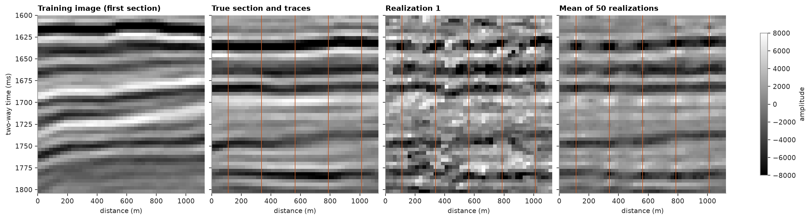
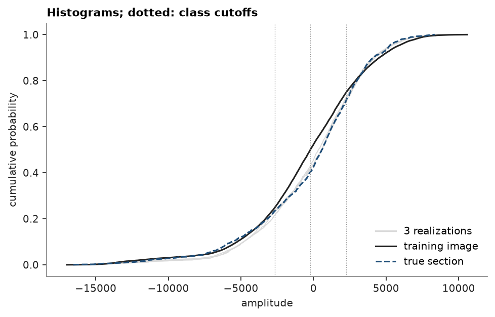

# continuous SNESIM

SNESIM counts patterns of categories, so it first cuts a continuous variable into a few classes. it simulates the
classes, then each cell takes a value from a cell of the training image in its class: of 32 drawn at random, the
one whose neighbors best match the values already simulated around it. here SNESIM fills a seismic section between
five traces, with other sections of the same survey as the training image.

<details><summary>Python</summary>

```python
import boitata as bt
import matplotlib.pyplot as plt
import numpy as np
from common import GRAY, HIGHLIGHT, INK, LIGHT, save

seismic = bt.datasets.f3_seismic()
nx, ny, nz = seismic.count
cube = seismic["amplitude"].astype(float).reshape(nz, ny, nx)[::-1]  # time down: row 0 at 1600 ms
print(f"{nx} x {ny} traces of {nz} samples, amplitude {cube.min():.0f} to {cube.max():.0f}")
```

</details>

```text
45 x 45 traces of 51 samples, amplitude -17711 to 10591
```

a section is 45 traces by 51 samples. one section holds few patterns, so the training image lays ten sections side
by side, every third one from the first. the section to simulate lies 13 sections past the last of them, and five
of its traces, 225 m apart, are the hard data. cells are 25 m by 4 ms; SNESIM reads patterns cell by cell, so the
image and the section share that size.

<details><summary>Python</summary>

```python
image = np.hstack([cube[:, j, :] for j in range(0, 30, 3)])
truth = cube[:, 40, :]
ti = bt.BlockModel((0, 1600), (25, 4), (image.shape[1], nz)).with_columns({"amplitude": image.ravel()})
section = bt.BlockModel((0, 1600), (25, 4), (nx, nz))
traces = [4, 13, 22, 31, 40]
at_traces = np.zeros((nz, nx), bool)
at_traces[:, traces] = True
wells = section.coords[at_traces.ravel()]
values = truth[at_traces]
```

</details>

the default cutoffs are the image's quartiles: four classes keep the patterns frequent enough to count. ten classes
give too many arrangements, and most cells fall back to the class proportions.

<details><summary>Python</summary>

```python
snesim = bt.SNESIM(ti, "amplitude").fit(wells, values)
print("cutoffs:", np.round(np.quantile(image, [0.25, 0.5, 0.75])))
summary = snesim.simulate(section, n=50, seed=11, keep=range(3))
reals = summary.realizations.reshape(-1, nz, nx)
etype = summary.mean.reshape(nz, nx)
print(f"hard data reproduced: {np.allclose(reals[:, at_traces], values)}")
corr = [np.corrcoef(r.ravel(), truth.ravel())[0, 1] for r in reals]
print(
    f"correlation with the true section: realizations {np.mean(corr):.2f}, mean of 50 {np.corrcoef(etype.ravel(), truth.ravel())[0, 1]:.2f}"
)
```

</details>

```text
cutoffs: [-2649.  -214.  2266.]
hard data reproduced: True
correlation with the true section: realizations 0.70, mean of 50 0.89
```

each realization carries the main reflectors from trace to trace, but it is rougher than the seismic: the patterns
come from four classes, and within a class a value matches only its 8 nearest neighbors. the mean of 50 keeps what
the traces fix and smooths the rest.

<details><summary>Python</summary>

```python
extent = (0, nx * 25, 1600 + nz * 4, 1600)
style = {
    "cmap": "gray",
    "vmin": -8000,
    "vmax": 8000,
    "extent": extent,
    "aspect": "auto",
    "interpolation": "nearest",
}
fig, axes = plt.subplots(1, 4, figsize=(15, 4), layout="constrained", sharey=True)
panels = [
    (image[:, :nx], "Training image (first section)"),
    (truth, "True section and traces"),
    (reals[0], "Realization 1"),
    (etype, "Mean of 50 realizations"),
]
for ax, (img, title) in zip(axes, panels):
    im = ax.imshow(img, **style)
    ax.set(title=title, xlabel="distance (m)")
for ax in axes[1:]:
    for t in traces:
        ax.axvline((t + 0.5) * 25, color=HIGHLIGHT, lw=0.8)
axes[0].set_ylabel("two-way time (ms)")
fig.colorbar(im, ax=axes, shrink=0.8, label="amplitude")
save(fig, "sections")
```

</details>



each value comes from the image, yet the realizations follow the true section's histogram closer than the image's:
the five traces, a tenth of the section, carry its proportions of each class into the patterns around them.

<details><summary>Python</summary>

```python
fig, ax = plt.subplots(figsize=(6, 3.8), layout="constrained")
for r in summary.realizations:
    ax.plot(np.sort(r), np.linspace(0, 1, r.size), color=LIGHT, lw=0.8)
ax.plot([], [], color=LIGHT, label="3 realizations")
ax.plot(np.sort(image.ravel()), np.linspace(0, 1, image.size), color=INK, lw=1.4, label="training image")
ax.plot(
    np.sort(truth.ravel()), np.linspace(0, 1, truth.size), color=GRAY, lw=1.4, ls="--", label="true section"
)
for q in np.quantile(image, [0.25, 0.5, 0.75]):
    ax.axvline(q, color=INK, lw=0.6, ls=":")
ax.set(xlabel="amplitude", ylabel="cumulative probability", title="Histograms; dotted: class cutoffs")
ax.legend(loc="lower right")
save(fig, "histograms")
```

</details>



categories are the usual case: see [the multigrid](../../13-multiple-point-statistics/01-snesim-multigrid/README.md) and
[conditioning](../../13-multiple-point-statistics/02-snesim-conditioning/README.md).

Full script: [`example_13_03.py`](example_13_03.py)
