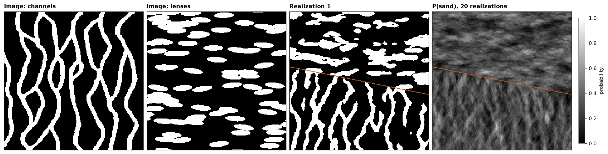

# Several training images

When the geology changes across a model, one image cannot hold every pattern. SNESIM takes a training image per
domain, `{domain: (model, column)}`, and `simulate` picks each cell's image from its domain. The images share one set
of codes, so a code means the same everywhere.

<details><summary>Python</summary>

```python
import boitata as bt
import matplotlib.pyplot as plt
import numpy as np
from common import HIGHLIGHT, INK, save
from matplotlib.colors import ListedColormap

channels = bt.datasets.strebelle()
n = channels.count[0]
grid = bt.BlockModel((0, 0), (1, 1), (n, n))
```

</details>

The second image is built from objects: sand lenses about 36 by 10 cells, lying east-west, over 30 % of a grid the size
of Strebelle.

<details><summary>Python</summary>

```python
lens = {"shape": "ellipsoid", "code": 1, "proportion": 0.3, "radii": (18, 5), "azimuth": (80, 100)}
lenses = bt.object_training_image(grid, [lens], seed=4)
print(f"sand: channels {channels['facies'].mean():.1%}, lenses {lenses['facies'].mean():.1%}")
```

</details>

```text
sand: channels 27.7%, lenses 30.2%
```

Two domains split by a line dipping east: channels in the south, lenses in the north. Twenty realizations, with the
sand share of each domain against its image:

<details><summary>Python</summary>

```python
x, y = grid.centroids[:, 0], grid.centroids[:, 1]
domains = np.where(y > 150 - 0.2 * x, "lenses", "channels")
snesim = bt.SNESIM({"channels": (channels, "facies"), "lenses": (lenses, "facies")})
summary = snesim.simulate(grid, n=20, seed=1, keep=[0], domains=domains, progress=False)
for name, image in (("channels", channels), ("lenses", lenses)):
    share = summary.probabilities[domains == name, 1].mean()
    print(f"{name}: realizations {share:.1%} sand, image {image['facies'].mean():.1%}")
```

</details>

```text
channels: realizations 29.2% sand, image 27.7%
lenses: realizations 30.4% sand, image 30.2%
```

<details><summary>Python</summary>

```python
codes = ListedColormap(["black", "white"])
boundary = (domains == "lenses").reshape(n, n).astype(float)
fig, axes = plt.subplots(1, 4, figsize=(15, 4), layout="constrained")
panels = (
    (channels["facies"], "Image: channels", codes),
    (lenses["facies"], "Image: lenses", codes),
    (summary.realizations[0], "Realization 1", codes),
    (summary.probabilities[:, 1], "P(sand), 20 realizations", "gray"),
)
for ax, (values, title, cmap) in zip(axes, panels):
    im = ax.imshow(values.reshape(n, n), origin="lower", cmap=cmap, vmin=0, vmax=1, interpolation="nearest")
    ax.set(title=title, xticks=[], yticks=[])
    for side in ax.spines.values():
        side.set(visible=True, color=INK, lw=0.6)
for ax in axes[2:]:
    ax.contour(boundary, levels=[0.5], colors=HIGHLIGHT, linewidths=1.2)
fig.colorbar(im, ax=axes[3], shrink=0.8, label="probability")
save(fig, "zones")
```

</details>



The boundary stays visible as a line: a cell next to it reads neighbors from both sides, which joins a channel to a
lens where they meet, but the change of pattern itself is abrupt. The images may differ in size but not in kind: a
dict of continuous images works the same way, each domain drawing its values from its own image. Hard data,
`anisotropy` and `target_proportions` combine with domains as without them.

Full script: [`example_13_05.py`](example_13_05.py)
