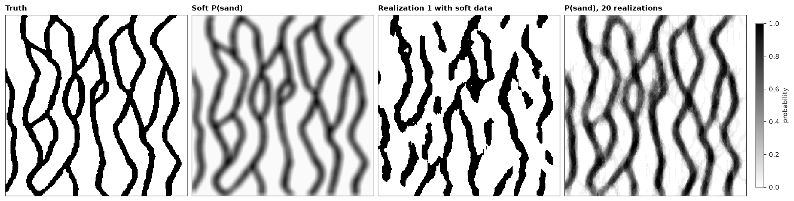

# soft data in SNESIM

hard data are rare; a probability of each category at each cell, from seismic or a geological interpretation, is
common. `soft` gives SNESIM one probability per category and cell, and SNESIM weighs them against the patterns of the
training image instead of copying them.

<details><summary>Python</summary>

```python
import boitata as bt
import matplotlib.pyplot as plt
import numpy as np
from common import INK, save
from matplotlib.colors import ListedColormap

ti = bt.datasets.strebelle()
nx, ny = ti.count[:2]
image = ti.grid("facies")[0]
grid = bt.BlockModel((0, 0), (1, 1), (nx, ny))
```

</details>

the image stands in for the truth again. its sand indicator averaged over 11 by 11 cells plays the part of a
seismic probability of sand: it knows where the channels lie and misses their edges.

<details><summary>Python</summary>

```python
def smooth(img, width):
    kernel = np.ones(width) / width
    rows = np.apply_along_axis(np.convolve, 1, img, kernel, "same")
    return np.apply_along_axis(np.convolve, 0, rows, kernel, "same")


p_soft = np.clip(smooth(image, 11), 0.02, 0.98)
soft = np.column_stack([1 - p_soft.ravel(), p_soft.ravel()])
print(f"soft P(sand) from {p_soft.min():.2f} to {p_soft.max():.2f}, mean {p_soft.mean():.2f}")
```

</details>

```text
soft P(sand) from 0.02 to 0.97, mean 0.28
```

twenty realizations without and with the soft probabilities. at each cell the probability read from the patterns,
`P_ti`, and the soft one combine by permanence of ratios, `P(c) ∝ P_ti(c) * P_soft(c) / P0(c)` with `P0` the
image's proportions. a soft probability equal to the image's share of sand changes nothing, and one near 0 or 1
overrules the patterns.

<details><summary>Python</summary>

```python
snesim = bt.SNESIM(ti, "facies")
summaries = {
    "patterns only": snesim.simulate(grid, n=20, seed=5, keep=[0]),
    "with soft data": snesim.simulate(grid, n=20, seed=5, keep=[0], soft=soft),
}
for name, summary in summaries.items():
    p_sand = summary.probabilities[:, 1]
    hits = (summary.realizations[0] == image.ravel()).mean()
    print(
        f"{name}: sand {summary.proportions[:, 1].mean():.1%}, realization 1 matches the image in {hits:.0%} of cells, "
        f"P(sand) against soft r = {np.corrcoef(p_sand, p_soft.ravel())[0, 1]:.2f}"
    )
```

</details>

```text
patterns only: sand 29.7%, realization 1 matches the image in 58% of cells, P(sand) against soft r = -0.03
with soft data: sand 29.9%, realization 1 matches the image in 82% of cells, P(sand) against soft r = 0.96
```

without soft data a realization matches the truth no better than chance; with it, in four cells of five. the
channels sit where the soft probability is high and keep the image's width, but break where the patterns and the
soft map disagree, most often where two channels cross. the probability of 20 realizations is sharper than the soft
map it came from: the patterns turn a smooth 0.5 into either a channel or none.

<details><summary>Python</summary>

```python
codes = ListedColormap(["white", "black"])
fig, axes = plt.subplots(1, 4, figsize=(15, 4), layout="constrained")
panels = (
    (image, "Truth", codes),
    (p_soft, "Soft P(sand)", "gray_r"),
    (grid.grid(summaries["with soft data"].realizations[0])[0], "Realization 1 with soft data", codes),
    (grid.grid(summaries["with soft data"].probabilities[:, 1])[0], "P(sand), 20 realizations", "gray_r"),
)
for ax, (img, title, cmap) in zip(axes, panels):
    im = ax.imshow(img, origin="lower", cmap=cmap, vmin=0, vmax=1, interpolation="nearest")
    ax.set(title=title, xticks=[], yticks=[])
    for side in ax.spines.values():
        side.set(visible=True, color=INK, lw=0.6)
fig.colorbar(im, ax=axes[3], shrink=0.8, label="probability")
save(fig, "soft")
```

</details>



hard data override the soft probabilities at their cells, and both combine with `anisotropy`, domains and the
servosystem. [image quilting](../../13-multiple-point-statistics/08-image-quilting/README.md) takes soft data too,
as a cost instead of a probability.

Full script: [`example_13_06.py`](example_13_06.py)
