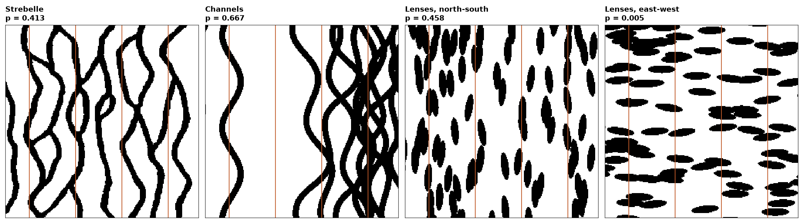

# training images and their consistency

a training image is a geological hypothesis drawn as a grid. `bt.object_training_image` draws one from channels and
ellipsoids, and `bt.training_image_consistency` tests whether the hard data could come from holes drilled through it.

<details><summary>Python</summary>

```python
import boitata as bt
import matplotlib.pyplot as plt
import numpy as np
from common import HIGHLIGHT, INK, save
from matplotlib.colors import ListedColormap

strebelle = bt.datasets.strebelle()
n = strebelle.count[0]
grid = bt.BlockModel((0, 0), (1, 1), (n, n))
```

</details>

three object-based candidates on a grid the size of strebelle, each about 30 % sand. sizes and angles given as a
`(min, max)` range get a fresh draw for each object: sinuous channels 8 cells wide trending north, and lenses 36 by
10 cells lying north-south or east-west.

<details><summary>Python</summary>

```python
channel = {"shape": "channel", "width": 8, "azimuth": (-20, 20), "amplitude": 12, "wavelength": 120}
lens = {"shape": "ellipsoid", "radii": (18, 5)}
candidates = {
    "Channels": bt.object_training_image(grid, [channel | {"code": 1, "proportion": 0.28}], seed=4),
    "Lenses, north-south": bt.object_training_image(
        grid, [lens | {"code": 1, "proportion": 0.3, "azimuth": (-10, 10)}], seed=4
    ),
    "Lenses, east-west": bt.object_training_image(
        grid, [lens | {"code": 1, "proportion": 0.3, "azimuth": (80, 100)}], seed=4
    ),
}
for name, image in candidates.items():
    print(f"{name}: sand {image['facies'].mean():.1%}")
```

</details>

```text
Channels: sand 28.9%
Lenses, north-south: sand 30.4%
Lenses, east-west: sand 30.2%
```

the data are four holes through strebelle, drilled north along its channels. on a 2D grid the test follows Y by
default. it counts the patterns of 4 consecutive cells down the holes and compares their frequencies with those of
the image by their jensen-shannon divergence. it repeats the comparison for 200 sets of holes of the same lengths
drilled at random through the image itself; the p-value is the share of those at least as divergent as the data.

<details><summary>Python</summary>

```python
columns = [30, 90, 150, 210]
drilled = np.zeros((n, n), bool)
drilled[:, columns] = True
holes = grid.coords[drilled.ravel()]
facies = strebelle["facies"].reshape(n, n)[drilled]
checks = {"Strebelle": bt.training_image_consistency(strebelle, "facies", holes, facies, seed=0)}
for name, image in candidates.items():
    checks[name] = bt.training_image_consistency(image, "facies", holes, facies, seed=0)
for name, check in checks.items():
    print(
        f"{name}: distance {check['distance']:.4f}, p-value {check['p_value']:.3f}, "
        f"unseen patterns {check['unseen']:.1%}"
    )
```

</details>

```text
Strebelle: distance 0.0049, p-value 0.413, unseen patterns 0.0%
Channels: distance 0.0047, p-value 0.667, unseen patterns 0.1%
Lenses, north-south: distance 0.0037, p-value 0.458, unseen patterns 0.0%
Lenses, east-west: distance 0.0226, p-value 0.005, unseen patterns 0.0%
```

strebelle, the image the holes came from, passes, and so do the channels. east-west lenses fail: down a hole they
are 10 cells thick, where the channels run on for dozens of cells. north-south lenses pass though they are no
channels, since along the holes they look like them. one axis tests thickness, order and proportions; the shape and
orientation of bodies need the geologist.

<details><summary>Python</summary>

```python
codes = ListedColormap(["white", "black"])
fig, axes = plt.subplots(1, 4, figsize=(15, 4), layout="constrained")
panels = [("Strebelle", strebelle)] + list(candidates.items())
for ax, (name, image) in zip(axes, panels):
    ax.imshow(
        image["facies"].reshape(n, n), origin="lower", cmap=codes, vmin=0, vmax=1, interpolation="nearest"
    )
    ax.set(title=f"{name}\np = {checks[name]['p_value']:.3f}", xticks=[], yticks=[])
    for x in columns:
        ax.axvline(x + 0.5, color=HIGHLIGHT, lw=1)
    for side in ax.spines.values():
        side.set(visible=True, color=INK, lw=0.6)
save(fig, "candidates")
```

</details>



a candidate that passes can still be wrong: these channels bunch in the east, which no hole along Y can see. one
that fails holds patterns the wells rule out.
[several training images](../../13-multiple-point-statistics/05-snesim-training-images-by-zone/README.md) combines
candidates by domain.

Full script: [`example_13_07.py`](example_13_07.py)
