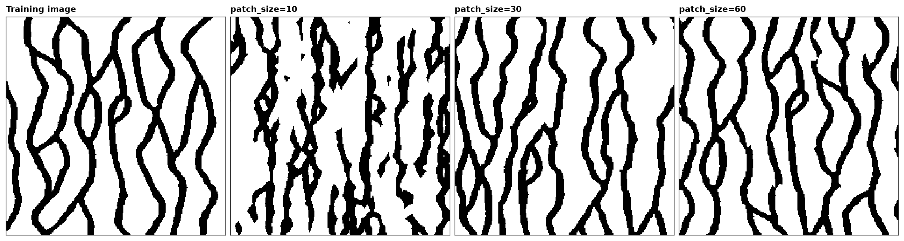
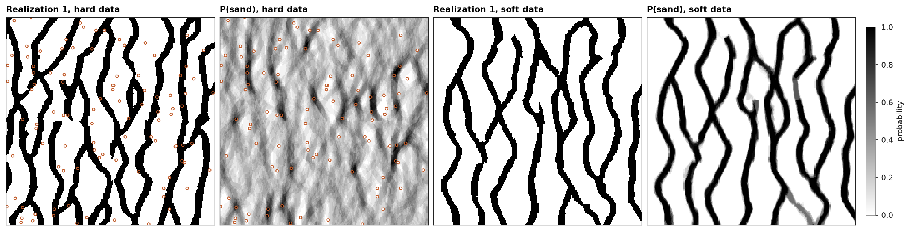

# image quilting

image quilting copies whole patches of the training image instead of one cell at a time. patches overlap along a
raster path. quilting draws each patch among the `n_best` positions of the image that best match what the grid
already holds under it, and joins it to its neighbors along the seam where the two differ least. it is fast, and a
patch keeps the image's patterns intact up to its own size.

<details><summary>Python</summary>

```python
import boitata as bt
import matplotlib.pyplot as plt
import numpy as np
from common import HIGHLIGHT, INK, save
from matplotlib.colors import ListedColormap

ti = bt.datasets.strebelle()
nx, ny = ti.count[:2]
image = ti["facies"].reshape(ny, nx)
grid = bt.BlockModel((0, 0), (1, 1), (nx, ny))


def runs(img, axis):
    """Mean length of the runs of code 1 along `axis` of a (y, x) image."""
    lines = img if axis == 1 else img.T
    lengths = [len(r) for line in lines for r in "".join(map(str, line.astype(int))).split("0") if r]
    return np.mean(lengths)


print(
    f"training image: sand {image.mean():.1%}, runs {runs(image, 0):.1f} cells along Y, {runs(image, 1):.1f} across"
)
```

</details>

```text
training image: sand 27.7%, runs 20.4 cells along Y, 8.5 across
```

`patch_size` sets how much of the image travels in one piece, and the overlap is a sixth of it by default. twenty
realizations for each of three sizes:

<details><summary>Python</summary>

```python
realizations = {}
for size in (10, 30, 60):
    summary = bt.ImageQuilting(ti, "facies", patch_size=size).simulate(grid, n=20, seed=7, keep=True)
    reals = summary.realizations.reshape(-1, ny, nx)
    realizations[size] = reals[0]
    along = np.mean([runs(r, 0) for r in reals])
    print(
        f"patch_size={size}: sand {reals.mean():.1%}, runs {along:.1f} along Y, {np.mean([runs(r, 1) for r in reals]):.1f} across"
    )
```

</details>

```text
patch_size=10: sand 26.9%, runs 19.3 along Y, 8.1 across
patch_size=30: sand 28.7%, runs 20.2 along Y, 8.3 across
patch_size=60: sand 29.7%, runs 20.6 along Y, 8.2 across
```

small patches cut the channels at their seams. at 30 cells the runs along Y match the image's; at 60 the
realizations are the image cut and reassembled, with fewer seams and less variety between them.

<details><summary>Python</summary>

```python
codes = ListedColormap(["white", "black"])


def frame(ax, title):
    ax.set(title=title, xticks=[], yticks=[])
    for side in ax.spines.values():
        side.set(visible=True, color=INK, lw=0.6)


fig, axes = plt.subplots(1, 4, figsize=(15, 3.9), layout="constrained")
panels = [(image, "Training image")] + [(r, f"patch_size={k}") for k, r in realizations.items()]
for ax, (img, title) in zip(axes, panels):
    ax.imshow(img, origin="lower", cmap=codes, vmin=0, vmax=1, interpolation="nearest")
    frame(ax, title)
save(fig, "patches")
```

</details>



when quilting chooses a patch, each hard datum weighs `data_weight` times a mismatched overlap cell, and no patch
pastes over it, so hard data hold in all realizations. soft probabilities add `soft_weight` times the mean of
`1 - P(c)` over the patch, `c` the code the patch puts in each cell. a patch can come from anywhere in the image, so
the truth here is the image mirrored east to west: the same patterns, none of them in the same place. 100 of its
cells serve as hard data, as in [conditioning SNESIM](../../13-multiple-point-statistics/02-snesim-conditioning/README.md), and smoothing turns it into
soft data as in [soft data in SNESIM](../../13-multiple-point-statistics/06-snesim-soft-data/README.md):

<details><summary>Python</summary>

```python
truth = image[:, ::-1]
rows = np.random.default_rng(0).choice(nx * ny, size=100, replace=False)
wells = grid.coords[rows]
facies = truth.ravel()[rows].astype(int)
hard = bt.ImageQuilting(ti, "facies", patch_size=30).fit(wells, facies)
with_data = hard.simulate(grid, n=20, seed=3, keep=True)
print(f"hard data reproduced: {(with_data.realizations[:, rows] == facies).all()}")

kernel = np.ones(11) / 11
p_soft = np.apply_along_axis(np.convolve, 1, truth, kernel, "same")
p_soft = np.clip(np.apply_along_axis(np.convolve, 0, p_soft, kernel, "same"), 0.02, 0.98).ravel()
with_soft = bt.ImageQuilting(ti, "facies", patch_size=30, soft_weight=5.0).simulate(
    grid, n=20, seed=3, keep=[0], soft=np.column_stack([1 - p_soft, p_soft])
)
for name, summary in (("hard data", with_data), ("soft data", with_soft)):
    hits = (summary.realizations[0] == truth.ravel()).mean()
    print(f"{name}: realization 1 matches the truth in {hits:.0%} of cells")
```

</details>

```text
hard data reproduced: True
hard data: realization 1 matches the truth in 62% of cells
soft data: realization 1 matches the truth in 92% of cells
```

a hundred scattered cells barely move a patch cut to fit its overlap, so they change little beyond their own cells.
the soft map covers each cell, and the patches follow it. a map this sharp with `soft_weight=5` leaves the
realizations little room to differ: P(sand) is near 0 or 1, gray only at a few seams. lower the weight when the
soft data are less certain than the patterns.

<details><summary>Python</summary>

```python
fig, axes = plt.subplots(1, 4, figsize=(15, 4), layout="constrained")
panels = (
    (with_data.realizations[0], "Realization 1, hard data", codes),
    (with_data.probabilities[:, 1], "P(sand), hard data", "gray_r"),
    (with_soft.realizations[0], "Realization 1, soft data", codes),
    (with_soft.probabilities[:, 1], "P(sand), soft data", "gray_r"),
)
for ax, (values, title, cmap) in zip(axes, panels):
    im = ax.imshow(values.reshape(ny, nx), origin="lower", cmap=cmap, vmin=0, vmax=1, interpolation="nearest")
    frame(ax, title)
for ax in axes[:2]:
    ax.scatter(
        *wells[:, :2].T, s=10, c=np.where(facies == 1, "black", "white"), edgecolors=HIGHLIGHT, linewidths=0.9
    )
fig.colorbar(im, ax=axes[3], shrink=0.8, label="probability")
save(fig, "conditioning")
```

</details>



[continuous quilting](../../13-multiple-point-statistics/09-image-quilting-continuous/README.md) copies values
instead of codes.

Full script: [`example_13_08.py`](example_13_08.py)
