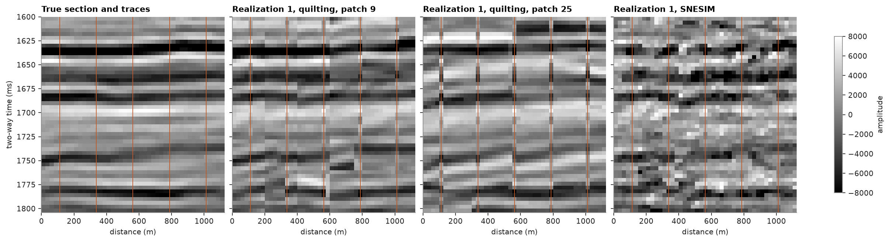

# continuous image quilting

quilting copies values as it copies codes: a mismatch is the squared difference over the squared value range of the
training image, with no classes. here quilting fills the seismic section of
[continuous SNESIM](../../13-multiple-point-statistics/03-snesim-continuous/README.md) between the same five traces.

<details><summary>Python</summary>

```python
import boitata as bt
import matplotlib.pyplot as plt
import numpy as np
from common import HIGHLIGHT, save

seismic = bt.datasets.f3_seismic()
nx, ny, nz = seismic.count
cube = seismic["amplitude"].astype(float).reshape(nz, ny, nx)[::-1]  # time down: row 0 at 1600 ms
image = np.hstack([cube[:, j, :] for j in range(0, 30, 3)])
truth = cube[:, 40, :]
ti = bt.BlockModel((0, 1600), (25, 4), (image.shape[1], nz)).with_columns({"amplitude": image.ravel()})
section = bt.BlockModel((0, 1600), (25, 4), (nx, nz))
traces = [4, 13, 22, 31, 40]
at_traces = np.zeros((nz, nx), bool)
at_traces[:, traces] = True
wells = section.coords[at_traces.ravel()]
values = truth[at_traces]
```

</details>

fifty realizations with patches 9 and 25 cells square, against SNESIM on the same data. the traces are 9 apart, so
each 9-cell patch holds one, and the choice of each patch weighs the trace in it five times as much as its overlap.

<details><summary>Python</summary>

```python
def correlation(a, b):
    return np.corrcoef(np.ravel(a), np.ravel(b))[0, 1]


summaries = {
    f"quilting, patch {size}": bt.ImageQuilting(ti, "amplitude", patch_size=size)
    .fit(wells, values)
    .simulate(section, n=50, seed=11, keep=[0])
    for size in (9, 25)
}
summaries["SNESIM"] = bt.SNESIM(ti, "amplitude").fit(wells, values).simulate(section, n=50, seed=11, keep=[0])
for name, summary in summaries.items():
    print(
        f"{name}: hard data reproduced {np.allclose(summary.realizations[:, at_traces.ravel()], values)}, "
        f"correlation with the true section: realization 1 {correlation(summary.realizations[0], truth):.2f}, "
        f"mean of 50 {correlation(summary.mean, truth):.2f}"
    )
```

</details>

```text
quilting, patch 9: hard data reproduced True, correlation with the true section: realization 1 0.84, mean of 50 0.89
quilting, patch 25: hard data reproduced True, correlation with the true section: realization 1 0.61, mean of 50 0.70
SNESIM: hard data reproduced True, correlation with the true section: realization 1 0.69, mean of 50 0.89
```

small patches follow the traces, and a single realization is nearer the truth than SNESIM's, since each value
between two traces arrives with the reflector around it instead of cell by cell. a 25-cell patch spans three traces
and cannot match them all: the traces stand out as stripes the patch around them fails to continue. SNESIM, cell by
cell, is rougher than either. the seams of the small patches show as steps in the reflectors. the means of 50 are
about as good for the small patches and SNESIM, since both keep what the traces fix.

<details><summary>Python</summary>

```python
extent = (0, nx * 25, 1600 + nz * 4, 1600)
style = {
    "cmap": "gray",
    "vmin": -8000,
    "vmax": 8000,
    "extent": extent,
    "aspect": "auto",
    "interpolation": "nearest",
}
fig, axes = plt.subplots(1, 4, figsize=(15, 4), layout="constrained", sharey=True)
panels = [(truth, "True section and traces")] + [
    (s.realizations[0].reshape(nz, nx), f"Realization 1, {name}") for name, s in summaries.items()
]
for ax, (img, title) in zip(axes, panels):
    im = ax.imshow(img, **style)
    ax.set(title=title, xlabel="distance (m)")
    for t in traces:
        ax.axvline((t + 0.5) * 25, color=HIGHLIGHT, lw=0.8)
axes[0].set_ylabel("two-way time (ms)")
fig.colorbar(im, ax=axes, shrink=0.8, label="amplitude")
save(fig, "sections")
```

</details>



[seismic volumes](../../13-multiple-point-statistics/10-seismic-volumes/README.md) reads and writes SEG-Y and uses
seismic as secondary data for quilting.

Full script: [`example_13_09.py`](example_13_09.py)
