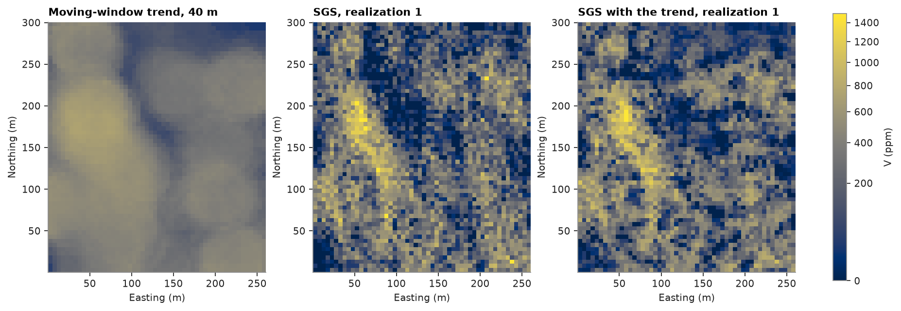
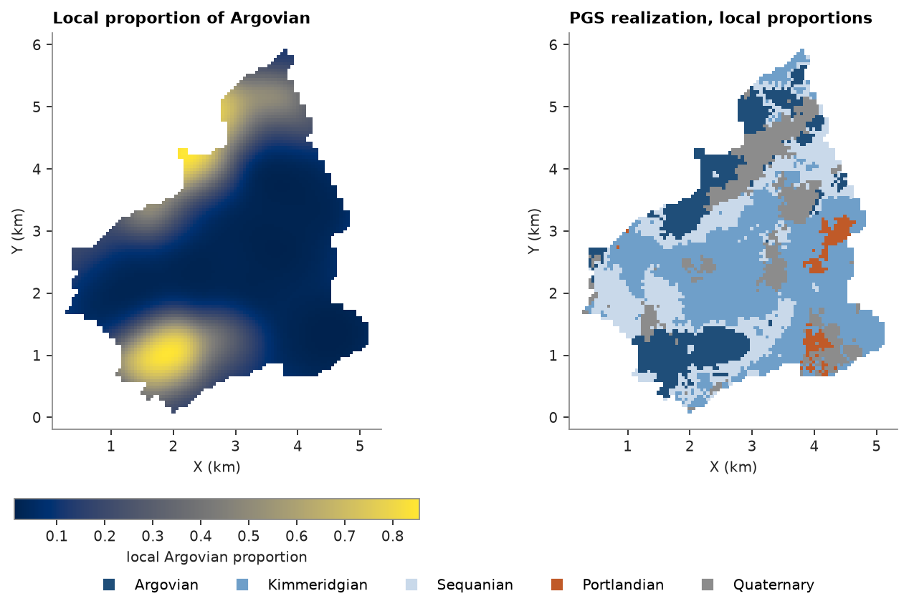
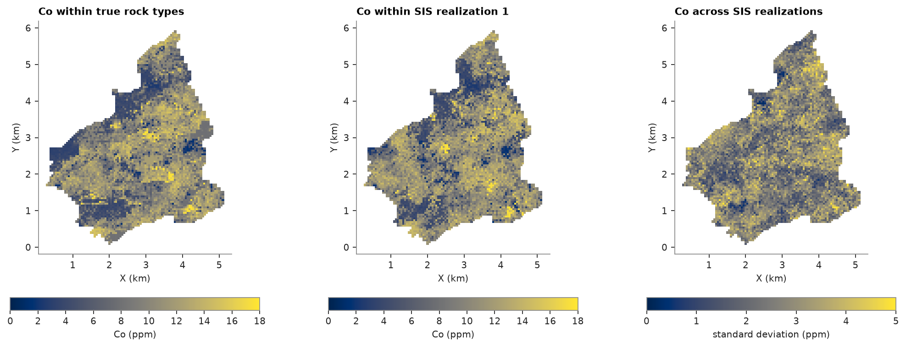

# 13. Simulation methods

Sequential Gaussian simulation (SGS) and turning bands simulate a continuous variable; sequential indicator
simulation (SIS) and plurigaussian simulation (PGS) simulate categories. Several correlated grades are simulated
through independent factors in [chapter 17](../17-multivariate/README.md).

<details><summary>Python</summary>

```python
import ceres as cs
import matplotlib.pyplot as plt
import numpy as np
from common import map_axes, save
from matplotlib.colors import ListedColormap, PowerNorm

samples = cs.datasets.walker_lake()
xy, v = samples.coords, samples["V"]
weights = cs.cell_declustering(xy, v, sizes=np.arange(2.5, 102.5, 2.5)).weights
gaussian = cs.Variogram([("spherical", 0.68, 82.0)], nugget=0.32, rotation=(170, 0, 0), ratios=(0.43, 1.0))
grid = cs.BlockModel(origin=(0.5, 0.5), size=(5, 5), count=(52, 60))
```

</details>

Both use the normal-score variogram of [chapter 5](../05-simulation/README.md). SGS visits nodes along a random
path, kriging each from data and nodes already simulated. Turning bands sums many one-dimensional processes along
random lines into an unconditional Gaussian field, then conditions it to the data by kriging the residuals.

<details><summary>Python</summary>

```python
sgs = cs.SGS(gaussian, cs.Search(radius=100, max_samples=24)).fit(xy, v, weights=weights)
tb = cs.TurningBands(gaussian, bands=500).fit(xy, v, weights=weights)
start = time.perf_counter()
by_sgs = sgs.simulate(grid, n=20, seed=5, realizations=True).realizations
sgs_seconds = time.perf_counter() - start
start = time.perf_counter()
by_tb = tb.simulate(grid, n=20, seed=5, realizations=True).realizations
tb_seconds = time.perf_counter() - start
for name, reals, seconds in (("SGS", by_sgs, sgs_seconds), ("turning bands", by_tb, tb_seconds)):
    print(
        f"{name:>13}: 20 realizations in {seconds:.2f} s, mean {reals.mean():.0f} ppm, variance {reals.var():.0f} ppm²"
    )
```

</details>

```text
          SGS: 20 realizations in 0.06 s, mean 299 ppm, variance 72174 ppm²
turning bands: 20 realizations in 0.11 s, mean 289 ppm, variance 61368 ppm²
```

<details><summary>Python</summary>

```python
shape = (60, 52)
extent = (0.5, 260.5, 0.5, 300.5)
norm = PowerNorm(0.5, vmin=0, vmax=1500)
fig, axes = plt.subplots(1, 4, figsize=(15, 4.4), layout="constrained")
panels = [
    (by_sgs[0], "SGS, realization 1"),
    (by_sgs[1], "SGS, realization 2"),
    (by_tb[0], "Turning bands, realization 1"),
    (by_tb[1], "Turning bands, realization 2"),
]
for ax, (image, title) in zip(axes, panels):
    im = ax.imshow(image.reshape(shape), origin="lower", extent=extent, norm=norm)
    map_axes(ax, title)
fig.colorbar(im, ax=axes, shrink=0.8, label="V (ppm)")
save(fig, "continuous")
```

</details>


## With a trend

Far from the data, SGS draws from the global histogram, wherever it is. A trend known everywhere can steer it
instead. Here the trend is a moving-window average of V within 40 m, built with an existing estimator; any model
or estimate would do. `trend=` gives it at the data to `fit` and at the nodes to `simulate`, as an array or the
name of a BlockModel column. The data are normal-scored within 8 equal-probability classes of the trend, the
stepwise conditional transform of [chapter 17](../17-multivariate/README.md) on (trend, V), which leaves scores
independent of the trend. Those scores are simulated with their own variogram, and every node is back-transformed
with the histogram of its trend class, before any averaging to `blocks`.

<details><summary>Python</summary>

```python
window = cs.MovingAverage(cs.Search(radius=40, max_samples=200)).fit(xy, v)
trend = window.predict(xy)
trended = grid.with_column("trend", window.predict(grid))
pair = np.column_stack([trend, v])
scores = cs.StepwiseConditional(classes=8).fit(pair, weights=weights).transform(pair)[:, 1]
score_variogram = cs.experimental_variogram(xy, scores, 10.0, 150.0).fit("spherical")
with_trend = cs.SGS(score_variogram, cs.Search(radius=100, max_samples=24), classes=8)
with_trend.fit(xy, v, weights=weights, trend=trend)
by_trend = with_trend.simulate(trended, n=20, seed=5, realizations=True, trend="trend").realizations

node_trend = trended["trend"]
cov = np.cov(v, trend, aweights=weights)
print(f"correlation with the trend: data {cov[0, 1] / np.sqrt(cov[0, 0] * cov[1, 1]):.2f}", end="")
for name, reals in (("SGS", by_sgs), ("SGS with trend", by_trend)):
    print(f", {name} {np.mean([np.corrcoef(r, node_trend)[0, 1] for r in reals]):.2f}", end="")
edges = np.quantile(node_trend, [0.25, 0.5, 0.75])
at_data, at_nodes = np.digitize(trend, edges), np.digitize(node_trend, edges)
print(f"\n{'mean V (ppm) by trend quartile':<32}{'data':>6}{'SGS':>6}{'SGS with trend':>16}")
for k in range(4):
    data_mean = np.average(v[at_data == k], weights=weights[at_data == k])
    plain_mean, trend_mean = (reals[:, at_nodes == k].mean() for reals in (by_sgs, by_trend))
    print(f"{f'quartile {k + 1}':<32}{data_mean:6.0f}{plain_mean:6.0f}{trend_mean:16.0f}")
```

</details>

```text
correlation with the trend: data 0.53, SGS 0.43, SGS with trend 0.50
mean V (ppm) by trend quartile    data   SGS  SGS with trend
quartile 1                         115   156             113
quartile 2                         273   267             276
quartile 3                         328   328             320
quartile 4                         466   446             455
```

<details><summary>Python</summary>

```python
fig, axes = plt.subplots(1, 3, figsize=(11.5, 4.4), layout="constrained")
panels = [
    (node_trend, "Moving-window trend, 40 m"),
    (by_sgs[0], "SGS, realization 1"),
    (by_trend[0], "SGS with the trend, realization 1"),
]
for ax, (image, title) in zip(axes, panels):
    im = ax.imshow(image.reshape(shape), origin="lower", extent=extent, norm=norm)
    map_axes(ax, title)
fig.colorbar(im, ax=axes, shrink=0.8, label="V (ppm)")
save(fig, "trend")
```

</details>



Plain SGS already follows the trend where data are dense, but pulls the low-trend quarter up towards the global
mean; with the trend, each quarter keeps the declustered mean of its data, and the realizations correlate with the
trend about as much as the data do.

## Categories

Jura's rock types are known everywhere on the prediction grid, so simulated categories can be compared with the
real geology. SIS krigs, at each node, the probability of every rock type from indicator variograms; PGS truncates
a Gaussian field at thresholds set by the proportions, which orders the types. A hierarchical `rule` truncates
several fields in turn: here the first sets Quaternary cover apart from the Jurassic, and the second orders the
Jurassic stages from Argovian to Portlandian, so the cover may touch every stage but each stage touches only the
next.

<details><summary>Python</summary>

```python
train = cs.datasets.jura()["prediction"]
jura_grid = cs.datasets.jura()["grid"]
names = ["Argovian", "Kimmeridgian", "Sequanian", "Portlandian", "Quaternary"]
code = {name: i for i, name in enumerate(names)}
rock = np.array([code[r] for r in train["Rock"]])
true_rock = np.array([code[r] for r in jura_grid["Rock"]])
proportions = np.bincount(rock, minlength=5) / len(rock)

indicator_models = []
for k in range(5):
    indicator = (rock == k).astype(float)
    if indicator.sum() >= 5:
        fitted = cs.experimental_variogram(train.coords, indicator, 0.1, 1.5).fit("spherical")
    else:
        fitted = cs.Variogram([("spherical", indicator.var(), 0.5)])
    indicator_models.append(fitted)

sis = cs.SIS(indicator_models, cs.Search(radius=1.5, max_samples=16)).fit(train.coords, rock)
sis_summary = sis.simulate(jura_grid, n=10, seed=3, realizations=True)
by_sis = sis_summary.realizations
latent = cs.Variogram([("spherical", 1.0, 0.8)])
pgs = cs.Plurigaussian(latent, proportions=proportions).fit(train.coords, rock)
by_pgs = pgs.simulate(jura_grid, n=1, seed=3, realizations=True).realizations[0]
stages = (1, [code["Argovian"], code["Sequanian"], code["Kimmeridgian"], code["Portlandian"]])
rule = (0, [stages, code["Quaternary"]])
hierarchy = cs.Plurigaussian([latent, latent], proportions=proportions, rule=rule).fit(train.coords, rock)
by_rule = hierarchy.simulate(jura_grid, n=1, seed=3, realizations=True).realizations[0]

simulated = (("SIS", by_sis[0]), ("PGS ordered", by_pgs), ("PGS rule", by_rule))
print(f"{'':>13}" + "".join(f"{n[:5]:>8}" for n in names))
for label, cats in (("samples", rock), ("true grid", true_rock), *simulated):
    shares = np.bincount(cats, minlength=5) / len(cats)
    print(f"{label:>13}" + "".join(f"{s:8.2f}" for s in shares))
for label, cats in simulated:
    print(f"{label}: {np.mean(cats == true_rock):.0%} of nodes match the true rock type")
matches = np.mean(sis_summary.most_likely == true_rock)
print(
    f"SIS most likely type over 10 realizations: {matches:.0%} match, mean entropy {sis_summary.entropy.mean():.2f}"
)
```

</details>

```text
                Argov   Kimme   Sequa   Portl   Quate
      samples    0.20    0.33    0.24    0.01    0.21
    true grid    0.20    0.34    0.27    0.05    0.13
          SIS    0.12    0.43    0.29    0.01    0.15
  PGS ordered    0.18    0.36    0.29    0.01    0.16
     PGS rule    0.19    0.40    0.22    0.03    0.16
SIS: 51% of nodes match the true rock type
PGS ordered: 43% of nodes match the true rock type
PGS rule: 49% of nodes match the true rock type
SIS most likely type over 10 realizations: 64% match, mean entropy 0.36
```

<details><summary>Python</summary>

```python
colors = ListedColormap(["#1f4e79", "#6f9fc9", "#c9d9ea", "#c05a28", "#8c8c8c"])
fig, axes = plt.subplots(2, 2, figsize=(8.5, 10), layout="constrained")
panels = [
    (true_rock, "True rock types"),
    (by_sis[0], "SIS realization"),
    (by_pgs, "PGS realization, ordered"),
    (by_rule, "PGS realization, hierarchical rule"),
]
for ax, (cats, title) in zip(axes.flat, panels):
    ax.scatter(
        *jura_grid.coords[:, :2].T, c=cats, cmap=colors, vmin=-0.5, vmax=4.5, s=7, marker="s", linewidths=0
    )
    ax.set_aspect("equal")
    ax.set(title=title, xlabel="X (km)", ylabel="Y (km)")
handles = [plt.Line2D([], [], marker="s", ls="", color=colors(i), label=n) for i, n in enumerate(names)]
fig.legend(handles=handles, loc="outside lower center", ncol=5, frameon=False)
save(fig, "categories")
```

</details>


SIS gives each type its own indicator variogram and matches the true type at half the nodes. Ordered PGS reproduces
the proportions closely, but its rule only allows contacts between neighbours in the order, so Portlandian appears
as specks along every Sequanian-Quaternary contact. The hierarchical rule puts Portlandian next to Kimmeridgian and
under the cover, as in the true map, and matches about as many nodes as SIS. None recovers Portlandian's 5 % of the
area from 3 of 259 samples.

Proportions need not be global. Given local proportions at the samples at `fit` and at the nodes at `simulate`,
the rule's thresholds follow them, so each rock type is likelier where its samples cluster. Here they are the rock
types of the samples averaged with Gaussian weights of 300 m, shrunk towards the global proportions where samples
are sparse.

<details><summary>Python</summary>

```python
onehot = np.eye(5)[rock]


def local_proportions(xy, bandwidth=0.3):
    d2 = ((xy[:, None, :2] - train.coords[None, :, :2]) ** 2).sum(-1)
    w = np.exp(-0.5 * d2 / bandwidth**2)
    return (w @ onehot + proportions) / (w.sum(axis=1, keepdims=True) + 1)


at_nodes = local_proportions(jura_grid.coords)
hierarchy.fit(train.coords, rock, proportions=local_proportions(train.coords))
by_local = hierarchy.simulate(jura_grid, n=1, seed=3, realizations=True, proportions=at_nodes).realizations[0]
print(f"PGS rule, local proportions: {np.mean(by_local == true_rock):.0%} of nodes match the true rock type")
```

</details>

```text
PGS rule, local proportions: 56% of nodes match the true rock type
```

<details><summary>Python</summary>

```python
fig, axes = plt.subplots(1, 2, figsize=(9, 5.2), layout="constrained")
im = axes[0].scatter(
    *jura_grid.coords[:, :2].T, c=at_nodes[:, code["Argovian"]], s=7, marker="s", linewidths=0
)
fig.colorbar(im, ax=axes[0], shrink=0.8, orientation="horizontal", label="local Argovian proportion")
axes[1].scatter(
    *jura_grid.coords[:, :2].T, c=by_local, cmap=colors, vmin=-0.5, vmax=4.5, s=7, marker="s", linewidths=0
)
for ax, title in zip(axes, ("Local proportion of Argovian", "PGS realization, local proportions")):
    ax.set_aspect("equal")
    ax.set(title=title, xlabel="X (km)", ylabel="Y (km)")
fig.legend(handles=handles, loc="outside lower center", ncol=5, frameon=False)
save(fig, "local-proportions")
```

</details>



With local proportions, Argovian keeps to the north-west and the south where its samples are, and the realization
matches the true rock type at 56 % of the nodes, against 49 % with global proportions.

The latent variograms so far were guesses. Each rock type's indicator variogram follows from the rule and the latent
variograms, so `fit_variograms` rescales the latent ranges until those implied variograms match the experimental
ones; Portlandian, with 3 samples, is left out.

<details><summary>Python</summary>

```python
from common import ACCENT, GREY

experimental = [
    cs.experimental_variogram(train.coords, (rock == k).astype(float), 0.1, 1.5)
    if k != code["Portlandian"]
    else None
    for k in range(5)
]
guessed = cs.Plurigaussian([latent, latent], proportions=proportions, rule=rule)
fitted = cs.Plurigaussian([latent, latent], proportions=proportions, rule=rule).fit_variograms(experimental)
cover, stage = (v.structures[0].range for v in fitted.variograms)
print(f"fitted latent ranges: {cover:.2f} km for the cover field, {stage:.2f} km for the stages field")
fitted.fit(train.coords, rock, proportions=local_proportions(train.coords))
by_fitted = fitted.simulate(jura_grid, n=1, seed=3, realizations=True, proportions=at_nodes).realizations[0]
print(
    f"PGS rule, local proportions, fitted: {np.mean(by_fitted == true_rock):.0%} of nodes match the true rock type"
)
```

</details>

```text
fitted latent ranges: 0.49 km for the cover field, 1.87 km for the stages field
PGS rule, local proportions, fitted: 59% of nodes match the true rock type
```

<details><summary>Python</summary>

```python
h = np.linspace(0, 1.5, 61)
fig, axes = plt.subplots(1, 4, figsize=(13, 3.4), layout="constrained", sharey=True)
for ax, k in zip(axes, [k for k in range(5) if experimental[k] is not None]):
    ax.plot(experimental[k].lags, experimental[k].gammas, "o", color=GREY, ms=4, label="experimental")
    ax.plot(h, guessed.indicator_variograms(h)[k], "--", color=GREY, label="guessed ranges")
    ax.plot(h, fitted.indicator_variograms(h)[k], color=ACCENT, label="fitted ranges")
    ax.set(title=names[k], xlabel="lag (km)")
axes[0].set_ylabel("indicator semivariance")
axes[0].legend(frameon=False, loc="lower right")
save(fig, "latent-variograms")
```

</details>


The fitted cover field is short and the stages field long, so the stages form broad bands that the cover patches
over; with 0.8 km on both, the stages varied too fast. The fitted variograms follow the experimental points of
every rock type and bring the match to 59 %.

## Grades within simulated rock types

Simulated rock types can host the grade simulation. Fitted with `domains`, SGS normal-scores Co within each rock
type, Argovian holding about half the Co of the others. Given the `(n, targets)` array of SIS realizations as
`domains`, realization k of Co is simulated within realization k of the rock types, so the grades carry the
uncertainty of the contacts; one row of labels, here the true rock types, holds the domains fixed.

<details><summary>Python</summary>

```python
co = train["Co"]
co_scores = np.empty(len(co))
for k in range(5):
    co_scores[rock == k] = cs.NormalScore().fit_transform(co[rock == k])
co_variogram = cs.experimental_variogram(train.coords, co_scores, 0.1, 1.5).fit("spherical")
cobalt = cs.SGS(co_variogram, cs.Search(radius=1.5, max_samples=16)).fit(train.coords, co, domains=rock)
within_true = cobalt.simulate(jura_grid, n=10, seed=3, realizations=True, domains=true_rock).realizations
within_sis = cobalt.simulate(jura_grid, n=10, seed=3, realizations=True, domains=by_sis).realizations

argovian = (by_sis == 0).mean(axis=0)
unsure = (argovian > 0) & (argovian < 1)
print(f"{'Co (ppm)':<42}{'true rock types':>16}{'SIS rock types':>16}")
rows = [
    ("mean", lambda r: r.mean()),
    ("mean on true Argovian", lambda r: r[:, true_rock == 0].mean()),
    ("std where SIS is unsure of Argovian", lambda r: r.std(axis=0)[unsure].mean()),
    ("std elsewhere", lambda r: r.std(axis=0)[~unsure].mean()),
]
for label, stat in rows:
    print(f"{label:<42}{stat(within_true):16.2f}{stat(within_sis):16.2f}")
print(f"SIS is unsure whether {unsure.mean():.0%} of the nodes are Argovian")
```

</details>

```text
Co (ppm)                                   true rock types  SIS rock types
mean                                                  9.39            9.53
mean on true Argovian                                 5.49            7.23
std where SIS is unsure of Argovian                   2.10            2.94
std elsewhere                                         2.19            2.53
SIS is unsure whether 33% of the nodes are Argovian
```

<details><summary>Python</summary>

```python
fig, axes = plt.subplots(1, 3, figsize=(13, 4.6), layout="constrained")
panels = [
    (within_true[0], "Co within true rock types", "Co (ppm)", 18),
    (within_sis[0], "Co within SIS realization 1", "Co (ppm)", 18),
    (within_sis.std(axis=0), "Co across SIS realizations", "standard deviation (ppm)", 5),
]
for ax, (image, title, label, top) in zip(axes, panels):
    im = ax.scatter(*jura_grid.coords[:, :2].T, c=image, s=7, marker="s", linewidths=0, vmin=0, vmax=top)
    ax.set_aspect("equal")
    ax.set(title=title, xlabel="X (km)", ylabel="Y (km)")
    fig.colorbar(im, ax=ax, shrink=0.8, orientation="horizontal", label=label)
save(fig, "grades-in-rock-types")
```

</details>



Within the true rock types Co drops sharply at every Argovian contact. Within SIS's rock types the contacts move
from one realization to the next, so the lean Argovian Co spreads over its uncertain margin: where SIS is unsure
of Argovian, the spread of Co across realizations grows by about 40 %.

Full script: [`example_13.py`](example_13.py)
