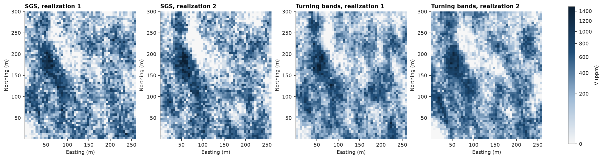
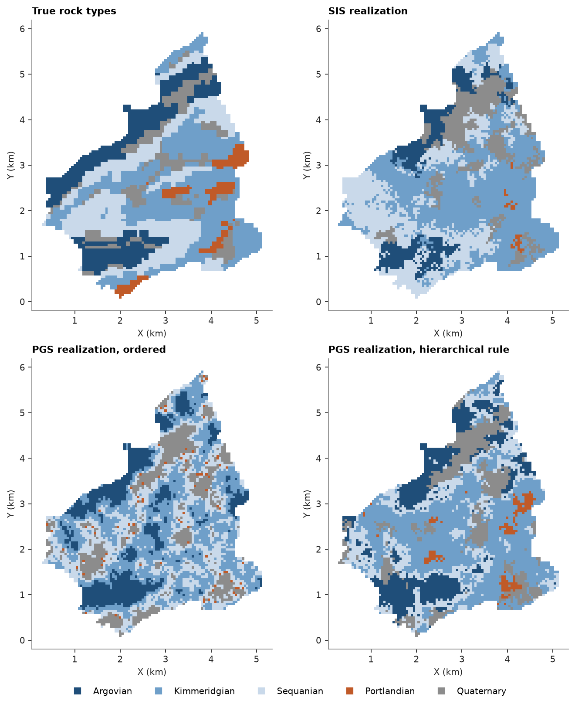

# 13. Simulation methods

Sequential Gaussian simulation (SGS) and turning bands simulate a continuous variable; sequential indicator
simulation (SIS) and plurigaussian simulation (PGS) simulate categories.

<details><summary>Python</summary>

```python
import ceres as cs
import matplotlib.pyplot as plt
import numpy as np
from common import fetch, map_axes, save
from matplotlib.colors import ListedColormap, PowerNorm

samples = cs.PointSet.from_table(cs.read_csv(fetch("walker-lake/sample.csv")))
xy, v = samples.coords, samples["V"]
weights = cs.cell_declustering(xy, v, sizes=np.arange(2.5, 102.5, 2.5)).weights
gaussian = cs.Variogram([("spherical", 0.68, 82.0)], nugget=0.32, rotation=(170, 0, 0), ratios=(0.43, 1.0))
grid = cs.BlockModel(origin=(0.5, 0.5), size=(5, 5), count=(52, 60))
```

</details>

Both use the normal-score variogram of [chapter 5](../05-simulation/README.md). SGS visits nodes along a random
path, kriging each from data and nodes already simulated. Turning bands sums many one-dimensional processes along
random lines into an unconditional Gaussian field, then conditions it to the data by kriging the residuals.

<details><summary>Python</summary>

```python
sgs = cs.SGS(gaussian, cs.Search(radius=100, max_samples=24)).fit(xy, v, weights=weights)
tb = cs.TurningBands(gaussian, bands=500).fit(xy, v, weights=weights)
start = time.perf_counter()
by_sgs = sgs.simulate(grid, n=20, seed=5, realizations=True).realizations
sgs_seconds = time.perf_counter() - start
start = time.perf_counter()
by_tb = tb.simulate(grid, n=20, seed=5, realizations=True).realizations
tb_seconds = time.perf_counter() - start
for name, reals, seconds in (("SGS", by_sgs, sgs_seconds), ("turning bands", by_tb, tb_seconds)):
    print(
        f"{name:>13}: 20 realizations in {seconds:.2f} s, mean {reals.mean():.0f} ppm, variance {reals.var():.0f} ppm²"
    )
```

</details>

```text
          SGS: 20 realizations in 0.38 s, mean 299 ppm, variance 72174 ppm²
turning bands: 20 realizations in 0.09 s, mean 289 ppm, variance 62047 ppm²
```

<details><summary>Python</summary>

```python
shape = (60, 52)
extent = (0.5, 260.5, 0.5, 300.5)
norm = PowerNorm(0.5, vmin=0, vmax=1500)
fig, axes = plt.subplots(1, 4, figsize=(15, 4.4), layout="constrained")
panels = [
    (by_sgs[0], "SGS, realization 1"),
    (by_sgs[1], "SGS, realization 2"),
    (by_tb[0], "Turning bands, realization 1"),
    (by_tb[1], "Turning bands, realization 2"),
]
for ax, (image, title) in zip(axes, panels):
    im = ax.imshow(image.reshape(shape), origin="lower", extent=extent, norm=norm)
    map_axes(ax, title)
fig.colorbar(im, ax=axes, shrink=0.8, label="V (ppm)")
save(fig, "continuous")
```

</details>



Jura's rock types are known everywhere on the prediction grid, so simulated categories can be compared with the
real geology. SIS krigs, at each node, the probability of every rock type from indicator variograms; PGS truncates
a Gaussian field at thresholds set by the proportions, which orders the types.

<details><summary>Python</summary>

```python
train = cs.PointSet.from_table(cs.read_csv(fetch("jura/prediction.csv")))
jura_grid = cs.PointSet.from_table(cs.read_csv(fetch("jura/grid.csv")))
names = ["Argovian", "Kimmeridgian", "Sequanian", "Portlandian", "Quaternary"]
code = {name: i for i, name in enumerate(names)}
rock = np.array([code[r] for r in train["Rock"]])
true_rock = np.array([code[r] for r in jura_grid["Rock"]])
proportions = np.bincount(rock, minlength=5) / len(rock)

indicator_models = []
for k in range(5):
    indicator = (rock == k).astype(float)
    if indicator.sum() >= 5:
        fitted = cs.experimental_variogram(train.coords, indicator, 0.1, 1.5).fit("spherical")
    else:
        fitted = cs.Variogram([("spherical", indicator.var(), 0.5)])
    indicator_models.append(fitted)

sis = cs.SIS(indicator_models, cs.Search(radius=1.5, max_samples=16)).fit(train.coords, rock)
sis_summary = sis.simulate(jura_grid, n=10, seed=3, realizations=True)
by_sis = sis_summary.realizations
pgs = cs.Plurigaussian(cs.Variogram([("spherical", 1.0, 0.8)]), proportions=proportions).fit(
    train.coords, rock
)
by_pgs = pgs.simulate(jura_grid, n=1, seed=3, realizations=True).realizations[0]

print(f"{'':>13}" + "".join(f"{n[:5]:>8}" for n in names))
for label, cats in (("samples", rock), ("true grid", true_rock), ("SIS", by_sis[0]), ("PGS", by_pgs)):
    shares = np.bincount(cats, minlength=5) / len(cats)
    print(f"{label:>13}" + "".join(f"{s:8.2f}" for s in shares))
for label, cats in (("SIS", by_sis[0]), ("PGS", by_pgs)):
    print(f"{label}: {np.mean(cats == true_rock):.0%} of nodes match the true rock type")
matches = np.mean(sis_summary.most_likely == true_rock)
print(
    f"SIS most likely type over 10 realizations: {matches:.0%} match, mean entropy {sis_summary.entropy.mean():.2f}"
)
```

</details>

```text
                Argov   Kimme   Sequa   Portl   Quate
      samples    0.20    0.33    0.24    0.01    0.21
    true grid    0.20    0.34    0.27    0.05    0.13
          SIS    0.12    0.43    0.29    0.01    0.15
          PGS    0.18    0.37    0.27    0.01    0.17
SIS: 51% of nodes match the true rock type
PGS: 40% of nodes match the true rock type
SIS most likely type over 10 realizations: 64% match, mean entropy 0.36
```

<details><summary>Python</summary>

```python
colors = ListedColormap(["#1f4e79", "#6f9fc9", "#c9d9ea", "#c05a28", "#8c8c8c"])
fig, axes = plt.subplots(1, 3, figsize=(13, 4.6), layout="constrained")
for ax, (cats, title) in zip(
    axes, [(true_rock, "True rock types"), (by_sis[0], "SIS realization"), (by_pgs, "PGS realization")]
):
    ax.scatter(
        *jura_grid.coords[:, :2].T, c=cats, cmap=colors, vmin=-0.5, vmax=4.5, s=7, marker="s", linewidths=0
    )
    ax.set_aspect("equal")
    ax.set(title=title, xlabel="X (km)", ylabel="Y (km)")
handles = [plt.Line2D([], [], marker="s", ls="", color=colors(i), label=n) for i, n in enumerate(names)]
fig.legend(handles=handles, loc="outside lower center", ncol=5, frameon=False)
save(fig, "categories")
```

</details>



SIS gives each type its own indicator variogram and matches the true type at half the nodes. PGS reproduces the
proportions closely, but its ordered rule only allows contacts between neighbours in the order, so Portlandian appears
as specks along every Sequanian-Quaternary contact: suited to sequences like stratigraphy, not these rocks. Neither
recovers Portlandian's 5 % of the area from 3 of 259 samples.

Full script: [`example.py`](example.py)
