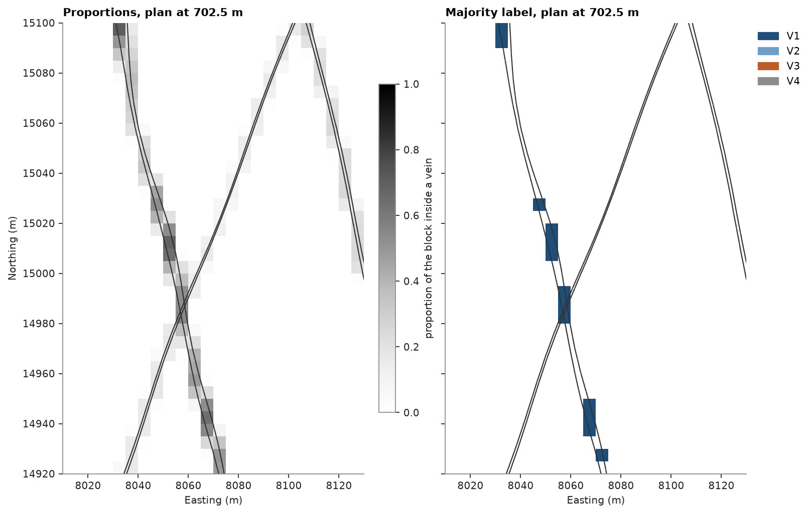

# Flag solid proportions in a block model

A grade-control model of 5 m blocks has to carry four gold veins, modeled as solids one to two meters thick.
Most blocks a vein reaches lie partly inside it. You measure the fraction of each block inside each vein, flag the
partial blocks, compare one domain label per block with stored proportions, and check that the volume in the
blocks adds back up to the volume of each solid.

<details><summary>Python</summary>

```python
import boitata as bt
import matplotlib.pyplot as plt
import numpy as np
from common import ACCENT, GRAY, HIGHLIGHT, save
```

</details>

!!! learn "What you'll learn"
    - How `Mesh.proportion` measures the fraction of each block inside a solid.
    - How to flag blocks as outside, partial or full, and find blocks two solids share.
    - Why a majority label loses a thin vein, and what to store instead.
    - The volume balance: block volume × proportion, summed, against the solid's own volume.

    Prerequisites: [solids](../../02-data-and-geometry/05-solids/README.md) and
    [block model from extents](../../02-data-and-geometry/12-block-model-from-extents/README.md).

## The data

The vein-gold grade-control dataset holds four veins. Confirm first that each is a closed solid
([find and fix degenerate solids](../../14-workflows/03-degenerate-solids/README.md) covers one that is not). Twice
the volume over the surface area gives a vein's mean thickness.

<details><summary>Python</summary>

```python
data = bt.datasets.vein_gold_grade_control()
names = ["V1", "V2", "V3", "V4"]
veins = [data[f"vein_{name}"] for name in names]
for name, vein in zip(names, veins):
    report = vein.validate()
    print(f"{name}: {report}, {vein.volume:9,.0f} m3, mean thickness {2 * vein.volume / vein.area:.1f} m")
```

</details>

```text
V1: MeshReport(0 problems, 1 shells, closed),   658,570 m3, mean thickness 2.0 m
V2: MeshReport(3 problems, 1 shells, closed),   142,085 m3, mean thickness 1.0 m
V3: MeshReport(0 problems, 1 shells, closed),   179,815 m3, mean thickness 1.0 m
V4: MeshReport(0 problems, 1 shells, closed),    55,521 m3, mean thickness 0.7 m
```

!!! step "Step 1: Build the block model"
    `BlockModel.from_extents` sizes a grid of 5 m blocks around the veins with a 10 m buffer, its origin snapped
    to a multiple of the block size.

<details><summary>Python</summary>

```python
size = (5, 5, 5)
model = bt.BlockModel.from_extents(*veins, size=size, buffer=10, snap=True)
block_volume = np.prod(size)
print(model)
```

</details>

```text
BlockModel(regular, 1060200 of 1060200 cells, count [62, 171, 100], size [5.0, 5.0, 5.0], rotation [0.0, 0.0, 0.0])
```

!!! step "Step 2: Measure the proportion of each block inside each vein"
    `proportion` returns one number per block between 0 and 1. Blocks the surface does not cross are settled by
    their centroid: all inside or all outside. Blocks it crosses get a grid of `discretization`
    points per axis, 4 by default, and the proportion is the fraction of those points inside the solid.

<figure class="bt-figure">
--8<-- "svg/w1-proportion.svg"
<figcaption><b>Figure 1.</b> The proportion of a block the vein crosses is the fraction of its discretization
points inside the vein, here 7 of 16 in a 4 × 4 grid (in 3D, 4 × 4 × 4 = 64 points). Blocks the vein surface
misses are settled by their centroid.</figcaption>
</figure>

<details><summary>Python</summary>

```python
proportions = np.array([vein.proportion(model) for vein in veins])
total = proportions.sum(axis=0)
print(f"{(total > 0).sum():,} of {len(model):,} blocks touch a vein")
```

</details>

```text
38,938 of 1,060,200 blocks touch a vein
```

!!! step "Step 3: Flag outside, partial and full blocks"
    A block is partial when its proportion is above 0 and below 1. The veins are thinner than the blocks, so
    almost every block they touch is partial.

<details><summary>Python</summary>

```python
flag = np.select([total == 0, total < 1], ["outside", "partial"], "full")
for name in ("outside", "partial", "full"):
    print(f"{name:>8}: {(flag == name).sum():>9,} blocks")
print(f"largest proportion {total.max():.2f}")
```

</details>

```text
 outside: 1,021,262 blocks
 partial:    38,915 blocks
    full:        23 blocks
largest proportion 1.09
```

A total above 1 means two veins overlap. Every overlap lies in blocks where two or more veins have a proportion.
To measure it, discretize those blocks into 10 × 10 × 10 points of 0.5 m and test each point against every vein.

<details><summary>Python</summary>

```python
shared = (proportions > 0).sum(axis=0) >= 2
points = model.filter(shared).discretize(10)
inside = np.array([vein.contains(points.coords) for vein in veins])
point_volume = points.volumes[0]
for i in range(len(veins)):
    for j in range(i + 1, len(veins)):
        if (both := inside[i] & inside[j]).any():
            print(f"{names[i]} and {names[j]} share {both.sum() * point_volume:,.0f} m3")
print(f"{shared.sum()} blocks hold two veins or more, {(total > 1).sum()} have a total above 1")
```

</details>

```text
V1 and V4 share 1,307 m3
V2 and V4 share 390 m3
V3 and V4 share 350 m3
461 blocks hold two veins or more, 4 have a total above 1
```

V4 crosses the three other veins. Counting that space once needs a priority: here V1 to V3 keep it and V4 gives
it up. In the shared blocks, each point goes to the first vein in that order that holds it, and the proportions
are recounted from the points.

<details><summary>Python</summary>

```python
first = np.where(inside.any(axis=0), inside.argmax(axis=0), -1)
rows = model.row_at(points.coords)
per_block = 10**3
net = proportions.copy()
for i in range(len(veins)):
    net[i, shared] = np.bincount(rows[first == i], minlength=len(model))[shared] / per_block
model = model.with_columns({f"p_{name}": p for name, p in zip(names, net)})
print(f"largest total after the priority: {net.sum(axis=0).max():.2f}")
```

</details>

```text
largest total after the priority: 1.00
```

!!! step "Step 4: One label per block, or proportions?"
    A block model often carries one domain per block: the vein filling most of the block, if veins fill at least
    half of it. That rule suits solids much thicker than the blocks. The alternative keeps the four proportion
    columns and weights every block by them.

<figure class="bt-figure">
--8<-- "svg/w1-majority.svg"
<figcaption><b>Figure 2.</b> A vein thinner than the blocks fills less than half of every block it crosses. A
majority rule labels none of them, and the vein disappears from the model; its proportions keep all of
it.</figcaption>
</figure>

<details><summary>Python</summary>

```python
filled = net.sum(axis=0)
majority = np.where(filled >= 0.5, net.argmax(axis=0), -1)
model = model.with_column("domain", np.array(["waste", *names])[majority + 1].tolist())
print(f"{'':4}{'solid (m3)':>12}{'proportions':>13}{'majority':>10}{'kept':>7}")
for i, (name, vein) in enumerate(zip(names, veins)):
    labeled = (majority == i).sum() * block_volume
    print(
        f"{name:4}{vein.volume:12,.0f}{net[i].sum() * block_volume:13,.0f}{labeled:10,.0f}"
        f"{labeled / vein.volume:7.0%}"
    )
```

</details>

```text
      solid (m3)  proportions  majority   kept
V1       658,570      658,416   375,125    57%
V2       142,085      142,080    10,250     7%
V3       179,815      179,757     6,625     4%
V4        55,521       53,361     1,375     2%
```

On a plan at 702.5 m, a bench through block centers, the proportions follow the vein outlines; the majority
label keeps only the blocks where V1, the thickest vein, fills at least half a block.

<details><summary>Python</summary>

```python
plane = ((0, 0, 702.5), 90, 0)
window = {"xlim": (8010, 8130), "ylim": (14920, 15100)}
fig, axes = plt.subplots(1, 2, figsize=(10, 7), sharey=True, layout="constrained")
touched = filled > 0
bt.plot.section(
    model.filter(touched),
    filled[touched],
    plane=plane,
    vmin=0,
    vmax=1,
    cmap="Greys",
    colorbar=False,
    ax=axes[0],
)
scale = plt.cm.ScalarMappable(plt.Normalize(0, 1), "Greys")
fig.colorbar(scale, ax=axes[0], shrink=0.6, label="proportion of the block inside a vein")
scheme = bt.Categories(names, colors=[ACCENT, "#6f9fc9", HIGHLIGHT, GRAY])
labeled = majority >= 0
bt.plot.section(model.filter(labeled), majority[labeled], plane=plane, scheme=scheme, ax=axes[1])
for ax, title in zip(axes, ["Proportions", "Majority label"]):
    bt.plot.slab(np.empty((0, 3)), plane=plane, thickness=1, meshes=veins, ax=ax)
    ax.set(title=f"{title}, plan at 702.5 m", xlabel="Easting (m)", **window)
axes[0].set_ylabel("Northing (m)")
axes[1].set_ylabel("")
save(fig, "plan")
```

</details>



!!! check "Check before you move on: the volume balance"
    Summed over the blocks, block volume × proportion must give back each solid's own volume. The difference
    comes from discretization and should be small. V4 has given its shared space to the other veins, so its
    proportions add up to its volume minus the overlaps. Across the veins, the proportions give back the volume
    of their union.

<details><summary>Python</summary>

```python
overlap = (
    sum((inside[i] & inside[j]).sum() for i in range(len(veins)) for j in range(i + 1, len(veins)))
    * point_volume
)
for i, (name, vein) in enumerate(zip(names, veins)):
    in_blocks = net[i].sum() * block_volume
    expected = vein.volume - (overlap if name == "V4" else 0)
    print(
        f"{name}: blocks {in_blocks:9,.0f} m3, expected {expected:9,.0f} m3, difference {in_blocks / expected - 1:+.2%}"
    )
union = sum(vein.volume for vein in veins) - overlap
in_blocks = net.sum() * block_volume
print(f"all: blocks {in_blocks:9,.0f} m3, union {union:9,.0f} m3, difference {in_blocks / union - 1:+.2%}")
assert abs(in_blocks / union - 1) < 0.01
```

</details>

```text
V1: blocks   658,416 m3, expected   658,570 m3, difference -0.02%
V2: blocks   142,080 m3, expected   142,085 m3, difference -0.00%
V3: blocks   179,757 m3, expected   179,815 m3, difference -0.03%
V4: blocks    53,361 m3, expected    53,474 m3, difference -0.21%
all: blocks 1,033,614 m3, union 1,033,944 m3, difference -0.03%
```

A finer `discretization` shrinks the difference. The default of 4 gives back each vein to within a fraction of a
percent.

<details><summary>Python</summary>

```python
for n in (2, 4, 8):
    errors = [
        vein.proportion(model, discretization=n).sum() * block_volume / vein.volume - 1 for vein in veins
    ]
    print(f"discretization {n}: " + ", ".join(f"{name} {e:+.2%}" for name, e in zip(names, errors)))
```

</details>

```text
discretization 2: V1 -0.00%, V2 -0.24%, V3 -0.22%, V4 +0.81%
discretization 4: V1 -0.02%, V2 +0.01%, V3 -0.02%, V4 -0.13%
discretization 8: V1 -0.00%, V2 +0.02%, V3 +0.01%, V4 -0.08%
```

!!! pitfall "Pitfall"
    Adding up each solid's proportions counts the space two solids share twice. A total above 1 reveals an
    overlap, but most blocks holding one stay below 1: here 4 of the 461 shared blocks. Test every block where
    two solids have a proportion, and decide which solid owns the overlap before reporting a total.

## The decision

Store the four net proportion columns, `p_V1` to `p_V4`, on the model. A block's vein tonnage is its volume ×
proportion × density, and a grade estimated inside a vein applies to that part of the block only. The majority
label keeps 57 % of V1 and 2 to 7 % of the thinner veins, so it serves only for display. When a model
needs one label per cell that still honors the contacts, [sub-block it from the solids](../../14-workflows/02-sub-blocks-from-solids/README.md).

!!! seealso "See also"
    - [Solids](../../02-data-and-geometry/05-solids/README.md): `contains`, `proportion` and `mask` on the lenses.
    - [Sub-block a model from solids](../../14-workflows/02-sub-blocks-from-solids/README.md): the next tutorial.
    - [Domain cleanup](../../02-data-and-geometry/14-domain-cleanup/README.md): tidying a label model once it exists.

Full script: [`example_14_01.py`](example_14_01.py)
