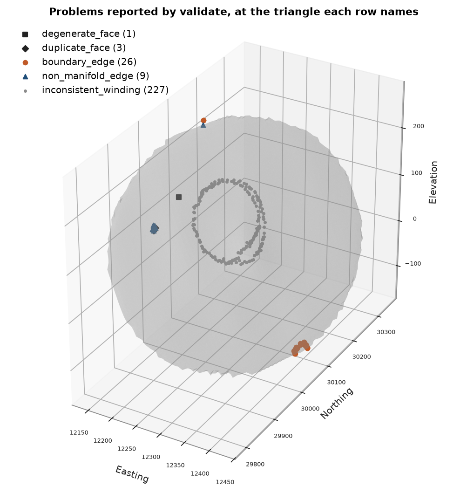

# Find and fix degenerate solids

A solid that arrives from another program or from hand editing can look whole on screen and still be broken:
a hole a few triangles wide, a patch wound inside out, a stray triangle hanging off an edge. Inside tests and
volumes need a closed, consistently wound solid. You damage a clean solid in five typical ways, find each defect
with `Mesh.validate`, repair what `Mesh.repair` can, fix the rest by hand, and check the result against the
original.

<details><summary>Python</summary>

```python
import boitata as bt
import matplotlib.pyplot as plt
import numpy as np
from common import ACCENT, GRAY, HIGHLIGHT, INK, LIGHT, save
```

</details>

!!! learn "What you'll learn"
    - What makes a triangle mesh a valid solid, and the defects that break it.
    - How to read the `MeshReport` from `Mesh.validate`: a summary of counts and one row per problem.
    - What `Mesh.repair` fixes, and how to fix a hole or a stray triangle it leaves.
    - Why a closed mesh can still give a wrong volume.

    Prerequisites: [solids](../../02-data-and-geometry/05-solids/README.md) and [mesh files](../../02-data-and-geometry/07-mesh-files/README.md), which repairs a mesh read as loose triangles.

## The problem

A solid is a closed surface: every edge is shared by exactly two triangles, and every triangle is wound the
same way, counter-clockwise seen from outside. Inside tests and volumes rely on both.

<figure class="bt-figure">
--8<-- "svg/w1-mesh-defects.svg"
<figcaption><b>Figure 1.</b> The defects <code>Mesh.validate</code> reports. A boundary edge belongs to one triangle
(a hole); a non-manifold edge to three or more (a fin); an inconsistent edge is run the same way by its two
triangles (a flipped face); a degenerate face has no area; a duplicate face repeats the corners of another.</figcaption>
</figure>

## The data

Lens 2 of the stacked sulphide lenses is a clean solid. `validate` returns a `MeshReport`: its `summary` counts
each kind of problem.

<details><summary>Python</summary>

```python
data = bt.datasets.stacked_sulphide_lenses()
lens = data["lens_2"]
report = lens.validate()
print(lens, report)
print(f"volume {lens.volume:,.0f} m3")
```

</details>

```text
Mesh(12962 vertices, 25920 triangles, closed) MeshReport(0 problems, 1 shells, closed)
volume 1,901,081 m3
```

Five defects go in at five places, each a common way a solid gets broken:

- a patch of triangles within 80 m of one point is wound the other way, as when a surface is joined back in
  reversed;
- the triangles within 12 m of the lowest point are deleted, a hole;
- three triangles are repeated, as when two exports of the same surface are merged;
- one triangle gets a repeated corner, a sliver with no area;
- a triangle is added on an edge near the top, a fin sticking out, as a stray digitized point makes.

<details><summary>Python</summary>

```python
vertices, triangles = lens.vertices, lens.triangles
centers = vertices[triangles].mean(axis=1)


def near(point, radius):
    return np.linalg.norm(centers - point, axis=1) < radius


flipped = near(centers.mean(axis=0) + [0, 0, 60], 80)
hole = near(centers[centers[:, 2].argmin()], 12)
damaged = triangles.copy()
damaged[flipped] = damaged[flipped, ::-1]
damaged = damaged[~hole]
top = damaged[centers[~hole][:, 2].argmax()]
fin_tip = vertices[top[:2]].mean(axis=0) + [0, 0, 25]
damaged = np.vstack(
    [
        damaged,
        damaged[[4000, 4001, 4002]],
        [damaged[8000, [0, 0, 1]]],
        [[top[0], top[1], len(vertices)]],
    ]
)
broken = bt.Mesh(np.vstack([vertices, fin_tip]), damaged)
print(f"{flipped.sum()} triangles flipped, {hole.sum()} deleted")
print(broken)
```

</details>

```text
2235 triangles flipped, 38 deleted
Mesh(12963 vertices, 25887 triangles, open, 26 boundary edges)
```

## Why it matters

The broken solid is open, so `volume` and `contains` raise an error:

<details><summary>Python</summary>

```python
for name, call in [("volume", lambda: broken.volume), ("contains", lambda: broken.contains(centers[:1]))]:
    try:
        call()
    except ValueError as error:
        print(f"{name}: {error}")
```

</details>

```text
volume: invalid geometry: volume needs a closed mesh
contains: mesh is not closed; this needs a solid
```

The flipped patch alone leaves the mesh closed, so neither call raises. Its volume is wrong, and so is the inside
test near the patch. Twenty thousand random points in the lens's bounding box show it:

<details><summary>Python</summary>

```python
only_flipped = triangles.copy()
only_flipped[flipped] = only_flipped[flipped, ::-1]
closed_but_wrong = bt.Mesh(vertices, only_flipped)
rng = np.random.default_rng(0)
low, high = np.array(lens.bounds[0]), np.array(lens.bounds[1])
points = low + rng.random((20_000, 3)) * (high - low)
truth = lens.contains(points)
print(f"closed: {closed_but_wrong.is_closed}")
print(
    f"volume {closed_but_wrong.volume:,.0f} m3 against {lens.volume:,.0f} m3 "
    f"({closed_but_wrong.volume / lens.volume - 1:+.1%})"
)
wrong = closed_but_wrong.contains(points) != truth
print(f"{truth.sum()} points inside, {wrong.sum()} classified wrong")
```

</details>

```text
closed: True
volume 1,704,246 m3 against 1,901,081 m3 (-10.4%)
573 points inside, 27 classified wrong
```

!!! pitfall "Pitfall"
    `is_closed` checks only the edges. A closed mesh with a flipped patch passes it and gives a volume
    that looks plausible. Read `inconsistent_edges` and `inward_shells` in the report before trusting a volume.

!!! step "Step 1: Validate"
    `validate` counts each kind of problem in `summary` and lists them in `problems`, a table with one row per
    problem. Edge problems name a triangle (`face`) holding the edge, the edge's first corner (`edge`, 0 to 2)
    and its first vertex. `other` is the earlier face a duplicate repeats, or the other face of a flipped edge.

<details><summary>Python</summary>

```python
report = broken.validate()
print({k: v for k, v in report.summary.items() if v})
problems = report.problems.to_polars()
print(problems.group_by("kind", maintain_order=True).len())
print(problems.head(3))
```

</details>

```text
{'degenerate_faces': 1, 'duplicate_faces': 3, 'boundary_edges': 26, 'non_manifold_edges': 9, 'inconsistent_edges': 227, 'shells': 1}
shape: (5, 2)
┌──────────────────────┬─────┐
│ kind                 ┆ len │
│ ---                  ┆ --- │
│ str                  ┆ u32 │
╞══════════════════════╪═════╡
│ degenerate_face      ┆ 1   │
│ duplicate_face       ┆ 3   │
│ boundary_edge        ┆ 26  │
│ non_manifold_edge    ┆ 9   │
│ inconsistent_winding ┆ 227 │
└──────────────────────┴─────┘
shape: (3, 5)
┌─────────────────┬───────┬────────┬──────┬───────┐
│ kind            ┆ face  ┆ vertex ┆ edge ┆ other │
│ ---             ┆ ---   ┆ ---    ┆ ---  ┆ ---   │
│ str             ┆ i64   ┆ i64    ┆ i64  ┆ i64   │
╞═════════════════╪═══════╪════════╪══════╪═══════╡
│ degenerate_face ┆ 25885 ┆ null   ┆ null ┆ null  │
│ duplicate_face  ┆ 25882 ┆ null   ┆ null ┆ 4000  │
│ duplicate_face  ┆ 25883 ┆ null   ┆ null ┆ 4001  │
└─────────────────┴───────┴────────┴──────┴───────┘
```

Five defects give 266 rows. The edges of the repeated triangles become non-manifold, each now held by three or
more triangles. The fin adds a non-manifold edge where it meets the lens and two boundary edges along its free
sides. The flipped patch shows only along its rim, where flipped and unflipped triangles meet.

!!! step "Step 2: Locate the problems"
    Each row's `face` gives a place: the center of that triangle. Plotted on the lens by kind, the rows fall into
    the five places the damage went in.

<details><summary>Python</summary>

```python
face_centers = broken.vertices[broken.triangles].mean(axis=1)
styles = {
    "degenerate_face": ("s", INK),
    "duplicate_face": ("D", INK),
    "boundary_edge": ("o", HIGHLIGHT),
    "non_manifold_edge": ("^", ACCENT),
    "inconsistent_winding": (".", GRAY),
}
fig = plt.figure(figsize=(9, 6.5), layout="constrained")
ax = fig.add_subplot(projection="3d")
ax.plot_trisurf(*vertices.T, triangles=triangles, color=LIGHT, linewidth=0, alpha=0.25)
for kind, (marker, color) in styles.items():
    faces = problems.filter(problems["kind"] == kind)["face"].to_numpy()
    xyz = face_centers[faces]
    ax.scatter(*xyz.T, marker=marker, color=color, s=18, depthshade=False, label=f"{kind} ({len(faces)})")
ax.set_box_aspect(high - low)
ax.set(xlabel="Easting", ylabel="Northing", zlabel="Elevation")
ax.tick_params(labelsize=6)
ax.legend(loc="upper left")
ax.set_title("Problems reported by validate, at the triangle each row names")
save(fig, "problems")
```

</details>



!!! step "Step 3: Repair what can be repaired automatically"
    `repair` drops degenerate and repeated triangles and rewinds each connected piece consistently, outward for
    a closed piece. With `tolerance` it also welds vertices closer than that distance, which fixes a solid read as
    loose triangles ([mesh files](../../02-data-and-geometry/07-mesh-files/README.md)). It does not delete
    triangles that belong to the surface or invent new ones, so the fin and the hole stay.

<details><summary>Python</summary>

```python
repaired = broken.repair()
report = repaired.validate()
print(repaired)
print({k: v for k, v in report.summary.items() if v})
```

</details>

```text
Mesh(12955 vertices, 25883 triangles, open, 26 boundary edges)
{'boundary_edges': 26, 'non_manifold_edges': 1, 'shells': 1}
```

!!! step "Step 4: Fix the rest by hand"
    The one non-manifold edge left is where the fin meets the lens. Of the three triangles on that edge, the fin
    is the one that also has boundary edges; deleting it and repairing again drops its unused tip vertex. The
    boundary edges left then run around the hole. Fanning a triangle from each of them to the mean of their
    corners closes it. Each new triangle runs its boundary edge in the opposite direction to the triangle across
    it, so the winding stays consistent.

<details><summary>Python</summary>

```python
problems = report.problems.to_polars()
tri = repaired.triangles
edge = problems.filter(problems["kind"] == "non_manifold_edge").row(0, named=True)
a, b = tri[edge["face"], edge["edge"]], tri[edge["face"], (edge["edge"] + 1) % 3]
on_edge = np.flatnonzero(np.isin(tri, [a, b]).sum(axis=1) == 2)
open_faces = problems.filter(problems["kind"] == "boundary_edge")["face"].to_numpy()
fin = np.intersect1d(on_edge, open_faces)
print(f"triangles on the non-manifold edge {on_edge}, fin {fin}")
without_fin = bt.Mesh(repaired.vertices, np.delete(tri, fin, axis=0)).repair()

rim = without_fin.validate().problems.to_polars()
rim = rim.filter(rim["kind"] == "boundary_edge")
tri = without_fin.triangles
start = tri[rim["face"].to_numpy(), rim["edge"].to_numpy()]
end = tri[rim["face"].to_numpy(), (rim["edge"].to_numpy() + 1) % 3]
patch_center = len(without_fin.vertices)
cap = np.column_stack([end, start, np.full(len(start), patch_center)])
fixed = bt.Mesh(
    np.vstack([without_fin.vertices, without_fin.vertices[start].mean(axis=0)]), np.vstack([tri, cap])
)
print(f"hole rim: {len(rim)} edges, closed with {len(cap)} triangles")
print(fixed, fixed.validate())
```

</details>

```text
triangles on the non-manifold edge [13904 13905 25882], fin [25882]
hole rim: 24 edges, closed with 24 triangles
Mesh(12955 vertices, 25906 triangles, closed) MeshReport(0 problems, 1 shells, closed)
```

!!! check "Check before you move on"
    The fixed solid has no problems left. Its volume differs from the original by the difference between the
    flat fan and the curved surface the hole removed, and the inside test agrees with the original's on all but
    the points in that sliver.

<details><summary>Python</summary>

```python
assert fixed.validate().summary["is_closed"]
print(
    f"volume {fixed.volume:,.0f} m3, original {lens.volume:,.0f} m3 ({fixed.volume / lens.volume - 1:+.3%})"
)
disagree = fixed.contains(points) != truth
print(f"inside test: {disagree.sum()} of {len(points):,} points disagree with the original")
```

</details>

```text
volume 1,900,886 m3, original 1,901,081 m3 (-0.010%)
inside test: 0 of 20,000 points disagree with the original
```

## The decision

Validate every solid before using it, and read every count in the summary, `inconsistent_edges` and `inward_shells` included. Let `repair` handle
duplicates, slivers and winding; delete fins and close holes by hand, then validate again until the report is
empty. When a hole is larger than a few triangles, a flat fan no longer follows the surface: go back to whoever
built the solid instead.

!!! seealso "See also"
    - [Solids](../../02-data-and-geometry/05-solids/README.md): inside tests and block proportions on valid solids.
    - [Mesh files](../../02-data-and-geometry/07-mesh-files/README.md): reading, writing and welding loose triangles.
    - [Flag solid proportions in a block model](../../14-workflows/01-solid-proportions/README.md): what a valid solid is for.

Full script: [`example_14_03.py`](example_14_03.py)
